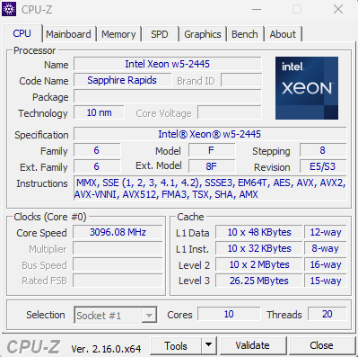
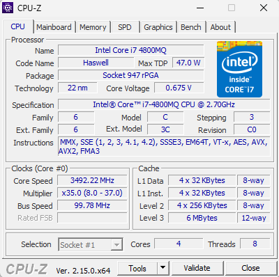

This code will read memory at different sizes and measure bandwidth
<!--more-->

Using **EuroAssembler**

```nasm
EUROASM AutoSegment=Yes, CPU=X64, SIMD=AVX2
memread PROGRAM Format=PE, Width=64, Model=Flat, IconFile=, Entry=main:

INCLUDE winscon.htm, winabi.htm, cpuext64.htm
FmtMsgAddr D "Allocated 1GB at address %%x",13,10,0
FmtAffinity D "Affinity Mask is %%x",13,10,0
FmtMsgKB D "Read %%d KB; Bandwidth %%d GB/s",13,10,0
FmtMsgMB D "Read %%d MB; Bandwidth %%d GB/s",13,10,0
CPUFreqFmt D " CPU Base Frequency = %%f[p2] GHz",13,10,0
EndMsg D "End",0
align 16
Freq DB Q 3_100_000_000 ; will be measured
QPFreq DB Q 10_000_000
Gig DB Q 1_000_000_000
Ticks DB Q
BaseFreq DB Q
Thread$ DB 32 * B ; Affinity
Thread  DQ 1

LINK cvirt.lib

main: nop
	GetArg 1
 	JC .NoArgument:       ; No argument
	StripQuotes RSI,RCX    ; Get rid of quotes if they were used.
	MOV RDI, Thread$ ; Room for the CPU Affinity string.
 	REP MOVSB              ; Copy the affinty.
 	SUB AL,AL
 	STOSB                  ; Zero terminate the string.
 	LodD Thread$
 	mov [Thread], rax
	dec rax
	mov r12, 1 ; Bit
	mov rcx, rax
	shl r12, cl ; left
	WinABI FmtOut, FmtAffinity, r12	
	WinABI GetCurrentThread ; This one will be in RAX
	WinABI SetThreadAffinityMask, RAX, r12 ; RCX is thread param (core#)
.NoArgument:
	WinABI SetThreadPriority, RAX, 15 ; RCX is thread param (core#)

;/==============================================================================
;/ Get Base CPU Speed
;/
	WinABI QueryPerformanceFrequency, Freq
	mov r15, [QPFreq]

	WinABI QueryPerformanceCounter, Ticks
	mov r10, [Ticks] ; r10 - initial

	CPUID
    RDTSC
    SHL RDX, 32
    OR RAX, RDX
    MOV R13, RAX ; R13 will hold initial Time Stamp counter value
align 16	
LC:
    RDTSCP
    SHL RDX, 32
    OR RAX, RDX
    SUB RAX, R13 ; Subtract previous stamp
	mov r14, rax ; R14 is the difference

	WinABI QueryPerformanceCounter, Ticks
	mov r11, [Ticks] ; r10 - was initial
	sub r11, r10
	cmp r11, r15 ; Frequency
	jle LC

	mov rax, r14
	mov [Freq], rax

    movq xmm0, rax ; movq xmm0, [numerator]
    movq xmm1, [Gig] ; movq xmm1, [denominator]
    divsd xmm0, xmm1
	movq [BaseFreq], xmm0
	WinABI FmtOut, CPUFreqFmt, xmm0	

	xor r13, r13

;/==============================================================================
;/ Allocate 1GB aligned Memory
;/ and read each 4KB to get TLB loaded to avoid Page Faults
;/
	WinABI VirtualAlloc, 0, 1073741824, 0x3000, 0x40 ; 1 GiB Allocated
	mov r10, rax
	WinABI FmtOut, FmtMsgAddr, r10	

; Warm up loop
	mov rcx, 262144; buffer_length      ; e.g. RCX = 32768
.loop_read1:
	mov rdx, r10                ; pointer to buffer
	vmovdqa ymm1, [rdx]
	add rdx, 4096
	sub rcx, 4096
	jnz .loop_read1


;/==============================================================================
;/ memory benchmark
;/
.begin:
	mov r8, 16 ; Amount of Iterations
	xor r9, r9
.cycles:

	RDTSC ; BENCHMARK START >> -------------------------------------------------
	shl rdx, 32
	or rax, rdx
	mov r11, rax

	xor r15,r15 ; GB/S Counter
.loop_one_second:
	mov r12, 65536 ; Iterations
	mov rcx, r13
	shr r12, cl ; divide
	
.loop_read_outer:

	mov rbx, 128 ; buffer_length (32768/128)
    mov rcx, r13
	shl rbx, cl ; multiply
	mov rdx, r10   ; pointer to buffer

.loop_read_inner:
	vmovdqa ymm1, [rdx]
	vmovdqa ymm2, [rdx+32]
	vmovdqa ymm3, [rdx+64]
	vmovdqa ymm4, [rdx+96]
	add rdx, 128
	dec rbx
	jnz .loop_read_inner
	dec r12
	jnz .loop_read_outer

	inc r15

	RDTSCP ; BENCHMARK END << --------------------------------------------------
	shl rdx, 32
	or rax, rdx
	sub rax, r11 ;  RAX - Ticks; RCX - CPU Nr

	mov rdx, [Freq]; 3_100_000_000 ; Base Speed
	cmp rax, rdx ; Base Speed
	jb .loop_one_second ; Jump below

	cmp r15, r9         ; Compare r15 with r9
	cmova r9, r15       ; If r15 > r9 (unsigned), move r15 into r9

	dec r8
	jnz .cycles

	mov rbx, 16 ; buffer_length (32768/128)
    mov rcx, r13
	shl rbx, cl
	cmp rbx, 1000
	jle .KB
	shr rbx, 10
	WinABI FmtOut, FmtMsgMB, rbx, r9	
	jmp .next
.KB:
	WinABI FmtOut, FmtMsgKB, rbx, r9	
.next:
    inc r13
	cmp r13, 16
	jle .begin

	StdOutput EndMsg, Eol=Yes, Console=Yes

	TerminateProgram

ENDPROGRAM
```

On Intel Xeon w5-2445:



Result:

```
>memread.exe 6
Affinity Mask is 20
 CPU Base Frequency = 3.10 GHz
Allocated 1GB at address 7e30000
Read 16 KB; Speed 245 GB/s  | L1 Cache (48 K)
Read 32 KB; Speed 248 GB/s  | ________
Read 64 KB; Speed 156 GB/s  |
Read 128 KB; Speed 157 GB/s |
Read 256 KB; Speed 157 GB/s | L2 Cache (2 MB)
Read 512 KB; Speed 154 GB/s |
Read 1 MB; Speed 153 GB/s   |
Read 2 MB; Speed 126 GB/s   |________
Read 4 MB; Speed 33 GB/s    |
Read 8 MB; Speed 33 GB/s    | L3 Cache (26,25 MB)
Read 16 MB; Speed 32 GB/s   |
Read 32 MB; Speed 26 GB/s   -----------
Read 64 MB; Speed 20 GB/s   |
Read 128 MB; Speed 17 GB/s  |
Read 256 MB; Speed 17 GB/s  | Out of cache
Read 512 MB; Speed 16 GB/s  |
Read 1024 MB; Speed 16 GB/s |
End
```

Haswell:



```
C:\Users\Andrey\Desktop\euroasm>memread.exe 1
Affinity Mask is 1
 CPU Base Frequency = 2.69 GHz
Allocated 1GB at address 4730000
Read 16 KB; Speed 197 GB/s
Read 32 KB; Speed 202 GB/s < L1 - 32 KB
Read 64 KB; Speed 90 GB/s
Read 128 KB; Speed 86 GB/s
Read 256 KB; Speed 69 GB/s < L2 - 256 KB
Read 512 KB; Speed 42 GB/s
Read 1 MB; Speed 42 GB/s
Read 2 MB; Speed 42 GB/s
Read 4 MB; Speed 33 GB/s
Read 8 MB; Speed 22 GB/s < L3 - 6 MB
Read 16 MB; Speed 17 GB/s
Read 32 MB; Speed 17 GB/s
Read 64 MB; Speed 16 GB/s
Read 128 MB; Speed 16 GB/s
Read 256 MB; Speed 16 GB/s
Read 512 MB; Speed 16 GB/s
Read 1024 MB; Speed 16 GB/s
End
```

