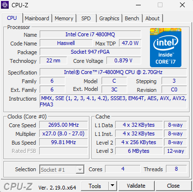
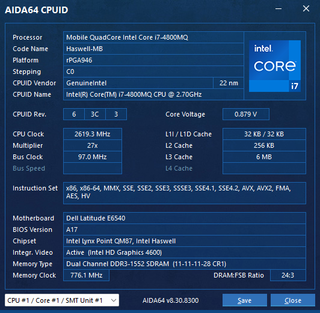
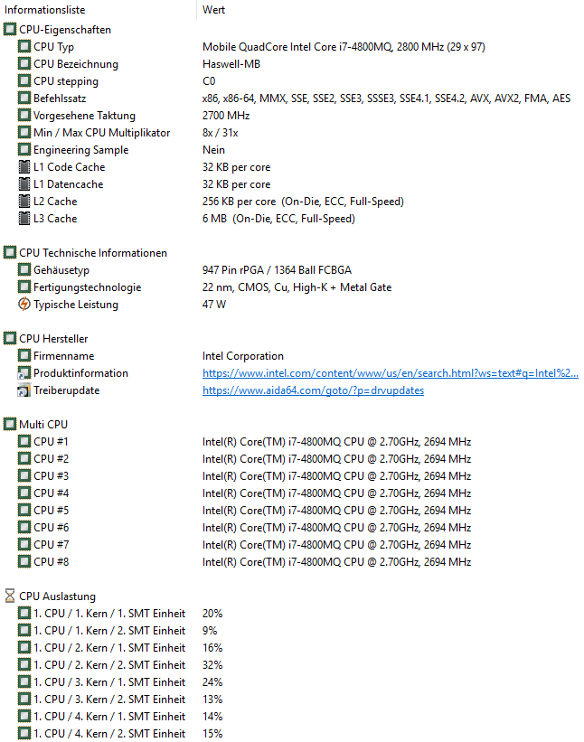
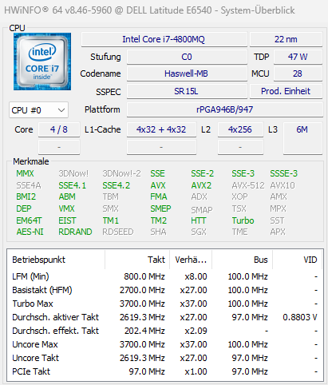
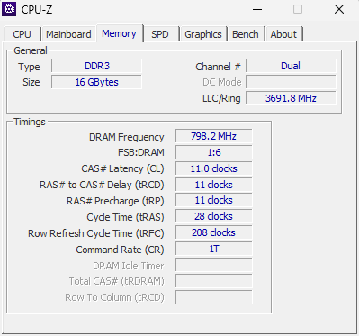
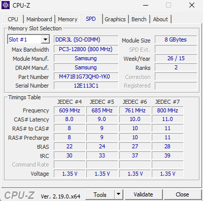
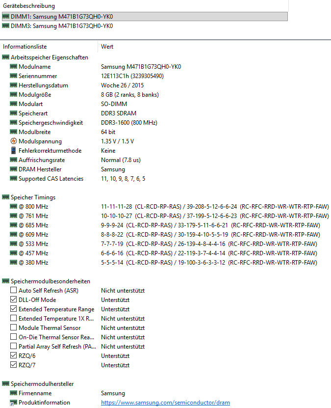
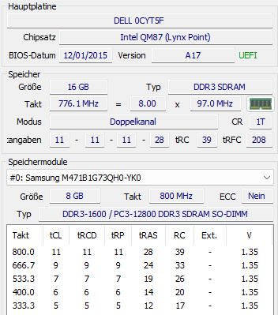
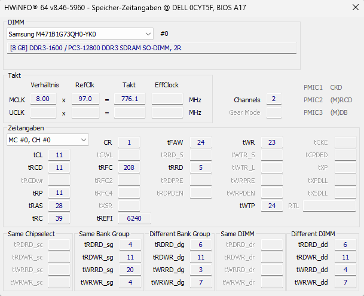

A very basic article about different tools used to obtain hardware (CPU/Memory, etc) Info.
<!--more-->
You can obtain information about your Hardware in many different ways.

## CPU

### CPU-Z



### AIDA 64





CPUID:

<details>
  <summary>Spoiler warning</summary>

```
--------[ AIDA64 Engineer ]---------------------------------------------------------------------

    Version                                           AIDA64 v8.30.8300/de
    Benchmark Modul                                   4.7.929.8-x64
    Homepage                                          https://www.aida64.com/
    Berichtsart                                       Kurzbericht
    Computer                                          DESKTOP-L1NJTNT
    Ersteller                                         Andrey
    Betriebssystem                                    Microsoft Windows 11 Enterprise LTSC 2024 10.0.26100.8246 (Win11 24H2 2024 Update)
    Datum                                             2026-05-02
    Zeit                                              09:58


--------[ CPUID ]-------------------------------------------------------------------------------

    CPUID Eigenschaften:
      CPUID Hersteller                                  GenuineIntel
      CPUID CPU Name                                    Intel(R) Core(TM) i7-4800MQ CPU @ 2.70GHz
      CPUID Revision                                    000306C3h
      IA Markenzeichen ID                               00h  (Unbekannt)
      Plattform ID                                      0027h / MC 10h  (rPGA946)
      Microcode Update Revision                         28h
      SMT / CMP Einheiten                               2 / 4
      Tjmax Temperatur                                  100 °C  (212 °F)
      CPU Thermal Design Power (TDP)                    47 W
      CPU Thermal Design Current (TDC)                  84 A
      CPU Max Power Limit                               Unlimited Power / Unlimited Time
      CPU Power Limit 1 (Long Duration)                 47 W / 28.00 Sek.  (Locked)
      CPU Power Limit 2 (Short Duration)                58.8 W / 2.44 ms  (Locked)
      Max Turbo Boost Multipliers                       1C: 37x, 2C: 36x, 3C: 35x, 4C: 35x

    Befehlssatz:
      64-bit x86 Extension (x86-64) (AMD64, Intel64)    Unterstützt
      AES Extensions                                    Unterstützt
      AMD 3DNow!                                        Nicht unterstützt
      AMD 3DNow! Professional                           Nicht unterstützt
      AMD 3DNowPrefetch                                 Nicht unterstützt
      AMD Enhanced 3DNow!                               Nicht unterstützt
      AMD Extended MMX                                  Nicht unterstützt
      AMD FMA4                                          Nicht unterstützt
      AMD MisAligned SSE                                Nicht unterstützt
      AMD SSE4A                                         Nicht unterstützt
      AMD XOP                                           Nicht unterstützt
      AMX-BF16                                          Nicht unterstützt
      AMX-COMPLEX                                       Nicht unterstützt
      AMX-FP16                                          Nicht unterstützt
      AMX-INT8                                          Nicht unterstützt
      AMX Tile Architecture (AMX-TILE)                  Nicht unterstützt
      APX (APX_F)                                       Nicht unterstützt
      APX Flags Supression (NF)                         Nicht unterstützt
      APX New Conditional Instructions (NCI)            Nicht unterstützt
      APX New Data Destination (NDD)                    Nicht unterstützt
      AVX                                               Unterstützt, Aktiviert
      AVX2                                              Unterstützt, Aktiviert
      AVX10.1                                           Nicht unterstützt
      AVX10.2                                           Nicht unterstützt
      AVX10-VNNI-INT                                    Nicht unterstützt
      AVX-512 (AVX512F)                                 Nicht unterstützt
      AVX-512 4x Fused Multiply-Add Single Precision (AVX512_4FMAPS)Nicht unterstützt
      AVX-512 4x Neural Network Instructions (AVX512_4VNNIW)Nicht unterstützt
      AVX-512 52-bit Integer Multiply-Add Instructions (AVX512_IFMA)Nicht unterstützt
      AVX-512 BF16 (AVX512_BF16)                        Nicht unterstützt
      AVX-512 Bit Algorithm (AVX512_BITALG)             Nicht unterstützt
      AVX-512 Bit Matrix Multiply Instructions (AVX512_BMM)Nicht unterstützt
      AVX-512 Byte and Word Instructions (AVX512BW)     Nicht unterstützt
      AVX-512 Conflict Detection Instructions (AVX512CD)Nicht unterstützt
      AVX-512 Doubleword and Quadword Instructions (AVX512DQ)Nicht unterstützt
      AVX-512 Exponential and Reciprocal Instructions (AVX512ER)Nicht unterstützt
      AVX-512 FP16 (AVX512_FP16)                        Nicht unterstützt
      AVX-512 Intersection (AVX512_VP2INTERSECT)        Nicht unterstützt
      AVX-512 Neural Network Instructions (AVX512_VNNI) Nicht unterstützt
      AVX-512 Prefetch Instructions (AVX512PF)          Nicht unterstützt
      AVX-512 Vector Bit Manipulation Instructions (AVX512_VBMI)Nicht unterstützt
      AVX-512 Vector Bit Manipulation Instructions 2 (AVX512_VBMI2)Nicht unterstützt
      AVX-512 Vector Length Extensions (AVX512VL)       Nicht unterstützt
      AVX-512 VPOPCNTDQ                                 Nicht unterstützt
      AVX Vector Neural Network Instructions (AVX-VNNI) Nicht unterstützt
      AVX-IFMA                                          Nicht unterstützt
      AVX-NE-CONVERT                                    Nicht unterstützt
      AVX-VNNI-INT8                                     Nicht unterstützt
      BMI1                                              Unterstützt
      BMI2                                              Unterstützt
      Cyrix Extended MMX                                Nicht unterstützt
      Enhanced REP MOVSB/STOSB                          Unterstützt
      Enqueue Stores                                    Nicht unterstützt
      Float-16 Conversion Instructions                  Unterstützt, Aktiviert
      FMA                                               Unterstützt, Aktiviert
      Galois Field New Instructions (GFNI)              Nicht unterstützt
      IA-64                                             Nicht unterstützt
      MMX                                               Unterstützt
      SHA Extensions                                    Nicht unterstützt
      SHA512                                            Nicht unterstützt
      SM2                                               Nicht unterstützt
      SSE                                               Unterstützt
      SSE2                                              Unterstützt
      SSE3                                              Unterstützt
      Supplemental SSE3                                 Unterstützt
      SSE4.1                                            Unterstützt
      SSE4.2                                            Unterstützt
      SM3                                               Nicht unterstützt
      SM4                                               Nicht unterstützt
      Vector AES (VAES)                                 Nicht unterstützt
      Vector-Extension Packed Matrix Multiplication (VPMM)Nicht unterstützt
      VIA Alternate Instruction Set                     Nicht unterstützt
      ADCX / ADOX Befehl                                Nicht unterstützt
      CLDEMOTE Befehl                                   Nicht unterstützt
      CLFLUSH Befehl                                    Unterstützt
      CLFLUSHOPT Befehl                                 Nicht unterstützt
      CLWB Befehl                                       Nicht unterstützt
      CLZERO Befehl                                     Nicht unterstützt
      CMPccXADD Befehl                                  Nicht unterstützt
      CMPXCHG8B Befehl                                  Unterstützt
      CMPXCHG16B Befehl                                 Unterstützt
      Conditional Move Befehl                           Unterstützt
      Fast Short CMPSB & SCASB Befehl                   Nicht unterstützt
      Fast Short REP MOV Befehl                         Nicht unterstützt
      Fast Short REP STOSB (FSRS) Befehl                Nicht unterstützt
      Fast Short REPE CMPSB (FSRC) Befehl               Nicht unterstützt
      Fast Short STOSB Befehl                           Nicht unterstützt
      Fast Zero-Length MOVSB Befehl                     Nicht unterstützt
      HRESET Befehl                                     Nicht unterstützt
      INVLPGB Befehl                                    Nicht unterstützt
      INVPCID Befehl                                    Unterstützt
      LAHF / SAHF Befehl                                Unterstützt
      LZCNT Befehl                                      Unterstützt
      MCOMMIT Befehl                                    Nicht unterstützt
      MONITOR / MWAIT Befehl                            Unterstützt
      MONITORX / MWAITX Befehl                          Nicht unterstützt
      MOVBE Befehl                                      Unterstützt
      MOVDIR64B Befehl                                  Nicht unterstützt
      MOVDIRI Befehl                                    Nicht unterstützt
      PCLMULQDQ Befehl                                  Unterstützt
      PCOMMIT Befehl                                    Nicht unterstützt
      PCONFIG Befehl                                    Nicht unterstützt
      POPCNT Befehl                                     Unterstützt
      PREFETCHIT0 / PREFETCHIT1 Befehl                  Nicht unterstützt
      PREFETCHWT1 Befehl                                Nicht unterstützt
      PTWRITE Befehl                                    Nicht unterstützt
      RAO-INT Befehl                                    Nicht unterstützt
      RDFSBASE / RDGSBASE / WRFSBASE / WRGSBASE Befehl  Unterstützt
      RDMSRLIST / WRMSRLIST Befehl                      Nicht unterstützt
      RDPRU Befehl                                      Nicht unterstützt
      RDRAND Befehl                                     Unterstützt
      RDSEED Befehl                                     Nicht unterstützt
      RDTSCP Befehl                                     Unterstützt
      SKINIT / STGI Befehl                              Nicht unterstützt
      SYSCALL / SYSRET Befehl                           Unterstützt
      SYSENTER / SYSEXIT Befehl                         Unterstützt
      Trailing Bit Manipulation Instructions            Nicht unterstützt
      VIA FEMMS Befehl                                  Nicht unterstützt
      VPCLMULQDQ Befehl                                 Nicht unterstützt
      WBNOINVD Befehl                                   Nicht unterstützt
      WRMSRNS Befehl                                    Nicht unterstützt

    Sicherheits Besonderheiten:
      Advanced Cryptography Engine (ACE)                Nicht unterstützt
      Advanced Cryptography Engine 2 (ACE2)             Nicht unterstützt
      Control-flow Enforcement Technology - Indirect Branch Tracking (CET_IBT)Nicht unterstützt
      Control-flow Enforcement Technology - Shadow Stack (CET_SS)Nicht unterstützt
      Control-flow Enforcement Technology - Supervisor Shadow Stack (CET_SSS)Nicht unterstützt
      Dateiausführungsverhinderung (DEP, NX, EDB)       Unterstützt
      Enhanced Indirect Branch Restricted Speculation   Nicht unterstützt
      Enhanced Predictive Store Forwarding (EPSF)       Nicht unterstützt
      FRED Transitions                                  Nicht unterstützt
      Hardware Random Number Generator (RNG)            Nicht unterstützt
      Hardware Random Number Generator 2 (RNG2)         Nicht unterstützt
      Indirect Branch Predictor Barrier (IBPB)          Unterstützt
      Indirect Branch Restricted Speculation (IBRS)     Unterstützt
      Key Locker                                        Nicht unterstützt
      L1D Flush                                         Unterstützt
      Linear Address Masking (LAM)                      Nicht unterstützt
      Linear Address Space Separation (LASS)            Nicht unterstützt
      LKGS                                              Nicht unterstützt
      MD_CLEAR                                          Unterstützt
      Memory Protection Extensions (MPX)                Nicht unterstützt
      PadLock Hash Engine (PHE)                         Nicht unterstützt
      PadLock Hash Engine 2 (PHE2)                      Nicht unterstützt
      PadLock Montgomery Multiplier (PMM)               Nicht unterstützt
      PadLock Montgomery Multiplier 2 (PMM2)            Nicht unterstützt
      Prozessor Seriennummer (PSN)                      Nicht unterstützt
      Protection Keys for Supervisor-Mode Pages (PKS)   Nicht unterstützt
      Protection Keys for User-Mode Pages (PKU)         Nicht unterstützt
      Read Processor ID (RDPID)                         Nicht unterstützt
      Rogue Data Cache Load (RDCL)                      empfindlich
      Safer Mode Extensions (SMX)                       Nicht unterstützt
      Secure Memory Encryption (SME)                    Nicht unterstützt
      SGX Attestation Services (SGX-KEYS)               Nicht unterstützt
      SGX Launch Configuration (SGX_LC)                 Nicht unterstützt
      Software Guard Extensions (SGX)                   Nicht unterstützt
      Single Thread Indirect Branch Predictors (STIBP)  Unterstützt
      Speculative Store Bypass Disable (SSBD)           Unterstützt
      SRBDS_CTRL                                        Nicht unterstützt
      Static Lockstep Mode (SLSM)                       Nicht unterstützt
      Supervisor Mode Access Prevention (SMAP)          Nicht unterstützt
      Supervisor Mode Execution Protection (SMEP)       Unterstützt
      Total Memory Encryption (TME)                     Nicht unterstützt
      Total Storage Encryption (TSE)                    Nicht unterstützt
      User-Mode Instruction Prevention (UMIP)           Nicht unterstützt

    Energieverwaltungs Fähigkeiten:
      APM Power Reporting                               Nicht unterstützt
      Application Power Management (APM)                Nicht unterstützt
      Automatic Clock Control                           Unterstützt
      Configurable TDP (cTDP)                           Nicht unterstützt
      Connected Standby                                 Nicht unterstützt
      Core C6 State (CC6)                               Nicht unterstützt
      Digital Thermometer                               Unterstützt
      Dynamic FSB Frequency Switching                   Nicht unterstützt
      Enhanced Halt State (C1E)                         Unterstützt, Aktiviert
      Enhanced SpeedStep Technology (EIST, ESS)         Unterstützt, Aktiviert
      Frequency ID Control                              Nicht unterstützt
      Hardware P-State Control                          Nicht unterstützt
      Hardware Thermal Control (HTC)                    Nicht unterstützt
      LongRun                                           Nicht unterstützt
      LongRun Table Interface                           Nicht unterstützt
      Overstress                                        Nicht unterstützt
      Package C6 State (PC6)                            Nicht unterstützt
      Parallax                                          Nicht unterstützt
      PowerSaver 1.0                                    Nicht unterstützt
      PowerSaver 2.0                                    Nicht unterstützt
      PowerSaver 3.0                                    Nicht unterstützt
      Processor Duty Cycle Control                      Unterstützt
      Running Average Power Limit (RAPL)                Nicht unterstützt
      Software Thermal Control                          Nicht unterstützt
      SpeedShift (SST, HWP)                             Nicht unterstützt
      Temperatur Sensing Diode                          Nicht unterstützt
      Thermal Monitor 1                                 Unterstützt
      Thermal Monitor 2                                 Unterstützt
      Thermal Monitor 3                                 Nicht unterstützt
      Thermal Monitoring                                Nicht unterstützt
      Thermal Trip                                      Nicht unterstützt
      Voltage ID Control                                Nicht unterstützt

    Virtualisierungs Besonderheiten:
      AMD Virtual Interrupt Controller (AVIC)           Nicht unterstützt
      Decode Assists                                    Nicht unterstützt
      Encrypted Microcode Patch                         Nicht unterstützt
      Encrypted State (SEV-ES)                          Nicht unterstützt
      Extended Page Table (EPT)                         Nicht unterstützt
      Flush by ASID                                     Nicht unterstützt
      Guest Mode Execute Trap Extension (GMET)          Nicht unterstützt
      Hypervisor                                        Vorhanden
      INVEPT Befehl                                     Nicht unterstützt
      INVVPID Befehl                                    Nicht unterstützt
      LBR Virtualization                                Nicht unterstützt
      Memory Bandwidth Enforcement (MBE)                Nicht unterstützt
      Nested Paging (NPT, RVI)                          Nicht unterstützt
      NRIP Save (NRIPS)                                 Nicht unterstützt
      PAUSE Filter Threshold                            Nicht unterstützt
      PAUSE Intercept Filter                            Nicht unterstützt
      RMP Dirty                                         Nicht unterstützt
      RMPOPT                                            Nicht unterstützt
      Secure AVIC                                       Nicht unterstützt
      Secure Encrypted Virtualization (SEV)             Nicht unterstützt
      Secure Virtual Machine (SVM, Pacifica)            Nicht unterstützt
      SVM Lock (SVML)                                   Nicht unterstützt
      Virtual Transparent Encryption (VTE)              Nicht unterstützt
      Virtualized GIF (vGIF)                            Nicht unterstützt
      Virtualized VMLOAD and VMSAVE                     Nicht unterstützt
      Virtualized X2APIC (X2AVIC)                       Nicht unterstützt
      Virtual Machine Extensions (VMX, Vanderpool)      Nicht unterstützt
      Virtual Processor ID (VPID)                       Nicht unterstützt
      VMCB Clean Bits                                   Nicht unterstützt

    CPUID Besonderheiten:
      1 GB Page Size                                    Unterstützt
      36-bit Page Size Extension                        Unterstützt
      5-Level Paging                                    Nicht unterstützt
      64-bit DS Area                                    Nicht unterstützt
      64-bit SIPI                                       Nicht unterstützt
      Adaptive Overclocking                             Nicht unterstützt
      Address Region Registers (ARR)                    Nicht unterstützt
      Asymmetrical RDT Allocation                       Nicht unterstützt
      Asymmetrical RDT Monitoring                       Nicht unterstützt
      Resource Director Technology Monitoring (RDT-M)   Nicht unterstützt
      Code and Data Prioritization Technology (CDP)     Nicht unterstützt
      Collaborative Processor Performance Control (CPPC)Nicht unterstützt
      Core Performance Boost (CPB)                      Nicht unterstützt
      Core Performance Counters                         Nicht unterstützt
      CPL Qualified Debug Store                         Nicht unterstützt
      CPPC Performance Priority                         Nicht unterstützt
      Data Breakpoint Extension                         Nicht unterstützt
      Debug Trace Store                                 Nicht unterstützt
      Debugging Extension                               Unterstützt
      Deprecated FPU CS and FPU DS                      Unterstützt
      Direct Cache Access                               Nicht unterstützt
      Dynamic Acceleration Technology (IDA)             Nicht unterstützt
      Dynamic Configurable TDP (DcTDP)                  Nicht unterstützt
      Enhanced Hardware Feedback Interface (EHFI)       Nicht unterstützt
      Extended APIC Register Space                      Nicht unterstützt
      Fast Save & Restore                               Unterstützt
      FP512 Downgrade                                   Nicht unterstützt
      Hardware Feedback Interface (HFI)                 Nicht unterstützt
      Hardware Lock Elision (HLE)                       Nicht unterstützt
      Hybrid Boost                                      Nicht unterstützt
      Hybrid CPU                                        Nicht unterstützt
      Hyper-Threading Technology (HTT)                  Unterstützt, Aktiviert
      Instruction Based Sampling                        Nicht unterstützt
      Invariant Time Stamp Counter                      Unterstützt
      L1 Context ID                                     Nicht unterstützt
      L2I Performance Counters                          Nicht unterstützt
      Lightweight Profiling                             Nicht unterstützt
      Local APIC On Chip                                Unterstützt
      Machine Check Architecture (MCA)                  Unterstützt
      Machine Check Exception (MCE)                     Unterstützt
      Memory Configuration Registers (MCR)              Nicht unterstützt
      Memory Protection Range Registers (MPRR)          Nicht unterstützt
      Memory Type Range Registers (MTRR)                Unterstützt
      Model Specific Registers (MSR)                    Unterstützt
      NB Performance Counters                           Nicht unterstützt
      Page Attribute Table (PAT)                        Unterstützt
      Page Global Extension                             Unterstützt
      Page Size Extension (PSE)                         Unterstützt
      Pending Break Event (PBE)                         Unterstützt
      Performance Time Stamp Counter (PTSC)             Nicht unterstützt
      Physical Address Extension (PAE)                  Unterstützt
      Process Context Identifiers (PCID)                Unterstützt
      Processor Feedback Interface                      Nicht unterstützt
      Processor Trace (PT)                              Nicht unterstützt
      Processor Trace Trigger Tracing (PTTT)            Nicht unterstützt
      Resource Director Technology Allocation (RDT-A)   Nicht unterstützt
      Resource Director Technology Monitoring (RDT-M)   Nicht unterstützt
      Restricted Transactional Memory (RTM)             Nicht unterstützt
      Self-Snoop                                        Unterstützt
      Time Stamp Counter (TSC)                          Unterstützt
      Time Stamp Counter Adjust                         Nicht unterstützt
      TSX Suspend Load Address Tracking                 Nicht unterstützt
      Turbo Boost                                       Unterstützt, Aktiviert
      Turbo Boost Max 3.0                               Nicht unterstützt
      Upper Address Ignore (UAI)                        Nicht unterstützt
      Upper Address Ignore (UAI) V2                     Nicht unterstützt
      User Interrupts (UINTR)                           Nicht unterstützt
      Virtual Mode Extension                            Unterstützt
      Watchdog Timer                                    Nicht unterstützt
      x2APIC                                            Unterstützt, Aktiviert
      X86S                                              Nicht unterstützt
      XGETBV / XSETBV OS Enabled                        Unterstützt
      XSAVE / XRSTOR / XSETBV / XGETBV Extended States  Unterstützt
      XSAVEOPT                                          Unterstützt

    CPUID Registers (CPU #0):
      CPUID 00000000                                    0000000D-756E6547-6C65746E-49656E69 [GenuineIntel]
      CPUID 00000001                                    000306C3-00100800-FFFAF38B-BFCBFBFF
      CPUID 00000002                                    76036301-00F0B5FF-00000000-00C10000
      CPUID 00000003                                    00000000-00000000-00000000-00000000
      CPUID 00000004                                    1C004121-01C0003F-0000003F-00000000 [SL 00]
      CPUID 00000004                                    1C004122-01C0003F-0000003F-00000000 [SL 01]
      CPUID 00000004                                    1C004143-01C0003F-000001FF-00000000 [SL 02]
      CPUID 00000004                                    1C03C163-02C0003F-00001FFF-00000006 [SL 03]
      CPUID 00000005                                    00000040-00000040-00000003-00042120
      CPUID 00000006                                    00000073-00000002-00000009-00000000
      CPUID 00000007                                    00000000-000027A9-00000000-BC000400 [SL 00]
      CPUID 00000008                                    00000000-00000000-00000000-00000000
      CPUID 00000009                                    00000000-00000000-00000000-00000000
      CPUID 0000000A                                    07300403-00000000-00000000-00000603
      CPUID 0000000B                                    00000001-00000002-00000100-00000000 [SL 00]
      CPUID 0000000B                                    00000004-00000008-00000201-00000000 [SL 01]
      CPUID 0000000C                                    00000000-00000000-00000000-00000000
      CPUID 0000000D                                    00000007-00000340-00000340-00000000 [SL 00]
      CPUID 0000000D                                    00000001-00000000-00000000-00000000 [SL 01]
      CPUID 0000000D                                    00000100-00000240-00000000-00000000 [SL 02]
      CPUID 80000000                                    80000008-00000000-00000000-00000000
      CPUID 80000001                                    00000000-00000000-00000021-2C100800
      CPUID 80000002                                    65746E49-2952286C-726F4320-4D542865 [Intel(R) Core(TM]
      CPUID 80000003                                    37692029-3038342D-20514D30-20555043 [) i7-4800MQ CPU ]
      CPUID 80000004                                    2E322040-48473037-0000007A-00000000 [@ 2.70GHz]
      CPUID 80000005                                    00000000-00000000-00000000-00000000
      CPUID 80000006                                    00000000-00000000-01006040-00000000
      CPUID 80000007                                    00000000-00000000-00000000-00000100
      CPUID 80000008                                    00003027-00000000-00000000-00000000

    CPUID Registers (CPU #1 Virtual):
      CPUID 00000000                                    0000000D-756E6547-6C65746E-49656E69 [GenuineIntel]
      CPUID 00000001                                    000306C3-01100800-FFFAF38B-BFCBFBFF
      CPUID 00000002                                    76036301-00F0B5FF-00000000-00C10000
      CPUID 00000003                                    00000000-00000000-00000000-00000000
      CPUID 00000004                                    1C004121-01C0003F-0000003F-00000000 [SL 00]
      CPUID 00000004                                    1C004122-01C0003F-0000003F-00000000 [SL 01]
      CPUID 00000004                                    1C004143-01C0003F-000001FF-00000000 [SL 02]
      CPUID 00000004                                    1C03C163-02C0003F-00001FFF-00000006 [SL 03]
      CPUID 00000005                                    00000040-00000040-00000003-00042120
      CPUID 00000006                                    00000073-00000002-00000009-00000000
      CPUID 00000007                                    00000000-000027A9-00000000-BC000400 [SL 00]
      CPUID 00000008                                    00000000-00000000-00000000-00000000
      CPUID 00000009                                    00000000-00000000-00000000-00000000
      CPUID 0000000A                                    07300403-00000000-00000000-00000603
      CPUID 0000000B                                    00000001-00000002-00000100-00000001 [SL 00]
      CPUID 0000000B                                    00000004-00000008-00000201-00000001 [SL 01]
      CPUID 0000000C                                    00000000-00000000-00000000-00000000
      CPUID 0000000D                                    00000007-00000340-00000340-00000000 [SL 00]
      CPUID 0000000D                                    00000001-00000000-00000000-00000000 [SL 01]
      CPUID 0000000D                                    00000100-00000240-00000000-00000000 [SL 02]
      CPUID 80000000                                    80000008-00000000-00000000-00000000
      CPUID 80000001                                    00000000-00000000-00000021-2C100800
      CPUID 80000002                                    65746E49-2952286C-726F4320-4D542865 [Intel(R) Core(TM]
      CPUID 80000003                                    37692029-3038342D-20514D30-20555043 [) i7-4800MQ CPU ]
      CPUID 80000004                                    2E322040-48473037-0000007A-00000000 [@ 2.70GHz]
      CPUID 80000005                                    00000000-00000000-00000000-00000000
      CPUID 80000006                                    00000000-00000000-01006040-00000000
      CPUID 80000007                                    00000000-00000000-00000000-00000100
      CPUID 80000008                                    00003027-00000000-00000000-00000000

    CPUID Registers (CPU #2):
      CPUID 00000000                                    0000000D-756E6547-6C65746E-49656E69 [GenuineIntel]
      CPUID 00000001                                    000306C3-02100800-FFFAF38B-BFCBFBFF
      CPUID 00000002                                    76036301-00F0B5FF-00000000-00C10000
      CPUID 00000003                                    00000000-00000000-00000000-00000000
      CPUID 00000004                                    1C004121-01C0003F-0000003F-00000000 [SL 00]
      CPUID 00000004                                    1C004122-01C0003F-0000003F-00000000 [SL 01]
      CPUID 00000004                                    1C004143-01C0003F-000001FF-00000000 [SL 02]
      CPUID 00000004                                    1C03C163-02C0003F-00001FFF-00000006 [SL 03]
      CPUID 00000005                                    00000040-00000040-00000003-00042120
      CPUID 00000006                                    00000073-00000002-00000009-00000000
      CPUID 00000007                                    00000000-000027A9-00000000-BC000400 [SL 00]
      CPUID 00000008                                    00000000-00000000-00000000-00000000
      CPUID 00000009                                    00000000-00000000-00000000-00000000
      CPUID 0000000A                                    07300403-00000000-00000000-00000603
      CPUID 0000000B                                    00000001-00000002-00000100-00000002 [SL 00]
      CPUID 0000000B                                    00000004-00000008-00000201-00000002 [SL 01]
      CPUID 0000000C                                    00000000-00000000-00000000-00000000
      CPUID 0000000D                                    00000007-00000340-00000340-00000000 [SL 00]
      CPUID 0000000D                                    00000001-00000000-00000000-00000000 [SL 01]
      CPUID 0000000D                                    00000100-00000240-00000000-00000000 [SL 02]
      CPUID 80000000                                    80000008-00000000-00000000-00000000
      CPUID 80000001                                    00000000-00000000-00000021-2C100800
      CPUID 80000002                                    65746E49-2952286C-726F4320-4D542865 [Intel(R) Core(TM]
      CPUID 80000003                                    37692029-3038342D-20514D30-20555043 [) i7-4800MQ CPU ]
      CPUID 80000004                                    2E322040-48473037-0000007A-00000000 [@ 2.70GHz]
      CPUID 80000005                                    00000000-00000000-00000000-00000000
      CPUID 80000006                                    00000000-00000000-01006040-00000000
      CPUID 80000007                                    00000000-00000000-00000000-00000100
      CPUID 80000008                                    00003027-00000000-00000000-00000000

    CPUID Registers (CPU #3 Virtual):
      CPUID 00000000                                    0000000D-756E6547-6C65746E-49656E69 [GenuineIntel]
      CPUID 00000001                                    000306C3-03100800-FFFAF38B-BFCBFBFF
      CPUID 00000002                                    76036301-00F0B5FF-00000000-00C10000
      CPUID 00000003                                    00000000-00000000-00000000-00000000
      CPUID 00000004                                    1C004121-01C0003F-0000003F-00000000 [SL 00]
      CPUID 00000004                                    1C004122-01C0003F-0000003F-00000000 [SL 01]
      CPUID 00000004                                    1C004143-01C0003F-000001FF-00000000 [SL 02]
      CPUID 00000004                                    1C03C163-02C0003F-00001FFF-00000006 [SL 03]
      CPUID 00000005                                    00000040-00000040-00000003-00042120
      CPUID 00000006                                    00000073-00000002-00000009-00000000
      CPUID 00000007                                    00000000-000027A9-00000000-BC000400 [SL 00]
      CPUID 00000008                                    00000000-00000000-00000000-00000000
      CPUID 00000009                                    00000000-00000000-00000000-00000000
      CPUID 0000000A                                    07300403-00000000-00000000-00000603
      CPUID 0000000B                                    00000001-00000002-00000100-00000003 [SL 00]
      CPUID 0000000B                                    00000004-00000008-00000201-00000003 [SL 01]
      CPUID 0000000C                                    00000000-00000000-00000000-00000000
      CPUID 0000000D                                    00000007-00000340-00000340-00000000 [SL 00]
      CPUID 0000000D                                    00000001-00000000-00000000-00000000 [SL 01]
      CPUID 0000000D                                    00000100-00000240-00000000-00000000 [SL 02]
      CPUID 80000000                                    80000008-00000000-00000000-00000000
      CPUID 80000001                                    00000000-00000000-00000021-2C100800
      CPUID 80000002                                    65746E49-2952286C-726F4320-4D542865 [Intel(R) Core(TM]
      CPUID 80000003                                    37692029-3038342D-20514D30-20555043 [) i7-4800MQ CPU ]
      CPUID 80000004                                    2E322040-48473037-0000007A-00000000 [@ 2.70GHz]
      CPUID 80000005                                    00000000-00000000-00000000-00000000
      CPUID 80000006                                    00000000-00000000-01006040-00000000
      CPUID 80000007                                    00000000-00000000-00000000-00000100
      CPUID 80000008                                    00003027-00000000-00000000-00000000

    CPUID Registers (CPU #4):
      CPUID 00000000                                    0000000D-756E6547-6C65746E-49656E69 [GenuineIntel]
      CPUID 00000001                                    000306C3-04100800-FFFAF38B-BFCBFBFF
      CPUID 00000002                                    76036301-00F0B5FF-00000000-00C10000
      CPUID 00000003                                    00000000-00000000-00000000-00000000
      CPUID 00000004                                    1C004121-01C0003F-0000003F-00000000 [SL 00]
      CPUID 00000004                                    1C004122-01C0003F-0000003F-00000000 [SL 01]
      CPUID 00000004                                    1C004143-01C0003F-000001FF-00000000 [SL 02]
      CPUID 00000004                                    1C03C163-02C0003F-00001FFF-00000006 [SL 03]
      CPUID 00000005                                    00000040-00000040-00000003-00042120
      CPUID 00000006                                    00000073-00000002-00000009-00000000
      CPUID 00000007                                    00000000-000027A9-00000000-BC000400 [SL 00]
      CPUID 00000008                                    00000000-00000000-00000000-00000000
      CPUID 00000009                                    00000000-00000000-00000000-00000000
      CPUID 0000000A                                    07300403-00000000-00000000-00000603
      CPUID 0000000B                                    00000001-00000002-00000100-00000004 [SL 00]
      CPUID 0000000B                                    00000004-00000008-00000201-00000004 [SL 01]
      CPUID 0000000C                                    00000000-00000000-00000000-00000000
      CPUID 0000000D                                    00000007-00000340-00000340-00000000 [SL 00]
      CPUID 0000000D                                    00000001-00000000-00000000-00000000 [SL 01]
      CPUID 0000000D                                    00000100-00000240-00000000-00000000 [SL 02]
      CPUID 80000000                                    80000008-00000000-00000000-00000000
      CPUID 80000001                                    00000000-00000000-00000021-2C100800
      CPUID 80000002                                    65746E49-2952286C-726F4320-4D542865 [Intel(R) Core(TM]
      CPUID 80000003                                    37692029-3038342D-20514D30-20555043 [) i7-4800MQ CPU ]
      CPUID 80000004                                    2E322040-48473037-0000007A-00000000 [@ 2.70GHz]
      CPUID 80000005                                    00000000-00000000-00000000-00000000
      CPUID 80000006                                    00000000-00000000-01006040-00000000
      CPUID 80000007                                    00000000-00000000-00000000-00000100
      CPUID 80000008                                    00003027-00000000-00000000-00000000

    CPUID Registers (CPU #5 Virtual):
      CPUID 00000000                                    0000000D-756E6547-6C65746E-49656E69 [GenuineIntel]
      CPUID 00000001                                    000306C3-05100800-FFFAF38B-BFCBFBFF
      CPUID 00000002                                    76036301-00F0B5FF-00000000-00C10000
      CPUID 00000003                                    00000000-00000000-00000000-00000000
      CPUID 00000004                                    1C004121-01C0003F-0000003F-00000000 [SL 00]
      CPUID 00000004                                    1C004122-01C0003F-0000003F-00000000 [SL 01]
      CPUID 00000004                                    1C004143-01C0003F-000001FF-00000000 [SL 02]
      CPUID 00000004                                    1C03C163-02C0003F-00001FFF-00000006 [SL 03]
      CPUID 00000005                                    00000040-00000040-00000003-00042120
      CPUID 00000006                                    00000073-00000002-00000009-00000000
      CPUID 00000007                                    00000000-000027A9-00000000-BC000400 [SL 00]
      CPUID 00000008                                    00000000-00000000-00000000-00000000
      CPUID 00000009                                    00000000-00000000-00000000-00000000
      CPUID 0000000A                                    07300403-00000000-00000000-00000603
      CPUID 0000000B                                    00000001-00000002-00000100-00000005 [SL 00]
      CPUID 0000000B                                    00000004-00000008-00000201-00000005 [SL 01]
      CPUID 0000000C                                    00000000-00000000-00000000-00000000
      CPUID 0000000D                                    00000007-00000340-00000340-00000000 [SL 00]
      CPUID 0000000D                                    00000001-00000000-00000000-00000000 [SL 01]
      CPUID 0000000D                                    00000100-00000240-00000000-00000000 [SL 02]
      CPUID 80000000                                    80000008-00000000-00000000-00000000
      CPUID 80000001                                    00000000-00000000-00000021-2C100800
      CPUID 80000002                                    65746E49-2952286C-726F4320-4D542865 [Intel(R) Core(TM]
      CPUID 80000003                                    37692029-3038342D-20514D30-20555043 [) i7-4800MQ CPU ]
      CPUID 80000004                                    2E322040-48473037-0000007A-00000000 [@ 2.70GHz]
      CPUID 80000005                                    00000000-00000000-00000000-00000000
      CPUID 80000006                                    00000000-00000000-01006040-00000000
      CPUID 80000007                                    00000000-00000000-00000000-00000100
      CPUID 80000008                                    00003027-00000000-00000000-00000000

    CPUID Registers (CPU #6):
      CPUID 00000000                                    0000000D-756E6547-6C65746E-49656E69 [GenuineIntel]
      CPUID 00000001                                    000306C3-06100800-FFFAF38B-BFCBFBFF
      CPUID 00000002                                    76036301-00F0B5FF-00000000-00C10000
      CPUID 00000003                                    00000000-00000000-00000000-00000000
      CPUID 00000004                                    1C004121-01C0003F-0000003F-00000000 [SL 00]
      CPUID 00000004                                    1C004122-01C0003F-0000003F-00000000 [SL 01]
      CPUID 00000004                                    1C004143-01C0003F-000001FF-00000000 [SL 02]
      CPUID 00000004                                    1C03C163-02C0003F-00001FFF-00000006 [SL 03]
      CPUID 00000005                                    00000040-00000040-00000003-00042120
      CPUID 00000006                                    00000073-00000002-00000009-00000000
      CPUID 00000007                                    00000000-000027A9-00000000-BC000400 [SL 00]
      CPUID 00000008                                    00000000-00000000-00000000-00000000
      CPUID 00000009                                    00000000-00000000-00000000-00000000
      CPUID 0000000A                                    07300403-00000000-00000000-00000603
      CPUID 0000000B                                    00000001-00000002-00000100-00000006 [SL 00]
      CPUID 0000000B                                    00000004-00000008-00000201-00000006 [SL 01]
      CPUID 0000000C                                    00000000-00000000-00000000-00000000
      CPUID 0000000D                                    00000007-00000340-00000340-00000000 [SL 00]
      CPUID 0000000D                                    00000001-00000000-00000000-00000000 [SL 01]
      CPUID 0000000D                                    00000100-00000240-00000000-00000000 [SL 02]
      CPUID 80000000                                    80000008-00000000-00000000-00000000
      CPUID 80000001                                    00000000-00000000-00000021-2C100800
      CPUID 80000002                                    65746E49-2952286C-726F4320-4D542865 [Intel(R) Core(TM]
      CPUID 80000003                                    37692029-3038342D-20514D30-20555043 [) i7-4800MQ CPU ]
      CPUID 80000004                                    2E322040-48473037-0000007A-00000000 [@ 2.70GHz]
      CPUID 80000005                                    00000000-00000000-00000000-00000000
      CPUID 80000006                                    00000000-00000000-01006040-00000000
      CPUID 80000007                                    00000000-00000000-00000000-00000100
      CPUID 80000008                                    00003027-00000000-00000000-00000000

    CPUID Registers (CPU #7 Virtual):
      CPUID 00000000                                    0000000D-756E6547-6C65746E-49656E69 [GenuineIntel]
      CPUID 00000001                                    000306C3-07100800-FFFAF38B-BFCBFBFF
      CPUID 00000002                                    76036301-00F0B5FF-00000000-00C10000
      CPUID 00000003                                    00000000-00000000-00000000-00000000
      CPUID 00000004                                    1C004121-01C0003F-0000003F-00000000 [SL 00]
      CPUID 00000004                                    1C004122-01C0003F-0000003F-00000000 [SL 01]
      CPUID 00000004                                    1C004143-01C0003F-000001FF-00000000 [SL 02]
      CPUID 00000004                                    1C03C163-02C0003F-00001FFF-00000006 [SL 03]
      CPUID 00000005                                    00000040-00000040-00000003-00042120
      CPUID 00000006                                    00000073-00000002-00000009-00000000
      CPUID 00000007                                    00000000-000027A9-00000000-BC000400 [SL 00]
      CPUID 00000008                                    00000000-00000000-00000000-00000000
      CPUID 00000009                                    00000000-00000000-00000000-00000000
      CPUID 0000000A                                    07300403-00000000-00000000-00000603
      CPUID 0000000B                                    00000001-00000002-00000100-00000007 [SL 00]
      CPUID 0000000B                                    00000004-00000008-00000201-00000007 [SL 01]
      CPUID 0000000C                                    00000000-00000000-00000000-00000000
      CPUID 0000000D                                    00000007-00000340-00000340-00000000 [SL 00]
      CPUID 0000000D                                    00000001-00000000-00000000-00000000 [SL 01]
      CPUID 0000000D                                    00000100-00000240-00000000-00000000 [SL 02]
      CPUID 80000000                                    80000008-00000000-00000000-00000000
      CPUID 80000001                                    00000000-00000000-00000021-2C100800
      CPUID 80000002                                    65746E49-2952286C-726F4320-4D542865 [Intel(R) Core(TM]
      CPUID 80000003                                    37692029-3038342D-20514D30-20555043 [) i7-4800MQ CPU ]
      CPUID 80000004                                    2E322040-48473037-0000007A-00000000 [@ 2.70GHz]
      CPUID 80000005                                    00000000-00000000-00000000-00000000
      CPUID 80000006                                    00000000-00000000-01006040-00000000
      CPUID 80000007                                    00000000-00000000-00000000-00000100
      CPUID 80000008                                    00003027-00000000-00000000-00000000

    MSR Registers (CPU #0):
      MSR 00000017                                      0010-0000-0000-0000 [PlatID = 4]
      MSR 0000001B                                      0000-0000-FEE0-0D00
      MSR 00000035                                      0000-0000-0004-0008
      MSR 00000048                                      0000-0000-0000-0000
      MSR 00000049                                      < FAILED >
      MSR 0000008B                                      0000-0028-0000-0000
      MSR 000000CE                                      0008-0838-F301-1B00 [eD = 0]
      MSR 000000E7                                      0000-01FA-73D9-A700 [S200]
      MSR 000000E7                                      0000-01FA-7C55-8C18 [S200]
      MSR 000000E7                                      0000-01FA-8108-B3EB
      MSR 000000E8                                      0000-0257-86A4-10A1 [S200]
      MSR 000000E8                                      0000-0257-8F42-5489 [S200]
      MSR 000000E8                                      0000-0257-98C1-0354
      MSR 0000010A                                      0000-0000-0000-0000
      MSR 0000010B                                      < FAILED >
      MSR 00000194                                      0000-0000-0009-0000
      MSR 00000198                                      0000-1C20-0000-1B00 [S200]
      MSR 00000198                                      0000-1C20-0000-1B00 [S200]
      MSR 00000198                                      0000-1C20-0000-1B00
      MSR 00000199                                      0000-0000-0000-2900
      MSR 0000019A                                      0000-0000-0000-0000
      MSR 0000019B                                      0000-0000-0000-0000
      MSR 0000019C                                      0000-0000-8823-0000 [S200]
      MSR 0000019C                                      0000-0000-8823-0000 [S200]
      MSR 0000019C                                      0000-0000-8824-0000
      MSR 0000019D                                      0000-0000-0000-0000
      MSR 000001A0                                      0000-0000-0085-1889
      MSR 000001A2                                      0000-0000-0364-1000
      MSR 000001A4                                      0000-0000-0000-0000
      MSR 000001AA                                      0000-0000-0040-0000
      MSR 000001AC                                      < FAILED >
      MSR 000001AD                                      0000-0000-2323-2425
      MSR 000001B0                                      0000-0000-0000-0006
      MSR 000001B1                                      0000-0000-8823-0000
      MSR 000001B2                                      0000-0000-0000-0000
      MSR 000001FC                                      0000-0000-0004-005F
      MSR 00000300                                      < FAILED >
      MSR 0000030A                                      0000-0100-4EDE-4CDF [S200]
      MSR 0000030A                                      0000-0100-5847-5822 [S200]
      MSR 0000030A                                      0000-0100-5CCB-4713
      MSR 0000030B                                      0000-00D4-DB96-ED55 [S200]
      MSR 0000030B                                      0000-00D4-E099-DC7F [S200]
      MSR 0000030B                                      0000-00D4-E4C5-6AB5
      MSR 00000601                                      0010-1414-8000-02A0
      MSR 00000602                                      < FAILED >
      MSR 00000603                                      0016-0000-0026-2626
      MSR 00000604                                      < FAILED >
      MSR 00000606                                      0000-0000-000A-0E03
      MSR 0000060A                                      0000-0000-0000-8842
      MSR 0000060B                                      0000-0000-0000-8873
      MSR 0000060C                                      0000-0000-0000-8891
      MSR 0000060D                                      0000-04D3-CA62-1669
      MSR 00000610                                      8042-81D6-00DC-8178
      MSR 00000611                                      0000-0000-3A40-94C2 [S200]
      MSR 00000611                                      0000-0000-3A41-1DD1 [S200]
      MSR 00000611                                      0000-0000-3A41-7337
      MSR 00000613                                      0000-0000-0000-0000
      MSR 00000614                                      0000-0000-0000-0178
      MSR 00000618                                      8054-00DE-0000-0000
      MSR 00000619                                      0000-0000-08DE-B6FD [S200]
      MSR 00000619                                      0000-0000-08DE-CC46 [S200]
      MSR 00000619                                      0000-0000-08DE-E4A5
      MSR 0000061B                                      0000-0000-0000-0000
      MSR 0000061C                                      < FAILED >
      MSR 0000061E                                      0000-0000-0000-0000
      MSR 00000620                                      0000-0000-0000-0825
      MSR 00000621                                      0000-0000-0000-001B
      MSR 00000638                                      0000-0000-0000-0000
      MSR 00000639                                      0000-0000-219A-2050 [S200]
      MSR 00000639                                      0000-0000-219A-7729 [S200]
      MSR 00000639                                      0000-0000-219B-0412
      MSR 0000063A                                      0000-0000-0000-0009
      MSR 0000063B                                      < FAILED >
      MSR 00000640                                      0000-0000-0000-0000
      MSR 00000641                                      0000-0000-0128-CDB3 [S200]
      MSR 00000641                                      0000-0000-0128-CFA6 [S200]
      MSR 00000641                                      0000-0000-0128-D793
      MSR 00000642                                      0000-0000-0000-000D
      MSR 00000648                                      0000-0000-0000-001B
      MSR 00000649                                      0000-0000-0000-0000
      MSR 0000064A                                      0000-0000-0000-0000
      MSR 0000064B                                      0000-0000-8000-0000
      MSR 0000064C                                      0000-0000-0000-0000
      MSR 00000690                                      0000-0000-3020-0020
      MSR 000006B0                                      0000-0000-0000-0000
      MSR 000006B1                                      0000-0000-0000-0000
      MSR 00000832                                      0000-0000-0003-00D8
      MSR 00000838                                      0000-0000-0000-0000
      MSR 00000839                                      0000-0000-0000-0000
      MSR 0000083E                                      0000-0000-0000-000B

    MSR Registers (CPU #1):
      MSR 00000017                                      0010-0000-0000-0000 [PlatID = 4]
      MSR 0000001B                                      0000-0000-FEE0-0C00
      MSR 00000035                                      0000-0000-0004-0008
      MSR 00000048                                      0000-0000-0000-0000
      MSR 00000049                                      < FAILED >
      MSR 0000008B                                      0000-0028-0000-0000
      MSR 000000CE                                      0008-0838-F301-1B00 [eD = 0]
      MSR 000000E7                                      0000-0127-E7D8-C934
      MSR 000000E8                                      0000-0165-B389-1101
      MSR 0000010A                                      0000-0000-0000-0000
      MSR 0000010B                                      < FAILED >
      MSR 00000194                                      0000-0000-0009-0000
      MSR 00000198                                      0000-1C20-0000-1B00
      MSR 00000199                                      0000-0000-0000-2900
      MSR 0000019A                                      0000-0000-0000-0000
      MSR 0000019B                                      0000-0000-0000-0000
      MSR 0000019C                                      0000-0000-8824-0000
      MSR 0000019D                                      0000-0000-0000-0000
      MSR 000001A0                                      0000-0000-0085-1889
      MSR 000001A2                                      0000-0000-0364-1000
      MSR 000001A4                                      0000-0000-0000-0000
      MSR 000001AA                                      0000-0000-0040-0000
      MSR 000001AC                                      < FAILED >
      MSR 000001AD                                      0000-0000-2323-2425
      MSR 000001B0                                      0000-0000-0000-0006
      MSR 000001B1                                      0000-0000-8824-0000
      MSR 000001B2                                      0000-0000-0000-0000
      MSR 000001FC                                      0000-0000-0004-005F
      MSR 00000300                                      < FAILED >
      MSR 0000030A                                      0000-0085-1DEE-88B8
      MSR 0000030B                                      0000-006C-DBA2-8EE6
      MSR 00000601                                      0010-1414-8000-02A0
      MSR 00000602                                      < FAILED >
      MSR 00000603                                      0016-0000-0026-2626
      MSR 00000604                                      < FAILED >
      MSR 00000606                                      0000-0000-000A-0E03
      MSR 0000060A                                      0000-0000-0000-8842
      MSR 0000060B                                      0000-0000-0000-8873
      MSR 0000060C                                      0000-0000-0000-8891
      MSR 0000060D                                      0000-04D4-489A-1A30
      MSR 00000610                                      8042-81D6-00DC-8178
      MSR 00000611                                      0000-0000-3A44-C927
      MSR 00000613                                      0000-0000-0000-0000
      MSR 00000614                                      0000-0000-0000-0178
      MSR 00000618                                      8054-00DE-0000-0000
      MSR 00000619                                      0000-0000-08DF-4DD6
      MSR 0000061B                                      0000-0000-0000-0000
      MSR 0000061C                                      < FAILED >
      MSR 0000061E                                      0000-0000-0000-0000
      MSR 00000620                                      0000-0000-0000-0825
      MSR 00000621                                      0000-0000-0000-0024
      MSR 00000638                                      0000-0000-0000-0000
      MSR 00000639                                      0000-0000-219B-709F
      MSR 0000063A                                      0000-0000-0000-0009
      MSR 0000063B                                      < FAILED >
      MSR 00000640                                      0000-0000-0000-0000
      MSR 00000641                                      0000-0000-0128-D793
      MSR 00000642                                      0000-0000-0000-000D
      MSR 00000648                                      0000-0000-0000-001B
      MSR 00000649                                      0000-0000-0000-0000
      MSR 0000064A                                      0000-0000-0000-0000
      MSR 0000064B                                      0000-0000-8000-0000
      MSR 0000064C                                      0000-0000-0000-0000
      MSR 00000690                                      0000-0000-3020-1000
      MSR 000006B0                                      0000-0000-0000-0000
      MSR 000006B1                                      0000-0000-0000-0000
      MSR 00000832                                      0000-0000-0003-00D8
      MSR 00000838                                      0000-0000-0000-0000
      MSR 00000839                                      0000-0000-0000-0000
      MSR 0000083E                                      0000-0000-0000-000B

    MSR Registers (CPU #2):
      MSR 00000017                                      0010-0000-0000-0000 [PlatID = 4]
      MSR 0000001B                                      0000-0000-FEE0-0C00
      MSR 00000035                                      0000-0000-0004-0008
      MSR 00000048                                      0000-0000-0000-0000
      MSR 00000049                                      < FAILED >
      MSR 0000008B                                      0000-0028-0000-0000
      MSR 000000CE                                      0008-0838-F301-1B00 [eD = 0]
      MSR 000000E7                                      0000-01E0-7E90-0F79
      MSR 000000E8                                      0000-0243-5876-2BBC
      MSR 0000010A                                      0000-0000-0000-0000
      MSR 0000010B                                      < FAILED >
      MSR 00000194                                      0000-0000-0009-0000
      MSR 00000198                                      0000-22F1-0000-2300
      MSR 00000199                                      0000-0000-0000-2900
      MSR 0000019A                                      0000-0000-0000-0000
      MSR 0000019B                                      0000-0000-0000-0000
      MSR 0000019C                                      0000-0000-8826-0000
      MSR 0000019D                                      0000-0000-0000-0000
      MSR 000001A0                                      0000-0000-0085-1889
      MSR 000001A2                                      0000-0000-0364-1000
      MSR 000001A4                                      0000-0000-0000-0000
      MSR 000001AA                                      0000-0000-0040-0000
      MSR 000001AC                                      < FAILED >
      MSR 000001AD                                      0000-0000-2323-2425
      MSR 000001B0                                      0000-0000-0000-0006
      MSR 000001B1                                      0000-0000-8824-0000
      MSR 000001B2                                      0000-0000-0000-0000
      MSR 000001FC                                      0000-0000-0004-005F
      MSR 00000300                                      < FAILED >
      MSR 0000030A                                      0000-00DC-D0E8-4BFF
      MSR 0000030B                                      0000-00B5-CC2F-3A4D
      MSR 00000601                                      0010-1414-8000-02A0
      MSR 00000602                                      < FAILED >
      MSR 00000603                                      0016-0000-0026-2626
      MSR 00000604                                      < FAILED >
      MSR 00000606                                      0000-0000-000A-0E03
      MSR 0000060A                                      0000-0000-0000-8842
      MSR 0000060B                                      0000-0000-0000-8873
      MSR 0000060C                                      0000-0000-0000-8891
      MSR 0000060D                                      0000-04D4-489A-1A30
      MSR 00000610                                      8042-81D6-00DC-8178
      MSR 00000611                                      0000-0000-3A44-CA8D
      MSR 00000613                                      0000-0000-0000-0000
      MSR 00000614                                      0000-0000-0000-0178
      MSR 00000618                                      8054-00DE-0000-0000
      MSR 00000619                                      0000-0000-08DF-4DFD
      MSR 0000061B                                      0000-0000-0000-0000
      MSR 0000061C                                      < FAILED >
      MSR 0000061E                                      0000-0000-0000-0000
      MSR 00000620                                      0000-0000-0000-0825
      MSR 00000621                                      0000-0000-0000-0023
      MSR 00000638                                      0000-0000-0000-0000
      MSR 00000639                                      0000-0000-219B-71AD
      MSR 0000063A                                      0000-0000-0000-0009
      MSR 0000063B                                      < FAILED >
      MSR 00000640                                      0000-0000-0000-0000
      MSR 00000641                                      0000-0000-0128-D793
      MSR 00000642                                      0000-0000-0000-000D
      MSR 00000648                                      0000-0000-0000-001B
      MSR 00000649                                      0000-0000-0000-0000
      MSR 0000064A                                      0000-0000-0000-0000
      MSR 0000064B                                      0000-0000-8000-0000
      MSR 0000064C                                      0000-0000-0000-0000
      MSR 00000690                                      0000-0000-3020-1000
      MSR 000006B0                                      0000-0000-0000-0000
      MSR 000006B1                                      0000-0000-0000-0000
      MSR 00000832                                      0000-0000-0003-00D8
      MSR 00000838                                      0000-0000-0000-0000
      MSR 00000839                                      0000-0000-0000-0000
      MSR 0000083E                                      0000-0000-0000-000B

    MSR Registers (CPU #3):
      MSR 00000017                                      0010-0000-0000-0000 [PlatID = 4]
      MSR 0000001B                                      0000-0000-FEE0-0C00
      MSR 00000035                                      0000-0000-0004-0008
      MSR 00000048                                      0000-0000-0000-0000
      MSR 00000049                                      < FAILED >
      MSR 0000008B                                      0000-0028-0000-0000
      MSR 000000CE                                      0008-0838-F301-1B00 [eD = 0]
      MSR 000000E7                                      0000-0167-5A53-6260
      MSR 000000E8                                      0000-01B1-A1FD-A4D9
      MSR 0000010A                                      0000-0000-0000-0000
      MSR 0000010B                                      < FAILED >
      MSR 00000194                                      0000-0000-0009-0000
      MSR 00000198                                      0000-1F88-0000-1F00
      MSR 00000199                                      0000-0000-0000-2900
      MSR 0000019A                                      0000-0000-0000-0000
      MSR 0000019B                                      0000-0000-0000-0000
      MSR 0000019C                                      0000-0000-8825-0000
      MSR 0000019D                                      0000-0000-0000-0000
      MSR 000001A0                                      0000-0000-0085-1889
      MSR 000001A2                                      0000-0000-0364-1000
      MSR 000001A4                                      0000-0000-0000-0000
      MSR 000001AA                                      0000-0000-0040-0000
      MSR 000001AC                                      < FAILED >
      MSR 000001AD                                      0000-0000-2323-2425
      MSR 000001B0                                      0000-0000-0000-0006
      MSR 000001B1                                      0000-0000-8824-0000
      MSR 000001B2                                      0000-0000-0000-0000
      MSR 000001FC                                      0000-0000-0004-005F
      MSR 00000300                                      < FAILED >
      MSR 0000030A                                      0000-00AF-D81E-9624
      MSR 0000030B                                      0000-0090-32F1-455D
      MSR 00000601                                      0010-1414-8000-02A0
      MSR 00000602                                      < FAILED >
      MSR 00000603                                      0016-0000-0026-2626
      MSR 00000604                                      < FAILED >
      MSR 00000606                                      0000-0000-000A-0E03
      MSR 0000060A                                      0000-0000-0000-8842
      MSR 0000060B                                      0000-0000-0000-8873
      MSR 0000060C                                      0000-0000-0000-8891
      MSR 0000060D                                      0000-04D4-489A-1A30
      MSR 00000610                                      8042-81D6-00DC-8178
      MSR 00000611                                      0000-0000-3A44-CC6C
      MSR 00000613                                      0000-0000-0000-0000
      MSR 00000614                                      0000-0000-0000-0178
      MSR 00000618                                      8054-00DE-0000-0000
      MSR 00000619                                      0000-0000-08DF-4E1F
      MSR 0000061B                                      0000-0000-0000-0000
      MSR 0000061C                                      < FAILED >
      MSR 0000061E                                      0000-0000-0000-0000
      MSR 00000620                                      0000-0000-0000-0825
      MSR 00000621                                      0000-0000-0000-001F
      MSR 00000638                                      0000-0000-0000-0000
      MSR 00000639                                      0000-0000-219B-7319
      MSR 0000063A                                      0000-0000-0000-0009
      MSR 0000063B                                      < FAILED >
      MSR 00000640                                      0000-0000-0000-0000
      MSR 00000641                                      0000-0000-0128-D793
      MSR 00000642                                      0000-0000-0000-000D
      MSR 00000648                                      0000-0000-0000-001B
      MSR 00000649                                      0000-0000-0000-0000
      MSR 0000064A                                      0000-0000-0000-0000
      MSR 0000064B                                      0000-0000-8000-0000
      MSR 0000064C                                      0000-0000-0000-0000
      MSR 00000690                                      0000-0000-3020-0020
      MSR 000006B0                                      0000-0000-0000-0000
      MSR 000006B1                                      0000-0000-0000-0000
      MSR 00000832                                      0000-0000-0003-00D8
      MSR 00000838                                      0000-0000-0000-0000
      MSR 00000839                                      0000-0000-0000-0000
      MSR 0000083E                                      0000-0000-0000-000B

    MSR Registers (CPU #4):
      MSR 00000017                                      0010-0000-0000-0000 [PlatID = 4]
      MSR 0000001B                                      0000-0000-FEE0-0C00
      MSR 00000035                                      0000-0000-0004-0008
      MSR 00000048                                      0000-0000-0000-0000
      MSR 00000049                                      < FAILED >
      MSR 0000008B                                      0000-0028-0000-0000
      MSR 000000CE                                      0008-0838-F301-1B00 [eD = 0]
      MSR 000000E7                                      0000-01D2-637F-3BE2
      MSR 000000E8                                      0000-0232-6F94-FAF6
      MSR 0000010A                                      0000-0000-0000-0000
      MSR 0000010B                                      < FAILED >
      MSR 00000194                                      0000-0000-0009-0000
      MSR 00000198                                      0000-1F89-0000-1F00
      MSR 00000199                                      0000-0000-0000-2900
      MSR 0000019A                                      0000-0000-0000-0000
      MSR 0000019B                                      0000-0000-0000-0000
      MSR 0000019C                                      0000-0000-8824-0000
      MSR 0000019D                                      0000-0000-0000-0000
      MSR 000001A0                                      0000-0000-0085-1889
      MSR 000001A2                                      0000-0000-0364-1000
      MSR 000001A4                                      0000-0000-0000-0000
      MSR 000001AA                                      0000-0000-0040-0000
      MSR 000001AC                                      < FAILED >
      MSR 000001AD                                      0000-0000-2323-2425
      MSR 000001B0                                      0000-0000-0000-0006
      MSR 000001B1                                      0000-0000-8824-0000
      MSR 000001B2                                      0000-0000-0000-0000
      MSR 000001FC                                      0000-0000-0004-005F
      MSR 00000300                                      < FAILED >
      MSR 0000030A                                      0000-00E3-DE3C-F135
      MSR 0000030B                                      0000-00BB-7FA9-6648
      MSR 00000601                                      0010-1414-8000-02A0
      MSR 00000602                                      < FAILED >
      MSR 00000603                                      0016-0000-0026-2626
      MSR 00000604                                      < FAILED >
      MSR 00000606                                      0000-0000-000A-0E03
      MSR 0000060A                                      0000-0000-0000-8842
      MSR 0000060B                                      0000-0000-0000-8873
      MSR 0000060C                                      0000-0000-0000-8891
      MSR 0000060D                                      0000-04D4-489A-1A30
      MSR 00000610                                      8042-81D6-00DC-8178
      MSR 00000611                                      0000-0000-3A44-CC6C
      MSR 00000613                                      0000-0000-0000-0000
      MSR 00000614                                      0000-0000-0000-0178
      MSR 00000618                                      8054-00DE-0000-0000
      MSR 00000619                                      0000-0000-08DF-4E1F
      MSR 0000061B                                      0000-0000-0000-0000
      MSR 0000061C                                      < FAILED >
      MSR 0000061E                                      0000-0000-0000-0000
      MSR 00000620                                      0000-0000-0000-0825
      MSR 00000621                                      0000-0000-0000-001F
      MSR 00000638                                      0000-0000-0000-0000
      MSR 00000639                                      0000-0000-219B-7319
      MSR 0000063A                                      0000-0000-0000-0009
      MSR 0000063B                                      < FAILED >
      MSR 00000640                                      0000-0000-0000-0000
      MSR 00000641                                      0000-0000-0128-D793
      MSR 00000642                                      0000-0000-0000-000D
      MSR 00000648                                      0000-0000-0000-001B
      MSR 00000649                                      0000-0000-0000-0000
      MSR 0000064A                                      0000-0000-0000-0000
      MSR 0000064B                                      0000-0000-8000-0000
      MSR 0000064C                                      0000-0000-0000-0000
      MSR 00000690                                      0000-0000-3020-0020
      MSR 000006B0                                      0000-0000-0000-0000
      MSR 000006B1                                      0000-0000-0000-0000
      MSR 00000832                                      0000-0000-0003-00D8
      MSR 00000838                                      0000-0000-0000-0000
      MSR 00000839                                      0000-0000-0000-0000
      MSR 0000083E                                      0000-0000-0000-000B

    MSR Registers (CPU #5):
      MSR 00000017                                      0010-0000-0000-0000 [PlatID = 4]
      MSR 0000001B                                      0000-0000-FEE0-0C00
      MSR 00000035                                      0000-0000-0004-0008
      MSR 00000048                                      0000-0000-0000-0000
      MSR 00000049                                      < FAILED >
      MSR 0000008B                                      0000-0028-0000-0000
      MSR 000000CE                                      0008-0838-F301-1B00 [eD = 0]
      MSR 000000E7                                      0000-011B-19BA-1AC1
      MSR 000000E8                                      0000-015A-53E9-55A5
      MSR 0000010A                                      0000-0000-0000-0000
      MSR 0000010B                                      < FAILED >
      MSR 00000194                                      0000-0000-0009-0000
      MSR 00000198                                      0000-2227-0000-2200
      MSR 00000199                                      0000-0000-0000-2900
      MSR 0000019A                                      0000-0000-0000-0000
      MSR 0000019B                                      0000-0000-0000-0000
      MSR 0000019C                                      0000-0000-8824-0000
      MSR 0000019D                                      0000-0000-0000-0000
      MSR 000001A0                                      0000-0000-0085-1889
      MSR 000001A2                                      0000-0000-0364-1000
      MSR 000001A4                                      0000-0000-0000-0000
      MSR 000001AA                                      0000-0000-0040-0000
      MSR 000001AC                                      < FAILED >
      MSR 000001AD                                      0000-0000-2323-2425
      MSR 000001B0                                      0000-0000-0000-0006
      MSR 000001B1                                      0000-0000-8824-0000
      MSR 000001B2                                      0000-0000-0000-0000
      MSR 000001FC                                      0000-0000-0004-005F
      MSR 00000300                                      < FAILED >
      MSR 0000030A                                      0000-0084-0C2E-B4CF
      MSR 0000030B                                      0000-006A-E85D-52DB
      MSR 00000601                                      0010-1414-8000-02A0
      MSR 00000602                                      < FAILED >
      MSR 00000603                                      0016-0000-0026-2626
      MSR 00000604                                      < FAILED >
      MSR 00000606                                      0000-0000-000A-0E03
      MSR 0000060A                                      0000-0000-0000-8842
      MSR 0000060B                                      0000-0000-0000-8873
      MSR 0000060C                                      0000-0000-0000-8891
      MSR 0000060D                                      0000-04D4-489A-1A30
      MSR 00000610                                      8042-81D6-00DC-8178
      MSR 00000611                                      0000-0000-3A44-CE33
      MSR 00000613                                      0000-0000-0000-0000
      MSR 00000614                                      0000-0000-0000-0178
      MSR 00000618                                      8054-00DE-0000-0000
      MSR 00000619                                      0000-0000-08DF-4E44
      MSR 0000061B                                      0000-0000-0000-0000
      MSR 0000061C                                      < FAILED >
      MSR 0000061E                                      0000-0000-0000-0000
      MSR 00000620                                      0000-0000-0000-0825
      MSR 00000621                                      0000-0000-0000-0022
      MSR 00000638                                      0000-0000-0000-0000
      MSR 00000639                                      0000-0000-219B-7464
      MSR 0000063A                                      0000-0000-0000-0009
      MSR 0000063B                                      < FAILED >
      MSR 00000640                                      0000-0000-0000-0000
      MSR 00000641                                      0000-0000-0128-D793
      MSR 00000642                                      0000-0000-0000-000D
      MSR 00000648                                      0000-0000-0000-001B
      MSR 00000649                                      0000-0000-0000-0000
      MSR 0000064A                                      0000-0000-0000-0000
      MSR 0000064B                                      0000-0000-8000-0000
      MSR 0000064C                                      0000-0000-0000-0000
      MSR 00000690                                      0000-0000-3020-0020
      MSR 000006B0                                      0000-0000-0000-0000
      MSR 000006B1                                      0000-0000-0000-0000
      MSR 00000832                                      0000-0000-0003-00D8
      MSR 00000838                                      0000-0000-0000-0000
      MSR 00000839                                      0000-0000-0000-0000
      MSR 0000083E                                      0000-0000-0000-000B

    MSR Registers (CPU #6):
      MSR 00000017                                      0010-0000-0000-0000 [PlatID = 4]
      MSR 0000001B                                      0000-0000-FEE0-0C00
      MSR 00000035                                      0000-0000-0004-0008
      MSR 00000048                                      0000-0000-0000-0000
      MSR 00000049                                      < FAILED >
      MSR 0000008B                                      0000-0028-0000-0000
      MSR 000000CE                                      0008-0838-F301-1B00 [eD = 0]
      MSR 000000E7                                      0000-01B3-8E15-731C
      MSR 000000E8                                      0000-020B-478E-191F
      MSR 0000010A                                      0000-0000-0000-0000
      MSR 0000010B                                      < FAILED >
      MSR 00000194                                      0000-0000-0009-0000
      MSR 00000198                                      0000-222B-0000-2200
      MSR 00000199                                      0000-0000-0000-2900
      MSR 0000019A                                      0000-0000-0000-0000
      MSR 0000019B                                      0000-0000-0000-0000
      MSR 0000019C                                      0000-0000-8828-0000
      MSR 0000019D                                      0000-0000-0000-0000
      MSR 000001A0                                      0000-0000-0085-1889
      MSR 000001A2                                      0000-0000-0364-1000
      MSR 000001A4                                      0000-0000-0000-0000
      MSR 000001AA                                      0000-0000-0040-0000
      MSR 000001AC                                      < FAILED >
      MSR 000001AD                                      0000-0000-2323-2425
      MSR 000001B0                                      0000-0000-0000-0006
      MSR 000001B1                                      0000-0000-8824-0000
      MSR 000001B2                                      0000-0000-0000-0000
      MSR 000001FC                                      0000-0000-0004-005F
      MSR 00000300                                      < FAILED >
      MSR 0000030A                                      0000-00CA-9BD5-1E81
      MSR 0000030B                                      0000-00A6-D585-DFA2
      MSR 00000601                                      0010-1414-8000-02A0
      MSR 00000602                                      < FAILED >
      MSR 00000603                                      0016-0000-0026-2626
      MSR 00000604                                      < FAILED >
      MSR 00000606                                      0000-0000-000A-0E03
      MSR 0000060A                                      0000-0000-0000-8842
      MSR 0000060B                                      0000-0000-0000-8873
      MSR 0000060C                                      0000-0000-0000-8891
      MSR 0000060D                                      0000-04D4-489A-1A30
      MSR 00000610                                      8042-81D6-00DC-8178
      MSR 00000611                                      0000-0000-3A44-CE33
      MSR 00000613                                      0000-0000-0000-0000
      MSR 00000614                                      0000-0000-0000-0178
      MSR 00000618                                      8054-00DE-0000-0000
      MSR 00000619                                      0000-0000-08DF-4E44
      MSR 0000061B                                      0000-0000-0000-0000
      MSR 0000061C                                      < FAILED >
      MSR 0000061E                                      0000-0000-0000-0000
      MSR 00000620                                      0000-0000-0000-0825
      MSR 00000621                                      0000-0000-0000-0022
      MSR 00000638                                      0000-0000-0000-0000
      MSR 00000639                                      0000-0000-219B-7464
      MSR 0000063A                                      0000-0000-0000-0009
      MSR 0000063B                                      < FAILED >
      MSR 00000640                                      0000-0000-0000-0000
      MSR 00000641                                      0000-0000-0128-D793
      MSR 00000642                                      0000-0000-0000-000D
      MSR 00000648                                      0000-0000-0000-001B
      MSR 00000649                                      0000-0000-0000-0000
      MSR 0000064A                                      0000-0000-0000-0000
      MSR 0000064B                                      0000-0000-8000-0000
      MSR 0000064C                                      0000-0000-0000-0000
      MSR 00000690                                      0000-0000-3020-0020
      MSR 000006B0                                      0000-0000-0000-0000
      MSR 000006B1                                      0000-0000-0000-0000
      MSR 00000832                                      0000-0000-0003-00D8
      MSR 00000838                                      0000-0000-0000-0000
      MSR 00000839                                      0000-0000-0000-0000
      MSR 0000083E                                      0000-0000-0000-000B

    MSR Registers (CPU #7):
      MSR 00000017                                      0010-0000-0000-0000 [PlatID = 4]
      MSR 0000001B                                      0000-0000-FEE0-0C00
      MSR 00000035                                      0000-0000-0004-0008
      MSR 00000048                                      0000-0000-0000-0000
      MSR 00000049                                      < FAILED >
      MSR 0000008B                                      0000-0028-0000-0000
      MSR 000000CE                                      0008-0838-F301-1B00 [eD = 0]
      MSR 000000E7                                      0000-0101-093D-E989
      MSR 000000E8                                      0000-013E-20E4-54B8
      MSR 0000010A                                      0000-0000-0000-0000
      MSR 0000010B                                      < FAILED >
      MSR 00000194                                      0000-0000-0009-0000
      MSR 00000198                                      0000-1C20-0000-1B00
      MSR 00000199                                      0000-0000-0000-2900
      MSR 0000019A                                      0000-0000-0000-0000
      MSR 0000019B                                      0000-0000-0000-0000
      MSR 0000019C                                      0000-0000-8828-0000
      MSR 0000019D                                      0000-0000-0000-0000
      MSR 000001A0                                      0000-0000-0085-1889
      MSR 000001A2                                      0000-0000-0364-1000
      MSR 000001A4                                      0000-0000-0000-0000
      MSR 000001AA                                      0000-0000-0040-0000
      MSR 000001AC                                      < FAILED >
      MSR 000001AD                                      0000-0000-2323-2425
      MSR 000001B0                                      0000-0000-0000-0006
      MSR 000001B1                                      0000-0000-8824-0000
      MSR 000001B2                                      0000-0000-0000-0000
      MSR 000001FC                                      0000-0000-0004-005F
      MSR 00000300                                      < FAILED >
      MSR 0000030A                                      0000-0080-526C-F9E2
      MSR 0000030B                                      0000-0067-444C-802A
      MSR 00000601                                      0010-1414-8000-02A0
      MSR 00000602                                      < FAILED >
      MSR 00000603                                      0016-0000-0026-2626
      MSR 00000604                                      < FAILED >
      MSR 00000606                                      0000-0000-000A-0E03
      MSR 0000060A                                      0000-0000-0000-8842
      MSR 0000060B                                      0000-0000-0000-8873
      MSR 0000060C                                      0000-0000-0000-8891
      MSR 0000060D                                      0000-04D4-489A-1A30
      MSR 00000610                                      8042-81D6-00DC-8178
      MSR 00000611                                      0000-0000-3A44-CF8E
      MSR 00000613                                      0000-0000-0000-0000
      MSR 00000614                                      0000-0000-0000-0178
      MSR 00000618                                      8054-00DE-0000-0000
      MSR 00000619                                      0000-0000-08DF-4E69
      MSR 0000061B                                      0000-0000-0000-0000
      MSR 0000061C                                      < FAILED >
      MSR 0000061E                                      0000-0000-0000-0000
      MSR 00000620                                      0000-0000-0000-0825
      MSR 00000621                                      0000-0000-0000-001B
      MSR 00000638                                      0000-0000-0000-0000
      MSR 00000639                                      0000-0000-219B-754B
      MSR 0000063A                                      0000-0000-0000-0009
      MSR 0000063B                                      < FAILED >
      MSR 00000640                                      0000-0000-0000-0000
      MSR 00000641                                      0000-0000-0128-D793
      MSR 00000642                                      0000-0000-0000-000D
      MSR 00000648                                      0000-0000-0000-001B
      MSR 00000649                                      0000-0000-0000-0000
      MSR 0000064A                                      0000-0000-0000-0000
      MSR 0000064B                                      0000-0000-8000-0000
      MSR 0000064C                                      0000-0000-0000-0000
      MSR 00000690                                      0000-0000-3020-0020
      MSR 000006B0                                      0000-0000-0000-0000
      MSR 000006B1                                      0000-0000-0000-0000
      MSR 00000832                                      0000-0000-0003-00D8
      MSR 00000838                                      0000-0000-0000-0000
      MSR 00000839                                      0000-0000-0000-0000
      MSR 0000083E                                      0000-0000-0000-000B


--------[ Debug - PCI ]-------------------------------------------------------------------------------------------------

    B00 D00 F00:  Intel Haswell-MB - Host Bridge/DRAM Controller
                  
      Offset 000:  86 80 04 0C  06 00 90 20  06 00 00 06  00 00 00 00 
      Offset 010:  00 00 00 00  00 00 00 00  00 00 00 00  00 00 00 00 
      Offset 020:  00 00 00 00  00 00 00 00  00 00 00 00  28 10 BE 05 
      Offset 030:  00 00 00 00  E0 00 00 00  00 00 00 00  00 00 00 00 
      Offset 040:  01 90 D1 FE  00 00 00 00  01 00 D1 FE  00 00 00 00 
      Offset 050:  09 02 00 00  19 00 00 00  17 00 10 CF  01 00 00 CC 
      Offset 060:  05 00 00 F8  00 00 00 00  01 80 D1 FE  00 00 00 00 
      Offset 070:  00 00 00 FE  03 00 00 00  00 0C 00 FE  7F 00 00 00 
      Offset 080:  10 00 00 00  00 11 11 00  1A 00 00 00  00 00 00 00 
      Offset 090:  01 00 00 FE  03 00 00 00  01 00 D0 2E  04 00 00 00 
      Offset 0A0:  01 00 00 00  04 00 00 00  01 00 E0 2E  04 00 00 00 
      Offset 0B0:  01 00 20 CD  01 00 00 CD  01 00 00 CC  01 00 20 CF 
      Offset 0C0:  00 00 00 00  00 00 00 00  00 00 00 00  00 00 00 00 
      Offset 0D0:  00 00 00 00  00 00 00 00  00 00 00 00  00 00 00 00 
      Offset 0E0:  09 00 0C 01  69 21 00 62  D0 00 44 74  00 00 00 00 
      Offset 0F0:  00 00 00 00  C8 0F 03 00  00 00 00 00  00 00 00 00 

    B00 D01 F00:  Intel Haswell - PCI Express x16 Controller
                  
      Offset 000:  86 80 01 0C  07 04 10 00  06 00 04 06  10 00 81 00 
      Offset 010:  00 00 00 00  00 00 00 00  00 01 01 00  E0 E0 00 20 
      Offset 020:  C0 F7 C0 F7  01 E0 F1 EF  00 00 00 00  00 00 00 00 
      Offset 030:  00 00 00 00  88 00 00 00  00 00 00 00  FF 01 00 00 
      Offset 040:  00 00 00 00  00 00 00 00  00 00 00 00  00 00 00 00 
      Offset 050:  00 00 00 00  00 00 00 00  00 00 00 00  00 00 00 00 
      Offset 060:  00 00 00 00  00 00 00 00  00 00 00 00  00 00 00 00 
      Offset 070:  00 00 00 00  00 00 00 00  00 00 00 00  00 00 00 0A 
      Offset 080:  01 90 03 C8  08 00 00 00  0D 80 00 00  28 10 BE 05 
      Offset 090:  05 A0 00 00  00 00 00 00  00 00 00 00  00 00 00 00 
      Offset 0A0:  10 00 42 01  00 80 00 00  00 00 00 00  03 AD 61 02 
      Offset 0B0:  43 00 83 D0  80 25 0C 00  00 00 48 00  00 00 00 00 
      Offset 0C0:  00 00 00 00  80 0B 08 00  00 64 00 00  0E 00 00 00 
      Offset 0D0:  43 00 1E 00  00 00 00 00  00 00 00 00  00 00 00 00 
      Offset 0E0:  00 00 00 00  00 00 00 00  00 00 00 00  00 00 00 00 
      Offset 0F0:  00 C0 00 00  4E 01 01 40  00 00 00 00  00 00 10 00 

    B00 D02 F00:  Intel Haswell-MB GT2 - Integrated Graphics Controller
                  
      Offset 000:  86 80 16 04  07 04 90 00  06 00 00 03  00 00 00 00 
      Offset 010:  04 00 80 F5  00 00 00 00  0C 00 00 D0  00 00 00 00 
      Offset 020:  01 F0 00 00  00 00 00 00  00 00 00 00  28 10 BE 05 
      Offset 030:  00 00 00 00  90 00 00 00  00 00 00 00  00 01 00 00 
      Offset 040:  09 00 0C 01  69 21 00 62  D0 00 44 74  00 00 00 00 
      Offset 050:  09 02 00 00  19 00 00 00  00 00 00 00  01 00 20 CD 
      Offset 060:  00 00 02 01  00 00 00 00  00 00 00 00  00 00 00 00 
      Offset 070:  00 00 00 00  00 00 00 00  00 00 00 00  00 00 00 00 
      Offset 080:  00 00 00 00  00 00 00 00  00 00 00 00  00 00 00 00 
      Offset 090:  05 D0 01 00  70 01 E0 FE  00 00 00 00  00 00 00 00 
      Offset 0A0:  00 00 00 00  13 00 06 03  00 00 00 00  00 00 00 00 
      Offset 0B0:  00 00 00 00  00 00 00 00  00 00 00 00  00 00 00 00 
      Offset 0C0:  00 00 00 00  00 00 00 00  00 00 00 00  00 00 00 00 
      Offset 0D0:  01 A4 22 00  00 00 00 00  00 00 00 00  00 00 00 00 
      Offset 0E0:  00 00 00 00  00 00 00 00  00 80 00 00  00 00 00 00 
      Offset 0F0:  00 00 00 00  00 00 00 00  00 00 06 00  18 90 7F CA 

    B00 D14 F00:  Intel Lynx Point PCH - USB 3.0 xHCI Host Controller [C1]
                  
      Offset 000:  86 80 31 8C  06 04 90 02  04 30 03 0C  00 00 00 00 
      Offset 010:  04 00 D2 F7  00 00 00 00  00 00 00 00  00 00 00 00 
      Offset 020:  00 00 00 00  00 00 00 00  00 00 00 00  28 10 BE 05 
      Offset 030:  00 00 00 00  70 00 00 00  00 00 00 00  00 01 00 00 
      Offset 040:  FD 01 36 80  89 C6 0F 80  00 00 00 00  00 00 00 00 
      Offset 050:  9F 6E 88 07  00 00 00 00  00 00 00 00  00 00 00 00 
      Offset 060:  30 20 00 00  00 00 00 00  00 00 00 00  00 00 00 00 
      Offset 070:  01 80 C2 C1  08 00 00 00  00 00 00 00  00 00 00 00 
      Offset 080:  05 00 87 00  90 01 E0 FE  00 00 00 00  00 00 00 00 
      Offset 090:  00 00 00 00  00 00 00 00  00 00 00 00  00 00 00 00 
      Offset 0A0:  40 01 00 00  00 00 00 00  00 00 00 00  00 00 00 00 
      Offset 0B0:  0F 00 01 00  00 00 00 00  00 00 00 00  00 00 00 00 
      Offset 0C0:  07 00 00 00  02 00 00 00  03 0C 30 00  00 00 00 00 
      Offset 0D0:  6F 6F 00 00  6F 6F 00 00  3F 00 00 00  3F 00 00 00 
      Offset 0E0:  80 00 00 00  00 00 00 00  00 00 00 00  D8 D8 D8 08 
      Offset 0F0:  00 00 00 00  00 00 00 00  B1 0F 06 08  00 00 00 00 

    B00 D16 F00:  Intel Lynx Point PCH - Host Embedded Controller Interface 1 (HECI1) [C1]
                  
      Offset 000:  86 80 3A 8C  06 04 10 00  04 00 80 07  00 00 80 00 
      Offset 010:  04 00 D4 F7  00 00 00 00  00 00 00 00  00 00 00 00 
      Offset 020:  00 00 00 00  00 00 00 00  00 00 00 00  28 10 BE 05 
      Offset 030:  00 00 00 00  50 00 00 00  00 00 00 00  00 01 00 00 
      Offset 040:  45 02 00 1E  20 00 01 80  06 23 00 60  E0 3F 00 10 
      Offset 050:  01 8C 03 C8  08 00 00 00  00 00 00 00  00 00 00 00 
      Offset 060:  00 03 00 00  00 00 00 00  00 00 00 00  00 00 00 00 
      Offset 070:  00 00 00 00  00 00 00 E0  00 00 00 00  00 00 00 00 
      Offset 080:  00 00 00 00  00 00 00 00  00 00 00 00  05 00 81 00 
      Offset 090:  50 01 E0 FE  00 00 00 00  00 00 00 00  00 00 00 00 
      Offset 0A0:  00 00 00 00  00 00 00 00  00 00 00 00  00 00 00 00 
      Offset 0B0:  00 00 00 00  00 00 00 00  00 00 00 00  02 00 00 C0 
      Offset 0C0:  FF 5E FF 81  AB 42 96 65  44 C9 BE 00  3A 5E 8A 15 
      Offset 0D0:  47 1B A6 15  63 D2 74 AD  76 7D 82 F8  0D 74 79 DF 
      Offset 0E0:  00 00 00 00  00 00 00 00  00 00 00 00  00 00 00 00 
      Offset 0F0:  00 00 00 00  00 00 00 00  00 00 00 00  00 00 00 00 

    B00 D16 F03:  Intel Lynx Point PCH - Keyboard and Text (KT) Redirection [C1]
                  
      Offset 000:  86 80 3D 8C  00 04 B0 00  04 02 00 07  00 00 00 00 
      Offset 010:  F1 FF 00 00  00 F0 AF FE  00 00 00 00  00 00 00 00 
      Offset 020:  00 00 00 00  00 00 00 00  00 00 00 00  28 10 BE 05 
      Offset 030:  00 00 00 00  C8 00 00 00  00 00 00 00  13 02 00 00 
      Offset 040:  00 00 00 00  00 00 00 00  00 00 00 00  00 00 00 00 
      Offset 050:  00 00 00 00  00 00 00 00  00 00 00 00  00 00 00 00 
      Offset 060:  00 00 00 00  00 00 00 00  00 00 00 00  00 00 00 00 
      Offset 070:  00 00 00 00  00 00 00 00  00 00 00 00  00 00 00 00 
      Offset 080:  00 00 00 00  00 00 00 00  00 00 00 00  00 00 00 00 
      Offset 090:  00 00 00 00  00 00 00 00  00 00 00 00  00 00 00 00 
      Offset 0A0:  00 00 00 00  00 00 00 00  00 00 00 00  00 00 00 00 
      Offset 0B0:  00 00 00 00  00 00 00 00  00 00 00 00  00 00 00 00 
      Offset 0C0:  00 00 00 00  00 00 00 00  01 D0 23 00  0B 00 00 00 
      Offset 0D0:  05 00 80 00  00 00 00 00  00 00 00 00  00 00 00 00 
      Offset 0E0:  00 00 00 00  00 00 00 00  00 00 00 00  00 00 00 00 
      Offset 0F0:  00 00 00 00  00 00 00 00  00 00 00 00  00 00 00 00 

    B00 D19 F00:  Intel Ethernet Connection I217-LM
                  
      Offset 000:  86 80 3A 15  06 04 10 00  04 00 00 02  00 00 00 00 
      Offset 010:  00 00 D0 F7  00 D0 D3 F7  01 00 00 00  00 00 00 00 
      Offset 020:  00 00 00 00  00 00 00 00  00 00 00 00  28 10 BE 05 
      Offset 030:  00 00 00 00  C8 00 00 00  00 00 00 00  00 01 00 00 
      Offset 040:  00 00 00 00  00 00 00 00  00 00 00 00  00 00 00 00 
      Offset 050:  00 00 00 00  00 00 00 00  00 00 00 00  00 00 00 00 
      Offset 060:  00 00 00 00  00 00 00 00  00 00 00 00  00 00 00 00 
      Offset 070:  00 00 00 00  00 00 00 00  00 00 00 00  00 00 00 00 
      Offset 080:  00 00 00 00  00 00 00 00  00 00 00 00  00 00 00 00 
      Offset 090:  00 00 00 00  00 00 00 00  00 00 00 00  00 00 00 00 
      Offset 0A0:  00 00 00 00  00 00 00 00  46 08 00 00  00 00 00 00 
      Offset 0B0:  00 00 00 00  00 00 00 00  00 00 00 00  00 00 00 00 
      Offset 0C0:  00 00 00 00  00 00 00 00  01 D0 22 C8  00 20 00 07 
      Offset 0D0:  05 E0 81 00  30 01 E0 FE  00 00 00 00  00 00 00 00 
      Offset 0E0:  13 00 06 03  00 00 00 00  00 00 00 00  00 00 00 00 
      Offset 0F0:  00 00 00 00  00 00 00 00  00 00 00 00  00 00 00 00 

    B00 D1A F00:  Intel Lynx Point PCH - USB 2.0 EHCI Host Controller 2 [C1]
                  
      Offset 000:  86 80 2D 8C  06 00 90 02  04 20 03 0C  00 00 00 00 
      Offset 010:  00 C0 D3 F7  00 00 00 00  00 00 00 00  00 00 00 00 
      Offset 020:  00 00 00 00  00 00 00 00  00 00 00 00  28 10 BE 05 
      Offset 030:  00 00 00 00  50 00 00 00  00 00 00 00  10 01 00 00 
      Offset 040:  00 00 00 00  DB 05 92 32  00 00 00 00  00 00 00 00 
      Offset 050:  01 58 C2 C9  00 00 00 00  0A 98 A0 20  00 00 00 00 
      Offset 060:  20 20 FF 07  00 00 00 00  01 00 00 00  00 00 00 C0 
      Offset 070:  00 00 DF 3F  02 00 00 00  4F 01 00 01  8C 40 00 00 
      Offset 080:  00 00 80 00  11 88 0C 93  70 0D 00 24  01 04 02 00 
      Offset 090:  00 00 00 00  00 00 00 00  13 00 06 03  00 00 00 00 
      Offset 0A0:  00 00 00 00  00 00 00 00  00 00 00 00  00 00 00 00 
      Offset 0B0:  00 00 00 00  00 00 00 00  00 00 00 00  00 00 00 00 
      Offset 0C0:  00 00 00 00  00 00 00 00  00 00 00 00  00 00 00 00 
      Offset 0D0:  00 00 00 00  00 AA FF 00  00 00 FF FF  27 00 00 00 
      Offset 0E0:  00 00 00 00  FF FF FF FF  FF FF FF FF  84 50 65 CA 
      Offset 0F0:  00 00 00 00  88 85 80 00  B1 0F 06 08  08 17 1A 20 

    B00 D1B F00:  Intel Lynx Point PCH - High Definition Audio Controller [C1]
                  
      Offset 000:  86 80 20 8C  06 00 10 00  04 00 03 04  10 00 00 00 
      Offset 010:  04 00 D3 F7  00 00 00 00  00 00 00 00  00 00 00 00 
      Offset 020:  00 00 00 00  00 00 00 00  00 00 00 00  28 10 BE 05 
      Offset 030:  00 00 00 00  50 00 00 00  00 00 00 00  16 01 00 00 
      Offset 040:  03 00 00 17  00 00 00 00  00 00 00 00  00 80 00 00 
      Offset 050:  01 60 42 C8  00 00 00 00  00 00 00 00  00 00 00 00 
      Offset 060:  05 70 80 00  00 00 00 00  00 00 00 00  00 00 00 00 
      Offset 070:  10 00 91 00  00 00 00 10  00 08 10 00  00 00 00 00 
      Offset 080:  00 00 00 00  00 00 00 00  00 00 00 00  00 00 00 00 
      Offset 090:  00 00 00 00  00 00 00 00  00 00 00 00  00 00 00 00 
      Offset 0A0:  00 00 00 00  00 00 00 00  00 00 00 00  00 00 00 00 
      Offset 0B0:  00 00 00 00  00 00 00 00  00 00 00 00  00 00 00 00 
      Offset 0C0:  00 04 02 01  00 60 00 00  00 0C 85 82  10 00 33 02 
      Offset 0D0:  00 0C 85 02  10 00 33 02  00 00 00 00  00 00 00 00 
      Offset 0E0:  00 00 00 00  00 00 00 00  00 00 00 00  00 00 00 00 
      Offset 0F0:  00 00 00 00  00 00 00 00  B1 0F 06 08  00 00 00 00 

    B00 D1C F00:  Intel Lynx Point PCH - PCI Express Root Port 1 [C1]
                  
      Offset 000:  86 80 10 8C  04 04 10 00  D4 00 04 06  10 00 81 00 
      Offset 010:  00 00 00 00  00 00 00 00  00 02 02 00  F0 00 00 20 
      Offset 020:  F0 FF 00 00  F1 FF 01 00  00 00 00 00  00 00 00 00 
      Offset 030:  00 00 00 00  40 00 00 00  00 00 00 00  FF 01 00 00 
      Offset 040:  10 80 42 00  00 80 00 00  00 00 10 00  12 4C 31 01 
      Offset 050:  03 00 01 10  60 00 04 00  00 00 40 00  00 00 00 00 
      Offset 060:  00 00 00 00  17 08 08 00  00 04 00 00  00 00 00 00 
      Offset 070:  02 00 01 00  00 00 00 00  00 00 00 00  00 00 00 00 
      Offset 080:  05 90 00 00  00 00 00 00  00 00 00 00  00 00 00 00 
      Offset 090:  0D A0 00 00  28 10 BE 05  00 00 00 00  00 00 00 00 
      Offset 0A0:  01 00 03 C8  00 00 00 00  00 00 00 00  00 00 00 00 
      Offset 0B0:  00 00 00 00  00 00 00 00  00 00 00 00  00 00 00 00 
      Offset 0C0:  00 00 00 00  00 00 00 00  00 00 00 00  00 00 00 00 
      Offset 0D0:  00 00 00 01  02 08 00 00  02 00 11 09  00 00 00 00 
      Offset 0E0:  00 3F 00 00  00 00 00 00  03 00 00 00  00 00 00 00 
      Offset 0F0:  50 00 00 00  80 F5 00 00  B1 0F 06 08  05 28 39 01 

    B00 D1C F02:  Intel Lynx Point PCH - PCI Express Root Port 3 [C1]
                  
      Offset 000:  86 80 14 8C  06 04 10 00  D4 00 04 06  10 00 81 00 
      Offset 010:  00 00 00 00  00 00 00 00  00 03 03 00  F0 00 00 20 
      Offset 020:  B0 F7 B0 F7  F1 FF 01 00  00 00 00 00  00 00 00 00 
      Offset 030:  00 00 00 00  40 00 00 00  00 00 00 00  FF 03 00 00 
      Offset 040:  10 80 42 01  00 80 00 00  00 00 10 00  12 3C 32 03 
      Offset 050:  42 00 11 70  00 B2 14 00  00 00 40 01  00 00 00 00 
      Offset 060:  00 00 00 00  17 08 00 00  00 04 00 00  00 00 00 00 
      Offset 070:  02 00 01 00  00 00 00 00  00 00 00 00  00 00 00 00 
      Offset 080:  05 90 00 00  00 00 00 00  00 00 00 00  00 00 00 00 
      Offset 090:  0D A0 00 00  28 10 BE 05  00 00 00 00  00 00 00 00 
      Offset 0A0:  01 00 03 C8  00 00 00 00  00 00 00 00  00 00 00 00 
      Offset 0B0:  00 00 00 00  00 00 00 00  00 00 00 00  00 00 00 00 
      Offset 0C0:  00 00 00 00  00 00 00 00  00 00 00 00  00 00 00 00 
      Offset 0D0:  00 00 00 01  42 18 00 00  08 80 11 8B  00 00 00 00 
      Offset 0E0:  00 03 00 00  00 00 00 00  01 00 00 00  00 00 00 00 
      Offset 0F0:  50 00 00 00  40 00 00 0C  B1 0F 06 08  04 28 00 03 

    B00 D1C F04:  Intel Lynx Point PCH - PCI Express Root Port 5 [C1]
                  
      Offset 000:  86 80 18 8C  07 04 10 00  D4 00 04 06  10 00 81 00 
      Offset 010:  00 00 00 00  00 00 00 00  00 04 04 00  D0 D0 00 20 
      Offset 020:  00 F7 90 F7  41 F1 D1 F1  00 00 00 00  00 00 00 00 
      Offset 030:  00 00 00 00  40 00 00 00  00 00 00 00  FF 01 00 00 
      Offset 040:  10 80 42 01  00 80 00 00  00 00 10 00  12 4C 32 05 
      Offset 050:  03 00 01 10  60 B2 24 00  00 00 00 00  00 00 00 00 
      Offset 060:  00 00 00 00  17 08 00 00  00 04 00 00  00 00 00 00 
      Offset 070:  02 00 01 00  00 00 00 00  00 00 00 00  00 00 00 00 
      Offset 080:  05 90 00 00  00 00 00 00  00 00 00 00  00 00 00 00 
      Offset 090:  0D A0 00 00  28 10 BE 05  00 00 00 00  00 00 00 00 
      Offset 0A0:  01 00 03 C8  00 00 00 00  00 00 00 00  00 00 00 00 
      Offset 0B0:  00 00 00 00  00 00 00 00  00 00 00 00  00 00 00 00 
      Offset 0C0:  00 00 00 00  00 00 00 00  00 00 00 00  00 00 00 00 
      Offset 0D0:  00 00 00 01  02 08 00 00  0A 80 11 CB  00 00 00 00 
      Offset 0E0:  00 3F 00 00  00 00 00 00  03 00 00 00  00 00 00 00 
      Offset 0F0:  50 00 00 00  40 00 00 00  B1 0F 06 08  04 28 00 05 

    B00 D1C F05:  Intel Lynx Point PCH - PCI Express Root Port 6 [C1]
                  
      Offset 000:  86 80 1A 8C  07 04 10 00  D4 00 04 06  10 00 81 00 
      Offset 010:  00 00 00 00  00 00 00 00  00 05 05 00  C0 C0 00 20 
      Offset 020:  60 F6 F0 F6  A1 F0 31 F1  00 00 00 00  00 00 00 00 
      Offset 030:  00 00 00 00  40 00 00 00  00 00 00 00  FF 02 00 00 
      Offset 040:  10 80 42 01  00 80 00 00  00 00 10 00  12 4C 32 06 
      Offset 050:  03 00 01 10  60 B2 2C 00  00 00 00 00  00 00 00 00 
      Offset 060:  00 00 00 00  17 08 00 00  00 04 00 00  00 00 00 00 
      Offset 070:  02 00 01 00  00 00 00 00  00 00 00 00  00 00 00 00 
      Offset 080:  05 90 00 00  00 00 00 00  00 00 00 00  00 00 00 00 
      Offset 090:  0D A0 00 00  28 10 BE 05  00 00 00 00  00 00 00 00 
      Offset 0A0:  01 00 03 C8  00 00 00 00  00 00 00 00  00 00 00 00 
      Offset 0B0:  00 00 00 00  00 00 00 00  00 00 00 00  00 00 00 00 
      Offset 0C0:  00 00 00 00  00 00 00 00  00 00 00 00  00 00 00 00 
      Offset 0D0:  00 00 00 01  02 08 00 00  0A 80 11 CB  00 00 00 00 
      Offset 0E0:  00 03 00 00  00 00 00 00  03 00 00 00  00 00 00 00 
      Offset 0F0:  50 00 00 00  40 00 00 0C  B1 0F 06 08  04 28 00 06 

    B00 D1C F06:  Intel Lynx Point PCH - PCI Express Root Port 7 [C1]
                  
      Offset 000:  86 80 1C 8C  07 04 10 00  D4 00 04 06  10 00 81 00 
      Offset 010:  00 00 00 00  00 00 00 00  00 06 0D 00  A0 B0 00 20 
      Offset 020:  C0 F5 50 F6  01 F0 91 F0  00 00 00 00  00 00 00 00 
      Offset 030:  00 00 00 00  40 00 00 00  00 00 00 00  FF 03 00 00 
      Offset 040:  10 80 42 01  00 80 00 00  00 00 10 00  12 4C 32 07 
      Offset 050:  03 00 01 10  60 B2 34 00  00 00 00 00  00 00 00 00 
      Offset 060:  00 00 00 00  17 08 00 00  00 04 00 00  00 00 00 00 
      Offset 070:  01 00 01 00  00 00 00 00  00 00 00 00  00 00 00 00 
      Offset 080:  05 90 00 00  00 00 00 00  00 00 00 00  00 00 00 00 
      Offset 090:  0D A0 00 00  28 10 BE 05  00 00 00 00  00 00 00 00 
      Offset 0A0:  01 00 03 C8  00 00 00 00  00 00 00 00  00 00 00 00 
      Offset 0B0:  00 00 00 00  00 00 00 00  00 00 00 00  00 00 00 00 
      Offset 0C0:  00 00 00 00  00 00 00 00  00 00 00 00  00 00 00 00 
      Offset 0D0:  00 00 00 01  02 08 00 00  0A 80 11 CB  00 00 00 00 
      Offset 0E0:  00 03 00 00  00 00 00 00  03 00 00 00  00 00 00 00 
      Offset 0F0:  50 00 00 00  40 00 00 0C  B1 0F 06 08  04 28 00 07 

    B00 D1C F07:  Intel Lynx Point PCH - PCI Express Root Port 8 [C1]
                  
      Offset 000:  86 80 1E 8C  06 04 10 00  D4 00 04 06  10 00 81 00 
      Offset 010:  00 00 00 00  00 00 00 00  00 0E 0E 00  F0 00 00 20 
      Offset 020:  A0 F7 A0 F7  F1 FF 01 00  00 00 00 00  00 00 00 00 
      Offset 030:  00 00 00 00  40 00 00 00  00 00 00 00  FF 04 00 00 
      Offset 040:  10 80 42 01  00 80 00 00  00 00 10 00  12 4C 32 08 
      Offset 050:  02 00 11 70  00 B2 3C 00  00 00 40 01  00 00 00 00 
      Offset 060:  00 00 00 00  17 08 00 00  00 04 00 00  00 00 00 00 
      Offset 070:  02 00 01 00  00 00 00 00  00 00 00 00  00 00 00 00 
      Offset 080:  05 90 00 00  00 00 00 00  00 00 00 00  00 00 00 00 
      Offset 090:  0D A0 00 00  28 10 BE 05  00 00 00 00  00 00 00 00 
      Offset 0A0:  01 00 03 C8  00 00 00 00  00 00 00 00  00 00 00 00 
      Offset 0B0:  00 00 00 00  00 00 00 00  00 00 00 00  00 00 00 00 
      Offset 0C0:  00 00 00 00  00 00 00 00  00 00 00 00  00 00 00 00 
      Offset 0D0:  00 00 00 01  42 18 00 00  08 80 11 8B  00 00 00 00 
      Offset 0E0:  00 03 00 00  5C 8C 46 88  11 00 00 00  00 00 00 00 
      Offset 0F0:  50 00 00 00  40 00 00 0C  B1 0F 06 08  04 28 00 08 

    B00 D1D F00:  Intel Lynx Point PCH - USB 2.0 EHCI Host Controller 1 [C1]
                  
      Offset 000:  86 80 26 8C  06 00 90 02  04 20 03 0C  00 00 00 00 
      Offset 010:  00 B0 D3 F7  00 00 00 00  00 00 00 00  00 00 00 00 
      Offset 020:  00 00 00 00  00 00 00 00  00 00 00 00  28 10 BE 05 
      Offset 030:  00 00 00 00  50 00 00 00  00 00 00 00  15 01 00 00 
      Offset 040:  00 00 00 00  07 06 3B 07  00 00 00 00  00 00 00 00 
      Offset 050:  01 58 C2 C9  00 00 00 00  0A 98 A0 20  00 00 00 00 
      Offset 060:  20 20 FF 07  00 00 00 00  01 00 00 00  00 00 00 C0 
      Offset 070:  00 00 DD 3F  07 00 00 00  4F 01 00 01  8C 40 00 00 
      Offset 080:  00 00 80 00  11 88 0C 93  70 0D 00 24  01 04 02 00 
      Offset 090:  00 00 00 00  00 00 00 00  13 00 06 03  00 00 00 00 
      Offset 0A0:  00 00 00 00  00 00 00 00  00 00 00 00  00 00 00 00 
      Offset 0B0:  00 00 00 00  00 00 00 00  00 00 00 00  00 00 00 00 
      Offset 0C0:  00 00 00 00  00 00 00 00  00 00 00 00  00 00 00 00 
      Offset 0D0:  00 00 00 00  00 AA FF 00  00 00 FF FF  27 00 00 00 
      Offset 0E0:  00 00 00 00  00 00 00 00  00 00 00 00  84 A0 8C CA 
      Offset 0F0:  00 00 00 00  88 85 80 00  B1 0F 06 08  08 17 1A 20 

    B00 D1F F00:  Intel QM87 Chipset - LPC Interface Controller [C1]
                  
      Offset 000:  86 80 4F 8C  07 00 10 02  04 00 01 06  00 00 80 00 
      Offset 010:  00 00 00 00  00 00 00 00  00 00 00 00  00 00 00 00 
      Offset 020:  00 00 00 00  00 00 00 00  00 00 00 00  28 10 BE 05 
      Offset 030:  00 00 00 00  E0 00 00 00  00 00 00 00  00 00 00 00 
      Offset 040:  01 18 00 00  80 00 00 00  01 1C 00 00  10 00 00 00 
      Offset 050:  F8 00 00 00  00 00 00 00  00 00 00 00  00 00 00 00 
      Offset 060:  80 80 80 80  90 00 00 00  80 80 80 80  F8 F0 00 00 
      Offset 070:  78 F0 78 F0  78 F0 78 F0  78 F0 78 F0  78 F0 78 F0 
      Offset 080:  00 00 0F 1C  81 06 7C 00  21 09 5C 00  E1 07 3C 00 
      Offset 090:  00 00 00 00  00 0F 00 00  00 00 00 00  00 00 00 00 
      Offset 0A0:  14 5E A0 50  09 38 06 00  00 46 00 00  00 00 01 80 
      Offset 0B0:  00 00 00 00  00 00 00 00  02 00 00 10  00 00 00 00 
      Offset 0C0:  00 00 00 00  00 00 00 00  00 00 00 00  00 00 00 00 
      Offset 0D0:  33 22 11 00  67 45 00 00  CF FF 00 00  2A 00 00 00 
      Offset 0E0:  09 00 0C 10  00 00 00 00  01 E8 30 95  00 00 00 00 
      Offset 0F0:  01 C0 D1 FE  00 00 00 00  B1 0F 06 08  00 00 00 00 

    B00 D1F F02:  Intel Lynx Point PCH - SATA RAID Controller [C1]
                  
      Offset 000:  86 80 2A 28  07 04 B0 02  04 00 04 01  00 00 00 00 
      Offset 010:  D1 F0 00 00  C1 F0 00 00  B1 F0 00 00  A1 F0 00 00 
      Offset 020:  61 F0 00 00  00 A0 D3 F7  00 00 00 00  28 10 BE 05 
      Offset 030:  00 00 00 00  80 00 00 00  00 00 00 00  00 02 00 00 
      Offset 040:  00 80 00 80  00 00 00 00  00 00 00 00  00 00 00 00 
      Offset 050:  00 00 00 00  00 00 00 00  00 00 00 00  00 00 00 00 
      Offset 060:  00 00 00 00  00 00 00 00  00 00 00 00  00 00 00 00 
      Offset 070:  01 A8 03 40  08 00 00 00  00 00 00 00  00 00 00 00 
      Offset 080:  05 70 01 00  30 00 E0 FE  00 00 00 00  00 00 00 00 
      Offset 090:  A0 38 07 83  83 01 00 38  20 02 5C 20  20 00 00 80 
      Offset 0A0:  A8 00 00 00  00 00 00 00  12 00 10 00  48 00 00 00 
      Offset 0B0:  00 00 00 00  00 00 00 00  00 00 00 00  00 00 00 00 
      Offset 0C0:  00 00 00 00  00 00 00 00  00 00 00 00  00 00 00 00 
      Offset 0D0:  00 00 00 00  00 00 00 00  00 00 00 00  00 00 00 00 
      Offset 0E0:  00 00 00 00  00 00 00 00  00 00 00 00  00 00 00 00 
      Offset 0F0:  00 00 00 00  00 00 00 00  B1 0F 06 08  00 00 00 00 

    B00 D1F F03:  Intel Lynx Point PCH - SMBus Controller [C1]
                  
      Offset 000:  86 80 22 8C  03 00 80 02  04 00 05 0C  00 00 00 00 
      Offset 010:  04 90 D3 F7  00 00 00 00  00 00 00 00  00 00 00 00 
      Offset 020:  41 F0 00 00  00 00 00 00  00 00 00 00  28 10 BE 05 
      Offset 030:  00 00 00 00  00 00 00 00  00 00 00 00  FF 03 00 00 
      Offset 040:  11 00 00 00  00 00 00 00  00 00 00 00  00 00 00 00 
      Offset 050:  00 00 00 00  00 00 00 00  00 00 00 00  00 00 00 00 
      Offset 060:  03 04 04 00  00 00 08 08  00 00 00 00  00 00 00 00 
      Offset 070:  00 00 00 00  00 00 00 00  00 00 00 00  00 00 00 00 
      Offset 080:  04 00 00 00  00 00 00 00  00 00 00 00  00 00 00 00 
      Offset 090:  00 00 00 00  00 00 00 00  00 00 00 00  00 00 00 00 
      Offset 0A0:  00 00 00 00  00 00 00 00  00 00 00 00  00 00 00 00 
      Offset 0B0:  00 00 00 00  00 00 00 00  00 00 00 00  00 00 00 00 
      Offset 0C0:  00 00 00 00  00 00 00 00  00 00 00 00  00 00 00 00 
      Offset 0D0:  00 00 00 00  00 00 00 00  00 00 00 00  00 00 00 00 
      Offset 0E0:  00 00 00 00  00 00 00 00  00 00 00 00  00 00 00 00 
      Offset 0F0:  00 00 00 00  00 00 00 00  B1 0F 06 08  00 00 00 00 

    B00 D1F F06:  Intel Lynx Point PCH - Thermal Controller [C1]
                  
      Offset 000:  86 80 24 8C  00 00 10 00  04 00 80 11  00 00 00 00 
      Offset 010:  04 00 00 00  00 00 00 00  00 00 00 00  00 00 00 00 
      Offset 020:  00 00 00 00  00 00 00 00  00 00 00 00  28 10 BE 05 
      Offset 030:  00 00 00 00  50 00 00 00  00 00 00 00  00 03 00 00 
      Offset 040:  05 F0 FD F7  00 00 00 00  00 00 00 00  00 00 00 00 
      Offset 050:  01 80 23 00  08 00 00 00  00 00 00 00  00 00 00 00 
      Offset 060:  00 00 00 00  00 00 00 00  00 00 00 00  00 00 00 00 
      Offset 070:  00 00 00 00  00 00 00 00  00 00 00 00  00 00 00 00 
      Offset 080:  05 00 00 00  00 00 00 00  00 00 00 00  00 00 00 00 
      Offset 090:  00 00 00 00  00 00 00 00  00 00 00 00  00 00 00 00 
      Offset 0A0:  00 00 00 00  00 00 00 00  00 00 00 00  00 00 00 00 
      Offset 0B0:  00 00 00 00  00 00 00 00  00 00 00 00  00 00 00 00 
      Offset 0C0:  00 00 00 00  00 00 00 00  00 00 00 00  00 00 00 00 
      Offset 0D0:  00 00 00 00  00 00 00 00  00 00 00 00  00 00 00 00 
      Offset 0E0:  00 00 00 00  00 00 00 00  00 00 00 00  00 00 00 00 
      Offset 0F0:  00 00 00 00  00 00 00 00  B1 0F 06 08  00 00 00 00 

    B01 D00 F00:  AMD Radeon HD 8790M (Dell) Video Adapter
                  
      Offset 000:  02 10 06 66  00 00 10 00  00 00 00 03  10 00 00 00 
      Offset 010:  0C 00 00 E0  00 00 00 00  04 00 C0 F7  00 00 00 00 
      Offset 020:  01 E0 00 00  00 00 00 00  00 00 00 00  28 10 BE 05 
      Offset 030:  00 00 C4 F7  48 00 00 00  00 00 00 00  FF 01 00 00 
      Offset 040:  00 00 00 00  00 00 00 00  09 50 08 00  28 10 BE 05 
      Offset 050:  01 58 03 76  00 00 00 00  10 A0 12 00  A1 8F 2C 01 
      Offset 060:  00 29 0B 00  83 0C 40 00  43 00 83 10  00 00 00 00 
      Offset 070:  00 00 00 00  00 00 00 00  00 00 00 00  00 00 00 00 
      Offset 080:  00 00 00 00  0E 00 00 00  03 00 1E 00  00 00 00 00 
      Offset 090:  00 00 00 00  00 00 00 00  00 00 00 00  00 00 00 00 
      Offset 0A0:  05 00 80 00  00 00 00 00  00 00 00 00  00 00 00 00 
      Offset 0B0:  00 00 00 00  00 00 00 00  00 00 00 00  00 00 00 00 
      Offset 0C0:  00 00 00 00  00 00 00 00  00 00 00 00  00 00 00 00 
      Offset 0D0:  00 00 00 00  00 00 00 00  00 00 00 00  00 00 00 00 
      Offset 0E0:  00 00 00 00  00 00 00 00  00 00 00 00  00 00 00 00 
      Offset 0F0:  00 00 00 00  00 00 00 00  00 00 00 00  00 00 00 00 

    B03 D00 F00:  Intel Centrino Advanced-N 6235 AGN 2x2 HMC WiFi/Bluetooth Adapter (Dell)
                  
      Offset 000:  86 80 8E 08  06 04 10 00  24 00 80 02  10 00 00 00 
      Offset 010:  04 E0 BF F7  00 00 00 00  00 00 00 00  00 00 00 00 
      Offset 020:  00 00 00 00  00 00 00 00  00 00 00 00  86 80 60 44 
      Offset 030:  00 00 00 00  C8 00 00 00  00 00 00 00  00 01 00 00 
      Offset 040:  00 00 00 00  00 00 00 00  00 00 00 00  00 00 00 00 
      Offset 050:  00 00 00 00  00 00 00 00  00 00 00 00  00 00 00 00 
      Offset 060:  00 00 00 00  00 00 00 00  00 00 00 00  00 00 00 00 
      Offset 070:  00 00 00 00  00 00 00 00  00 00 00 00  00 00 00 00 
      Offset 080:  00 00 00 00  00 00 00 00  00 00 00 00  00 00 00 00 
      Offset 090:  00 00 00 00  00 00 00 00  00 00 00 00  00 00 00 00 
      Offset 0A0:  00 00 00 00  00 00 00 00  00 00 00 00  00 00 00 00 
      Offset 0B0:  00 00 00 00  00 00 00 00  00 00 00 00  00 00 00 00 
      Offset 0C0:  00 00 00 00  00 00 00 00  01 D0 23 C8  00 00 00 0D 
      Offset 0D0:  05 E0 81 00  B0 01 E0 FE  00 00 00 00  00 00 00 00 
      Offset 0E0:  10 00 01 00  C0 8E 00 10  00 08 19 00  11 EC 06 00 
      Offset 0F0:  42 00 11 10  00 00 00 00  00 00 00 00  00 00 00 00 

    B0E D00 F00:  O2Micro Integrated MMC/SD Controller
                  
      Offset 000:  17 12 20 85  06 00 10 00  01 01 05 08  10 00 00 00 
      Offset 010:  00 10 A0 F7  00 00 A0 F7  00 00 00 00  00 00 00 00 
      Offset 020:  00 00 00 00  00 00 00 00  00 00 00 00  28 10 BE 05 
      Offset 030:  00 00 00 00  6C 00 00 00  00 00 00 00  13 01 00 00 
      Offset 040:  00 00 00 00  00 00 00 00  05 80 80 01  00 00 00 00 
      Offset 050:  00 00 00 00  00 00 00 00  00 00 00 00  00 00 00 00 
      Offset 060:  00 00 00 00  00 04 F7 38  00 08 00 00  01 48 43 C0 
      Offset 070:  08 00 00 00  10 78 00 00  00 00 00 00  00 00 00 00 
      Offset 080:  10 00 02 00  81 8F 90 05  00 0C 09 00  11 BC 07 00 
      Offset 090:  03 01 11 00  00 00 00 00  00 00 00 00  00 00 00 00 
      Offset 0A0:  00 00 00 00  00 08 00 00  00 04 00 00  00 00 00 00 
      Offset 0B0:  00 00 00 00  00 00 00 00  00 00 00 00  00 00 00 00 
      Offset 0C0:  00 00 00 00  00 00 00 00  00 00 00 00  00 00 00 00 
      Offset 0D0:  01 00 00 80  50 83 0A C0  40 40 EF 07  91 21 00 01 
      Offset 0E0:  5C EC C0 64  00 00 00 00  02 02 10 0C  81 23 00 00 
      Offset 0F0:  01 08 14 40  F9 FD 58 00  00 00 00 00  48 C0 06 01 

    PCI-8086-0C04:  Intel SNB/IVB/HSW/CRW/BDW/SKL/KBL/CFL/WHL/CNL/CML/ICL/RKL/TGL/JSL/EHL MCHBAR
                  
      Offset 4000:  6B 71 86 15  84 41 33 08  D4 10 EF B0  54 DD 5A 0B
      Offset 4010:  07 00 00 00  0B D5 00 00  00 00 00 00  00 00 00 00
      Offset 4020:  00 00 10 00  2A 2A 00 00  44 00 15 00  00 00 00 00
      Offset 4030:  00 00 00 00  00 00 00 00  00 00 00 00  00 00 00 00
      Offset 4040:  49 C0 00 00  00 00 00 00  56 34 12 00  EF CD AB 00
      Offset 4050:  43 65 87 00  56 34 12 00  EF CD AB 00  43 65 87 00
      Offset 4060:  56 34 12 00  EF CD AB 00  43 65 87 00  56 34 12 00
      Offset 4070:  EF CD AB 00  43 65 87 00  00 01 01 01  00 00 00 00
      Offset 4080:  00 00 00 00  00 00 00 00  00 00 00 00  00 00 00 00

    PCI-8086-0C04:  Intel SNB/IVB/HSW/CRW/BDW/SKL/KBL/CFL/WHL/CNL/CML/ICL/RKL/TGL/JSL/EHL MCHBAR
                  
      Offset 4200:  00 00 3F 00  00 00 00 00  00 00 00 00  00 00 00 00
      Offset 4210:  00 00 00 00  00 00 00 00  00 00 00 00  00 00 00 00
      Offset 4220:  00 00 00 00  00 00 00 00  00 00 00 00  00 00 00 00
      Offset 4230:  00 00 00 00  00 00 00 00  00 00 00 00  00 00 00 00
      Offset 4240:  00 00 00 00  00 00 00 00  00 00 00 00  00 00 00 00
      Offset 4250:  00 00 00 00  00 00 00 00  00 00 00 00  00 00 00 00
      Offset 4260:  00 00 00 00  00 00 00 00  00 00 00 00  00 00 00 00
      Offset 4270:  00 00 00 00  00 00 00 00  00 00 00 00  00 00 00 00
      Offset 4280:  00 00 00 00  00 00 00 00  00 00 00 00  00 00 00 00
      Offset 4290:  80 40 00 00  FF 98 00 00  60 18 D0 6C  58 00 00 00
      Offset 42A0:  03 00 00 00  00 82 00 41  00 00 00 00  00 00 00 00

    PCI-8086-0C04:  Intel SNB/IVB/HSW/CRW/BDW/SKL/KBL/CFL/WHL/CNL/CML/ICL/RKL/TGL/JSL/EHL MCHBAR
                  
      Offset 4400:  6B 71 86 15  84 41 33 08  D4 10 EF B0  54 DD 5A 0B
      Offset 4410:  07 00 00 00  0B D5 00 00  00 00 00 00  00 00 00 00
      Offset 4420:  00 00 10 00  2B 2B 00 00  55 00 15 00  00 00 00 00
      Offset 4430:  00 00 00 00  00 00 00 00  00 00 00 00  00 00 00 00
      Offset 4440:  49 C0 00 00  00 00 00 00  56 34 12 00  EF CD AB 00
      Offset 4450:  43 65 87 00  56 34 12 00  EF CD AB 00  43 65 87 00
      Offset 4460:  56 34 12 00  EF CD AB 00  43 65 87 00  56 34 12 00
      Offset 4470:  EF CD AB 00  43 65 87 00  00 01 01 01  00 00 00 00
      Offset 4480:  00 00 00 00  00 00 00 00  00 00 00 00  00 00 00 00

    PCI-8086-0C04:  Intel SNB/IVB/HSW/CRW/BDW/SKL/KBL/CFL/WHL/CNL/CML/ICL/RKL/TGL/JSL/EHL MCHBAR
                  
      Offset 4600:  00 00 3F 00  00 00 00 00  00 00 00 00  00 00 00 00
      Offset 4610:  00 00 00 00  00 00 00 00  00 00 00 00  00 00 00 00
      Offset 4620:  00 00 00 00  00 00 00 00  00 00 00 00  00 00 00 00
      Offset 4630:  00 00 00 00  00 00 00 00  00 00 00 00  00 00 00 00
      Offset 4640:  00 00 00 00  00 00 00 00  00 00 00 00  00 00 00 00
      Offset 4650:  00 00 00 00  00 00 00 00  00 00 00 00  00 00 00 00
      Offset 4660:  00 00 00 00  00 00 00 00  00 00 00 00  00 00 00 00
      Offset 4670:  00 00 00 00  00 00 00 00  00 00 00 00  00 00 00 00
      Offset 4680:  00 00 00 00  00 00 00 00  00 00 00 00  00 00 00 00
      Offset 4690:  80 40 00 00  FF 98 00 00  60 18 D0 6C  58 00 00 00
      Offset 46A0:  03 00 00 00  00 82 00 41  00 00 00 00  00 00 00 00

    PCI-8086-0C04:  Intel SNB/IVB/HSW/CRW/BDW/SKL/KBL/CFL/WHL/CNL/CML/ICL/RKL/TGL/JSL/EHL MCHBAR
                  
      Offset 4800:  00 00 00 00  00 00 03 00  00 00 00 08  00 00 00 08
      Offset 4810:  00 00 00 08  00 00 00 08  00 00 00 08  00 00 00 08

    PCI-8086-0C04:  Intel SNB/IVB/HSW/CRW/BDW/SKL/KBL/CFL/WHL/CNL/CML/ICL/RKL/TGL/JSL/EHL MCHBAR
                  
      Offset 4A80:  00 00 00 00  00 00 00 00  00 00 00 00  00 00 00 00
      Offset 4A90:  00 00 00 00  00 00 00 00  00 00 00 00  00 00 00 00

    PCI-8086-0C04:  Intel SNB/IVB/HSW/CRW/BDW/SKL/KBL/CFL/WHL/CNL/CML/ICL/RKL/TGL/JSL/EHL MCHBAR
                  
      Offset 5000:  24 00 00 00  20 00 62 00  20 00 62 00  00 00 60 00
      Offset 5010:  00 00 00 00  00 00 40 20  00 00 00 00  00 00 00 00

    PCI-8086-0C04:  Intel SNB/IVB/HSW/CRW/BDW/SKL/KBL/CFL/WHL/CNL/CML/ICL/RKL/TGL/JSL/EHL MCHBAR
                  
      Offset 5880:  20 00 00 00  04 00 00 00  0E 0E 00 00  00 00 00 00
      Offset 5890:  FF FF 00 00  FF FF 00 00  FF FF 00 00  FF FF 00 00
      Offset 58A0:  00 00 00 00  01 00 00 00  9A 13 00 00  00 00 00 00
      Offset 58B0:  00 00 00 00  00 00 00 00  00 00 00 00  7F 00 00 00
      Offset 58C0:  00 00 00 00  00 00 00 00  00 00 00 00  00 00 00 00
      Offset 58D0:  FF FF 00 00  FF FF 00 00  FF FF 00 00  FF FF 00 00
      Offset 58E0:  00 00 00 00  DE 00 54 00  B6 51 DF 08  00 00 00 00
      Offset 58F0:  00 00 00 00  00 00 00 00  00 00 12 00  00 20 20 30
      Offset 5900:  00 00 00 00  00 00 00 00  00 00 00 00  00 00 00 00
      Offset 5910:  00 00 00 00  00 00 00 00  00 00 00 00  00 00 00 00
      Offset 5920:  09 00 00 00  0D 00 00 00  7F 8E 9B 21  BF D7 28 01
      Offset 5930:  78 01 00 00  00 00 00 00  03 0E 0A 00  D9 F4 44 3A
      Offset 5940:  C4 E3 54 09  05 7B B7 09  00 0C 00 00  00 00 00 00
      Offset 5950:  00 00 00 00  00 00 10 00  00 1B 01 F3  28 08 08 00
      Offset 5960:  A8 FD DA 73  B8 45 02 BC  A3 A4 83 5D  5F A8 D9 95
      Offset 5970:  B8 77 E8 37  F1 89 60 E1  43 00 00 00  43 00 00 00
      Offset 5980:  3C 00 00 00  80 C2 A5 C7  00 00 00 00  00 00 00 00
      Offset 5990:  FF 00 00 00  FF 00 00 00  1A 08 04 00  00 10 64 03
      Offset 59A0:  00 00 00 00  00 00 00 00  00 00 00 00  00 00 00 00
      Offset 59B0:  A0 02 00 80  14 14 10 00  00 00 00 00  00 00 00 00
      Offset 59C0:  00 08 28 88  00 00 00 00  00 00 00 00  00 00 00 00

    PCI-8086-0C04:  Intel SNB/IVB/HSW/CRW/BDW/SKL/KBL/CFL/WHL/CNL/CML/ICL/RKL/TGL/JSL/EHL MCHBAR
                  
      Offset 5E00:  06 00 00 00  06 00 00 00  00 00 00 00  00 00 00 00
      Offset 5E10:  00 00 00 00  00 00 00 00  00 00 00 00  00 00 00 00

    PCI-8086-8C24:  Intel 8/9-series PCH TBAR
                  
      Offset 00:  E1 00 00 00  80 00 00 00  81 00 01 00  80 00 00 00
      Offset 10:  54 01 00 00  00 00 00 00  00 00 00 00  00 00 00 00
      Offset 20:  00 00 00 00  00 00 00 00  00 00 00 00  00 00 00 00
      Offset 30:  00 00 00 00  00 00 00 00  00 00 00 00  00 00 00 00
      Offset 40:  3C 09 85 B4  00 00 00 00  00 00 00 00  00 00 00 00
      Offset 50:  00 00 00 00  00 00 00 00  00 00 00 00  00 00 00 00
      Offset 60:  00 00 01 00  00 00 00 00  00 00 00 00  00 00 00 00
      Offset 70:  00 00 00 00  00 00 00 00  00 00 00 00  00 00 00 00
      Offset 80:  01 00 00 00


--------[ Debug - Video BIOS ]------------------------------------------------------------------------------------------

    C000:0000  ................................................................
    C000:0040  ................................................................
    C000:0080  ................................................................
    C000:00C0  ................................................................
    C000:0100  ................................................................
    C000:0140  ................................................................
    C000:0180  ................................................................
    C000:01C0  ................................................................
    C000:0200  ................................................................
    C000:0240  ................................................................
    C000:0280  ................................................................
    C000:02C0  ................................................................
    C000:0300  ................................................................
    C000:0340  ................................................................
    C000:0380  ................................................................
    C000:03C0  ................................................................


------------------------------------------------------------------------------------------------------------------------

The names of actual companies and products mentioned herein may be the trademarks of their respective owners.
```

</details>


### HWiNFO



## Memory

### CPU-Z





### AIDA 64



### HWiNFO





