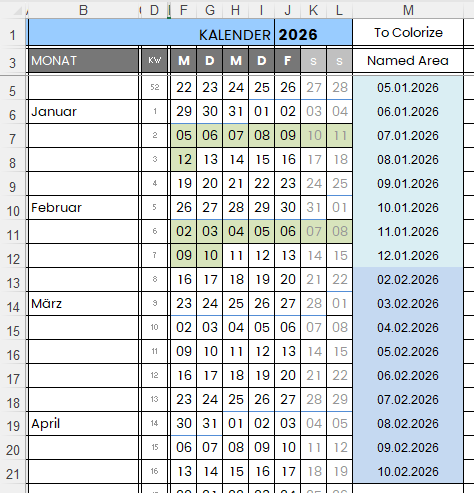
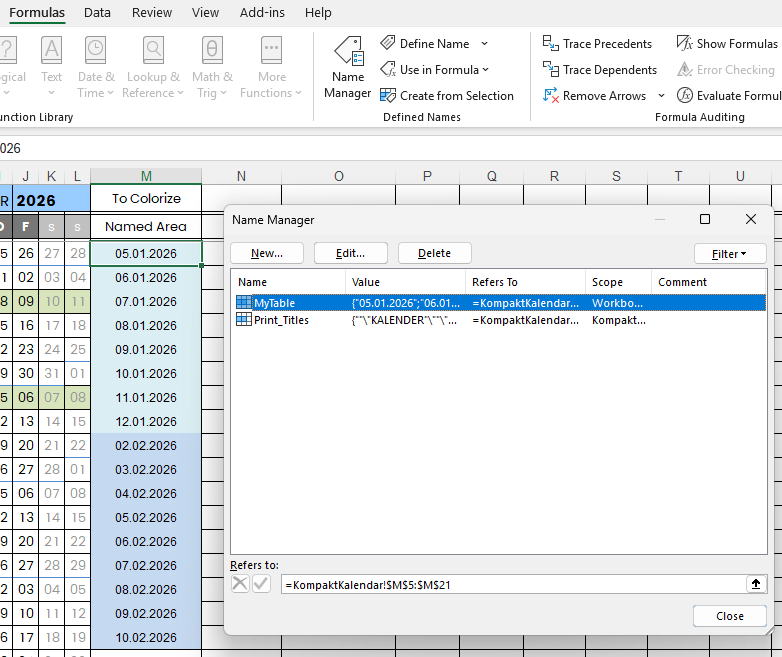
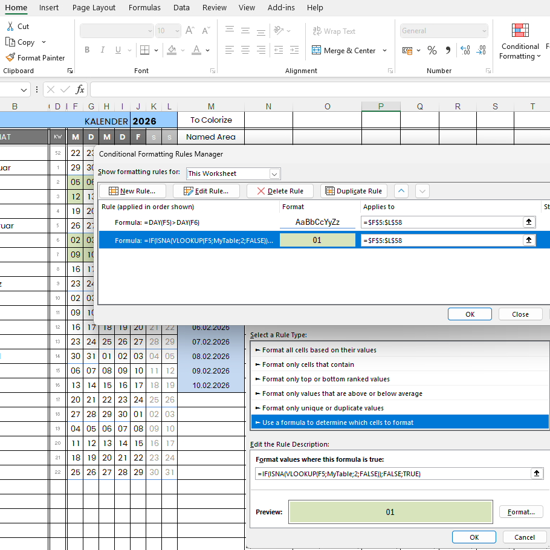

How to Colorize Cells in Excel Based on Rules from Other Cells
<!--more-->
For example, suppose you have a calendar and want to colorize or highlight certain cells automatically based on values in other cells.

To do this, you need two steps: 

1. **Define a named range** in the *Name Manager* for the relevant part of your table.     This allows you to reference that area easily in your formulas.

2. **Apply conditional formatting** from the *Home* tab.     

   - Go to *Conditional Formatting → New Rule → Use a formula to determine which cells to format*.
   - Enter your formula referencing the named range or other cells.
   - Choose the desired fill color or style, and click **OK**.

That’s it! Your cells will now automatically change color according to the rules you defined.
