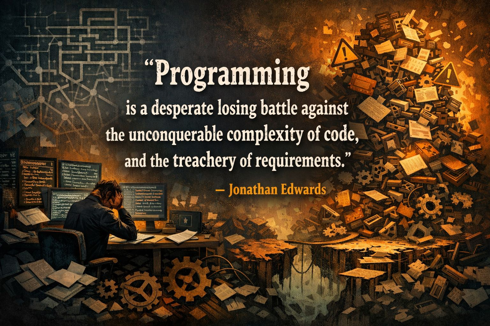

+++
date = '2026-05-17'
draft = false
title = 'Quintessence of programming'

+++

, captured by Jonathan Edwards in a remarkably honest quote:

👉 “...programming is a desperate losing battle against the unconquerable complexity of code, and the treachery of requirements.”

<!--more-->

This resonates deeply in my mind. Every new framework, paradigm, or language — whether it’s object‑oriented design, reactive systems, LabVIEW, Rust, or the next “silver bullet” — ultimately aims to let us express increasingly complex ideas in a simpler, more structured form. And yet, the total complexity of our systems still keeps growing continously.

We build abstractions to tame the chaos, but the world keeps demanding more features, more integrations, more robustness, more safety, more intelligence, more everything… Complexity doesn’t disappear — it migrates, it reshapes, it accumulates.

Today, AI gives us a way to push back against this entropy a little bit. It helps us navigate the ever‑growing maze, automate the mundane, and reason about systems that have outgrown the capacity of any single human mind.
But even with AI, the fundamental truth remains: we are not fighting to win — we are fighting to keep the complexity at bay long enough to build something meaningful.

And perhaps that’s what makes programming both humbling and beautiful: that in the face of overwhelming complexity, we continue to build, to imagine, to shape ideas into reality. Not because the battle is winnable, but because the work itself moves the world forward.

