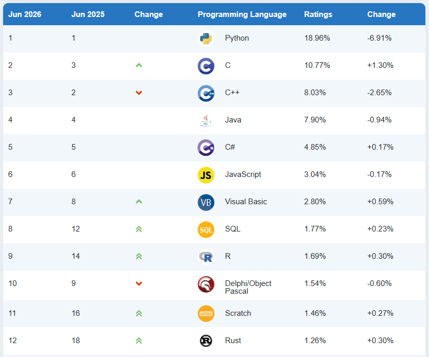
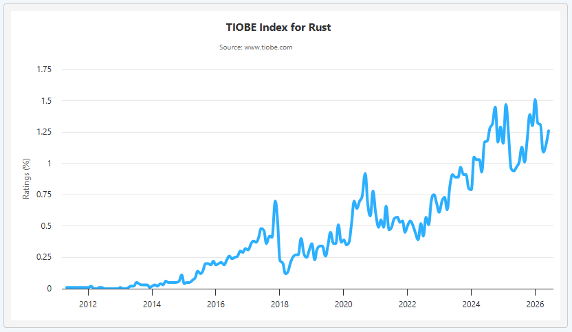
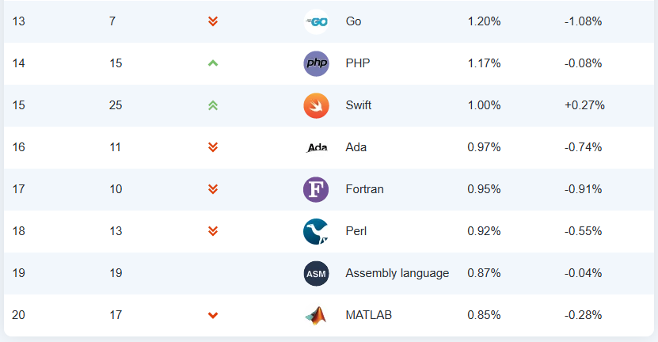
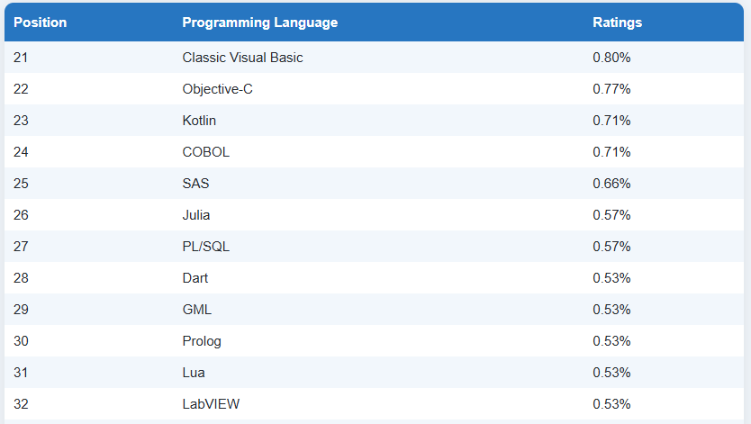
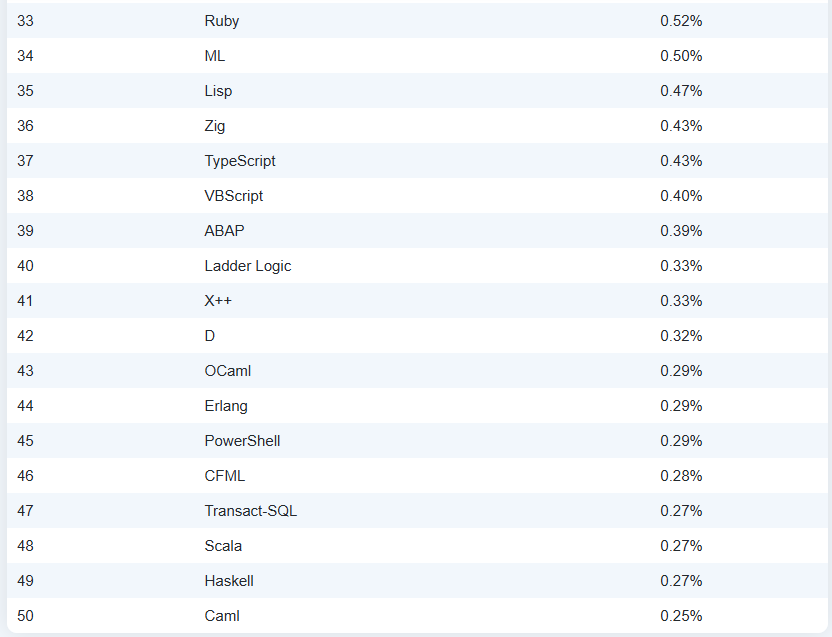
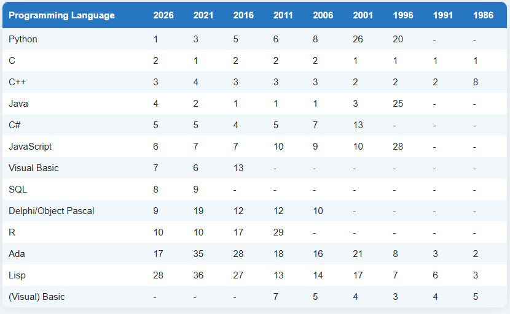

+++
date = '2026-06-01'
draft = false
title = 'Tiobe June 2026'

+++

Tiobe Index - June 2026 - Rust on Place 12, LabVIEW -32! Just would like to keep it in memory.

<!--more-->

[Home](https://www.tiobe.com/) » **TIOBE Index**

## **TIOBE Index for June 2026**

### June Headline: Rust's reported plateau appears premature

Two months ago, I wrote that Rust appeared to have plateaued. My conclusion was based on the fact that Rust had not gained any positions in the TIOBE Index for an entire year. However, recent developments have led me to revise that view. Rust has now reached a new all-time high, ranking 12th for the first time in its history. The language combines performance, memory safety, and powerful abstractions in a way that few other languages can match. These qualities give Rust strong potential to become a long-term success and a serious competitor to C and C++.

One challenge remains: Rust's concepts and design require a relatively high level of programming expertise. This may limit its appeal to a broader audience and could make it more difficult for Rust to break into the top five languages. That said, the future is never easy to predict. Rust has already exceeded my expectations, and it will be interesting to see whether its current momentum continues in the years ahead.

## The Next 50 Programming Languages

The following list of languages denotes #51 to #100. Since the differences are relatively small, the programming languages are only listed (in alphabetical order).

- (Visual) FoxPro, ActionScript, Apex, Awk, Bash, BCPL, Bourne shell, C shell, C++/CLI, CL (OS/400), Clojure, CoffeeScript, cT, ECMAScript, EGL, Elixir, F#, GAMS, Groovy, Io, J, J#, JScript.NET, Logo, MDX, MQL5, MS-DOS batch, NetLogo, OpenCL, PL/I, Pure Data, Q, REBOL, Ring, RPG, S, Scheme, SNOBOL, Solidity, Tcl, V, Vala/Genie, VHDL, Wolfram, XBase++, XC, Xojo, XPL, XSLT, Z shell

------

## This Month's Changes in the Index

This month the following changes have been made to the definition of the index:

- Stan, a programming language designed for statistical modeling and data analysis, has entered the TIOBE Index for the first time at position #189.
- Huawei's new programming language, Cangjie, designed for developing mobile applications for HarmonyOS NEXT, has entered the TIOBE Index for the first time. Cangjie debuts at position #201.

------

## Very Long Term History

To see the bigger picture, please find below the positions of the top 10 programming languages of many years back. Please note that these are *average* positions for a period of 12 months.

