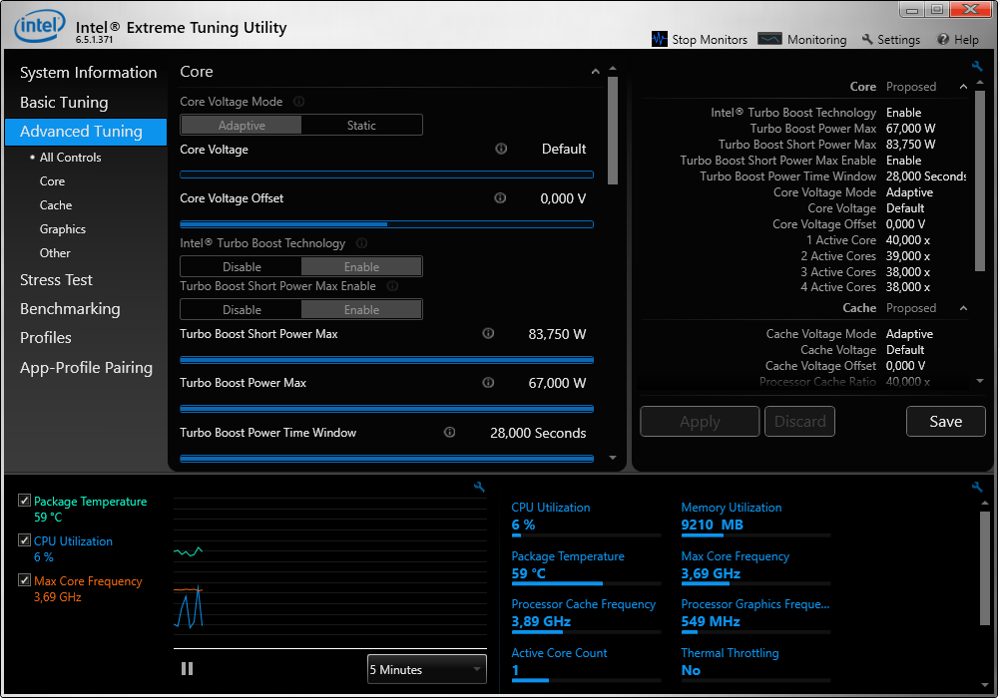

Recently upgraded CPU in my ancient laptop from i7-4800MQ to i7-4940MX, which is Extreme Edition, and need legacy Intel Extreme Tuning Utility, version XTUSetup 6.5.1.360 is compatible.
<!--more-->

Found [here](https://community.intel.com/t5/Processors/XTU-Versions/m-p/1398793): 

and works:

