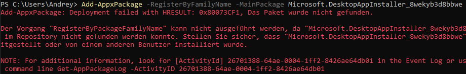

In attempt to install winget on Windowss 11 LTSC as recommended by Microsoft I've got error message. Below the simple workaround
<!--more-->

Error message looks like this:



Workaround:

Download winget manually from [Github repository](https://github.com/microsoft/winget-cli/releases). Actual version (as per 12th Janualy 2025) is [1.10.40](https://github.com/microsoft/winget-cli/releases/download/v1.10.40-preview/Microsoft.DesktopAppInstaller_8wekyb3d8bbwe.msixbundle).

Now execute following command:

```
Add-AppxPackage C:\Users\Andrey\Downloads\Microsoft.DesktopAppInstaller_8wekyb3d8bbwe.msixbundle
```

Check instllation:

```
winget --version
```

Result:

```
v1.10.40-preview
```

Now we can install, for example 'SysInternals' from store using winget.

Take a note, there are two distribution:

```
C:\Users\Andrey\Desktop>winget install sysinternals
Mehrere Pakete mit übereinstimmenden Eingabekriterien gefunden.
Bitte verfeinern Sie die Eingabe.
Name               ID                     Quelle
-------------------------------------------------
Sysinternals Suite 9P7KNL5RWT25           msstore
SysInternals       Microsoft.Sysinternals winget
```

You can install like this:

```
winget install "Sysinternals Suite"
```

or

```
winget install Microsoft.Sysinternals
```

both will work, the first one is "recommended"

Technically they will be installed in "C:\Users\Andrey\AppData\Local\Microsoft\WinGet\Packages\Microsoft.Sysinternals_Microsoft.Winget.Source_8wekyb3d8bbwe"

PowerToys also can be installed with winget:

```
winget install --id Microsoft.PowerToys --source winget
```

