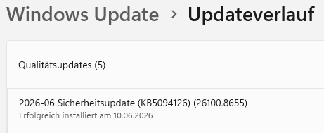

New Windows feature available in KB5094126.
<!--more-->

This one:



Link: — [9. Juni 2026 – KB5094126 (builds 26100/26200.8655)](https://support.microsoft.com/de-de/topic/9-juni-2026-kb5094126-betriebssystembuilds-26200-8655-und-26100-8655-1a9bcba6-5f53-4075-8156-fe11ac631737)

How to enable if not enabled yet:

[ViVe Tool](https://github.com/thebookisclosed/ViVe/releases).

```
vivetool /enable /id:60716524,61391826,48433719
```

60716524 = LowLatencyProfile

61391826 = LowLatencyProfileForApplicationLaunch

48433719 = UxAccOptimization.

Log

```
>vivetool /query /id:60716524,61391826,48433719
ViVeTool v0.3.4 - Windows feature configuration tool

No configuration for feature ID 60716524 was found in the Runtime store
No configuration for feature ID 61391826 was found in the Runtime store
[48433719] (UxAccOptimization)
Priority        : ImageDefault (0)
State           : Disabled (1)
Type            : Override (0)


C:\Users\Andrey\Downloads\ViVeTool-v0.3.4-IntelAmd>vivetool /enable /id:60716524,61391826,48433719
ViVeTool v0.3.4 - Windows feature configuration tool

Successfully set feature configuration(s)

C:\Users\Andrey\Downloads\ViVeTool-v0.3.4-IntelAmd>vivetool /query /id:60716524,61391826,48433719
ViVeTool v0.3.4 - Windows feature configuration tool

[60716524]
Priority        : User (8)
State           : Enabled (2)
Type            : Override (0)

[61391826]
Priority        : User (8)
State           : Enabled (2)
Type            : Override (0)

[48433719] (UxAccOptimization)
Priority        : ImageDefault (0)
State           : Disabled (1)
Type            : Override (0)
```

https://www.deskmodder.de/blog/2026/05/27/windows-11-erhaelt-low-latency-profile-um-anwendungen-schneller-starten-zu-lassen/

