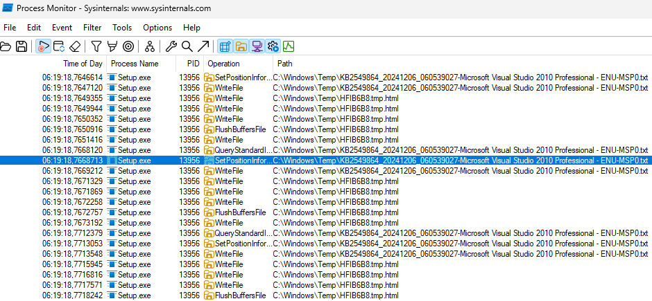
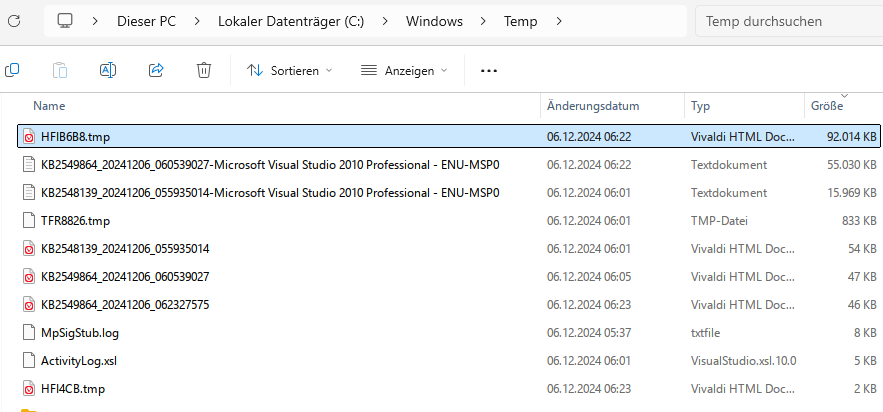
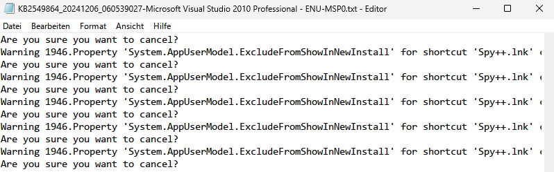
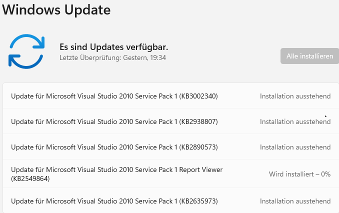
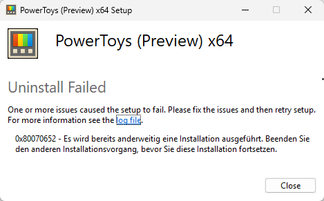

Today I noticed that my computer was slower than usual. A brief investigation revealed that PowerLauncher.exe was causing other running MSI installers to fail when setting up shortcuts.<!--more-->

I observed unusually high SSD activity. The tool I typically use in such cases is Process Monitor from Sysinternals, and here's what I observed:

Temporary file with pretty large size:

and lot of entries related to the shortcut in log file:

The reason was Update of Visual Studio 2010, which I installed for some legacy projects:

After short digging into internet found similar issue:

[PowerLauncher.exe causes other running MSI installers to fail to set up the shortcut #34391](https://github.com/microsoft/PowerToys/issues/34391).

So, the PowerToys and Power Launcher was killed from the Task Manager,

Unistallation was slightly painful:

But second attempt was successfull. After restart the Windows Updates was installed successfully and everything went normal back.

Will keep Power Toys unistalled for the moment, and wait for bug fix (hopefully will be fixed someday).