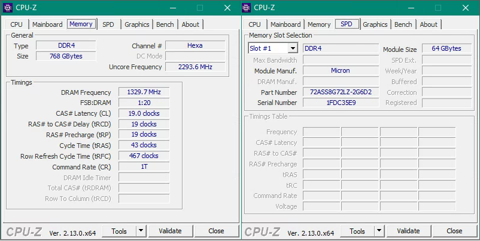
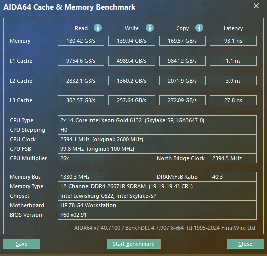
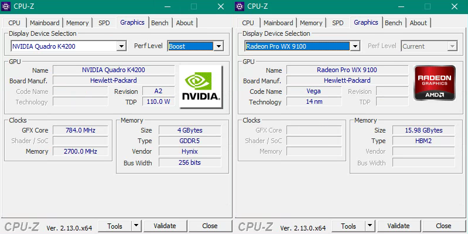
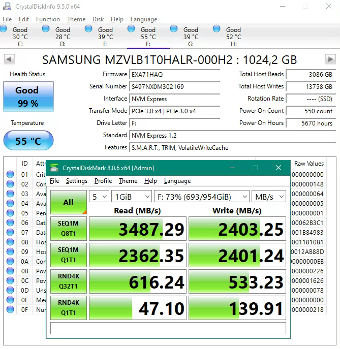
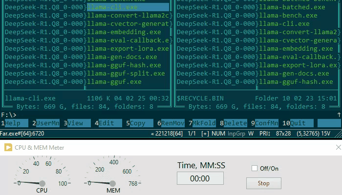
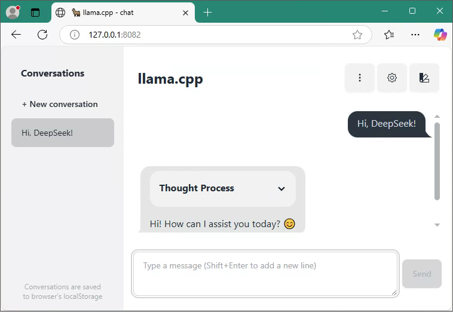

To get DeepSeek running on your PC you will need enough RAM, and it is quite easy with llama.cpp. Below step by step guide and results.
<!--more-->
PC HP z8 G4 Workstation.
CPU:


Memory - 12 x 64 GB = 768 GB:



Memory Benchmark (take a note, this is 12-channels memory with around 180 GB/s read - this is important for performance):



Video Adapters (will be unused):



SSD Drive:



### Download DeepSeek

I will download full [DeepSeek R1 Q8_0](https://huggingface.co/unsloth/DeepSeek-R1-GGUF/tree/main/DeepSeek-R1-Q8_0) from the HuggingFace [DeepSeek-R1-GGUF](https://huggingface.co/unsloth/DeepSeek-R1-GGUF/tree/main) Repository.

### Download llama.cpp

Windows builds available in the [Releases](https://github.com/ggerganov/llama.cpp/releases). I downloaded AVX-512 version.

### Run it

```
llama-cli.exe -m DeepSeek-R1.Q8_0-00001-of-00015.gguf -p "Hi!" -n 4096
```

That is. Also tried ollama and LM Studio, but got some troubles and issues. 

How it looks in real time:



Let try to ask C Source code for Runge-Kutta Method:


It is not very fast, around 1.2 tokens per second, but works.

It recommended to turn Hyper threading Off to get better performance and better CPU Utilization:


Also possible to run as server:

```
llama-server.exe -m DeepSeek-R1.Q8_0-00001-of-00015.gguf --port 8082
```

The you can use web interface:




Enjoy!

