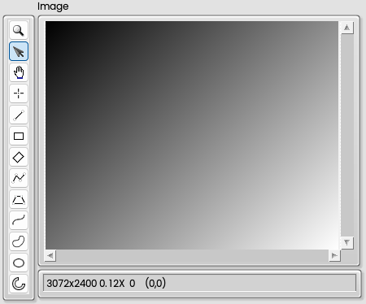
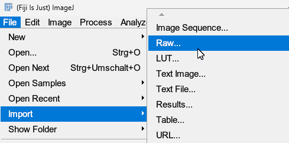
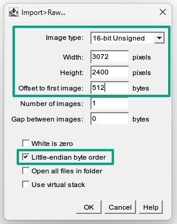
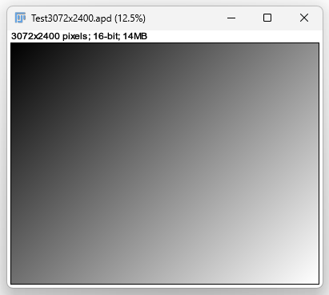
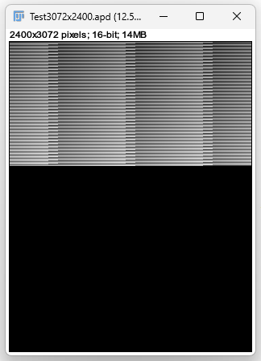
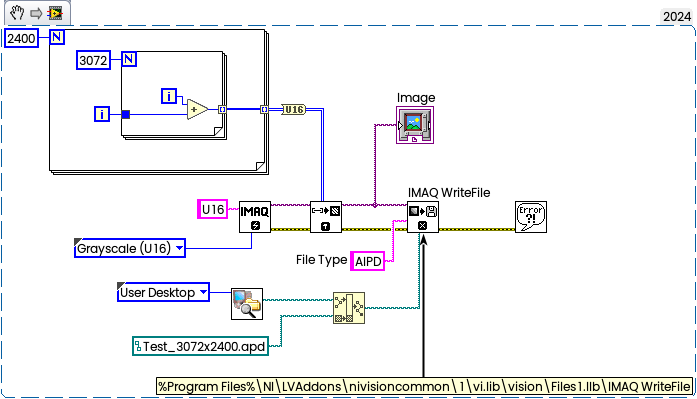
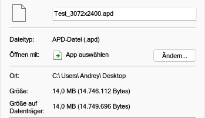
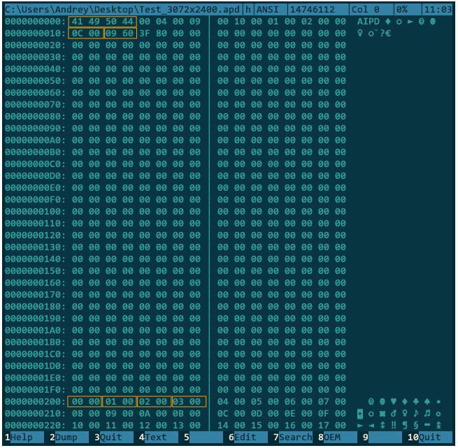
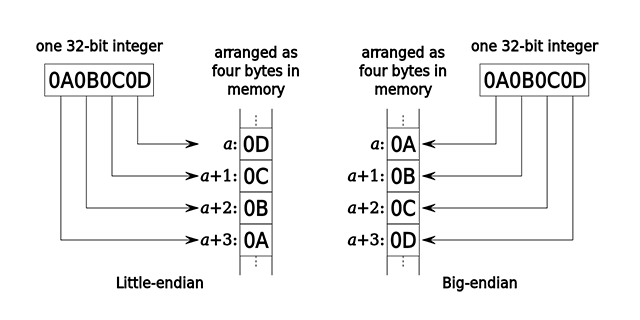

The AIPD image format is an internal, proprietary National Instruments format. It can normally be opened in NI software like Vision Assistant, but it can also be opened in ImageJ.
<!--more-->
In general, AIPD is a raw, uncompressed format with a simple header, which is 512 bytes. The typical file extension used is *.apd or *.aipd. To work with this format in ImageJ, you only need to specify the offset, size, and bit depth. The advantage is performance on save, because this format is not encoded like TIFF or PNG.

For example, if you have a 16-bit grayscale image with a size of 3072x2400 (width x height) and a simple gradient:

In ImageJ (or Fiji) you should import RAW Image (File->Import->Raw...:

and then setup four parameters as shown below:

Then image gets opened:

If you have a "corrupted image", then in most cases one of these parameters is wrong (usually the size). For example, if you occasionally swap the Width and Height, then you'll get something like this.

The similar "distortion" you may get in case of wrong of Offset Image Type or Byte Order.

### Short explanation

The test image has been created in LabVIEW with following code snippet:

If you will take a look into Properties, then you will see size:

3072 x 2400 = 7 372 800 pixels x 2 bytes = 14 745 600 bytes.

Now 14 745 600 + 512 bytes header = 14 746 112 bytes as shown above.

(By the way, size on the disk is 14 749 696 bytes, because  14 746 112 will take 3601 clusters (more exactly 3600¼, and each cluster on NTFS is 4096 bytes, so the ¾ of the last cluster remains unused), therefore 3601 * 4096 = 14 749 696 bytes.)

So, now if you will take a look inside of *.apd file with Hex Viewer (I using Far Manager), then you will see following:

Here above you can see - the file will start with signature AIPD (ASCII 0x41, 0x49, 0x50 0x44), then the size also present in the header - bytes 0x0C00 is 3072 (Width), then 0x0960 is decimal 2400 (Heigh), the rest some internal info (someday I will perform fully reverse engineering, may be).

The image itself starts from 0x200 (which is 512) - this is your offset, and first pixel is zero 0x0000, then the next with value = 1 — 0x0100 and so on. This is little-endian byte order, refer to [Endianness](https://en.wikipedia.org/wiki/Endianness):

I think, it should be possible to develop plugin for ImageJ to avoid manual size/offset definition, but this exercise is out of scope for this topic. 

[Test image](https://gitlab.com/AndyDm/for_blog/-/blob/main/Test_3072x2400.apd.zip).
