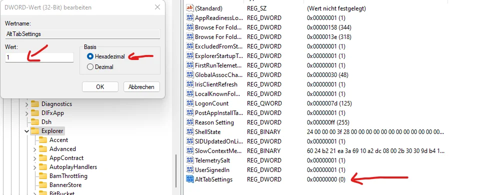

When I hold Left Alt + Tab, I am still able to select my desired window by tabbing, however when I release Alt, nothing happens. It still stuck at the small window selecting thing, I have to manually click on or hit ENTER to switch to the desired window instead of just releasing key. Looks like left Alt acts as right Alt. And the Solution is to add DWORD Value  AltTabSettings and set it to 1 to the Registry:
```
HKEY_CURRENT_USER\Software\Microsoft\Windows\CurrentVersion\Explorer
```
<!--more-->



(from [Reddit](https://www.reddit.com/r/VALORANT/comments/110f9i5/fixing_the_alttab_freeze_bug_in_windows_11_3/))
