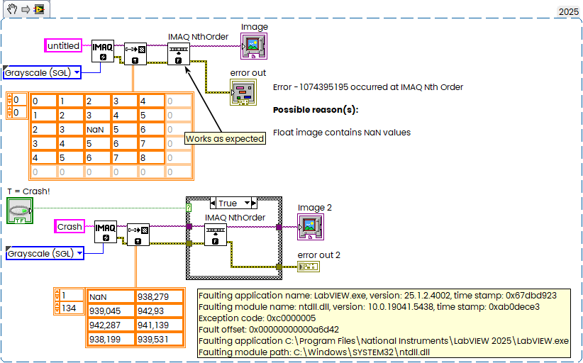

I just encountered an interesting exception in LabVIEW when the Median Filter was called for a float image containing a NaN value. It works as expected for small images, but I found one that caused a crash.

<!--more-->

I'm not sure if the size or content is the "trigger" for this issue. Anyway, the snippet below:

I also tested it in LabVIEW 2018 32-bit, and it crashed as well.
