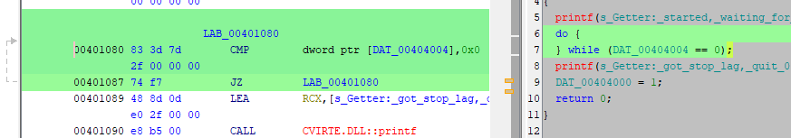

A practical example of compiler optimization side effects: when the `volatile` keyword becomes essential
<!--more-->
The `volatile` keyword in C is essential for ensuring correct program behavior when a variable's value can change unexpectedly, outside the control of the code the compiler sees, because some C compilers perform aggressive optimizations, such as caching variable values in CPU registers to avoid repeated memory access and If a variable can change independently of the current code (for example, by another thread, or an interrupt), the compiler's optimizations may cause the program to use a stale value, leading to incorrect behavior.

Pretty simple code in NI CVI:

```c
#include <ansi_c.h>
#include <windows.h>
#include <utility.h>

BOOL quit = FALSE;
BOOL stop = FALSE;

int CVICALLBACK fnSetterThread (void *functionData)
{
	printf("Setter: started\n");
	Sleep(1000);
	stop = TRUE;
	printf("Setter: stop flag set\n");
	while (!quit) {}
	printf("Setter: stopped\n");
	return 0;
}

int CVICALLBACK fnGetterThread (void *functionData)
{
	printf("Getter: started, waiting for the stop flag...\n");
	while (!stop) {}
	printf("Getter: got stop lag, quit\n");
	quit = TRUE;
	return 0;
}

int main (int argc, char *argv[])
{
	int fnId1, fnId2;
	CmtScheduleThreadPoolFunction (DEFAULT_THREAD_POOL_HANDLE, fnSetterThread, NULL, &fnId1);
	CmtScheduleThreadPoolFunction (DEFAULT_THREAD_POOL_HANDLE, fnGetterThread, NULL, &fnId2);
	CmtWaitForThreadPoolFunctionCompletion (DEFAULT_THREAD_POOL_HANDLE, fnId1, 0);
	CmtWaitForThreadPoolFunctionCompletion (DEFAULT_THREAD_POOL_HANDLE, fnId2, 0);
	return 0;
}
```

Without `volatile`, the code hangs indefinitely because the compiler caches `stop` in a register, ignoring updates from other threads. The disassembly reveals that non-volatile variables are optimized into infinite loops (e.g., `while (1)`), while volatile variables force memory reads, this code will be never stopped:

```console
Setter: started
Getter: started, waiting for the stop flag...
Setter: stop flag set
```

To be honest, when the execution got stuck at the `while (!stop) {}` line (and the `stop` variable was TRUE for sure), my first impression was that it was a cache coherence issue. But no, everything is much simpler.

Expected result, which is

```console
Setter: started
Getter: started, waiting for the stop flag...
Setter: stop flag set
Getter: got stop lag, quit
Setter: stopped
```

will be obtained in the following cases:

* if you will declare both stop and quit flags as volatile

* or, if you will put Sleep(1) into waiting loops

* or, if you will compile code as Debug and not in Release mode

Let check what happened in the code above. I have no idea, how to get assembly listing from NI CVI, so I’ll decompile code with Ghidra (you can use IDA or any other disassembler your choice)

This is first loop:


And the second looks exactly the same — the «1» value written inside of the loop, then of course, the loop never finished;


Now how this gets changed if both variables declared as volatile:

```c
volatile BOOL quit = FALSE;
volatile BOOL stop = FALSE;
```

First thread:


Second thread:



Using `volatile` introduces slight performance overhead but guarantees correctness in multithreaded or hardware-interfacing scenarios. And don’t forget to pair it with proper synchronization mechanisms (e.g., mutexes) for thread safety if you have critical sections.

This is how volatile keyword may change unexpected behavior.
