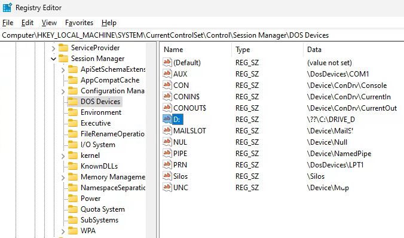

In some cases we need to have dedicated Drive in absence of the physical Drive. In this case we can add drive mapped to the Folder. Typically this could be done using **SUBST** command, but there is more convenient way.
<!--more-->
 For example, you need to move dropbox folder to the other drive, or some software will expect some data on the dedicated drive, etc. Typically we using SUBST command:

```
>SUBST /?
Associates a path with a drive letter.

SUBST [drive1: [drive2:]path]
SUBST drive1: /D

  drive1:        Specifies a virtual drive to which you want to assign a path.
  [drive2:]path  Specifies a physical drive and path you want to assign to
                 a virtual drive.
  /D             Deletes a substituted (virtual) drive.

Type SUBST with no parameters to display a list of current virtual drives.
```

For example, if we need to map C:\DRIVE_D Folder to the D:\ Drive, then it could be done like this:

```
>SUBST D: C:\DRIVE_D
```

But one inconvenient point is that you have to execute this command every time when booted OS (by placing to the command file, or to the Scheduler Task, called on logon).

More convenient to do this persistent is using Registry:



Simple registry file:

```
Windows Registry Editor Version 5.00

[HKEY_LOCAL_MACHINE\SYSTEM\CurrentControlSet\Control\Session Manager\DOS Devices]
"D:"="\\??\\C:\\DRIVE_D"
```

SUBST command will show substitution as well:

```
>SUBST
D:\: => C:\DRIVE_D
```

