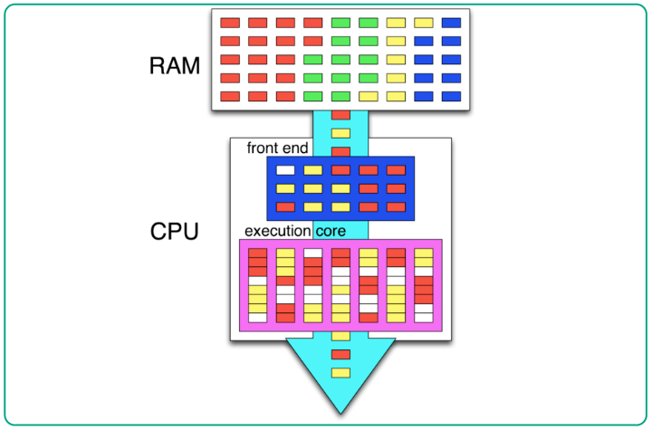
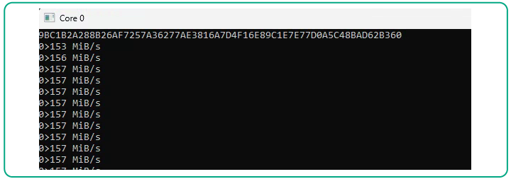
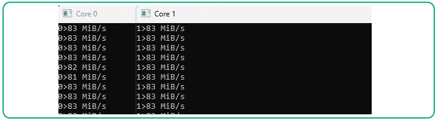
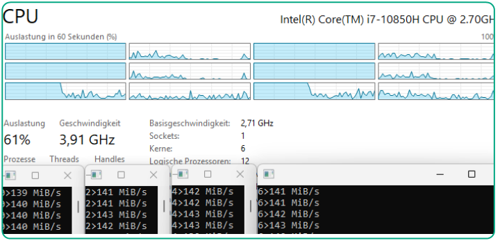

I ran my own experiments to better understand how Hyper-Threading works internally on Windows, using hand-written assembly benchmarks — from single-register multiplications to SHA-256 hashing.

<!--more-->

At the beginning of September, I came across an insightful article by Brendan Long titled [**%CPU Utilization Is A Lie**](https://www.brendanlong.com/cpu-utilization-is-a-lie.html). Spoiler — yes, it's true, the %CPU Utilization is a lie.

In the article, Brendan questions the reliability of CPU utilization metrics commonly used in Linux system monitoring tools. Using stress tests on a Ryzen 9 5900X, this article demonstrates that reported CPU utilization often underrepresents the actual workload. For instance, a system showing 50% utilization might already be operating at 60–100% of its real capacity, depending on the task and concludes that relying solely on %CPU can lead to poor capacity planning and instead advocates for benchmarking the actual work performed.

Several key factors contribute to this discrepancy:

- **Hyper-Threading**, which leads to resource sharing beyond physical core limits.
- **OS scheduling inefficiencies**, especially with partially loaded multi-threaded workloads.
- **Turbo Boost**, which dynamically adjusts clock speeds and distorts utilization metrics.

Although Brendan’s analysis focuses on Linux, I will be conducting my experiments on **Windows**. The underlying principles and conclusions, however, remain valid across both platforms — the same architectural and mostly the same scheduling challenges apply.

Let’s dive deeper into this topic — as deep as we can.

### The Confusion Around Hyperthreading

When people talk about Hyper-Threading, it often begins with neat diagrams full of colorful squares — like this one from Wikipedia:



Figure 1. Hyper Threading explain in Wikipedia (Image source: Wikipedia.org)

And that’s all fine. But if you ask the average engineer how this technology _actually_ works, the conversation often goes something like this:

— “Well, when it’s enabled, we get twice as many cores and things get parallelized...”_

_— “So, does that mean the computer runs twice as fast?”_

_— “No, of course not. These aren’t real cores, resources are shared...”_

_— “But there’s some benefit, right? A multithreaded program will run faster?”_

_— “Well, yes, there is some benefit, and the program might run faster.”_

_— “Or it might not?”_

_— “Or it might not. It’s kind of a gamble...”_

### My First Encounter with Hyper-Threading

I first encountered Hyper-Threading about twenty years ago on a dual-core Xeon processor. After enabling it, I ran into a series of headaches — specifically, the NI-IMAQ image acquisition card driver began sporadically crashing the system with BSODs. And by “sporadically,” I mean it could run fine for two or three days without issues, or crash multiple times in a single day. I disabled Hyper-Threading and forgot about it for months.

Later, I made several more attempts to develop multithreaded programs that could benefit from Hyper-Threading. But no luck — performance measurements consistently fell within the margin of error: sometimes slightly faster, sometimes slightly slower. For context, I was using LabVIEW at the time, which has its own unique behavior when it comes to multithreading.

These days, I generally keep Hyper-Threading enabled — having double the number of logical cores is usually better than relying solely on the physical ones. I only disable it when absolutely necessary (for example, when dealing with crashes that still occasionally occur in LabVIEW-based applications).

One thing is clear, though: doubling the number of logical cores doesn’t mean doubling performance. Still, I’ve always wanted to write a minimal piece of code that clearly demonstrates what Hyper-Threading actually does. After reading Brendan’s article, I finally gave it a shot — and it turned out to be much simpler than expected (once you know where to dig).

The challenge with demonstrating Hyper-Threading’s pros and cons using synthetic benchmarks — especially those created in a quick “vibe coding” session — is that the instructions used might either be ideal or completely unsuitable for showcasing the effect. What we need is a distilled, fully controlled test — down to the level of individual CPU instructions. That means it’s time to break out the assembler. (In theory, you could use C or Rust with inline assembly, but we’re not taking the easy route — and you’d still need to inspect the assembly listing anyway.)

### Test Environment

For these experiments, I’m using older hardware running **Windows 11 LTSC 24H2**, specifically build **26100.6584** (the most recent at the time of writing):


Figure 2. Quad Core Intel Xeon E5-1620 v3 CPU

[This CPU](https://www.intel.de/content/www/de/de/products/sku/82763/intel-xeon-processor-e51620-v3-10m-cache-3-50-ghz/specifications.html), although more than ten years old, is not as complex as modern systems, but it's perfectly adequate for our experiments. To kick things off, I ran a basic performance benchmark — the first one I had on hand — with and without Hyper-Threading enabled. The result? **No difference whatsoever**.


Figure 3. Benchmarks of the Intel Xeon E5-1620 v3 with and without Hyper-Threading

But just because we don’t see a difference at first glance doesn’t mean it’s not there. Let’s try loading the cores with a custom test — one that simply multiplies two numbers in the CPU’s registers. Nothing more.

No need to go far for this. Here’s the starter assembly code, with AI-generated comments that I’ve lightly cleaned up:

```nasm
EUROASM AutoSegment=Yes, CPU=X64, SIMD=AVX2
cputest PROGRAM Format=PE, Width=64, Model=Flat, IconFile=, Entry=Start:

INCLUDE winscon.htm, winabi.htm, cpuext64.htm

Msg0 D ">",0 ; Separator between core number and timestamps
Buf0 DB 4 * B ; Buffer to convert core number from register to ASCII
Buf1 DB 16 * B ; Buffer to convert TSC value from register to ASCII string

Start: NOP ; Entry point - 'nop' is a no-op (used for auto-segmentation)

    MOV R8, 1_200_000_000 ; Load 1.2 billion into r8 - loop counter

    CPUID       ; Serialize execution to prevent out-of-order effects
    RDTSC       ; Read Time Stamp Counter low and high into rax:rdx
    SHL RDX, 32 ; Shift rdx left by 32 bits
    OR RAX, RDX ; Combine rdx:rax into 64-bit TSC value by OR command
    MOV R9, RAX ; Store start TSC value from rax into r9 register

align 16 ; Loop entry aligned to 16 bytes - recommended by Intel
.loop:            ; --- the workload starts here
    IMUL R10, R10 ; Multiply r10 by itself - the core workload
    DEC R8        ; Decrement loop counter (1.2 billion iterations)
    JNZ .loop     ; Loop until zero in r8 (no need extra comparison) ---

    RDTSCP       ; Read TSC and processor core ID with serialization
    SHL RDX, 32  ; Combine high and low parts of TSC again
    OR RAX, RDX  ; You know this already
    SUB RAX, R9  ; Subtract r9 from TSC to calculate elapsed cycles
    StoD Buf1    ; Convert elapsed cycles in rax to decimal string to Buf1
    MOV RAX, RCX ; Move core number from rcx to rax
    StoD Buf0    ; Convert core number to decimal string to Buf0
    StdOutput Buf0, Msg0, Buf1, Eol=Yes, Console=Yes ; Output to Console
    Clear Buf0, 20 ; Clear both buffers before next measurement

    JMP Start ; Repeat benchmark indefinitely (hit Ctrl+C to stop it)
ENDPROGRAM ; End of the program
```

If you're not familiar with Assembly, below list of all 12 instructions used in the example (skip this section if the code above is crisp and clear for you):

- [NOP](https://www.felixcloutier.com/x86/nop) — No Operation
- [MOV](https://www.felixcloutier.com/x86/mov) — Move (Copies the second operand/source to the first operand/destination)
- [SHL](https://www.felixcloutier.com/x86/sal:sar:shl:shr) — Shifts the bits in the first operand (destination) to the left by the number of bits
- [OR](https://www.felixcloutier.com/x86/or) — Logical Inclusive OR
- [SUB](https://www.felixcloutier.com/x86/sub) — Subtracts the second operand/source from the first operand/destination
- [IMUL](https://www.felixcloutier.com/x86/imul) — Signed Multiply (most important instruction in this test)
- [DEC](https://www.felixcloutier.com/x86/dec) — Decrement by 1
- [JNZ](https://www.felixcloutier.com/x86/jcc) — Jump short if not zero
- [JMP](https://www.felixcloutier.com/x86/jmp) — Jump
- [CPUID](https://www.felixcloutier.com/x86/cpuid) — CPU Identification
- [RDTSC](https://www.felixcloutier.com/x86/rdtsc) — Read Time-Stamp Counter
- [RDTSCP](https://www.felixcloutier.com/x86/rdtscp) — Read Time-Stamp Counter and Processor ID

**RAX, RDX, R8, and R9** are general-purpose registers. Each CPU core has 16 of these, and they’re used for arithmetic, logic, and data movement. Here’s a breakdown:

- **RAX** – Accumulator
- **RBX** – Base
- **RCX** – Counter
- **RDX** – Data
- **RSI** – Source Index
- **RDI** – Destination Index
- **RBP** – Base Pointer (used for stack frames)
- **RSP** – Stack Pointer (gets changed by PUSH/POP Instructions)
- **R8** to **R15** — 8 Extended Registers (added in x64)
- **RIP** – Instruction Pointer (read-only)

Each of these registers has 32-bit, 16-bit, and 8-bit sub-registers. In general, there are many more types of registers — such as segment registers, flags, and SIMD registers (XMM, YMM, ZMM) — but those are outside the scope of this example.

This piece of code written in [**EuroAssembler**](https://euroassembler.eu/index.htm), a lightweight and portable assembler developed by [Pavel Šrubař](https://www.linkedin.com/in/pavel-%C5%A1ruba%C5%99-a2893439/), just [**download**](https://euroassembler.eu/download/) it, copy the source code from above and save it as cputest.asm, then compile (or, more correct to say "assemble" it) using the following command, you will get Windows executable:

```console
> euroasm.exe cputest.asm 
```

The [**StoD**](https://euroassembler.eu/maclib/cpuext64.htm#StoD) and [**StdOutput**](https://euroassembler.eu/maclib/winabi.htm#StdOutput) are macros. Of course, converting a register value to a string and printing it to the console involves a bunch of tedious steps — that’s why we included [**winscon**](https://euroassembler.eu/maclib/winscon.htm), [**winabi**](https://euroassembler.eu/maclib/winabi.htm), and [**cpuext64**](https://euroassembler.eu/maclib/cpuext64.htm) at the top of the source file to support those macros.

### The Essence of the Benchmark

Our entire loop is "distilled" and stripped down to a single operation: a register multiplying itself. It’s a pure benchmark — minimal, focused, and free of distractions for CPU:

```nasm
MOV R8, 1_200_000_000
.loop:
    IMUL R10, R10
    DEC R8
    JNZ .loop
```

The actual value in register R10, and the fact that it’s never used afterward, doesn’t concern us at all. This isn’t C, where the compiler might optimize away “unused” code. Here, we explicitly ask the CPU to multiply — and it will multiply.

Why **1.2 billion** iterations? Because the test CPU runs at **3.6 GHz** thanks to Turbo Boost (its nominal clock speed is 3.5 GHz). The loop takes **three CPU cycles per iteration** — not because there are three instructions, but because IMUL has a latency of three cycles on Haswell architecture. So the CPU will execute roughly **3.6 billion cycles** (1.2 × 3), which means the loop should take **exactly one second**. Take a note than on this Xeon all cores are boosted uniformly.

The RDTSCP instruction returns a timestamp based on the **base clock** (3.5 GHz). Don’t confuse this with the CPU’s dynamic clock speed, which can be higher or lower. So, if I see around **3.5 billion increments**, I know the loop ran for roughly one second — without interruptions or delays, so expected is something around 3,5 billion increments.

At the end, I’ll print to the console not only the elapsed timestamp increments, but also the **CPU core** on which the RDTSCP instruction was executed (will be useful for self-control).

Let’s assemble and run it.

```
>multest1.exe   
4>3508224852                                    
5>3508484297                                    
6>3508373234                                    
6>3508483834                                    
6>3508368821                                    
4>3509116171                                    
7>3508654410                                    
2>3509981084
... 
```

Here’s how Task Manager displays CPU usage during the benchmark:


Figure 4. Multiplication in the loop running on Windows without Affinity

Almost all of these spikes are from our test application. For this experiment, I ensured that background Windows activity remained minimal — just a few percent during idle time.

So why are **all cores** busy more or less uniformly, instead of just one? Good question. That’s simply how **Windows scheduling** works. Our program — more precisely, the thread executing the benchmark — gets moved from core to core approximately every 10–15 milliseconds.

This behavior is easy to demonstrate. The RDTSCP instruction, used at the end of the benchmark, acts as a command ordering barrier and also writes the core number (from IA32_TSC_AUX) into the ECX register. You can see this in the output as 4>, 5>, 6>, and so on — indicating the core on which the instruction was executed.

How to run applications on the dedicated cores? The easiest way to run an application on a specific core is by setting processor affinity. Here’s how to launch four instances of the benchmark, each pinned to a different physical core (leaving the Hyper-Threaded siblings unused for the moment):

```
start "" /affinity 0x01 "multest1.exe"
start "" /affinity 0x04 "multest1.exe"
start "" /affinity 0x10 "multest1.exe"
start "" /affinity 0x40 "multest1.exe"
```

This is how it looks in Windows Task Manager:


Figure 5. Four loops with multiplications running on the physical cores only

So, with this setup, we’re tightly utilizing four physical cores. Task Manager shows around **55% CPU usage**, and each microbenchmark runs at full speed — completing in exactly one second. There’s a slight dip, of course, since the OS needs some resources to operate, but overall, everything is stable. But is it really **55% utilization**?

An impatient reader might exclaim:

> “Well then, go, go ahead and run eight copies on eight cores!”

And of course, we’ll do exactly that (bets on the results are welcome) — but not just yet.

First, let’s run one more simple experiment: we’ll add another multiplication to the loop, using a **different register**. Why use a different register for the second multiplication? Because using the same destination register would create a data dependency — and that introduces a performance penalty. Here’s why: modern CPUs use pipelining and out-of-order execution to maximize throughput. But when an instruction depends on the result of a previous one (like multiplying r10 and then immediately using r10 again), the CPU has to wait for the first instruction to complete before starting the next. This is known as a read-after-write (RAW) hazard. In contrast, if you use a different register (e.g., r11), the CPU can execute both multiplications in "parallel", assuming there are enough execution units available. This allows the benchmark to better saturate the core’s arithmetic units and gives a more accurate picture of how Hyper-Threading affects throughput. So, to avoid artificial bottlenecks and better simulate real-world parallel workloads, we use IMUL instructions with independent registers.

```nasm
.loop:
	IMUL r10, r10 
	IMUL r11, r11 ; The second multiplication added here
	DEC r8
	JNZ .loop
```

Here’s one more important point: CPU instructions have two key characteristics — **latency** and **throughput**. So, how long will the loop run now, after adding a second multiplication?

Well, if you’ve looked up the latency and throughput of the IMUL instruction in Intel’s optimization manual, you won’t be surprised. On Haswell architecture:

- **Latency** of IMUL is **3 cycles (**each IMUL instruction takes **3 cycles** to complete**)**
- **Throughput** is **1 instruction per cycle (**the CPU can **start executing one** IMUL per cycle, assuming there are no dependencies and enough execution resources**)**

This means that even with two independent IMUL instructions in the loop, the CPU can still issue one per cycle — and the loop still runs for **exactly one second**, just like before.

Let’s run it **without setting affinity**, allowing Windows to freely move the thread across cores. We’ll even give Hyper-Threading a head start.

```
>multest2.exe
3>3504262254
1>3504642284
3>3504270689
6>3504938132
5>3504372957
2>3504528373
1>3504337204
```

Well, let now try **three** sequential IMULs:

```nasm
.loop:
	IMUL r10, r10 
	IMUL r11, r11
	IMUL r12, r12 ; One more multiplication added here
	DEC r8
	JNZ .loop
```

And the result? Same speed:

```
>multest3.exe
3>3505637001
0>3506060212
2>3506114325
3>3504772562
5>3506323017
2>3505235671
7>3505771778
```

Some readers might think the core is somehow “elastic” or that something unusual is happening — but no, it’s just how modern CPUs handle instruction-level parallelism. Although IMUL has a **latency of three cycles**, the processor can **start a new one every cycle**, and execute **up to three in parallel** — assuming there are no data dependencies and execution port is available.

Also, the DEC and JNZ instructions are likely **macro-fused** — meaning the CPU combines them into a single µOP for more efficient execution. This is a common optimization in Intel architectures.

However, adding a fourth IMUL will indeed slow the program down:

```nasm
.loop:
	IMUL r10, r10 
	IMUL r11, r11
	IMUL r12, r12
        IMUL r13, r13 ; Now 4 CPU cycles will be required
	DEC r8
	JNZ .loop
```

Now it’s **4.6 billion cycles** — meaning the loop now takes about a third of a second longer than before.


(Beautiful number, by the way — 142857 repeats infinitely). Here's the proof of 4,6 billion:

```
>multest4.exe
2>4673869757
3>4673805777
1>4677235204
3>4676222892
7>4676995126
2>4674254098
2>4674209913
6>4672962356
```

Key takeaway from this experiment — we can run one, two or three sequential multiplications in "parallel". Now its a time to run single multiplication, but on **eight logical cores** — fully occupying the CPU and pushing utilization to 100%:


Figure 6. Eight threads with single multiplications running at full speed on all logical cores

At this point, the picture should be more clear. The colorful diagrams from Wikipedia have become quite _tangible_. With only one multiplication per thread, the execution pipelines are **underutilized** — roughly one-third full. So when a second thread is scheduled on the same physical core (via Hyper-Threading), it can **fill in the "idle" pipeline slots**. This is the essence of how Hyper-Threading improves throughput. Obviously, if we had a hypothetical **“tri-hyperthreading”** (three logical threads per core), we’d effectively have a “12-core” CPU from just four physical cores.

If you check the _Intel® 64 and IA-32 Architectures Software Developer’s Manual_, Figure 2-8 shows that each physical core has **only one execution engine**, shared between its two Hyper-Threaded siblings:


Figure 7. Intel Haswell 4 Cores/8 Threads CPU Architecture

Instructions from both threads are **merged and executed** on the same engine. So if you run a single multiplication on one core and two on another, they’ll perform accordingly — try it yourself.

And now it should be clear why the **CPU usage reported by the OS** can differ significantly from **actual CPU utilization**:


Table 1. Reported vs actual CPU Usage for loops with multiplications

### Deep Diving

Now that we’ve seen how Hyper-Threading behaves under simple, controlled workloads, it’s time to go deeper — beyond what Task Manager or even RDTSCP can tell us.

We’ll explore what’s really happening inside the CPU:

- How instructions are dispatched and executed
- Later, how execution ports are utilized
- What limits throughput when logical cores compete for shared resources
- And how we can measure all of this using **hardware performance counters**

This is where things get interesting — and a bit more technical. But don’t worry, we’ll take it step by step.

To gain deeper insights into CPU internals, I highly recommend building and running the [**Intel® Performance Counter Monitor (Intel® PCM)**](https://www.intel.com/content/www/us/en/developer/articles/tool/performance-counter-monitor.html). Think of it as an “advanced Task Manager” — it provides far more detailed information about core activity, execution units, cache usage, and more.

Below is an example of PCM output when a single multiplication loop is running on each logical core:

```
> pcm.exe

  Core (SKT) | UTIL | IPC  | CFREQ | L3MISS | L2MISS | L3HIT | L2HIT |

   0    0     1.00   0.99    3.60      21 M     80 M    0.73    0.55  
   1    0     1.00   0.98    3.60      12 M     42 M    0.71    0.68  
   2    0     1.00   0.98    3.60    7558 K     25 M    0.70    0.67  
   3    0     1.00   0.99    3.60    5504 K     19 M    0.72    0.71  
   4    0     1.00   0.98    3.60    3742 K     14 M    0.75    0.46  
   5    0     1.00   0.99    3.60    1154 K   5485 K    0.79    0.47  
   6    0     1.00   1.00    3.60    5189 K     11 M    0.56    0.56  
   7    0     1.00   0.99    3.60    1188 K   9740 K    0.88    0.49  
-------------------------------------------------------------------------
 SKT    0     1.00   0.98    3.58      58 M    209 M    0.72    0.61  
--------------------------------------------------------------------------
 TOTAL  *     1.00   0.98    3.58      58 M    209 M    0.72    0.61  

 Instructions retired: 30 G ; Active cycles: 32 G ; Time TSC: 3512 Mticks;
 
Legend:
 UTIL  : utilization (the value is in 0..1)
 CFREQ : core frequency in Ghz
 IPC   : instructions per CPU cycle
 L2MISS: L2 (read) cache misses (including other core's L2 cache *hits*)
 L3HIT : L3 (read) cache hit ratio (0.00-1.00)
 L2HIT : L2 cache hit ratio (0.00-1.00)
```

One very important metric to observe is **IPC** — _Instructions Per Cycle_. In our case, IPC is close to **1** across all eight cores. Why? Because each loop iteration consists of **three instructions** — IMUL, DEC, and JNZ — and takes **three CPU cycles** to complete. That means the CPU is executing one instruction per cycle.

What Happens If we mix loads? Let’s try a different setup: run **two multiplications** on **Core 0**, and **one multiplication** on **Core 1**. What do you expect to happen?

```nasm
; Core 0
.loop:
    IMUL R10, R10
    IMUL R11, R11
    DEC R8
    JNZ .loop

; Core 1
.loop:
    IMUL r10, r10
    DEC r8
    JNZ .loop
```

Then, the **IPC** (Instructions Per Cycle) on **Core 0** increases to approximately **1.33**. Why? Because now the loop contains **four instructions** — two IMULs and DEC/JNZ pair — but still takes **three CPU cycles** to complete. That means the CPU is executing **4 instructions over 3 cycles**, resulting in an IPC of 1,33:


```
 Core (SKT) | UTIL | IPC  | CFREQ | L3MISS | L2MISS | L3HIT | L2HIT |

   0    0     1.00   1.33    3.60     213 K   1008 K    0.79    0.43 
   1    0     1.00   1.00    3.60      32 K    167 K    0.81    0.56 
```

If we run **three independent multiplications** on **Core 0**, while keeping all other cores idle:

```nasm
; Core 0 only
.loop:
    IMUL R10, R10
    IMUL R11, R11
    IMUL R12, R12
    DEC R8
    JNZ .loop
```

then the **IPC** on Core 0 increases even further — because now the loop contains **five instructions**: three IMULs, plus DEC and JNZ. Since the loop still takes **three CPU cycles** to complete, the IPC becomes 1,66:

```
 Core (SKT) | UTIL | IPC  | CFREQ | L3MISS | L2MISS | L3HIT | L2HIT | 
   0    0     1.00   1.66    3.60     169 K    696 K    0.76    0.46 
```

  


But what happens if we try to run one more thread — say, a fourth multiplication — on a second core? Well, we start to see performance degradation, because we’ve reached the capacity of the Execution Engine on that core. Adding more threads doesn’t magically increase the number of execution ports or arithmetic units — they’re still shared between logical cores.

However, despite this saturation, the CPU usage reported by the operating system remains the same. That’s because OS-level metrics don’t account for instruction-level efficiency. They simply report how many logical cores are “busy,” not how effectively those cores are executing instructions.

In reality, true CPU load depends heavily on the type of instructions being executed. A thread running simple arithmetic operations may fully saturate a core’s execution resources, while another thread doing memory-bound work might barely touch them — yet both may appear as “100% utilized” in Task Manager.

### Deeper Diving

So far, we’ve explored how Hyper-Threading affects performance using controlled benchmarks and simple loops. But to truly understand what’s happening inside the CPU, we need to go deeper — into the microarchitecture itself. his means looking beyond IPC and CPU usage, and into execution port utilization — which instructions go where, and how many can run in parallel.

You might get the impression that **any set of instructions** running in parallel within a single thread can be split across multiple threads for better performance — but that’s not always the case. In some scenarios, doing so can actually lead to **performance degradation** due to resource contention and architectural limits. Let’s replace one IMUL with a simpler instruction: ADD. If you’ve read the previous section carefully, it won’t come as a surprise that the following loop runs **just as fast** as the one with two IMULs:

```nasm
; Single Thread
.loop:
    IMUL R10, R10
    ADD R11, R11
    DEC R8
    JNZ .loop
```

IPC is still 1,33, which means that 4 instructions taken 3 cycles per iteration:

```
 Core (SKT) | UTIL | IPC  | CFREQ | L3MISS | L2MISS | L3HIT | L2HIT |    
   0    0     1.00   1.33    3.60     <  4 instructions taken 3 cycles
```

Let’s take it a step further and separate the IMUL and ADD into different threads, each running on its own physical core:

```nasm
 ; Core 0
.loop:
    IMUL r10, r10
    DEC r8
    JNZ .loop

; Core 2 (next Physical Core)
.loop:
    ADD r10, r10
    DEC r8
    JNZ .loop
```

Now, on Core 0, we’re running the IMUL loop — which consists of three instructions taking three cycles to complete. This results in an IPC of 1.00. On Core 2, the ADD loop is much lighter. Since ADD has a latency of 1 cycle, the CPU can execute three instructions in a single cycle, resulting in an IPC close to 3.00. Here’s a sample output from Intel® PCM:

```
 Core (SKT) | UTIL | IPC  | CFREQ | L3MISS | L2MISS | L3HIT | L2HIT | 
   0    0     1.00   0.99    3.60     < Here IMUL running  
   1    0     0.03   0.82    3.55     334 K   1301 K    0.74    0.53  
   2    0     1.00   2.88    3.60     < Here ADD running  
   3    0     0.06   0.87    3.56     648 K   2083 K    0.69    0.49 
```

From Task Manager’s point of view, it looks like this: (And now we know: those “30%” CPU reported usage is not truly 30% in terms of actual execution engine utilization):


Figure 8. IMUL and ADD loops running on the physical cores only

Take note: the ADD loop requires **1.2 billion ticks** for **1.2 billion iterations** — meaning each iteration takes **exactly one cycle**. That’s as efficient as it gets. But the situation changes when we move the ADD loop to a **Hyper-Threaded core**.

```
 Core (SKT) | UTIL | IPC  | CFREQ | L3MISS | L2MISS | L3HIT | L2HIT | 
   0    0     1.00   0.98    3.60     < Here IMUL  
   1    0     1.00   2.00    3.60     < Now ADD is running here  
   2    0     0.15   0.91    3.57    1670 K   7729 K    0.78    0.54 
```

Now we’re running the IMUL and ADD loops on **two logical cores** that share the **same physical core**:


Figure 9. IMUL and ADD running on two logical Hyper-Threaded cores (same physical core)

As a result, the IPC drops to around 2.0, and the execution speed of the ADD loop falls from 1.2 billion ticks to roughly 1.8 billion. That’s a clear sign of resource contention. Why this happened? To answer that, we need another tool from Intel — and a bit of architectural insight.

The Haswell CPU is more complex than it might appear. It has multiple execution ports, and different instructions — more precisely, the micro-operations (µOPs) generated from those instructions — are dispatched to specific ports. For us especially interesting Ports 0, 1, 5 and 6:


Figure 10. Intel Haswell Architecture - Scheduler and Ports

The IMUL instruction uses only Port 1, which is designated for slow integer operations. The ADD instruction, on the other hand, can be dispatched to Ports 0, 1, and 5 — all of which handle ALU (arithmetic logic unit) operations. Meanwhile, the JNZ instruction — which is macro-fused with DEC — uses Port 6 (because this is Primary Branch).

To observe **Ports utilization**, we can use the tool pcm-core.exe from [Intel PCM](https://github.com/intel/pcm) with the following command:

```
pcm-core.exe -e cpu/umask=0x01,event=0xA1,name=UOPS_EXECUTED_PORT.PORT_0/ -e cpu/umask=0x02,event=0xA1,name=UOPS_EXECUTED_PORT.PORT_1/ -e cpu/umask=0x20,event=0xA1,name=UOPS_EXECUTED_PORT.PORT_5/ -e cpu/umask=0x40,event=0xA1,name=UOPS_EXECUTED_PORT.PORT_6/
```

Each counter is an unmasked event, and the event IDs can be found in the official Intel [Documentation for 4th Generation Intel® Core™ Processor](https://perfmon-events.intel.com/haswell.html).

Here’s a sample output and we can see a little bit more:

```
Time elapsed: 998 ms
Core | IPC | Instr. | Cycles | RefCycl | PORT_0 | PORT_1 | PORT_5 | PORT_6
   0   0.99  3628 M   3649 M    3549 M   2551 K   1207 M   1561 K   1208 M
   1   1.99  7279 M   3649 M    3549 M   1200 M   8720 K   1218 M   2426 M
```

And the **bottleneck**: **Port 6**. It cannot execute JNZ (**taken** branches, to be exact) from both threads simultaneously. Even though ADD and IMUL are dispatched to different ports, the shared use of JNZ (via Port 6) introduces contention, limiting overall throughput.

Now, compare this output with a scenario where the ADD loop is moved to a next physical core:

```
Core | IPC | Instr. | Cycles | RefCycl | PORT_0 | PORT_1 | PORT_5 | PORT_6   
   0   0.99  3572 M   3596 M    3500 M   1664 K   1188 M   1892 K   1192 M
   1   0.61    44 M     72 M      71 M   9069 K   1433 K     10 M   9409 K
   2   2.87    10 G   3596 M    3500 M   1125 M   1150 M   1166 M   3450 M
IMUL on the Core 0 and ADD on the Core 2
```

In this case, IMUL runs on Core 0 and ADD on Core 2. As you can see, the IPC for the ADD loop is now close to 3 (2,87). Ports 0, 1, and 5 are fully utilized, and Port 6 handles around 3.5 billion branches over 3.5 billion cycles. This means each loop iteration takes exactly one cycle, with no interference between threads — thanks to execution on separate physical cores.

And finally, if you'd like to perform static analysis of the assembly code, you can use the llvm-mca.exe tool — the [LLVM Machine Code Analyzer](https://llvm.org/docs/CommandGuide/llvm-mca.html).

Just save a snippet of code like this, and specify Intel syntax:

```nasm
.intel_syntax noprefix

.loop:
    IMUL R10, R10
    DEC R8
    JNZ .loop
```

Then run the tool with following parameters:

```
cd "C:\Program Files\LLVM\bin"
>llvm-mca.exe -mcpu=haswell -timeline -iterations=4 test.asm
```

And this will produce a very detailed execution timeline:

```
Timeline view:
                    01234
Index     0123456789     

[0,0]     DeeeER    .   .   imul	r10, r10
[0,1]     DeE--R    .   .   dec	r8
[0,2]     D=eE-R    .   .   jne	.loop
[1,0]     D===eeeER .   .   imul	r10, r10
[1,1]     .DeE----R .   .   dec	r8
[1,2]     .D=eE---R .   .   jne	.loop
[2,0]     .D=====eeeER  .   imul	r10, r10
```

In general, the execution process is more complex: instructions go through multiple stages — after being fetched from memory, they are dispatched to the CPU pipeline (D), executing (e), completed execution (E), and finally retired (R). They may also be stalled due to dependencies or resource contention. A full explanation is beyond the scope of this article to keep it concise.

Key takeaway. Heavy branching is generally detrimental to Hyper-Threading performance — and to CPU performance overall. Whenever possible, aim to design branchless algorithms which is a widely recommended best practice (and not only related to Hyper-Threading).

### Real Test — SHA-256

A sharp-eyed reader might point out that while the previous examples are insightful, they rely on relatively trivial operations. Real-world programs are far more complex — they involve a wide variety of instructions, not just multiplying two registers, and everything running asynchronously. So let’s move on to something more practical: computing a real cryptographic hash.

I will use a pure assembly implementation of **SHA-256** I have in my hands. Admittedly, this code isn’t groundbreaking — the OpenSSL library version is significantly faster, and on CPUs with native SHA-256 instructions, it doesn’t stand a chance. But the beauty of this implementation lies in its **purity**: everything is done entirely with registers, without touching memory (except initial array and digest, of course). This makes execution smooth and deterministic — at least as much as Windows allows.

First experiment — I will run SHA256 on the Core 0 only:



Figure 11. Performance of the SHA-256 when running on single core

And result - 157 MiB/s, the first core fully utilized with IPC 2,78 indicating high utilization of the core, here’s the performance breakdown:

```
Core | IPC | Instr. | Cycles | RefCycl | PORT_0 | PORT_1 | PORT_5 | PORT_6 
   0   2.78  9990 M   3592 M    3494 M   2673 M   2385 M   3375 M    783 M
   1   0.42    10 M     25 M      25 M   1228 K   1564 K    718 K   4985 K
```

As you can see, Core 0 is fully loaded, with nearly 10 billion instructions executed over ~3.5 billion cycles. The IPC of 2.78 is quite efficient for a workload that includes bitwise operations, shifts, and conditional logic — all common in cryptographic algorithms.

Now let’s see what happens when we run **two copies of SHA-256** on the **logical cores** of the same physical core — using Hyper-Threading:



Figure 12. Performance of the SHA-256 when running on the two logical cores of the same physical core

**Result:** Performance dropped to **83 MiB/s per thread**, with **IPC reduced to 1.47** for each:

```
Core | IPC | Instr. | Cycles | RefCycl | PORT_0 | PORT_1 | PORT_5 | PORT_6 
   0   1.47  5358 M   3633 M    3535 M   1431 M   1276 M   1803 M    430 M
   1   1.47  5356 M   3633 M    3535 M   1433 M   1274 M   1807 M    426 M
```

This is a **typical outcome of Hyper-Threading**: while each thread runs slower individually (IPC drops from 2.78 to 1.47), the **combined throughput** improves slightly. In this case:

- **Single-threaded performance:** **157 MiB/s**
- **Dual-threaded (HT) performance:** 83 + 83 = **166 MiB/s**

So, Hyper-Threading gives us a **~6% performance boost** — not dramatic, but still beneficial in scenarios where full core utilization is desired.

### OS scheduling inefficiencies

To explore how **OS scheduling** interacts with **Hyper-Threading**, I ran the SHA-256 test from earlier on a **10-core CPU** (with **20 logical threads**).

I performed the test three times, each time increasing the number of threads from 1 to 20. The difference between the runs was in how the threads were assigned:

1. **Default OS Scheduling** — Letting the operating system decide where to execute threads.
2. **Start from Physical Core Assignment** — Starting with physical cores only, then adding logical ones.
3. **Sequential Assignment** — Assigning threads in strict order: physical core first, then its logical sibling and so on.

For each run, I measured total throughput. Here's what the results show:


Figure 13. SHA-256 Performance on the Intel Xeon w5-2445 from single to twenty threads.

When the **OS chooses the cores**, execution threads tend to **migrate** between cores by scheduler. Sometimes they run on physical cores, sometimes on Hyper-Threaded logical ones. As a result, the blue line (default scheduling) remains stable up to 6 threads, beyond that, performance becomes inconsistent and from 17 threads, it stabilizes again — reaching full logical core usage.

In the **manual physical-core-only-first** scenario (red line), performance scales **linearly** up to 10 threads, as expected, then no significant improvements on Hyper-Threaded cores. This reflects full utilization of the CPU’s physical capacity.

> ⚠️ **Note:** Windows may report only 50% CPU usage in this case — but this is misleading. The system sees 20 logical cores and assumes 10 active threads = 50%, even though the physical cores are fully saturated.

In the **sequential assignment** case (green line), performance increases in **more consistent steps**, we can recognize slightly increasing by Hyper-Treading and CPU usage reported by Windows aligns more closely with actual utilization.

Key takeaway. There can be a performance advantage in programmatically setting thread affinity — especially in compute-heavy workloads. While letting the operating system handle scheduling is convenient, it may not always yield optimal results. Assigning threads to dedicated physical cores can improve consistency and throughput.

### Turbo Boost Effect

Although Turbo Boost isn’t directly related to Hyper-Threading, it’s an important factor to consider when running multi-core benchmarks. In the earlier example, the Intel Xeon processor boosts all cores evenly — not dramatically, but consistently. All cores operate reliably at 3.6 GHz, and in this case, performance is largely independent of workload. In contrast, Intel i7 processors behave differently. When only one thread is active, the executing core can boost significantly. However, as more cores become engaged, the frequency of each core gradually decreases. This dynamic scaling should be taken into account when measuring performance — and it varies depending on the CPU model and architecture.

A good example is close at hand: I have a suitable six-core CPU. Using the SHA256 test from a previous exercise.

Six threads on six physical cores, and each core delivers ~130 MiB/s at a 3.6 GHz frequency._(Windows reports 77% utilization — but we know - this is misleading, the real usage slightly higher)_


Figure 14. Six threads with SHA-256 running on physical cores of the i7 CPU at 3,6 GHz.

Now four threads only, the core frequency increased to 3,91 GHz and each thread is faster:



Figure 15. Four threads running on the same CPU at 3,91 GHz

Two threads only — the frequency climbs above 4 GHz, more improvement:


Figure 16. Two threads only, but CPU Turbo-boosted up to 4,16 GHz

And finally single thread, the CPU reaches full Turbo Boost speed — 4.65 GHz — delivering maximum single core performance:


Figure 17. Single thread only at maximal frequency of 4,65 GHz.

Consider this effect during benchmarking.

That’s all I wanted to share today. Unfortunately, the breakfast and lunch breaks as well as weekends aren’t long enough to dive into memory behavior — especially the effects of shared caches between Hyper-Threaded cores. But stay tuned — that’s a topic for the next article.

I encourage you to take the code examples above as "getting started" and run your own experiments. Modern CPUs are fascinating, full of hidden potential with architectural nuances, and understanding their behavior can lead to some performance gains in real-world applications.

### Useful Links and Literature

Agner Fog — [Software optimization resources](https://www.agner.org/optimize/), especially two PDFs: [Instruction tables](https://www.agner.org/optimize/instruction_tables.pdf) and [Optimizing subroutines in assembly language](https://www.agner.org/optimize/optimizing_assembly.pdf). Strongly recommended.

uops.info — [Latency, Throughput, and Port Usage Information](https://uops.info/), especially [Tables](https://uops.info/table.html).

llvm-mca - [LLVM Machine Code Analyzer](https://llvm.org/docs/CommandGuide/llvm-mca.html).

Intel® [VTune™ Profiler](https://www.intel.com/content/www/us/en/docs/vtune-profiler/user-guide/2025-4/overview.html).

Intel® [Performance Counter Monitor (Intel® PCM)](https://github.com/intel/pcm).

Intel® 64 and IA-32 Architectures [Software Developer Manuals](https://www.intel.com/content/www/us/en/developer/articles/technical/intel-sdm.html). (over 5000 pages)

4th Generation Intel® Core™ Processor — [Reference for hardware events](https://perfmon-events.intel.com/haswell.html).

David Kanter — [Intel’s Haswell CPU Microarchitecture](https://www.realworldtech.com/haswell-cpu/).

Daniel Kusswurm — [Modern X86 Assembly Language Programming](https://www.amazon.com/dp/1484296028).

Arensburg, September, 2025.