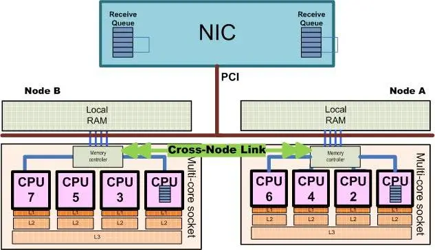

If you have two sockets CPU then you may have dedicated RAM assigned to each socket, and get performance penalties while accessing from one socket to "wrong" memory bank, below simple bechmark and explanation how to utilize full bandwidth properly.
<!--more-->

NUMA (Non-Uniform Memory Access) is a computer memory architecture used in multi-processor systems where memory access time varies depending on the processor's location relative to the memory. Each processor has its own local memory and can also access other processors' memory, but accessing memory on a different processor's "node" takes longer than accessing local memory. 

Here's a more detailed breakdown:

- **Distributed Shared Memory:**

    NUMA systems are essentially distributed shared memory architectures, meaning multiple processors share a single memory space.

- **Nodes:**

    Processors are grouped into "nodes," each with its own local memory and processors.

- **Access Times:**

    Accessing memory within the same node (local memory) is faster than accessing memory on a different node (non-local memory).

- **Performance:**

    NUMA can improve performance for workloads that have high memory locality, meaning data used by a processor is likely stored in its own node, reducing traffic on the shared memory bus.

- **Scalability:**

    NUMA allows for systems to be scaled by adding more nodes to handle larger memory and processor requirements, [according to TechTarget](https://www.techtarget.com/whatis/definition/NUMA-non-uniform-memory-access). 



(image from article [What is NUMA?](https://seniordba.wordpress.com/2015/12/23/what-is-numa/))

How to work with NUMA? There are two things you need - to run threads on dedicated CPU and allocate memory on proper NUMA Node - you have to use [SetThreadAffinityMask function](https://learn.microsoft.com/en-us/windows/win32/api/winbase/nf-winbase-setthreadaffinitymask) and [VirtualAllocExNuma function](https://learn.microsoft.com/en-us/windows/win32/api/memoryapi/nf-memoryapi-virtualallocexnuma) instead of trivial malloc().

Simple demo and benchmark:

```c++
#include <iostream>
#include <windows.h>
#include <stdio.h>
#include <stdint.h>

#define BLOCK_SIZE (1024 * 1024 * 1024) // 1 GB

void pin_thread_to_cpu(DWORD cpu_index) {
  SetThreadAffinityMask(GetCurrentThread(), ((DWORD_PTR)1 << cpu_index));
}

int main() {
  uint64_t sum = 0;
  LARGE_INTEGER freq, start, end;
  QueryPerformanceFrequency(&freq);

  for (DWORD numa_node = 0; numa_node <= 1; numa_node++) {
    for (DWORD cpu_id = 0; cpu_id < 64; cpu_id++) {
      // Pin this thread to CPU (typically 0 on NUMA node 0)
      pin_thread_to_cpu(cpu_id);
      // Allocate memory on the selected NUMA node
      void* buffer = VirtualAllocExNuma(GetCurrentProcess(),
        NULL,
        BLOCK_SIZE,
        MEM_RESERVE | MEM_COMMIT,
        PAGE_READWRITE,
        numa_node
      );

      if (!buffer) {
        printf("VirtualAllocExNuma failed: %lu\n", GetLastError());
        return 1;
      }
      // Touch every page to ensure physical allocation
      volatile char* ptr = (volatile char*)buffer;
      for (size_t i = 0; i < BLOCK_SIZE; i += 4096) ptr[i] = 1; // 1GB
      // Measure read time
      QueryPerformanceCounter(&start);
      for (size_t i = 0; i < BLOCK_SIZE; i += 64) sum += ptr[i];
      QueryPerformanceCounter(&end);
      double elapsed = (double)(end.QuadPart - start.QuadPart) / freq.QuadPart * 1000.0;
      printf("CPU %d - Numa node %d: Read time: %.2f ms\n", cpu_id, numa_node, elapsed);
      VirtualFree(buffer, 0, MEM_RELEASE);
    }
  }
  printf("sum %llu", sum);
  return 0;
}
```

And the result:

```
C:\Users\Andrey\Desktop\numa_test\numa_test\x64\Release>numa_test.exe

CPU 0 - Numa node 0: Read time: 83.31 ms << OK, Node 0 accessed from Socket 0
CPU 1 - Numa node 0: Read time: 82.99 ms
CPU 2 - Numa node 0: Read time: 81.82 ms
...
CPU 29 - Numa node 0: Read time: 83.27 ms
CPU 30 - Numa node 0: Read time: 82.74 ms
CPU 31 - Numa node 0: Read time: 82.76 ms
CPU 32 - Numa node 0: Read time: 129.08 ms << Accessing NUMA node 0 from socket 1
CPU 33 - Numa node 0: Read time: 128.67 ms << Penalties
CPU 34 - Numa node 0: Read time: 128.68 ms
...
CPU 61 - Numa node 0: Read time: 128.80 ms
CPU 62 - Numa node 0: Read time: 128.56 ms
CPU 63 - Numa node 0: Read time: 128.38 ms
CPU 0 - Numa node 1: Read time: 127.35 ms << Accessing NUMA node 1 from socket 0
CPU 1 - Numa node 1: Read time: 127.24 ms << Penalties again
CPU 2 - Numa node 1: Read time: 125.79 ms
...
CPU 29 - Numa node 1: Read time: 126.31 ms
CPU 30 - Numa node 1: Read time: 127.02 ms
CPU 31 - Numa node 1: Read time: 126.95 ms
CPU 32 - Numa node 1: Read time: 78.10 ms << OK, Node 1 accessed from Socket 1
CPU 33 - Numa node 1: Read time: 79.02 ms
CPU 34 - Numa node 1: Read time: 77.48 ms
...
CPU 61 - Numa node 1: Read time: 77.75 ms
CPU 62 - Numa node 1: Read time: 76.80 ms
CPU 63 - Numa node 1: Read time: 77.11 ms
sum 33554432
```

Now  as you can see, accessing «wrong» node is not prohibited, but caused penalties.
