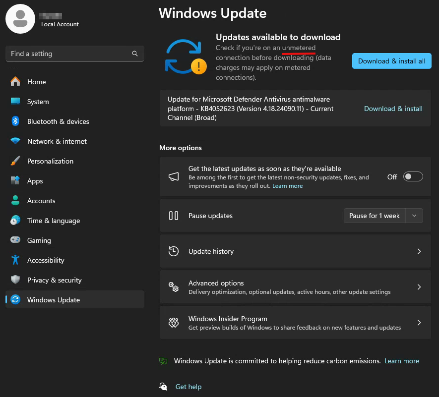
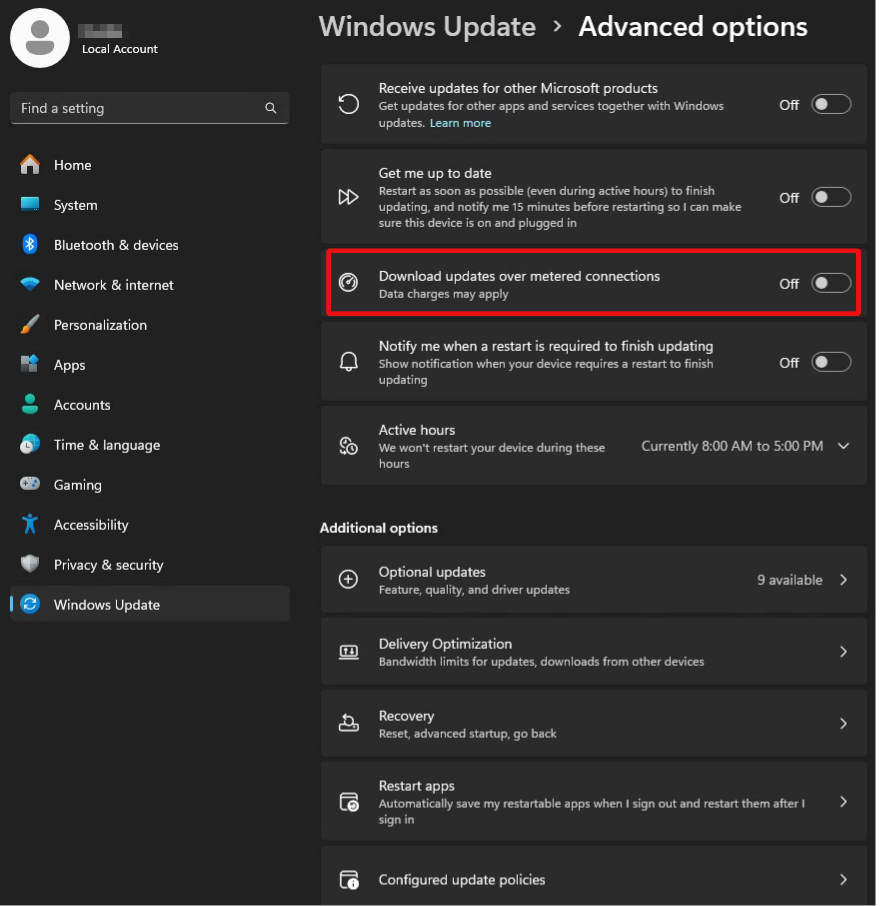

Sometimes you need to prevent Windows updates and following restarts of the PC (for example during long endurance test while PC Stays connected to Internet). An easiest way to do this - is just set Metered Connection to public interface
<!--more-->
The Metered Connection can be enabled here:

Then on Windows Update will still notify you about updates, but they will be not downloaded:

Until not enabled in Advanced Options:

You may get "No connection" troubles with updates in NI Package Manager, in this case just turn off metered connection temporarily. 

