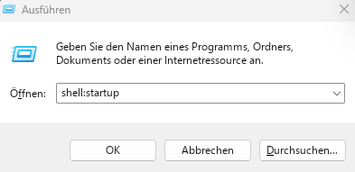
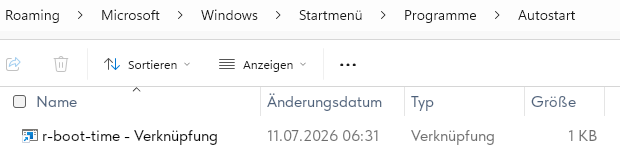
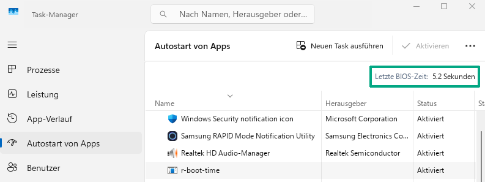

For diagnostic purposes you might get boot duration with simple script
<!--more-->

Run as Administrator:

```powershell
$log = 'Microsoft-Windows-Diagnostics-Performance/Operational'

# Check if the log is enabled
if (-not (Get-WinEvent -ListLog $log).IsEnabled) {
    Write-Host "The Diagnostics-Performance log is disabled. Enabling it now..."
    wevtutil set-log $log /enabled:true
    Write-Host "Please restart Windows so that boot events can be generated."
    exit
}

# Get the newest boot event (ID 100)
$evt = Get-WinEvent -FilterHashtable @{
    LogName = $log
    Id      = 100
} -MaxEvents 1 -ErrorAction SilentlyContinue

if (-not $evt) {
    Write-Host "No boot events found. The PC may not have been restarted since the log was enabled."
    exit
}

# Parse XML
$xml = [xml]$evt.ToXml()

# Extract values
$mainPath = $xml.Event.EventData.Data |
    Where-Object { $_.Name -eq 'MainPathBootTime' } |
    Select-Object -ExpandProperty '#text'

$postBoot = $xml.Event.EventData.Data |
    Where-Object { $_.Name -eq 'BootPostBootTime' } |
    Select-Object -ExpandProperty '#text'

$totalBoot = $xml.Event.EventData.Data |
    Where-Object { $_.Name -eq 'BootTime' } |
    Select-Object -ExpandProperty '#text'

# Output all three values
Write-Host "MainPathBootTime: $([int]$mainPath / 1000) seconds"
Write-Host "BootPostBootTime: $([int]$postBoot / 1000) seconds"
Write-Host "Total BootTime: $([int]$totalBoot / 1000) seconds"
```

Output:

```
MainPathBootTime: 57.925 seconds
BootPostBootTime: 53.095 seconds
Total BootTime: 111.02 seconds
```

Troubleshooting:

If Diagnostics-Performance log is not enabled this can be activated with

```powershell
wevtutil set-log Microsoft-Windows-Diagnostics-Performance/Operational /enabled:true
```

and checked with

```powershell
Get-WinEvent -ListLog *Diagnostics* | Format-Table LogName, IsEnabled
```


<details>
  <summary>Spoiler warning</summary>
```
LogName | IsEnabled
-------                                                                 Microsoft-Windows-Windows Firewall With Advanced Security/FirewallDiagnostics
Microsoft-Windows-Provisioning-Diagnostics-Provider/ManagementService   Microsoft-Windows-Provisioning-Diagnostics-Provider/AutoPilot           Microsoft-Windows-Provisioning-Diagnostics-Provider/Admin               Microsoft-Windows-ModernDeployment-Diagnostics-Provider/ManagementService
Microsoft-Windows-ModernDeployment-Diagnostics-Provider/Diagnostics     Microsoft-Windows-ModernDeployment-Diagnostics-Provider/Autopilot       Microsoft-Windows-ModernDeployment-Diagnostics-Provider/Admin           Microsoft-Windows-MemoryDiagnostics-Results/Debug                       Microsoft-Windows-Diagnostics-Performance/Operational                   Microsoft-Windows-Diagnostics-Networking/Operational                     Microsoft-Windows-Diagnosis-ScriptedDiagnosticsProvider/Operational     Microsoft-Windows-DeviceManagement-Enterprise-Diagnostics-Provider/Sync Microsoft-Windows-DeviceManagement-Enterprise-Diagnostics-Provider/Operational
Microsoft-Windows-DeviceManagement-Enterprise-Diagnostics-Provider/Enrollment
Microsoft-Windows-DeviceManagement-Enterprise-Diagnostics-Provider/Autopilot
Microsoft-Windows-DeviceManagement-Enterprise-Diagnostics-Provider/Admin
Microsoft-System-Diagnostics-DiagnosticInvoker/Operational
```
</details>
Alternatively you can create simple Rust Program, which will measure time from the start of GetTickCount:

```Rust
use std::fs::OpenOptions;
use std::io::Write;
use windows_sys::Win32::System::SystemInformation::GetTickCount64;

fn main() {
    // Read time in milliseconds
    let time_ms = unsafe { GetTickCount64() };
    let time_s = time_ms / 1000;

    // Get current local time as timestamp
    let now = chrono::Local::now();
    let timestamp = now.format("%Y-%m-%d %H:%M:%S").to_string();

    // Prepare log line
    let line = format!("{} | {} s\n", timestamp, time_s);

    // Append to boot-time.log
    let mut file = OpenOptions::new()
        .create(true)
        .append(true)
        .open("boot-time.log")
        .expect("Unable to open log file");

    file.write_all(line.as_bytes())
        .expect("Unable to write to log file");
}
```

Cargo.toml:

```toml
[package]
name = "r-boot-time"
version = "0.1.0"
edition = "2024"

[dependencies]
chrono = "0.4.45"
windows-sys = { 
    version = "0.61.2",
    features = [
        "Win32_System_SystemInformation"
    ]
}
```

And put it to atostart:






Also take a note that you can take BIOS time from Task Manager (but this is just BIOS, not overall boot time):


