It’s simple to explain what it does, but people often misunderstand whats behind of [Wait (ms) Function](https://www.ni.com/docs/en-US/bundle/labview-api-ref/page/functions/wait-ms.html) and how this Function works. Most common misunderstanding is accuracy, often expected that the loop with with 1 ms Delay will operate at 1 kHz rate, but it does not.
<!--more-->
At the beginning — snapshot from the Help:

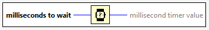

*"Waits the specified number of milliseconds and returns the value of the millisecond timer. The actual wait time may be up to 1 ms shorter than the requested wait time. This function makes asynchronous system calls, but the nodes on the block diagram execute synchronously. Therefore, this function does not complete execution until the specified time has elapsed."*

Typically this function used in while loops to prevent 100% core CPU utilization or to wait some time if needed.

Most of misunderstanding is that the delay will be **exact** as requested. It is not, and this is quite simple to demonstrate, for example, if I'll request 1 ms Delay, then measure time with [High Resolution Relative Seconds](https://www.ni.com/docs/en-US/bundle/labview-api-ref/page/vi-lib/utility/high-resolution-relative-seconds-vi.html):

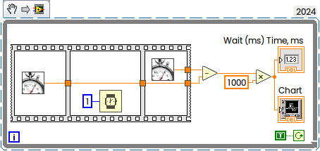

This is what typically I will get:

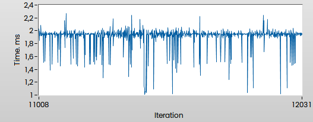

It is easy enough to say that the Windows is not Real-Time OS, and you will never ever get exact delay (and this is true), but there is interesting mechanism behind, which can be investigated a little bit more deeper.

In general Wait (ms) acts exactly in same way as [WinAPI Sleep()](https://learn.microsoft.com/en-us/windows/win32/api/synchapi/nf-synchapi-sleep) from Kernel32.dll:

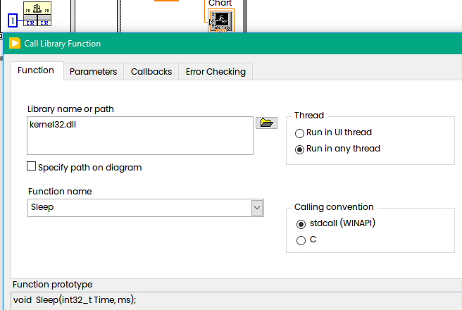

From Microsoft's Help: "*This function causes a thread to relinquish the remainder of its time slice and become unrunnable for an interval based on the value of dwMilliseconds. The system clock "ticks" at a constant rate. If dwMilliseconds is less than the resolution of the system clock, the thread may sleep for less than the specified length of time. If dwMilliseconds is greater than one tick but less than two, the wait can be anywhere between one and two ticks, and so on.* "

But now we can do interesting experiment. For this exercise we will need clear Windows "out of the box" (Virtual Machine is OK).

We will call Sleep(1) and measure time — how long it really will take. For precision measurement we will not use trivial [GetTickCount()](https://learn.microsoft.com/en-us/windows/win32/api/sysinfoapi/nf-sysinfoapi-gettickcount) function, because the resolution is not enough. Instead of that we will use  [QueryPerformanceCounter()](https://learn.microsoft.com/en-us/windows/win32/sysinfo/acquiring-high-resolution-time-stamps) as recommended by Microsoft:

```c
#include <Windows.h>

int main (int argc, char *argv[])
{
	LARGE_INTEGER StartingTime, EndingTime, ElapsedMicroseconds;
	LARGE_INTEGER Frequency;
	
	QueryPerformanceFrequency(&Frequency);

	for(int i=0; i<10; i++){
		QueryPerformanceCounter(&StartingTime);
		
		Sleep(1); // Activity to be timed

		QueryPerformanceCounter(&EndingTime);
		ElapsedMicroseconds.QuadPart = EndingTime.QuadPart - StartingTime.QuadPart;
		ElapsedMicroseconds.QuadPart *= 1000000;
		ElapsedMicroseconds.QuadPart /= Frequency.QuadPart;

		double ElapsedTimeMs = (double)(ElapsedMicroseconds.QuadPart)/1000.0;
		printf("Sleep(1) Time is %f ms\n", ElapsedTimeMs);
	}
    return 0;
}
```

And the result is:

```
Sleep(1) Time is 11.490000 ms
Sleep(1) Time is 22.488000 ms
Sleep(1) Time is 16.692000 ms
Sleep(1) Time is 15.049000 ms
Sleep(1) Time is 34.575000 ms
Sleep(1) Time is 30.357000 ms
Sleep(1) Time is 28.563000 ms
Sleep(1) Time is 31.320000 ms
Sleep(1) Time is 30.563000 ms
Sleep(1) Time is 30.029000 ms
```

Why this? Because default timer resolution is 15.625 ms (1,000 ms divided by 64) and at some random time then we will probably be woken sometime between 1 ms and 16,625 ms in the future, whenever the next interrupt fires.  In additional, we can miss interruption, as result sometimes we have also 34 ms measured time.

Why we don't have such "huge" times in LabVIEW? Because we can control and change default resolution. Official way is to use timeBeginPeriod() function as shown below:

```c
#include <Windows.h>
#include <timeapi.h>

int main (int argc, char *argv[])
{
	LARGE_INTEGER StartingTime, EndingTime, ElapsedMicroseconds;
	LARGE_INTEGER Frequency;
	
	TIMECAPS tc;
	timeGetDevCaps(&tc, sizeof(TIMECAPS));
	printf("Timer Resolution: Min %d ms, Max %d ms\n", tc.wPeriodMin, tc.wPeriodMax);
	timeBeginPeriod(1); 
	
	QueryPerformanceFrequency(&Frequency);

	for(int i=0; i<10; i++){
		QueryPerformanceCounter(&StartingTime);
		
		Sleep(1); // Activity to be timed

		QueryPerformanceCounter(&EndingTime);
		ElapsedMicroseconds.QuadPart = EndingTime.QuadPart - StartingTime.QuadPart;
		ElapsedMicroseconds.QuadPart *= 1000000;
		ElapsedMicroseconds.QuadPart /= Frequency.QuadPart;

		double ElapsedTimeMs = (double)(ElapsedMicroseconds.QuadPart)/1000.0;
		printf("Sleep(1) Time is %f ms\n", ElapsedTimeMs);
	}
	timeEndPeriod(1); 
    return 0;
}
```

and now our results closer to LabVIEW's

```
Timer Resolution: Min 1 ms, Max 1000000 ms
Sleep(1) Time is 2.511000 ms
Sleep(1) Time is 1.153000 ms
Sleep(1) Time is 1.606000 ms
Sleep(1) Time is 2.725000 ms
Sleep(1) Time is 2.363000 ms
Sleep(1) Time is 2.312000 ms
Sleep(1) Time is 2.250000 ms
Sleep(1) Time is 1.836000 ms
Sleep(1) Time is 3.074000 ms
Sleep(1) Time is 2.378000 ms
```

Here is the way how to check which application requested higher Timer Resolution. From Administrator Command Prompt you have to call [powercfg](https://learn.microsoft.com/en-us/windows-hardware/design/device-experiences/powercfg-command-line-options):

```
powercfg /Energy /Duration 1
```

or

```
powercfg -energy -duration 1
```

powercfg  will [detect the requested timer resolution](https://stackoverflow.com/questions/20269920/how-does-powercfg-energy-detect-the-requested-timer-resolution) and this is what you will see in created [energy-report.html](https://support.microsoft.com/en-au/topic/guided-help-get-a-detailed-power-efficiency-diagnostics-report-for-your-computer-in-windows-7-3f6ce138-fc04-7648-089a-854bcf332810):

```
Platform Timer Resolution:Outstanding Timer Request
A program or service has requested a timer resolution smaller than the platform maximum timer resolution.
Requested Period	10000
Requesting Process ID	67844
Requesting Process Path	\Device\HarddiskVolume5\Users\Andrey\Desktop\SleepExperiments\Experiment2.exe
```

if nobody requested higher resolution you will see 15,625 ms

```
Platform Timer Resolution: Platform Timer Resolution
The standard platform timer resolution is 15.6 ms (15625000 ns) and should be used whenever the system is idle.
If the timer resolution is increased, processor power management technologies may not be effective.
The increased timer resolution may be due to multimedia playback or graphics animation.
Current timer resolution (100 ns units) 156250
```

But you can go below 1 ms resolution, the smallest time is 0,5 ms. To achieve this we can use [NtSetTimerResolution()](http://undocumented.ntinternals.net/index.html?page=UserMode%2FUndocumented%20Functions%2FTime%2FNtQueryTimerResolution.html) Function as shown in the following code:

```c
#include <Windows.h>

extern WINAPI NTAPI NtQueryTimerResolution(
  OUT PULONG              MinimumResolution,
  OUT PULONG              MaximumResolution,
  OUT PULONG              CurrentResolution );

extern WINAPI NTAPI NtSetTimerResolution(
  IN ULONG                DesiredResolution,
  IN BOOLEAN              SetResolution,
  OUT PULONG              CurrentResolution );

int main (int argc, char *argv[])
{
	LARGE_INTEGER StartingTime, EndingTime, ElapsedMicroseconds;
	LARGE_INTEGER Frequency;

	int MinRes, MaxRes, CurrRes;
	NtQueryTimerResolution(&MinRes, &MaxRes, &CurrRes);
	printf("Timer Resolution: Min %f ms, Max %f ms, Curr %f ms\n",
		   MinRes/10000.0, MaxRes/10000.0, CurrRes/10000.0);
	NtSetTimerResolution(5000, 1, &CurrRes); //5000...156250
	printf("Timer Resolution: Curr %f ms\n", CurrRes/10000.0);

	QueryPerformanceFrequency(&Frequency);
	for(int i=0; i<10; i++){
		QueryPerformanceCounter(&StartingTime);

		Sleep(1); // Activity to be timed

		QueryPerformanceCounter(&EndingTime);
		ElapsedMicroseconds.QuadPart = EndingTime.QuadPart - StartingTime.QuadPart;
		ElapsedMicroseconds.QuadPart *= 1000000;
		ElapsedMicroseconds.QuadPart /= Frequency.QuadPart;

		double ElapsedTimeMs = (double)(ElapsedMicroseconds.QuadPart)/1000.0;
		printf("Slepp(1) Time now is %f ms\n", ElapsedTimeMs);
	}
	return 0;
}
```

This code needs to be linked with ntdll.lib

```
Timer Resolution: Min 15.625000 ms, Max 0.500000 ms, Curr 15.625000 ms
Timer Resolution: Curr 0.488200 ms
Slepp(1) Time now is 1.363000 ms
Slepp(1) Time now is 1.713000 ms
Slepp(1) Time now is 1.768000 ms
Slepp(1) Time now is 1.909000 ms
Slepp(1) Time now is 1.595000 ms
Slepp(1) Time now is 2.601000 ms
Slepp(1) Time now is 2.060000 ms
Slepp(1) Time now is 2.038000 ms
Slepp(1) Time now is 2.159000 ms
Slepp(1) Time now is 1.366000 ms
```

Now its a little bit more "stable" and closer to 1 ms. Reported 0,4882 ms is because we are at 1000/2048 now instead of 1000/64 before.

This is what LabVIEW does — requesting 1 ms Time resolution:

```
Platform Timer Resolution:Outstanding Timer Request
A program or service has requested a timer resolution smaller than the platform maximum timer resolution.
Requested Period	10000
Requesting Process ID	88224
Requesting Process Path	\Device\HarddiskVolume5\Program Files\National Instruments\LabVIEW 2024\LabVIEW.exe
```

and this resulted Resolution 9765 in 100ns Units (seems to be 1000/1024):

```
Platform Timer Resolution:Platform Timer Resolution
The default platform timer resolution is 15.6ms (15625000ns) and should be used whenever the system is idle.
If the timer resolution is increased, processor power management technologies may not be effective.
The timer resolution may be increased due to multimedia playback or graphical animations.
Current Timer Resolution (100ns units)	9765
Maximum Timer Period (100ns units)	156250
```

This is how it works.

Interesting fact that NI Variable Engine will set Timer to 10 ms:

```
Platform Timer Resolution:Outstanding Timer Request
A program or service has requested a timer resolution smaller than the platform maximum timer resolution.
Requested Period	100000
Requesting Process ID	8496
Requesting Process Path	\Device\HarddiskVolume5\Program Files (x86)\National Instruments\Shared\Tagger\tagsrv.exe
```

And every LabVIEW-based application will set it to 1 ms, not only Dev Environment.

Useful tool to check current Timer's Resolution is [TimerTool](https://github.com/tebjan/TimerTool):

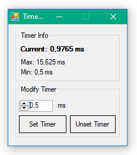

Another way to get this value is [ClockRes](https://learn.microsoft.com/en-us/sysinternals/downloads/clockres) from [SysInternals](https://learn.microsoft.com/en-us/sysinternals/):

```
> Clockres64.exe

Clockres v2.1 - Clock resolution display utility
Copyright (C) 2016 Mark Russinovich
Sysinternals

Maximum timer interval: 15.625 ms
Minimum timer interval: 0.500 ms
Current timer interval: 0.977 ms
```

Now with this knowledge we can set Timer to smallest 0,5 ms in LabVIEW as well:

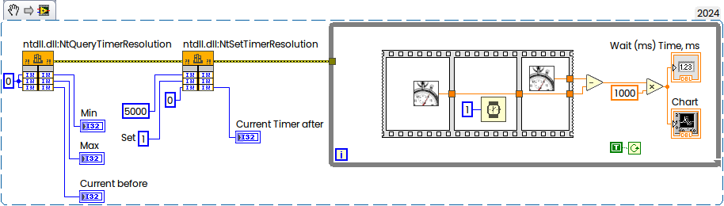

Now compare new result:

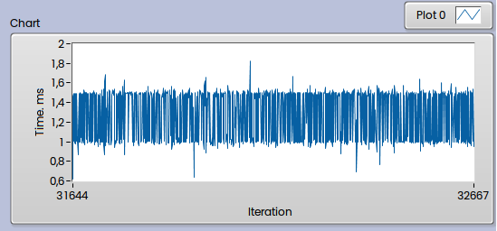

with previous where the Timer was 1 ms (default in LabVIEW):

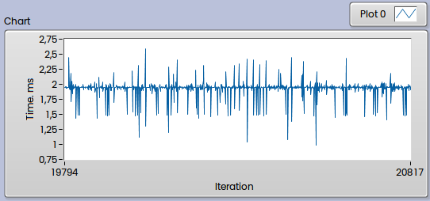

But what about higher precision than Wait (ms) offer? If you would like to get better accuracy, then instead of [Wait (ms)](https://www.ni.com/docs/en-US/bundle/labview-api-ref/page/functions/wait-ms.html) you can use [High Res Polling Wait](https://www.ni.com/docs/en-US/bundle/labview-api-ref/page/vi-lib/utility/high-resolution-polling-wait-vi.html):

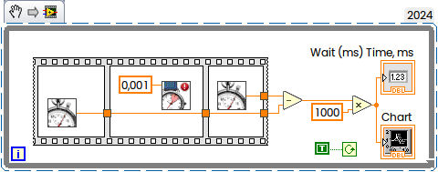

This is result on my PC:

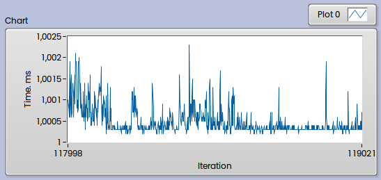

Here we still have some spikes, but overall deviation much smaller. But if you will have lot of parallel threads, and in additional background OS activities, then real "sleep" time may vary more and more. And you will get higher CPU load with this, which also sated in Help: "*Unlike the Wait (ms) function, if the number of seconds you specify is 0, this VI does not force the current thread to yield control of the CPU. **Use this VI with caution** if you are concerned about high CPU loads: this VI may use polling to achieve high timing resolution for all or a portion of the wait time.*".

And also take a note that the scheduler behavior changes dramatically in Windows 10 2004 and later versions. Previously the delay for *Sleep(1)* in any process was simply the same as the timer interrupt interval, but In Windows 10 2004 and Windows 11 the mapping between *timeBeginPeriod* and the sleep delay in another process (one that didn’t call *timeBeginPeriod*) is peculiar, as described in the Article "[Windows Timer Resolution: The Great Rule Change](https://randomascii.wordpress.com/2020/10/04/windows-timer-resolution-the-great-rule-change/)".

In general all written above is also applicable to the [Wait Until Next ms Multiple Function](https://www.ni.com/docs/en-US/bundle/labview-api-ref/page/functions/wait-until-next-ms-multiple.html#:~:text=Waits%20until%20the%20value%20of,control%20the%20loop%20execution%20rate.). Most common misunderstanding is that the loop with 1 ms will operate at 1 kHz:

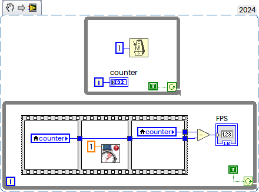

It is not, the rate will be around 500-600 Hz only. But if you will set Timer to highest possible resolution, then the rate will be increased:

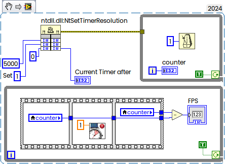

Now FPS will be around 800 Hz, but not 1000 anyway.

