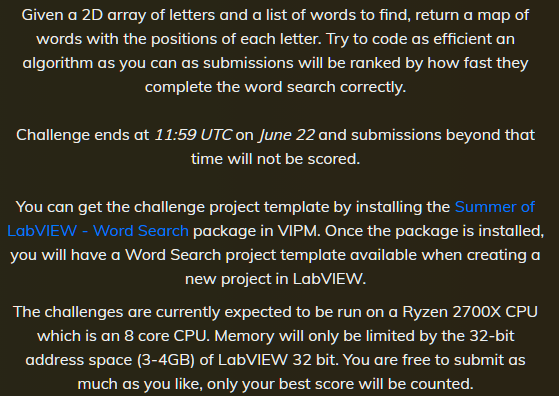

At Week #25 of 2024 I've participated in "Word Puzzle" challenge. Was interesting experience, which I would like to share, may be will be useful for someone.
<!--more-->
Usually I do not participating in "performance" LabVIEW challenges, because I don't see any reason to perform optimizations tasks on the environment, which is in general not intendent for faster machine code generation. Almost any trivial LabVIEW code can be beat with equivalent C code, just because more optimal code generation, especially by modern compilers. And usually in such challenges is prohibited to use external code called via 'CLFN' (Call Library Function Node). But this time the rules was defined as:

I've read this twice - nowhere stated that the CLFNs are not eligible. Well, this fact will wake my interest.

In general "Word Search" is not a new problem, was solved many times in different languages, and for C code I can search some code which will use as start point template, no need to reinvent the wheel and write everything from the scratch.

And yes, found this on CodeProject:[Solving Word-Search Puzzles in Linear Time](https://www.codeproject.com/Articles/861524/Solving-Word-Search-Puzzles-in-Linear-Time) written by JorgeLuisOrejel. This code got some critique from other colleagues, and in all my respect to author (who save some my time) the code is example "how do not program", so I agree with given comments. The problems are in global variables (and resulted troubles in threads safety), lot of bugs, like swapped variables, which caused exception on non-square grids, meaningless names of the variables and implementation far away from optimal. You can say "do it better", but if I'll start with vertical and diagonals arrays, then it is usually hell with pointers, so, for me it was more easy to make this code thread-safe and fix some bugs to get it functional at least. Worst thing in 2D arrays if you will name sometimes row/col, or m/n, or i/j, or width/height and all in same code. Errors guaranteed.

The idea of the searcher is pretty simple. It uses Rabin–Karp algorithm.

### Rabin-Karp algorithm

This is string-searching algorithm created by Richard M. Karp and Michael O. Rabin (1987) that uses hashing to find an exact match of a pattern string in a text. It uses a rolling hash to quickly filter out positions of the text that cannot match the pattern, and checks for a match at the "hash hit" positions.

Especially for this challenge JorgeLuisOrejel uses sum of all ASCII codes as hash function.

Let say you have string ABCDEFGH and looking for CDEF. First three letters of the initial string will be added A=65, B=66 and C = 67 and D=68, together 65+66+67+68 = 266. CDEF also added together, it give 