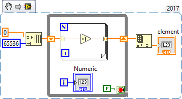
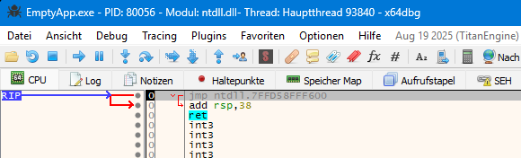
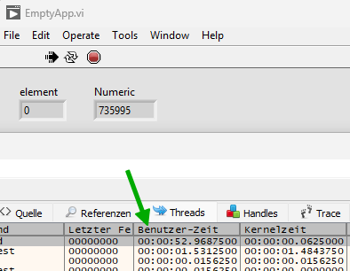
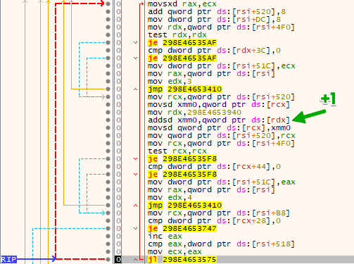
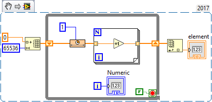
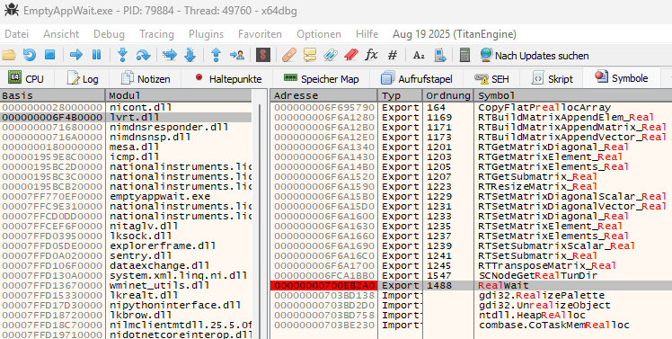
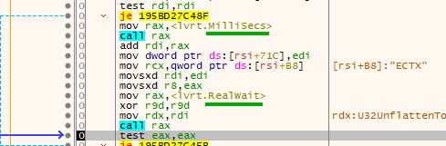
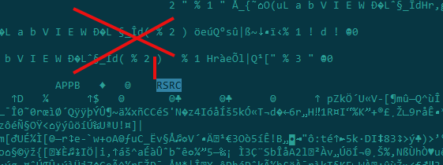
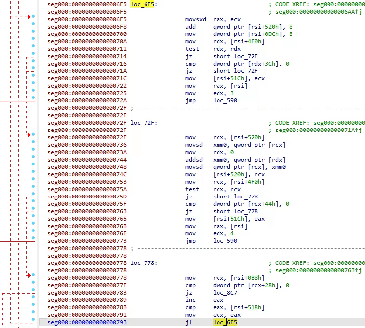

Sometimes it’s necessary to inspect the machine code behind a LabVIEW-generated executable. Running such an application under a binary debugger is straightforward; locating the desired code is only slightly tricky.
<!--more-->

There are two methods I use from time to time.

Let’s start with this simple code:



How does the inner **for-loop** look at the machine-code level?

I’ll use [x64dbg](https://x64dbg.com/) — an open-source x64/x32 debugger for windows.

Build the application from the code above and open it in the debugger (**File → Open** or just press **F3**). The debugger will break on load:



Now press **F9** several times (around 10) until the application is fully loaded and running.

We’ll use the fact that most of the time, the application stays in high-load code. To jump to this area, navigate to **Threads** and sort by **User Time**. The thread consuming the most CPU will be at the top:



Double-click that thread, then press **F12** (Pause execution) and go to **Assembly**:

Here’s our loop — you can recognize the increment:



So simple.

Alternative Approach is to insert a known function before the code, for example, **Wait (ms)**:



Open the executable in the debugger as usual.

Set a breakpoint on **RealWait**, exported from `lvrt.dll`:



Execution will stop here:


Press **Ctrl+F9** (execute until return), then **F8** for one step — you’ll return to the caller code:



Scroll down about 70 instructions (or keep pressing **F8**) and you’ll see the for-loop shown above.

This technique was used in the NI Forum comments:

[Re: For loop parallelism vs starting multiple asynchronous call and collect](https://forums.ni.com/t5/LabVIEW/For-loop-parallelism-vs-starting-multiple-asynchronous-call-and/m-p/4462386#M1318219).

[Re: Got some interesting benchmarks on To Upper vs. "Branchless Programming"](https://forums.ni.com/t5/LabVIEW/Got-some-interesting-benchmarks-on-To-Upper-vs-quot-Branchless/m-p/4460235#M1317431).

### Static disassembly

Static disassembly is a bit trickier. It makes no sense to disassemble the executable directly because it contains only the loader + the actual code is packed into an internal LLB, which contains VIs without block diagrams but with compiled code.

You’ll need the following tools:

pylabview here https://github.com/mefistotelis/pylabview

Python 3.14.1 - https://www.python.org/downloads/

Requirements:

```
>pip install setuptools
Successfully installed setuptools-80.9.0
>pip install Pillow
Successfully installed Pillow-12.0.0
```

Install it:

```
>python setup.py --help-commands
>python setup.py install
```

Verify installation:

```
>python readRSRC.py  --version
readRSRC.py 0.1.0 by Jessica Creighton, Mefistotelis
```

Now take a freshly built LabVIEW executable and cut everything until the **RSRC** section (I use FAR Manager):



Save this file as `*.RSRC` (it should start with the RSRC signature).

Now extract resources:

```
readRSRC.py -x -i EmptsyApp.RSRC
```

You’ll get `EmptyApp_LVzp.bin`. Rename it to `*.zip` and extract the VI from the archive. This VI contains the compiled code.

Now extract resources from the VI:

```
>readRSRC.py -x -i EmptyApp.vi
EmptyApp.vi: Warning: Block b'VICD' section 0 patches parse exception: No parsing made for MCLVRTPatches.
Warning: Identifier has more than one special character.
```

Take `EmptyApp_VICD_code.bin` and disassemble it with any suitable disassembler (I use IDA).

Here’s our for-loop:



Assembly for inner for-loop:


An interesting observation: in the raw machine code, some variables are set to zero (e.g., `mov rdx, 0`), but in the actual running code, they contain memory addresses. This looks like some kind of JIT compiler or runtime patching.

This is also why profilers like VTune can’t capture this code — it’s dynamically modified and loaded at runtime.

That’s it.