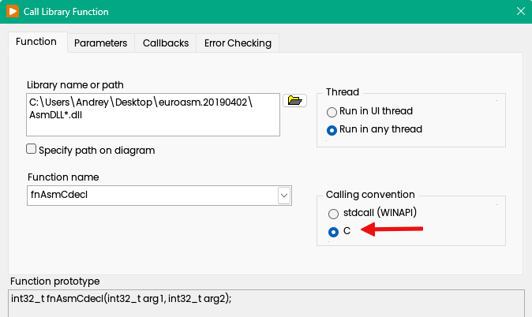

Nowadays development on pure Assembler is not very popular, because modern compilers can generate "good" code. On the other hand this is a very good exercise, which helps to understand a calling conventions and how it work in very low details. 
<!--more-->
In this exercise we will need an Assembler, suitable code editor, LabVIEW and debugger. Required knowledge about 32-bit calling conventions, as well as 64-bit calling conventions, and how to configure Call Library Function Node (CLFN) in LabVIEW.

## Calling Conventions

All what you need to know is that the calling conventions are different for 32-bit and 64-bit.

### 32-bit Calling Conventions

Here one important point to understand is that you have two possibilities - cdecl and stdcall, they are slightly different in term who will correct the stack back.

#### [cdecl](https://learn.microsoft.com/en-us/cpp/cpp/cdecl?view=msvc-170) calling convention

**`__cdecl`** is the default calling convention for C and C++ programs. Because the stack is cleaned up by the caller, it can do `vararg` functions (variable arguments). The **`__cdecl`** calling convention creates larger executables than [__stdcall](https://learn.microsoft.com/en-us/cpp/cpp/stdcall?view=msvc-170), because it requires each function call to include stack cleanup code. The following list shows the implementation of this calling convention. The **`__cdecl`** modifier is Microsoft-specific.

| Element                          | Implementation                                               |
| :------------------------------- | :----------------------------------------------------------- |
| Argument-passing order           | Right to left.                                               |
| Stack-maintenance responsibility | Calling function pops the arguments from the stack.          |
| Name-decoration convention       | Underscore character (_) is prefixed to names, except when __cdecl functions that use C linkage are exported. |
| Case-translation convention      | No case translation performed.                               |

##### Return values

If the return values are Integer values or memory addresses they are put into the **EAX** [register](https://en.wikipedia.org/wiki/Processor_register) by the callee, whereas floating point values are put in the ST0 [x87](https://en.wikipedia.org/wiki/X87) register. Registers EAX, ECX, and EDX are caller-saved, and the rest are callee-saved. 

#### [stdcall](https://learn.microsoft.com/en-us/cpp/cpp/stdcall?view=msvc-170) calling convention

The **`__stdcall`** calling convention is used to call Win32 API functions. The callee cleans the stack, so the compiler makes `vararg` functions **`__cdecl`**. Functions that use this calling convention require a function prototype. The **`__stdcall`** modifier is Microsoft-specific.

| Element                          | Implementation                                               |
| :------------------------------- | :----------------------------------------------------------- |
| Argument-passing order           | Right to left.                                               |
| Argument-passing convention      | By value, unless a pointer or reference type is passed.      |
| Stack-maintenance responsibility | Called function pops its own arguments from the stack.       |
| Name-decoration convention       | An underscore (`_`) is prefixed to the name. The name is followed by the at sign (`@`) followed by the number of bytes (in decimal) in the argument list. Therefore, the function declared as `int func( int a, double b )` is decorated as follows: `_func@12` |
| Case-translation convention      | None                                                         |

Functions declared using the **`__stdcall`** modifier return values the same way as functions declared using [`__cdecl`](https://learn.microsoft.com/en-us/cpp/cpp/cdecl?view=msvc-170).

### 64-bit calling convention

By default, [the x64 calling convention](https://learn.microsoft.com/en-us/cpp/build/x64-calling-convention?view=msvc-170) passes the first four arguments to a function in registers. The registers used for these arguments depend on the position and type of the argument. Remaining arguments get pushed on the stack in right-to-left order.

| Parameter type                                     | fifth and higher | fourth | third | second | first (leftmost) |
| :------------------------------------------------- | :--------------- | :----- | :---- | :----- | :--------------- |
| floating-point                                     | stack            | XMM3   | XMM2  | XMM1   | XMM0             |
| integer                                            | stack            | R9     | R8    | RDX    | RCX              |
| Aggregates (8, 16, 32, or 64 bits) and **`__m64`** | stack            | R9     | R8    | RDX    | RCX              |
| Other aggregates, as pointers                      | stack            | R9     | R8    | RDX    | RCX              |
| **`__m128`**, as a pointer                         | stack            | R9     | R8    | RDX    | RCX              |

Important point: The x64 ABI considers the registers RAX, RCX, RDX, R8, R9, R10, R11, and XMM0-XMM5 volatile. When present, the upper portions of YMM0-YMM15 and ZMM0-ZMM15 are also volatile. On AVX512VL, the ZMM, YMM, and XMM registers 16-31 are also volatile. When AMX support is present, the TMM tile registers are volatile. Consider volatile registers destroyed on function calls unless otherwise safety-provable by analysis such as whole program optimization.

The x64 ABI considers registers RBX, RBP, RDI, RSI, RSP, R12, R13, R14, R15, and XMM6-XMM15 nonvolatile. They must be saved and restored by a function that uses them. 

#### Return values

A scalar return value that can fit into 64 bits, including the **`__m64`** type, is returned through **RAX**. Non-scalar types including floats, doubles, and vector types such as [`__m128`](https://learn.microsoft.com/en-us/cpp/cpp/m128?view=msvc-170), [`__m128i`](https://learn.microsoft.com/en-us/cpp/cpp/m128i?view=msvc-170), [`__m128d`](https://learn.microsoft.com/en-us/cpp/cpp/m128d?view=msvc-170) are returned in XMM0. The state of unused bits in the value returned in RAX or XMM0 is undefined.

User-defined types can be returned by value from global functions and static member functions. To return a user-defined type by value in RAX, it must have a length of 1, 2, 4, 8, 16, 32, or 64 bits. 

That is. Now we're ready to departure.

## Assembler

There are couple of [different assemblers](https://en.wikipedia.org/wiki/Comparison_of_assemblers) which can be used for this exercise. In general you can use any suitable, they slightly different in term of usability and convenience. If you have Visual Studio, then probably you will use MASM, but I would like to recommend something different - called [EuroAssembler](https://euroassembler.eu/index.htm). Pretty simple but powerful and portable, just [download](https://euroassembler.eu/download/) and unpack, installation is not required.

### 32-bit

At the beginning we will create simple DLL for 32-bit LabVIEW. we will just add two integers together and return back. Both cdecl and stdcall will be placed into same library. Good idea to add bitness to the name of DLL, so you will clearly see if this 32 or 64 bit DLL, in additional, this naming convention also supported by NI.

This is the code, save is under ASMDLL32.asm:

```nasm
AsmDLL32 PROGRAM FORMAT=DLL, MODEL=FLAT

EXPORT fnAsmCdecl
fnAsmCdecl PROC
	mov     eax, [esp+4]
	add     eax, [esp+8]
	retn
ENDP fnAsmCdecl

EXPORT fnAsmStdCall
fnAsmStdCall PROC
	mov     eax, [esp+4]
	add     eax, [esp+8]
	retn 8
ENDP fnAsmStdCall

ENDPROGRAM AsmDLL32
```

All what you need to know — esp is Stack Pointer. We will get two arguments by extracting from +4 and +8 bytes relative addresses (+4 and +8 because 0 is return address), tnen move first one to eax, add second and return in eax.

To build DLL simply call

```
> euroasm.exe ASMDLL32.asm
```

If everything is OK, you will see output like this:

```
I0010 EuroAssembler version 20190402 started.
I0020 Current directory is "C:\Users\Andr~~oasm.20190402".
I0070 Assembling global option file "C:\Users\Andr~~2\euroasm.ini".
I0170 Assembling local option file "euroasm.ini".
I0180 Assembling source file "ASMDLL32.asm".
I0270 Assembling source "ASMDLL32".
I0310 Assembling source pass 1.
I0330 Assembling source pass 2 - final.
I0470 Assembling program "AsmDLL32". "ASMDLL32.asm"{1}
I0510 Assembling program pass 1. "ASMDLL32.asm"{1}
I0510 Assembling program pass 2. "ASMDLL32.asm"{1}
I0530 Assembling program pass 3 - final. "ASMDLL32.asm"{1}
I0660 32bit FLAT DLL file "AsmDLL32.dll" created, size=15196. "ASMDLL32.asm"{17}
I0650 Program "AsmDLL32" assembled in 3 passes with errorlevel 0. "ASMDLL32.asm"{17}
I0750 Source "ASMDLL32" (17 lines) assembled in 2 passes with errorlevel 0.
I0860 Listing file "ASMDLL32.asm.lst" created, size=1358.
I0980 Memory allocation 640 KB. 72 statements assembled in 1 s.
I0990 EuroAssembler terminated with errorlevel 0.
```

That is. Now you have a DLL.


This is how call configured:



### 64-bit

This is more simple than 32-bit, following calling conventions (save this as ASMDLL64.asm):

```nasm
EUROASM CPU=X64
AsmDLL64 PROGRAM FORMAT=DLL, MODEL=FLAT, WIDTH=64

EXPORT fnAsm64
fnAsm64 PROC
	mov     rax, rcx
	add     rax, rdx
	ret
ENDP fnAsm64

ENDPROGRAM AsmDLL64
```

We receiving our parameters via RCX/RDX and then return result to RAX.

Compile with same command:

```
> euroasm.exe ASMDLL64.asm
```

Calling as easy as:


Here in general doesn't matter if you selecting cdecl or stdcall, bot will work (because unused), but if you have a plan to create 32-bit version of your VI, then this is important (for example, you calling WinAPI from kernel32/user32). If not — leave cdecl as default.

Good exercise to run it under Debugger (windbg, x64dbg), but this is another topic.
