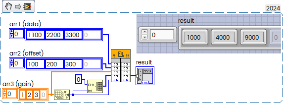

Calling external code from different languages is great feature of LabVIEW. In general you can wrap almost anything into DLL, then call it by Call Library Function Node. This time we will mix Rust code with LabVIEW.
<!--more-->
The Rust programming language helps you write faster, more reliable software. High-level ergonomics and low-level control are often at odds in programming language design; Rust challenges that conflict. Through balancing powerful technical capacity and a great developer experience, Rust gives you the option to control low-level details (such as memory usage) without all the hassle traditionally associated with such control.

You need 64-bit LabVIEW and the Rust, of course. To get started, [download Rust and install as described.](https://www.rust-lang.org/tools/install)

If you have Rust installed already, then you can update it to the latest version by calling

```
> rustup update
```

Before continue I would like to recommend to read Reference Manual: [Call Library Function Node Manual](https://www.ni.com/docs/en-US/bundle/labview-api-ref/page/functions/call-library-function-node.html) and [Configuring the Call Library Function Node Article](https://www.ni.com/docs/en-US/bundle/labview/page/configuring-the-call-library-function-node.html).

The first step is — how to create "minimal valuable" DLL in Rust. By default it will be compiled to executable, so you should properly configure cargo.

All what you need is just two files Cargo.toml and lib.rs in \src SubFolder:


<br>│<br>
│  Cargo.toml<br>
│<br>
└─── src<br>
&nbsp;&nbsp;&nbsp;&nbsp;&nbsp;&nbsp;&nbsp;&nbsp;lib.rs<br><br>
{.code_pseudo}

Cargo.toml:

```toml
[package]
name = "my_rust_lib"
version = "0.1.0"

[lib]
crate-type = ["cdylib"]
```

and first lib.rs with just one function which will add two floats:

```rust
// return sum of two floats
#[no_mangle]
pub extern "C" fn Add(a: f64, b: f64) -> f64{
	let sum: f64 = a + b;
	return sum;
}
```

To compile this you will need to call

```
> cargo build --release

   Compiling my_rust_lib v0.1.0
    Finished `release` profile [optimized] target(s) in 0.62s
```

Your library will be located in \target\release folder:


<br>│   Cargo.toml<br>
│<br>
├─── src<br>
│       lib.rs<br>
│<br>
└─── target<br>
&nbsp;&nbsp;&nbsp;&nbsp;│<br>
&nbsp;&nbsp;&nbsp;&nbsp;└─── release<br>
&nbsp;&nbsp;&nbsp;&nbsp;&nbsp;&nbsp;&nbsp;&nbsp;│   my_rust_lib.dll<br>
&nbsp;&nbsp;&nbsp;&nbsp;&nbsp;&nbsp;&nbsp;&nbsp;│   my_rust_lib.dll.exp<br>
&nbsp;&nbsp;&nbsp;&nbsp;&nbsp;&nbsp;&nbsp;&nbsp;│   my_rust_lib.dll.lib<br>
&nbsp;&nbsp;&nbsp;&nbsp;&nbsp;&nbsp;&nbsp;&nbsp;│   my_rust_lib.pdb<br><br>
{.code_pseudo}

Now its a time to launch LabVIEW and configure Call Library Function Node:


parameters:


And it works:


Of course, you can pass more complicated data structures, not only scalars, for example, arrays:

```rust
// return sum of array
#[allow(dead_code)]
#[no_mangle]
pub extern "C" fn SumArray(ptr: *mut f64, length: usize) -> f64{
    	let data = unsafe { std::slice::from_raw_parts_mut(ptr, length) };
    	let sum: f64 = data.iter().sum();
	return sum;
}
```

Then LabVIEW Code:


Array passed as Data Pointer:


If you need to iterate across all elements and return result, then the following snippet could be useful:

```rust
#[no_mangle]
pub extern "C" fn ffc_rust(
    arr1: *const i16,
    arr2: *const i16,
    arr3: *const f32,
    result: *mut i16,
    size: usize,
) {
    unsafe {
        for i in 0..size {
            let subtraction_result = *arr1.offset(i as isize) - *arr2.offset(i as isize);
            let multiplication_result = (subtraction_result as f32 * *arr3.offset(i as isize)) as i16;
            *result.offset(i as isize) = multiplication_result;
        }
    }
}
```

Here above we will perform kind of Flat Field Correction - subtract arr2 (which act as "offset") from arr1 (our data), then multiply by arr3 (gain) and return result:



This is how it works.

Technically Rust positioned as fast and safe alternative to C. Programming in Rust instead of C has several benefits, including improved memory safety, better performance, and enhanced security. From generated code point of view its inetersting to disassemble Rust-based library and take a look inside:

This is how Add(int a, int b) compiled:

```assembly
public Add
	proc near
	addsd   xmm0, xmm1
	retn
	endp
```

Everything like in learning book, no questions. Two parameters passed via xmm0 and xmm1, then result returned in xmm0 as described in [x64 calling conventions](https://learn.microsoft.com/en-us/cpp/build/x64-calling-convention?view=msvc-170).

SumArray is not very optimal, but fully acceptable:

```assembly
                public SumArray
SumArray        proc near               ; DATA XREF: .rdata:off_18001CD98↓o
                test    rdx, rdx
                jz      short loc_180001029
                mov     eax, edx
                and     eax, 7
                cmp     rdx, 8
                jnb     short loc_18000102D
                xorpd   xmm0, xmm0
                xor     r8d, r8d
                jmp     short loc_180001080
; ---------------------------------------------------------------------------

loc_180001029:                          ; CODE XREF: SumArray+3↑j
                xorps   xmm0, xmm0
                retn
; ---------------------------------------------------------------------------

loc_18000102D:                          ; CODE XREF: SumArray+E↑j
                and     rdx, 0FFFFFFFFFFFFFFF8h
                xorpd   xmm0, xmm0
                xor     r8d, r8d
                nop     dword ptr [rax+rax+00000000h]

loc_180001040:                          ; CODE XREF: SumArray+6E↓j
                addsd   xmm0, qword ptr [rcx+r8*8]
                addsd   xmm0, qword ptr [rcx+r8*8+8]
                addsd   xmm0, qword ptr [rcx+r8*8+10h]
                addsd   xmm0, qword ptr [rcx+r8*8+18h]
                addsd   xmm0, qword ptr [rcx+r8*8+20h]
                addsd   xmm0, qword ptr [rcx+r8*8+28h]
                addsd   xmm0, qword ptr [rcx+r8*8+30h]
                addsd   xmm0, qword ptr [rcx+r8*8+38h]
                add     r8, 8
                cmp     rdx, r8
                jnz     short loc_180001040

loc_180001080:                          ; CODE XREF: SumArray+17↑j
                test    rax, rax
                jz      short locret_18000109D
                lea     rcx, [rcx+r8*8]
                xor     edx, edx
                nop     dword ptr [rax+rax+00h]

loc_180001090:                          ; CODE XREF: SumArray+8B↓j
                addsd   xmm0, qword ptr [rcx+rdx*8]
                inc     rdx
                cmp     rax, rdx
                jnz     short loc_180001090

locret_18000109D:                       ; CODE XREF: SumArray+73↑j
                retn
SumArray        endp
```

My experience is that the C code compiled with highly optimizing compiler like Intel could be still slightly faster than Rust, but in general I'm impressed about results. Anyway, there are some performance tuning trick described in the article [Cheap tricks for high-performance Rust](https://deterministic.space/high-performance-rust.html).

Technically for optimization you should place **config.toml** into **.cargo** SubFolder:

<br>│   Cargo.toml<br>
│<br>
├───.cargo<br>
│       &nbsp;&nbsp;&nbsp;&nbsp;&nbsp;config.toml<br>
│<br>
├───src<br>
│       &nbsp;&nbsp;&nbsp;&nbsp;&nbsp;lib.rs<br>
│<br>
└───target<br>
&nbsp;&nbsp;&nbsp;&nbsp;│<br>
&nbsp;&nbsp;&nbsp;&nbsp;└───release<br>
&nbsp;&nbsp;&nbsp;&nbsp;&nbsp;&nbsp;&nbsp;&nbsp;│   my_rust_lib.dll<br>
&nbsp;&nbsp;&nbsp;&nbsp;&nbsp;&nbsp;&nbsp;&nbsp;│   _tester_.vi<br><br>
{.code_pseudo}

And in config.toml you have to place options:

```
[build]
# rustflags = ["-O", "-C", "target-feature=+avx"]
rustflags = ["-O", "-C", "target-cpu=native"]
```

Of course, be careful with "target-cpu=native", because it will work only on the same CPU architecture where it compiled, but this make sense, for example the assembly listing with default release flag:

```assembly
loc_180001190:                          ; CODE XREF: ffc_rust+18B↓j
	movq    xmm2, qword ptr [rcx+r11*2]
	movq    xmm3, qword ptr [rdx+r11*2]
	psubw   xmm2, xmm3
	punpcklwd xmm2, xmm2
	psrad   xmm2, 10h
	cvtdq2ps xmm2, xmm2
	movups  xmm3, xmmword ptr [r8+r11*4]
	mulps   xmm3, xmm2
	movshdup xmm2, xmm3
	movaps  xmm4, xmm0
	maxss   xmm4, xmm2
	movaps  xmm2, xmm1
	minss   xmm2, xmm4
	cvttss2si esi, xmm2
...
```

and with enabled optimization we can see

```assembly
loc_180001210:                          ; CODE XREF: ffc_rust+587↓j
	vmovdqu xmm2, xmmword ptr [rcx+r11*2]
	vmovdqu xmm3, xmmword ptr [rcx+r11*2+10h]
	vmovdqu xmm4, xmmword ptr [rcx+r11*2+20h]
	vmovdqu xmm5, xmmword ptr [rcx+r11*2+30h]
	vpsubw  xmm2, xmm2, xmmword ptr [rdx+r11*2]
	vpsubw  xmm3, xmm3, xmmword ptr [rdx+r11*2+10h]
	vpsubw  xmm4, xmm4, xmmword ptr [rdx+r11*2+20h]
	vpsubw  xmm5, xmm5, xmmword ptr [rdx+r11*2+30h]
	vpmovsxwd ymm2, xmm2
	vcvtdq2ps ymm2, ymm2
	vpmovsxwd ymm3, xmm3
	vcvtdq2ps ymm3, ymm3
	vpmovsxwd ymm4, xmm4
	vcvtdq2ps ymm4, ymm4
	vpmovsxwd ymm5, xmm5
	vmulps  ymm16, ymm2, ymmword ptr [r8+r11*4]
	vmulps  ymm17, ymm3, ymmword ptr [r8+r11*4+20h]
	vmulps  ymm4, ymm4, ymmword ptr [r8+r11*4+40h]
	vcvtdq2ps ymm2, ymm5
	vmulps  ymm2, ymm2, ymmword ptr [r8+r11*4+60h]
	vmovshdup xmm3, xmm16
	vmaxss  xmm3, xmm0, xmm3
	vminss  xmm3, xmm1, xmm3
	vcvttss2si esi, xmm3
	vmaxss  xmm3, xmm0, xmm16
	vminss  xmm3, xmm1, xmm3
	vcvttss2si edi, xmm3
	...
```

So, the loop get unrolled with usage of ymm* registers.

Quick benchmark shows me some improvement from 19 to 16 ms for U16 "image" 4096x4096:


Two more links:

[Creating A DLL With Rust](https://samrambles.com/guides/window-hacking-with-rust/creating-a-dll-with-rust/index.html).

[How to call Rust code from LabVIEW](https://create.vi/how-to-call-rust-code-from-labview-18a70702546a) / [LabVIEW wrapper around the Rust](https://github.com/JKISoftware/toml-edit-labview).
