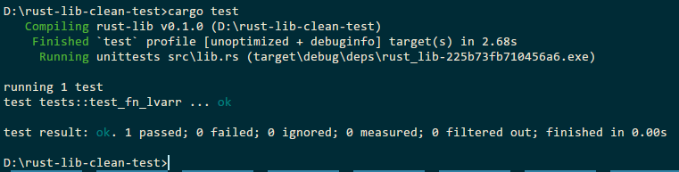
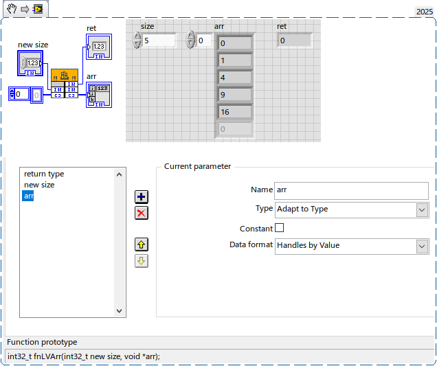

Second post about LabVIEW and Rust. This time we will pass native LabVIEW array into DLL written in Rust and resize inside.
<!--more-->
First, don't forget to update Rust:
```
rustup update
```

An easiest way to create library in Rust is the following:

```
cargo init --lib
```

Now, in C if you would like to pass native array and resize it inside of DLL call, then you should do something like that:

```c
/* Typedefs */
typedef struct {
	int32_t dimSize;
	int32_t elt[1];
	} TD1;
typedef TD1 **TD1Hdl;

__declspec(dllexport) int __cdecl fnLVArr(size_t length, TD1Hdl arr)
{
    if(noErr == NumericArrayResize(uL, 1, (UHandle*)(&arr), length)){
		(*arr)->dimSize = (int32_t)length;
   		for(int i = 0; i < length; i++) (*arr)->elt[i] = i * i;
		return mgNoErr;
	}
	else return mgArgErr;
}
```

And the same code in Rust will looks like this:

```rust
use std::os::raw::{c_int};
use std::ptr;

// Define LabVIEW error codes
const MG_NO_ERR: c_int = 0;
const MG_ARG_ERR: c_int = 1;
const UL: u32 = 0x7; // LabVIEW array type code (Int32, 1D)

// Represents void* in C
#[repr(C)]
pub struct TD1 {
    dim_size: i32,
    elt: [i32; 0], // Zero-sized array, acts as offset marker
}

// Type alias for double pointer
type TD1Hdl = *mut *mut TD1;

unsafe extern "C" { // in latest Rust must be unsafe!
    #[link_name = "NumericArrayResize"] // Use link_name if the function is named differently in the DLL
    fn numeric_array_resize(
        numeric_type: u32, // This should be u32, based on LabVIEW documentation
        num_dimensions: i32,
        data_handle: *mut TD1Hdl, // LabVIEW uses UHandle for array resizing.
        new_size: usize,           // New size of the array
    ) -> c_int;
}

#[unsafe(no_mangle)]
pub extern "C" fn fnLVArr(length: usize, mut arr: TD1Hdl) -> i32 {
    unsafe {
        let mut vec = Vec::with_capacity(length as usize);
        for i in 0..length { vec.push((i * i) as i32); }
    
		if numeric_array_resize(UL, 1, &mut arr as *mut TD1Hdl, length ) == MG_NO_ERR {          
			if !arr.is_null() {
                (**arr).dim_size = length as i32;
                // Copy the elements from the Vec to the array
                ptr::copy_nonoverlapping(vec.as_ptr(), (**arr).elt.as_mut_ptr(), length as usize);
            } 
            MG_NO_ERR
        } else { MG_ARG_ERR }
    }
}
```

If you prefer without extra allocation:

```rust
#[unsafe(no_mangle)]
pub extern "C" fn fnLVArr2(length: usize, mut arr: TD1Hdl) -> i32 {
    unsafe {
		if ! (numeric_array_resize(UL, 1, &mut arr as *mut TD1Hdl, length ) == MG_NO_ERR) { return MG_ARG_ERR }
		else {
             (**arr).dim_size = length as i32;
			let array_ptr = (**arr).elt.as_mut_ptr();
            let first_element_ptr = array_ptr.add(0);
            for i in 1..length {
                *(first_element_ptr).add(i) = (i * i) as i32; // Write to the array elements
            } 
		}            
		MG_NO_ERR
	}
}
```

This code above must be placed into lib.rs file.

Cargo.toml:

```toml
[package]
name = "rust-lib"
version = "0.1.0"
edition = "2024"
build = "build.rs" # Add this line

[lib]
crate-type = ["cdylib"]

[dependencies]
libc = "0.2.170"
```

To link this library with labview.lib the build.rs must be created:

```rust
fn main() {
    // Tell Cargo to link against the labview library
   println!("cargo::rustc-link-search=C:\\Program Files\\National Instruments\\LabVIEW 2025\\cintools"); 
   println!("cargo:rustc-link-lib=labview");
   //println!("cargo:rustc-link-lib=lvrt");
   println!("cargo:rustc-link-lib=user32"); //without .lib!

    // Optionally, you can specify the path to the library if it's not in a standard location
    // let lib_path = PathBuf::from("path/to/your/libview.lib");
    // println!("cargo:rustc-link-search={}", lib_path.display());
}
```

#### Test

To test it you need LabVIEW, but classical Rust test is also possible with one "rusty" trick.

First of them, you should link your lib with lvrt.lib (which can be easily created from lvrt.dll) instead of labview.lib:

```rust
println!("cargo:rustc-link-lib=lvrt");
```

Then using LabVIEW Memory functions to create desired handle:

```rust
unsafe extern "C" {
    #[link_name = "DSNewHandle"]
    fn ds_new_handle(
        new_size: usize 
    ) -> TD1Hdl;
}

unsafe extern "C" {
    #[link_name = "DSDisposeHandle"]
    fn ds_dispose_handle(
        h:TD1Hdl           // Handle to be disposed
    ) -> c_int;
}

#[cfg(test)]
mod tests {
    use super::*;
    #[test]
    fn test_fn_lvarr() {

        unsafe {
            // 1. Allocate a handle (using LabVIEW's memory management if possible)
            //    LabVIEW would have allocated the handle with DSNewHandle().
            let handle = ds_new_handle(8 as usize);
            let length = 5;
            // 2. Call the function.
            let result = fnLVArr(length, handle);
 			assert_eq!(result, MG_NO_ERR);
            //  The handle will not be automatically freed by Rust!
			ds_dispose_handle(handle);
        }
    }
}
```

And this will work if you will place lvrt.dll and niCPULib.dll into project directory, these two files are sufficient.



And in LabVIEW, of course:


