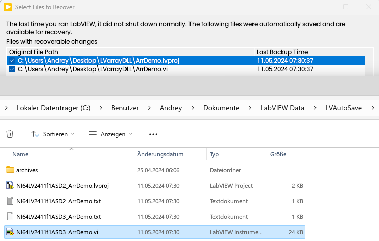

Text before Cut.
<!--more-->

# How to pass LabVIEW's array to DLL

This is typical use case when you need to modify LabVIEW's arrays in external code, or copy arrays from external code to LabVIEW for further modification or displaying in the Graphs, etc.

There are different possiblities, depending on where you will allocate memory for array.

The first one is allocation in LabVIEW, then pass it to DLL as pointer to array (to the first array's elementh). This method will need two inputs - one will point to array, and another one is the size, otherwise DLL will not known how large your array is.

-in the following example we will use int32 array, which will be filled with squares values of the index.

The  C code will looks like this:

```c
__declspec(dllexport) int __cdecl fnArr(int length, int* arr)
{
	if (arr){
		for(int i = 0; i < length; i++){
			arr[i] = i * i;
		}
		return 0;
	}
	else return 1; //indicate an error
}
```

And according Block Diagram like this:


Take a note, that you is responsinble for range control, attempt to write array's elements outhside of allocated memory will caused exception (crash).

\---

Another method is to use Array's Handle (native LabVIEW --handle). This is how LabVIEW stored in memory - you have a structure of two members - length and pointer and somewhere array itself. This is more flexible way, because you can resize array in needed.

For example, we will pass empty array (the array is empty, but the handle is created already), then resize inside of DLL:


And the LabVIEW code


The NumericResize called from LabVIEW.exe (or lvrt.dll if you in Run-Time). DLL linked with labview.lib.

One important point is alignment. By default you will get a gap between first and second elementh in structure, but 32-bit LabVIEW expect packed structure without gap, so internally you will need #pragma pack(1) before this structure and restore back. One simple trick is that from Call Library Node you can create C code snippet, which will properly define the data type typedef and also take care about alignment in prolog and epilog, and this will work for both 32- and 64-bits DLLs.

The header files as well as libraries for linking can be taken from LabVIEW excode folder. You can add these paths to inlude and linker, but usually I copying these to my project from latest LabVIEW version, it is backward compatible. You can take these form LabVIEW 2024, and the DLL built with these will be OK for LabVIEW 2018, for example.

As you can see, the Handle contains also length of the array, and in some use cases you can take this size from Handle, then you don't need to pass it separately:


then source code also simplified if you don't neet to resize (but you can if needed, of course)


Of course, everything written above will work also with more complicated data types. For example, if you have array of clusters. Then you have two typedefs - one for array, and another one for cluster. Now I will fill the first cluster element


Now one more specific example, which partially described here:. I will not recommend to used this way without significant needs, but it is good for better understanding of memory.

Here we will allocate memory inside of DLL and return back pointer to creatged array with return statement.

You can't simply copy content of array from pointer to LabVEIW's array without helper" called MoveMemory. This is a function from LabVIEW.exe (or lvrt.dll) can take two pointers and dereference LabVIEW array. In generak this acts as memcpy ("Move" is slightly wrong word, the original (source) memory will be not released.

Then my DLL is quite simple:


But transfer of the data will take two calls:


Such use case is a very rare, in most cases needed only if you have some "third party" DLL, and would like to avoid to make a wrapper with your own copy routine.

Please take a note, that you shoukld be very accurate with this stuff. Wrong calling conventions (cdecl or stdcall for 32-bit call), attempt to read or write memory outside of allocated space, null pointers, wrong parameter selection will cause an exception (crash), which kooks like this:

.

Bot don't panic, just save your work every time when you run it. The LabVIEW is intellegent enough, will keep temporary copy of changed VI, and somethimes afer crash will offer to restore (but unfortunateky not always), so you may lost your work. 



Technically saved in LabVIEW Data\LVAutoSave

But donÄt worry - you will not damage your computer or LabVIEW installation.

If crash happened, then you can take a look into report, then into dump, and if you will open dump in  debugger,l then sometimes will see where the crash happened (but this depends what you damaged exactly, sometimes not).

And the last hint, often forgotten — you can't call 32-bit DLL from 64-bit LabVIEW and visa versa. If you need to support both LabVIEW's bittnesses, then you have to compile DLL twice for every bittness, then recommended to append to DLL's names postfixes 32 or 64, and then use asterisk pattern like *.dll  when using this DLL in Call External Code node.

Project:
