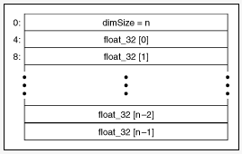
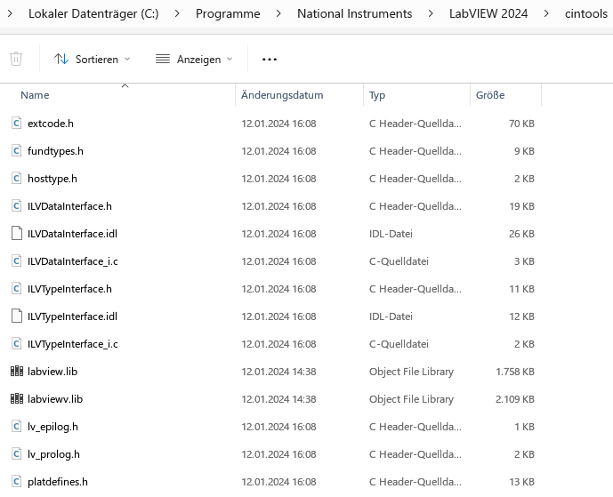
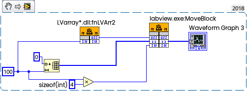

When calling external code in LabVIEW, we need very often to pass arrays into external DLL. This small "step by step" tutorial walks you through two possible ways of calling C/C++ DLLs manipulating LabVIEW arrays inside.

<!--more-->

This is typical use case when you need to modify LabVIEW's arrays in external code, or copy arrays from external code to LabVIEW for further modification or displaying in the Graphs, etc.

There are different possiblities, depending on where you will allocate memory for array.

## Pass as Array's Data Pointer

The first one is allocation in LabVIEW, then pass it to DLL as pointer to array (to the first array's element). This method will need two inputs — one will point to array, and another one is the size, otherwise DLL will not known how large your array is.

In the following example we will use int32 array, which will be filled with squares values of the index.

The  C code will looks like this:

```c
__declspec(dllexport) int __cdecl fnArr(int length, int* arr)
{
	if (arr){
		for(int i = 0; i < length; i++){
			arr[i] = i * i;
		}
		return 0;
	}
	else return 1; //indicate an error
}
```

And according Block Diagram like this:


Take a note, that you is responsible for range control, attempt to write array's elements outside of the allocated memory will (may) caused exception (crash).

---

## Pass native Array's Handle by Value

Another method is to use Array's Handle (native LabVIEW handle). This is how LabVIEW stored data in memory — you have a structure of two members — length and pointer and somewhere array itself. This is more flexible way, because you can resize array in needed.

LabVIEW stores arrays as handles, or pointers to pointers, that contain the size of each dimension of the array in 32-bit integers followed by the data. If the handle is 0, the array is empty. Because of alignment constraints of certain platforms, a few bytes of padding might follow the dimension size so that the first element of the data is correctly aligned. If you write a shared library that uses a LabVIEW array, you might need to [adjust the size of the handle](https://www.ni.com/docs/en-US/bundle/labview/page/using-arrays-and-strings-in-the-call-library-function-node.html).

The following illustration shows a 1D array of single-precision floating-point numbers (the same for int32). The decimal numbers to the left represent the byte offsets of locations in memory where the array begins.



For example, we will pass empty array (the array is empty, but the handle is created already), then resize inside of DLL:

```c
#include "include/extcode.h"
/* lv_prolog.h and lv_epilog.h set up the correct alignment for LabVIEW data. */
#include "include/lv_prolog.h"

/* Typedefs */
typedef struct {
	int32_t dimSize;
	int32_t elt[1];
	} TD1;
typedef TD1 **TD1Hdl;

#include "include/lv_epilog.h"

__declspec(dllexport) int __cdecl fnLVArr(size_t length, TD1Hdl arr)
{
    if(noErr == NumericArrayResize(uL, 1, (UHandle*)(&arr), length)){
		(*arr)->dimSize = (int32_t)length;
   		for(int i = 0; i < length; i++){
			(*arr)->elt[i] = i * i;
		}
		return mgNoErr; // 0
	}
	else return mgArgErr; // 1
}
```

And the according LabVIEW code:


The [NumericArrayResize](https://www.ni.com/docs/en-US/bundle/labview-api-ref/page/properties-and-methods/lv-manager/numericarrayresize.html) called from LabVIEW.exe (or lvrt.dll if you in Run-Time). DLL linked with labview.lib.

One important point is alignment.  Take a note, that lv_prolog.h/lv_epilog.h will take care about structure alignment (and this works for different platforms). By default you will get a gap between first and second element in structure, but 32-bit LabVIEW expect packed structure without gap, so internally you will need #pragma pack(1) before this structure and restore back. One simple trick is that from Call Library Node you can create C code snippet, which will properly define the data type typedef and also take care about alignment in prolog and epilog, and this will work for both 32- and 64-bits DLLs:


The header files as well as libraries for linking can be taken from LabVIEW cintools folder:




You can add these paths to include and and for linker, but usually I copying these to my project from latest LabVIEW version, it is backward compatible with previous LabVIEW's versions. You can take these form LabVIEW 2024, and the DLL built with these will be just fine for LabVIEW 2018, for example.

As you can see, the Handle contains also length of the array, and in some use cases you can take this size from Handle, then you don't need to pass it separately:


then source code also simplified if you don't need to resize (but you can if needed, of course)

```c
__declspec(dllexport) int __cdecl fnLVArr1(TD1Hdl arr)
{
   	for(int i = 0; i < (*arr)->dimSize; i++){
		(*arr)->elt[i] = i * i;
	}
	return 0;
}
```

Of course, everything written above will work also with more complicated data types. For example, if you have array of clusters. Then you have two typedefs — one for array, and another one for cluster. Now I will fill the first cluster element

```c
//LabVIEW Array of Clusters:
typedef struct {
	float X;
	float Y;
} TD2;

typedef struct {
	int32_t dimSize;
	TD2 elt[1];
} TD1;
typedef TD1** TD1Hdl;
//...
extern "C" __declspec(dllexport) int foobar(TD1Hdl XYmap)
{
//...
	for (int row = 0; row < rows; row++) { //height, y
		for (int col = 0; col < cols; col++) { //width, x
			Your_X = (float)((*XYmap)->elt)[col + row * cols].X;
			Your_Y = (float)((*XYmap)->elt)[col + row * cols].Y;
		}
	}
}
//... etc
```

Now one more specific example, which partially described here:. I will not recommend to used this way without significant needs, but it is good for better understanding of memory.

Here we will allocate memory inside of DLL and return back pointer to created array with return statement:

```c
__declspec(dllexport) int* __cdecl fnLVArr2(size_t length)
{
	int* MyArr;
	MyArr = (int*)malloc(length * sizeof(int));
	//now array allocated outside LabVIEW, remember to free it!
	if (MyArr){
	   	for(int i = 0; i < length; i++){
			MyArr[i] = i * i;
		}
		return MyArr;
	}
	else return NULL;
}
```

You can't simply copy content of array from pointer to LabVEIW's array outside of DLL without helper, called [MoveBlock](https://www.ni.com/docs/en-US/bundle/labview-api-ref/page/properties-and-methods/lv-manager/moveblock.html). This is a function from LabVIEW.exe (or lvrt.dll) can take two pointers and dereference LabVIEW array. In general this acts as memcpy ("Move" is slightly wrong word, the original (source) memory will be not released or deleted).

Then my DLL is quite simple as shown above, but transfer of the data will take two calls:



Such use case is a very rare, in most cases needed only if you have some "third party" DLL, and would like to avoid to make a wrapper with your own copy routine.

Please take a note, that you should be very accurate with this stuff. Wrong calling conventions (cdecl or stdcall for 32-bit call), attempt to read or write memory outside of allocated space, null pointers, wrong parameter selection will cause an exception (crash), which kooks like this:


Crash protocol usually looks like this:

```
DWarn 0x0E697B77: Caught exception in ExtCode call!
source\execsupp\ExtFuncRunTime.cpp(86) : DWarn 0x0E697B77: Caught exception in ExtCode call!
[ExecSys:0; Executing:"[VI "ArrDemo.vi" (0x00000189f163aca0)]"]minidump id: 69c9b6b2-b6d4-409d-a6c6-5f8283d979c0

DAbort 0x00BA6193: 
source\ThEvent.cpp(263) : DAbort 0x00BA6193: 
[ExecSys:0; Executing:"[VI "ArrDemo.vi" (0x00000189f163aca0)]"]minidump id: 68f0312e-1971-48a1-9425-cc5b0594afa4
```

But don't panic, just save your work every time when you run it. The LabVIEW is intelligent enough, will keep temporary copy of changed VI, and sometimes after the crash will offer to restore (but unfortunately not always), so you may lost your work. 


Technically saved in LabVIEW Data\LVAutoSave as you can see on the screenshot above.

But don't worry — you will not damage your computer or LabVIEW installation.

If crash happened, then you can take a look into report, then look into dump, and if you will open dump in  debugger, then sometimes will see where the crash happened (but this depends what you damaged exactly, sometimes not).

And the last hint, often forgotten — you can't call 32-bit DLL from 64-bit LabVIEW and visa versa. If you need to support both LabVIEW's bitnesses, then you have to compile DLL twice for every bitness, then recommended to append to DLL's names postfixes 32 or 64, and then use asterisk pattern like *.dll  when using this DLL in Call External Code node, refer to the article "[Wildcards in the LabVIEW Call Library Node](https://blog.kalbermatter.nl/2021/10/12/wildcards-in-the-labview-call-library-node/)" from Rolf Kalbermatter.

| Filename        | resulting 32-bit filename | resulting 64-bit filename |
| :-------------- | :------------------------ | :------------------------ |
| myLibrary*.dll  | myLibrary32.dll           | myLibrary64.dll           |
| myLibrary**.dll | myLibrary.dll             | myLibrary_64.dll          |
| my*Library.dll  | my32Library.dll           | my64Library.dll           |
| my**Library.dll | myLibrary.dll             | my_64Library.dll          |

And of course you can do everyting described above in Windows/Linux and MacOS:

| Platform | Ending     | Example     | Result              |
| :------- | :--------- | :---------- | :------------------ |
| Windows  | .dll       | myLibrary.* | myLibrary.dll       |
| Linux    | .so        | myLibrary.* | myLibrary.so        |
| MacOS X  | .framework | myLibrary.* | myLibrary.framework |

Project (LV2018): [LVarrayDLL.zip](https://forums.ni.com/ni/attachments/ni/170/1284979/1/LVarrayDLL.zip).
