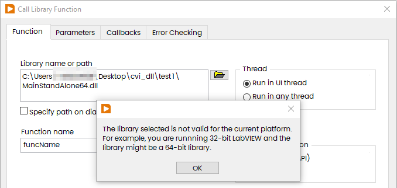
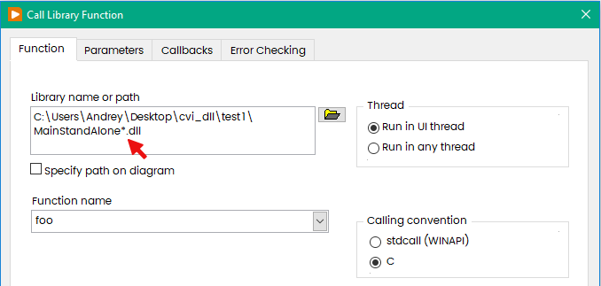
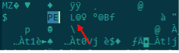
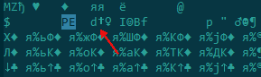
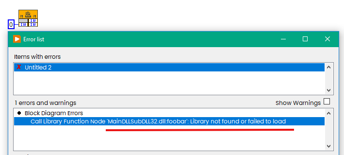
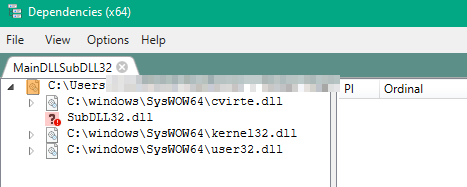
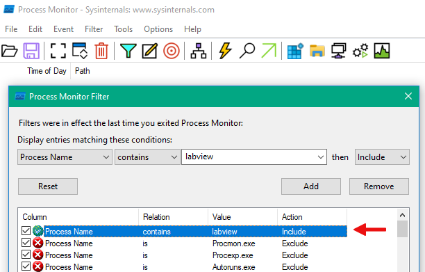
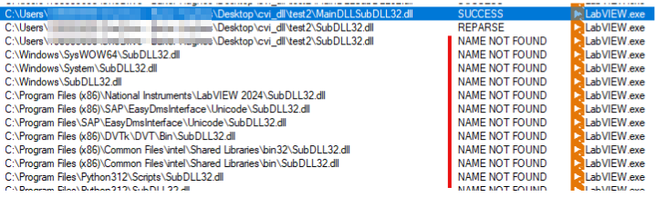
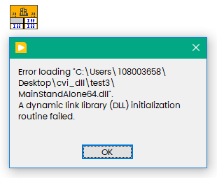

This is a question, raised again and again on the forums about third-party DLLs: "...whatever I do I cannot get the library to work in LabVIEW. I get the error "The library for this node cannot be found or cannot be loaded....". Below short "check list" with some explanations.
<!--more-->
Let say you have "unknown" DLL which needs to be called from LabVIEW (assumed, that this is not completely "unknown", at least you have documentation).

Good exercise is to create your own in different form and experiment with it.

## Bitness

The very first thing to check is the bitness. You can't call 32-bit DLL from 64-bit LabVIEW and visa versa. In attempt to load "wrong one" you will get the following message:



Good idea to add bitness to the name. Usually I adding 32 or 64 at the end, and this make possible to work with 32/64 mixed environment, because proper DLL will be loaded automatically if named with wildcard:



### How to check bitness?

If you have SDK in your hands, then you can call from VS prompt:

```
dumpbin /Headers YOUR_DLL.dll
```

for 32-bit you will see:

```
FILE HEADER VALUES
             14C machine (x86)
```

and for 64-bit:

```
FILE HEADER VALUES
            8664 machine (x64)
```

Or open in any text editor, and search for "PE"

for 32-bit you will see "L"



and for 64-bit — "d†":



## Dependencies

Now if you selected right Development Environment, the next common reason is Dependencies.

Let say somewhere in the DLL you have nested call to the other DLL:

```c
int foobar (int x)
{
	return bar(x);
}
```

In this case both DLLs shall be available (better to put both into the same folder). In case if nested DLL coming from library, then this needs to be installed on the target PC and on the PC where you will deploy your application.

If you have missing nested DLL, then the error looks like this:



How to check dependencies? I would like to recommend to use [Dependencies Tool](https://github.com/lucasg/Dependencies).

This is how it looks in my particular case:



From the screenshot above we can see that our DLL depends on kernel32/user32, but also from cvirte.dll, which is a part of [CVI Run-Time](https://www.ni.com/en/support/downloads/software-products/download.labwindows-cvi-runtime.html#352886), but SubDLL32.dll is not found, therefore VI gets broken.

Or (on old OS) you can use light-weight  [Dependency Walker](https://www.dependencywalker.com). On Win10/11 this tool may take a very long time to resolve or may not respond.

### Check how dependencies loaded with Process Monitor 

Very often happened situation that you have all nested DLLs in your hands, but in wrong places, and LabVIEW unable to locate (better to place into the same folder). Another way to check what gets loaded is [ProcessMonitor](https://learn.microsoft.com/en-us/sysinternals/downloads/procmon) from [SysInternals](https://learn.microsoft.com/en-us/sysinternals/).

At first start - configure the filter as shown below to include events from LabVIEW only:



and now try to load your DLL, you will see lot of "NOT FOUND" entries:



In general LabVIEW will try to walk over whole PATH Variable.

## Return Code from Entry Point

Rare case, but also could happened. Usually you have Entry Point in DLL, which is in case of CVI looks like that:

```c
//==============================================================================
// DLL main entry-point functions

int __stdcall DllMain (HINSTANCE hinstDLL, DWORD fdwReason, LPVOID lpvReserved)
{
	switch (fdwReason) {
		case DLL_PROCESS_ATTACH:
			if (InitCVIRTE (hinstDLL, 0, 0) == 0)
				return 0;	  /* out of memory */
			break;
		case DLL_PROCESS_DETACH:
			CloseCVIRTE ();
			break;
			
		case DLL_THREAD_ATTACH:
			break;

		case DLL_THREAD_DETACH:
			break;
	}
	
	//return 1; //OK
	return 0; //Failure
	
}
```

In case of success this function shall return 1, but I'll change it to 0 (failure).

This is what happened in LabVIEW - during loading (when you hit OK in CLFN Dialog), the LabVIEW will call entry point twice - once for Process Attach, then for Thread Attach. And if zero returned, then you will see:



As you can see above, the DLL may perform some activities in entry point, like CVI RTE initialization and if failed, then whole DLL is failed. And don't forget that Entry Points with Process/Thread Attach/Detach will be called from whole hierarchy, in example above from both DLLs.

