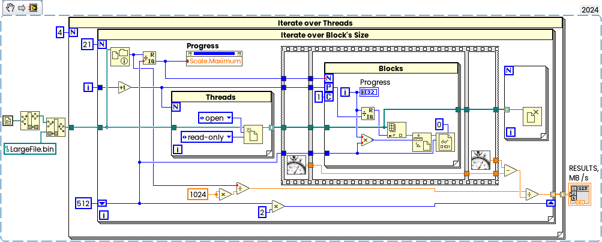
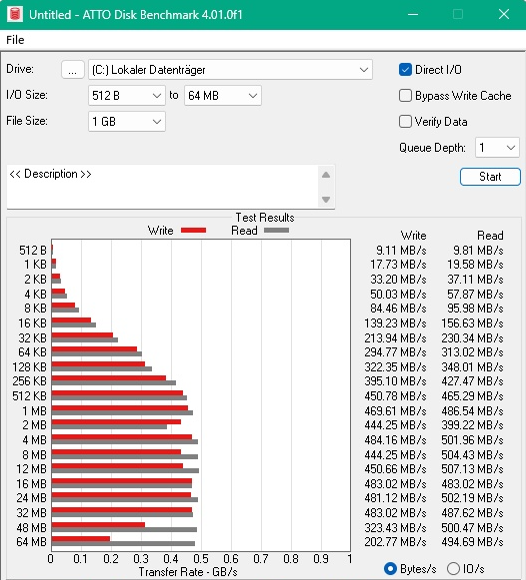

In this "weekend" experiment I'll write large file (16 GB in my case), then read it back with different buffer size and threads and check the performance.
<!--more-->
The result is more or less predictable — each drive have a given throughput limit, and we can't read faster than drive and interface will allow, but there are some interesting points which I would like to share.

To avoid read from cache I will create file, which is equal to RAM's Size. In my case test laptop equipped with 16GB RAM, so I'll write 16 GB File.

## Write Experiment

Writing speed measurement is slightly out of scope, but anyway I will check how fast this will take.

I will write test file with 1MB blocks:

Now the results. for 16 GB it takes 86,7 seconds, means 189 MB/s average speed:

Interesting point that the first GB was written very fast — around 2GB/s. Of course my SSD (which Samsung 750 EVO) can't hold this speed. There are three factors — first, I have Samsung Magician software with enabled RAPID mode, then, second, obviously we have OS file write cache, and third, SSD's cache. All three together resulted that the fist GB written to RAM, then dropped to SSD. This is what happened after first GB:

Theoretically I can turn off Rapid Mode, as well as write caching, but this experiment is slightly out of scope (expected some performance drop anyway).

## Read Experiment

Now we will read large file back with standard LabVIEW's File I/O functions. There are two parameters which can be changed — block size to be read in single operation and amount of threads. My test laptop have 4 cores, so I'll check from single to 4 threads and iterate over different block sizes starting from from 512 bytes:

And the results (measured in MB/s):

| Block Size | Single thread | 2 Threads | 3 Threads | 4 Threads |
| ---------- | ------------- | --------- | --------- | --------- |
| 512 B      | 60,10         | 19,30     | 28,82     | 32,23     |
| 1 KB       | 113,66        | 33,59     | 38,15     | 46,38     |
| 2 KB       | 227,44        | 53,60     | 56,48     | 60,67     |
| 4 KB       | 386,68        | 60,44     | 79,59     | 92,55     |
| 8 KB       | 332,35        | 110,62    | 141,69    | 160,95    |
| 16 KB      | 319,90        | 159,61    | 221,36    | 254,05    |
| 32 KB      | 333,98        | 220,28    | 288,84    | 323,87    |
| 64 KB      | 359,20        | 288,14    | 344,64    | 396,21    |
| 128 KB     | 408,41        | 351,06    | 401,79    | 456,51    |
| 256 KB     | 433,92        | 415,28    | 450,04    | 502,90    |
| 512 KB     | 444,09        | 459,03    | 506,23    | 509,73    |
| 1 MB       | 447,17        | 510,29    | 510,83    | 510,80    |
| 2 MB       | 449,19        | 510,96    | 510,88    | 510,79    |
| 4 MB       | 455,00        | 510,90    | 511,02    | 511,38    |
| 8 MB       | 452,69        | 510,79    | 511,02    | 511,45    |
| 16 MB      | 398,42        | 512,04    | 512,41    | 512,57    |
| 32 MB      | 403,78        | 512,52    | 512,72    | 512,52    |
| 64 MB      | 394,79        | 505,45    | 511,21    | 508,03    |
| 128 MB     | 372,18        | 502,46    | 510,96    | 506,82    |
| 256 MB     | 353,78        | 481,07    | 506,33    | 506,45    |
| 512 MB     | 354,66        | 493,42    | 494,73    | 487,47    |

Interesting that single thread has more performance, but 2, 3 and 4 threads working as expected. We reach 500 MB/s with 1 MB buffer in two threads, but in 4 threads it is enough to have 256 KB buffer only.

This measurement can be different on different SSDs and PC Configurations, of course.

But in general this is expected results, the same can be obtained with traditional benchmark, for example, single thread:

against 4  Queues:

With larger amount of the threads we can reach "saturation" limit earlier with smaller buffer. And for better performance the buffer should be large enough - 256 KB - 1 MB.
