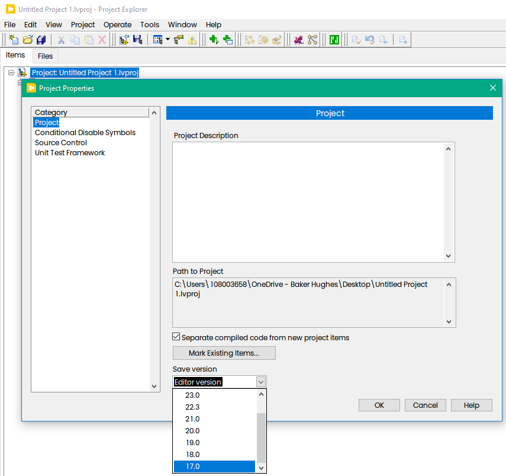
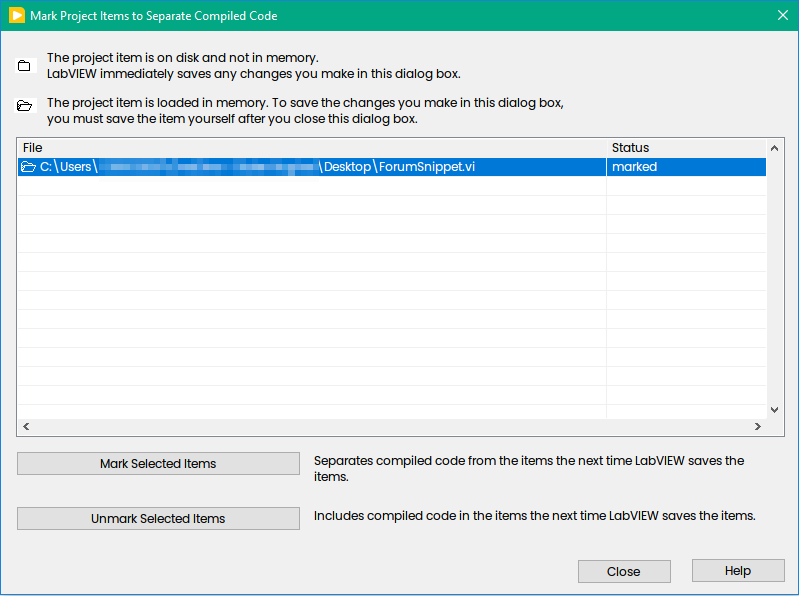
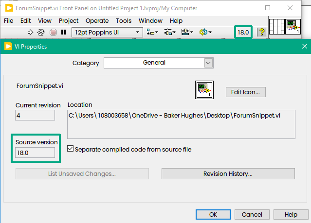

There are some "hidden" INI keys available in LabVIEW, which I often forgot
<!--more-->
## Save for Previous Version
Introduced in LabVIEW 2024 

```ini
FeatureToggle.Editor.ProjectSaveVersion=True
```

This feature allows you to use LabVIEW 2024 Q1 to edit VIs that can be opened with older versions of the LabVIEW editor. This allows you to collaborate on a project with others who haven’t upgraded to the same version of LabVIEW that you are using.

How it works:



Don't forget to mark VIs to be saved in previous version:



The Version will appear on ToolBar and in the Properties:




Refer to [Preview Feature in LabVIEW 2024 Q1: Developing a LabVIEW Project in an Older Save Version File Format ](https://forums.ni.com/t5/LabVIEW-Public-Beta-Program-in/Preview-Feature-in-LabVIEW-2024-Q1-Developing-a-LabVIEW-Project/m-p/4350547)

## Enabling Heap Peek and Ned

```ini
LVdebugKeys=True
```

Heap Peek is a debug feature which allows to view internal data structures created for all loaded VI files, including Front Panel Heap and Block Diagram Heap. The feature is intended for use by LV R&D.

 to trigger the Heap Peek window:

- Open your VI
- Press CTRL+SHIFT+D+H.

to trigger the Ned Options Window

- Press CTRL+SHIFT+D+N.

Refer to [LabVIEW Wiki - Heap Peek](https://labviewwiki.org/wiki/Heap_Peek) & [Lava - Heap Peek](https://lavag.org/topic/12500-heap-peek-and-other-internal-debug-tools/).

