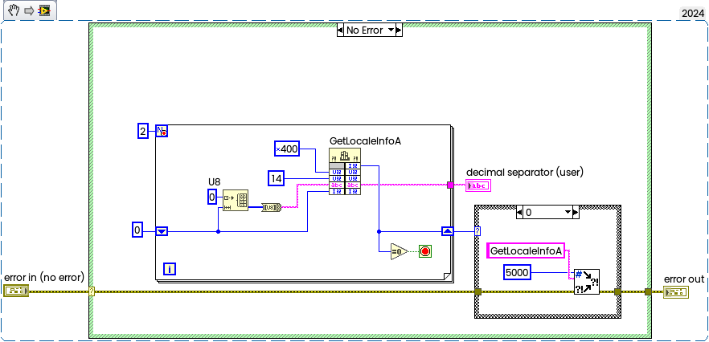

While playing around with the Signal Processing Toolkit, I found in NI's sources a funny method to detect which decimal separator is used in the operating system — simply perform a conversion of the string "1,23" to a double and compare it to the double constant "1.23".
<!--more-->

More information on NI Forum: ## [Read Decimal Symbol "," or "."](https://forums.ni.com/t5/LabVIEW/Read-Decimal-Symbol-quot-quot-or-quot-quot/m-p/4193952)

And some variations:

or this:

or more simple:

.png)

or more hard, but tecnically accurate way using WinAPI:

