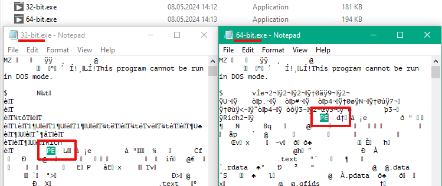

Two ways, how to check if a binary is 32 or 64 bit on Windows. One is "official", using dumbpin and another one is "funny" using ... Notepad.
<!--more-->
Technically the signature is `PE\0\0` (letters "P" and "E" followed by two null bytes), followed by a two-byte Machine Type in Little Endian. The relevant values are `0x8664` for a 64-bit executable and `0x014c` for a 32-bit one (`64 86` and `4c 01` respectively when adjusted for endianness).

## Official Method
When SDK is installed, then from command prompt just call 

```
> dumpbin /Headers MyApp.exe | more
or
> dumpbin /Headers MyApp.exe >MyApp.txt
```
(| more or redirect to file, because output will be long)

For 32-bit App typically will be displayed something like this:

```
Microsoft (R) COFF/PE Dumper Version 14.39.33523.0
Copyright (C) Microsoft Corporation.  All rights reserved.


Dump of file 32-bit.exe

PE signature found

File Type: EXECUTABLE IMAGE

FILE HEADER VALUES
             14C machine (x86)
               6 number of sections
        65A1A0E2 time date stamp Fri Jan 12 21:28:18 2024
               0 file pointer to symbol table
               0 number of symbols
              E0 size of optional header
             122 characteristics
                   Executable
                   Application can handle large (>2GB) addresses
                   32 bit word machine
```

For 64-bit App:

```
Dump of file 64-bit.exe

PE signature found

File Type: EXECUTABLE IMAGE

FILE HEADER VALUES
            8664 machine (x64)
               7 number of sections
        65A1A0E2 time date stamp Fri Jan 12 21:28:18 2024
               0 file pointer to symbol table
               0 number of symbols
              F0 size of optional header
              22 characteristics
                   Executable
                   Application can handle large (>2GB) addresses
```
"machine" is clearly stated about bittness, as well as Large Address for 32-bit.

## Non-official, but funny way
Just open App in Notepad or any Text Editor, then check the first printable characters after the first occurrence of 'PE':

32-Bit App:

```
PE  L
```
For 64-Bit:

```
PE  d†
```

Mnemonic rule for me: "32-bit" = Low; 64-bit looks like 64 where 6 is mirrored.

In reality looks like that:



([from StackExchange](https://superuser.com/questions/358434/how-to-check-if-a-binary-is-32-or-64-bit-on-windows))

And don't forget that the bittness of the LabVIEW-based application should be the the same with bittness of the Run-Time Engine. 

64-bit application obviously can't be executed on 32-bit OS, but 32-bit App will be fine with 64-bit OS.
