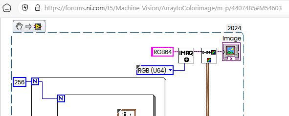
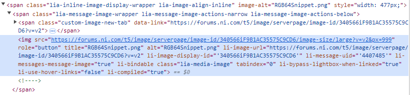

It is a very funny fact that the NI'S Web Site doesn't support NI's Snippets properly, especially on NI Forum, where the Snippets used actively to exchange the small pieces of the LabVIEW code. Here how you can get code from such snippets.
<!--more-->
Technically the Snippet is just PNG file with custom private data, where the copy of the code is placed.

For example, this Solution with Snippet:

[Re: ArraytoColorimage](https://forums.ni.com/t5/Machine-Vision/ArraytoColorimage/m-p/4407485#M54603)

Looks like that:




This is how this snippet embedded into web page:



and this caused removal of the custom data.

When you will click on that image, then the following link will be opened:

```
forums.ni.com/t5/Machine-Vision/ArraytoColorimage/m-p/4407485?lightbox-message-images-4407485=340566iF9B1AC35575C9CD6#M54603
```

Or if you will copy the address of the image, then the following:

```
https://forums.ni.com/t5/image/serverpage/image-id/340566iF9B1AC35575C9CD6/image-size/large?v=v2&px=999
```

Here important is ID: **340566iF9B1AC35575C9CD6**

Now you should use this ID on the following link:

```
https://forums.ni.com/t5/image/serverpage/image-id/340566iF9B1AC35575C9CD6
```

(another link mentioned here — [Resolve links to VI snippets](https://forums.ni.com/t5/LabVIEW-Idea-Exchange/Resolve-links-to-VI-snippets/idi-p/4080744)):

```
https://ni.i.lithium.com/t5/image/serverpage/image-id/340566iF9B1AC35575C9CD6
```

Currently both direct links working: [Link 1](https://forums.ni.com/t5/image/serverpage/image-id/340566iF9B1AC35575C9CD6) and [Link 2](https://ni.i.lithium.com/t5/image/serverpage/image-id/340566iF9B1AC35575C9CD6).

Now you can save this image as png (on the Desktop, for example), then just drag and drop image on the BD, that is.

Take a note - sometimes some browsers can "save" the cached image instead of "native" and you will get again just "preview" image without data. In this case just open another browser (for example, normally I using Vivaldi, but to download Snippet I using Edge).