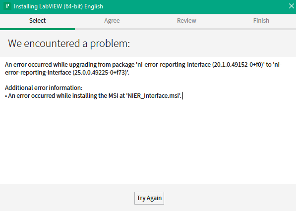
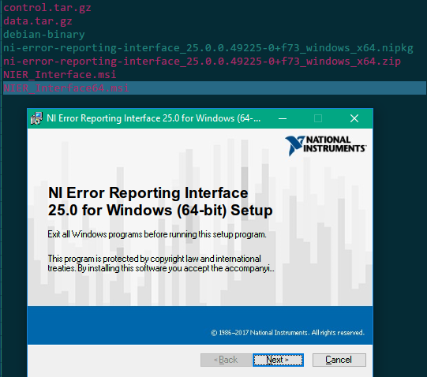
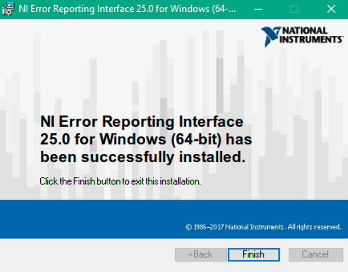
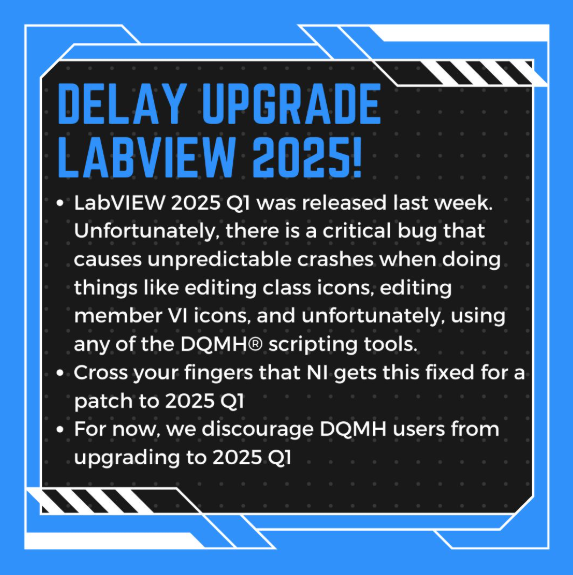
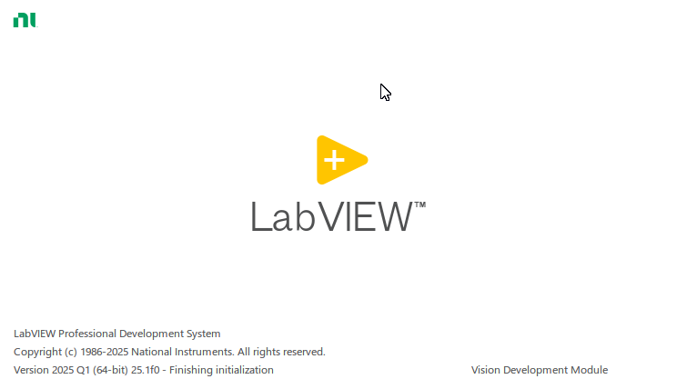

LabVIEW 2025 Q1 and Vision 2025 was release in January. I downloaded and installed both, but some problems are occurred.
<!--more-->
On my "almost empty" home PC installation was OK (takes half an hour), but on business PC encountered issue during installation:

Workaround: from DVD extract NI Error Reporting Interface, and install it manually (don't need to exit from NI Package Manager), then repeat installation. 

was installed successfully:

then repeat installation attempt.

#### Another problem:

[There is a critical bug](https://www.linkedin.com/feed/update/urn:li:activity:7290238333132120064/) that causes unpredictable crashes when doing things like editing class icons, editing member VI icons, and unfortunately, using any of the DQMH® scripting tools. 

In case if DQMH is used actively, then you have to wait...

### LabVIEW 2025 Q1 Features and Changes

[Official Release Notes for 2025](https://www.ni.com/docs/en-US/bundle/labview/page/labview-2025q1-changes.html?srsltid=AfmBOorU5OYc-A61OFnjiOpDe4A5zDVmXiSmcqzn5UWZ_VZLG8C5R1Lr). [Changes lists for 2019-2025](https://www.ni.com/docs/en-US/bundle/labview/page/labview-changes.html).

### .NET (Core) 8.0 Support

LabVIEW 2025 Q1 supports loading and running .NET 8.0 assemblies on Windows. The following features are also supported with .NET 8:

- Building applications, packed libraries, and source distributions.
- Defining and using static properties and methods.

Note The .NET Container, registering VIs for event callbacks, and building .NET assemblies, are not yet supported with .NET 8.

My Note - the latest version of .net is [9.0.1 released  January 14, 2025](https://dotnet.microsoft.com/en-us/download/dotnet/9.0)

### Python Support

LabVIEW 2025 Q1 supports Python 3.11 and 3.12.

Note LabVIEW 2025 will continue to support Python 3.9 and 3.10.

My Note — the latest version of Python is [3.13.1 released Dec. 3, 2024](https://www.python.org/downloads/release/python-3131/).

### Changes to Compare VIs and Other LabVIEW Files

LabVIEW 2025 Q1 adds the HTML format for VI comparison reports. These reports include:

- Annotated images of differences, including different colors for additions, modifications, and removals.
- Images of changed VI icons and connector panes.
- Collapsible sections to help focus on the remaining differences during reviews.

Interactive comparison of VIs also has new annotations and buttons to copy images of differences to the clipboard. You can easily use these features in change comments, such as in Pull Requests with Git.

Project, library, and class files now contain better property labels and less redundant information. It makes it easier for you to review changes using third-party tools for text files.

### New Row Options for Listbox, Multicolumn Listbox, Table, and Tree Controls

LabVIEW 2025 Q1 adds the following new options to listbox, multicolumn listbox, table, and tree controls:

- Added Word Wrap option. This option causes text in a cell to display in multiple lines if the column is not wide enough to display the complete text. This option will work best when used in combination with Autosize Row Height.
- Added alternating row background color option. This option makes it easier to associate text with the correct row, especially when the control is not showing horizontal lines. In high contrast themes, this feature is disabled when using system colors for both the text and the background color.

### New Properties, Methods, and Events

LabVIEW 2025 Q1 includes the following new properties, methods, and events:

- The Project and Library classes include the following new property:
  - Save Version (read only) — Returns the save version of the project or library.
- The Project class includes the following new method:
  - Set Project Save Version — Sets the save version of the project. Version is specified as a short form LabVIEW version string, such as 24.0 representing LabVIEW 2024 Q1. The oldest supported version is 17.0. This method will load all project items. The items will prompt to be saved on close if not already saved in a compatible version.
- The Library class includes the following new method:
  - Set Library Save Version — Sets the save version of the library. Version is specified as a short form LabVIEW version string, such as 24.0 representing LabVIEW 2024 Q1. The oldest supported version is 17.0. This method will load all library and class items. The items will prompt to be saved on close if not already saved in a compatible version.
- The Listbox, Multicolumn Listbox, Table, and Tree classes include the following new properties:
  - Word Wrap — Determines whether the height of a row is based on explicit lines or wrapped text.
  - Alternating Row Colors — Row background colors alternate to make row size and boundaries more obvious.
  - Alternate Row Background Color — Background color used to draw alternate rows.

### Additional Changes and Links

- The *LabVIEW Style Guide* is now in the *[LabVIEW Wiki](https://labviewwiki.org/wiki/Style_Guide)*.
- [Hardware and software compatibility information](https://www.ni.com/en/support/documentation/compatibility/21/ni-hardware-and-operating-system-compatibility.html).
- [LabVIEW and Microsoft Windows Compatibility](https://www.ni.com/en/support/documentation/compatibility/17/labview-and-microsoft-windows-compatibility.html)

### Direct links

[LabVIEW 2025 Q1 64-bit (3,05 GB)](https://download.ni.com/support/nipkg/products/ni-l/ni-labview-2025/25.1/offline/ni-labview-2025_25.1.0_offline.iso)

[LabVIEW 2025 Q1 32-bit (3,03 GB)](https://download.ni.com/support/nipkg/products/ni-l/ni-labview-2025-x86/25.1/offline/ni-labview-2025-x86_25.1.0_offline.iso)

[LabVIEW 2025 Q1 Runtime 64-bit (531,72 MB)](https://download.ni.com/support/nipkg/products/ni-l/ni-labview-2025-runtime-engine/25.1/offline/ni-labview-2025-runtime-engine_25.1.0_offline.iso)

[LabVIEW 2025 Q1 Runtime 32-bit (544,63 MB)](https://download.ni.com/support/nipkg/products/ni-l/ni-labview-2025-runtime-engine-x86/25.1/offline/ni-labview-2025-runtime-engine-x86_25.1.0_offline.iso)

[LabVIEW 2025 Q1 and Drivers 64-bit (27,88 GB)](https://download.ni.com/support/nipkg/products/ni-l/ni-labview-2025/25.0/offline/ni-labview-2025_25.0.0.49247-0+f95_offline.iso)

[LabVIEW 2025 Q1 and Drivers 32-bit (27,21 GB)](https://download.ni.com/support/nipkg/products/ni-l/ni-labview-2025-x86/25.0/offline/ni-labview-2025-x86_25.0.0.49247-0+f95_offline.iso)

[Vision Development Module 2025 Q1 32-bit and 64-bit (3,29 GB)](https://download.ni.com/support/nipkg/products/ni-v/ni-vision-development-module/25.0/offline/ni-vision-development-module_25.0.0_offline.iso)

[Vision Development Module 2025 Q1 Runtime 32-bit and 64-bit (1,57 GB)](https://download.ni.com/support/nipkg/products/ni-v/ni-vision-runtime/25.0/offline/ni-vision-runtime_25.0.0_offline.iso)

[Vision Acquisition Software 2025 Q1 32-bit and 64-bit (2,25 GB)](https://download.ni.com/support/nipkg/products/ni-v/ni-vision-acquisition/25.0/offline/ni-vision-acquisition_25.0.0.49273-0+f121_offline.iso)

