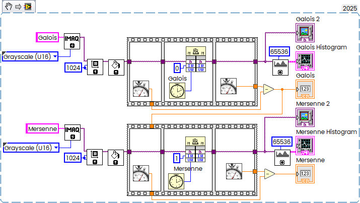
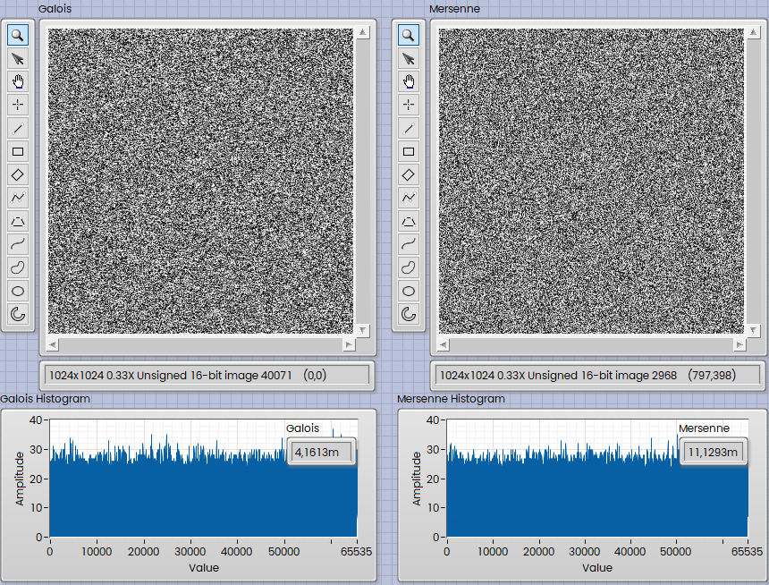

From time to time, I need to fill images with random values — and do it quickly. There are two simple yet elegant algorithms to achieve this.
<!--more-->
First on is based on [Galois LFSR](https://en.wikipedia.org/wiki/Linear-feedback_shift_register) (Linear-feedback shift register). There are several possible implementations, the pure 16 bit will repeat sequence every 65K values, 

```c
// Galois LFSR with 16-bit register and a primitive polynomial
static inline uint16_t galois_lfsr16(GRand* rand) {
	uint16_t lsb = rand->g16 & 1;	// Get LSB (bit 0)
	rand->g16 >>= 1;				// Shift register
	if (lsb)  rand->g16 ^= 0xB400;	// Apply polynomial x^16 + x^14 + x^13 + x^11 + 1
	return rand->g16;
}
```

So, I use a 32-bit version and take only the lower 16 bits:

```c
static inline uint16_t galois_lfsr32(GRand* rand) {
	uint32_t lsb = rand->g32 & 1;		// Get LSB (bit 0)
	rand->g32 >>= 1;					// Shift register
	if (lsb) rand->g32 ^= 0x80200003;	// Polynomial: x^32 + x^22 + x^2 + x^1 + 1
	return (uint16_t)(rand->g32 & 0xFFFF);;
}
```

Simple and beautiful.

Another one is [Mersenne Twister](https://en.wikipedia.org/wiki/Mersenne_Twister), which is a little bit more complicated:

```c
// Generate a random unsigned short (16-bit)
// based on https://github.com/ESultanik/mtwister/blob/master/mtwister.c
uint16_t mersenne32_U16(MTRand* rand) {
    uint32_t y;
    static const uint32_t mag[2] = {0x0, 0x9908b0df};

    if (rand->index >= 624 || rand->index < 0) {
        int kk;
        for (kk = 0; kk < 624 - 397; kk++) {
            y = (rand->mt[kk] & 0x80000000) | (rand->mt[kk + 1] & 0x7fffffff);
            rand->mt[kk] = rand->mt[kk + 397] ^ (y >> 1) ^ mag[y & 0x1];
        }
        for (; kk < 624 - 1; kk++) {
            y = (rand->mt[kk] & 0x80000000) | (rand->mt[kk + 1] & 0x7fffffff);
            rand->mt[kk] = rand->mt[kk + (397 - 624)] ^ (y >> 1) ^ mag[y & 0x1];
        }
        y = (rand->mt[624 - 1] & 0x80000000) | (rand->mt[0] & 0x7fffffff);
        rand->mt[624 - 1] = rand->mt[397 - 1] ^ (y >> 1) ^ mag[y & 0x1];
        rand->index = 0;
    }

    y = rand->mt[rand->index++];
    y ^= (y >> 11);
    y ^= (y << 7) & 0x9d2c5680;
    y ^= (y << 15) & 0xefc60000;
    y ^= (y >> 18);

    return (uint16_t)(y & 0xFFFF);  // Return only the lower 16 bits
}
```

Both are pretty fast (Galois obviously is faster than Mersenne), this is how they used in Wrapper:

```c
extern "C" __declspec(dllexport)
void FillRandom(NIImageHandle IMAQImage, uint16_t Type, uint32_t seed)
{
	Image *ImgSrc;
	uint16_t *LVImagePtrU16;
 	int LVWidth, LVHeight,	LVLineWidthSrc, x, y;

	LV_SetThreadCore(1);
	LV_LVDTToGRImage(IMAQImage, &ImgSrc);
	
	LVImagePtrU16 = (uint16_t *)((ImageInfo *)ImgSrc)->imageStart;

 	LVWidth = ((ImageInfo *)ImgSrc)->xRes;
	LVHeight = ((ImageInfo *)ImgSrc)->yRes;
	LVLineWidthSrc = ((ImageInfo *)ImgSrc)->pixelsPerLine;
	
	if (Type == 0){
		GRand rng = seedRand_g(seed);  // Non-zero seed, default is 0xACE1u
		for (y = 0; y < LVHeight; y++){
			for (x = 0; x < LVWidth; x++){
				*LVImagePtrU16++ = galois_lfsr32_U16(&rng);
			}
			LVImagePtrU16 += (LVLineWidthSrc - LVWidth);
		}
	}

	if (Type == 1){
		MTRand rng = seedRand_m(seed);  // Seed with any 32-bit value
		for (y = 0; y < LVHeight; y++){
			for (x = 0; x < LVWidth; x++){
				*LVImagePtrU16++ = mersenne32_U16(&rng);			
			}
			LVImagePtrU16 += (LVLineWidthSrc - LVWidth);
		}
	}
}
```

and LabVIEW Code:



and result:



<details>
  <summary>Full Code</summary>

in NI CVI 2020

```c
//==============================================================================
//
// Title:		G&Mrnd
// Purpose:		Random Numbers generation
//
// Created on:	10.06.2025 at 08:54:42 by AD.
//
//==============================================================================

#include <ansi_c.h>
#include <nivision.h>

typedef uintptr_t NIImageHandle;

extern "C" int LV_LVDTToGRImage(NIImageHandle niImageHandle, void *image);
extern "C" int LV_SetThreadCore(int NumThreads);

//==============================================================================
// Mersenne functions

typedef struct {
    uint32_t mt[624];
    int index;
} MTRand;

// Seeding function
MTRand seedRand_m(uint32_t seed) {
    MTRand rand = {0};
    rand.mt[0] = seed;
    for (rand.index = 1; rand.index < 624; rand.index++) {
        rand.mt[rand.index] = (6069U * rand.mt[rand.index - 1]) & 0xffffffffU;
    }	
    return rand;
}


// Generate a random unsigned short (16-bit)
// based on https://github.com/ESultanik/mtwister/blob/master/mtwister.c
static inline uint16_t mersenne32_U16(MTRand* rand) {
    uint32_t y;
    static const uint32_t mag[2] = {0x0, 0x9908b0df};

    if (rand->index >= 624 || rand->index < 0) {
        int kk;
        for (kk = 0; kk < 624 - 397; kk++) {
            y = (rand->mt[kk] & 0x80000000) | (rand->mt[kk + 1] & 0x7fffffff);
            rand->mt[kk] = rand->mt[kk + 397] ^ (y >> 1) ^ mag[y & 0x1];
        }
        for (; kk < 624 - 1; kk++) {
            y = (rand->mt[kk] & 0x80000000) | (rand->mt[kk + 1] & 0x7fffffff);
            rand->mt[kk] = rand->mt[kk + (397 - 624)] ^ (y >> 1) ^ mag[y & 0x1];
        }
        y = (rand->mt[624 - 1] & 0x80000000) | (rand->mt[0] & 0x7fffffff);
        rand->mt[624 - 1] = rand->mt[397 - 1] ^ (y >> 1) ^ mag[y & 0x1];
        rand->index = 0;
    }

    y = rand->mt[rand->index++];
    y ^= (y >> 11);
    y ^= (y << 7) & 0x9d2c5680;
    y ^= (y << 15) & 0xefc60000;
    y ^= (y >> 18);

    return (uint16_t)(y & 0xFFFF);  // Return only the lower 16 bits
}


//==============================================================================
// Galois functions

typedef struct {
    uint32_t g32;
	uint16_t g16;
} GRand;

// Seeding function
GRand seedRand_g(uint32_t seed) {
    GRand rand = {0};
	rand.g32 = seed;
	rand.g16 = seed & 0xFFFF;
    return rand;
}

// Galois LFSR with 16-bit register and a primitive polynomial
static inline uint16_t galois_lfsr16(GRand* rand) {
	uint16_t lsb = rand->g16 & 1;	// Get LSB (bit 0)
	rand->g16 >>= 1;				// Shift register
	if (lsb)  rand->g16 ^= 0xB400;	// Apply polynomial x^16 + x^14 + x^13 + x^11 + 1
	return rand->g16;
}

static inline uint16_t galois_lfsr32_U16(GRand* rand) {
	uint32_t lsb = rand->g32 & 1;		// Get LSB (bit 0)
	rand->g32 >>= 1;					// Shift register
	if (lsb) rand->g32 ^= 0x80200003;	// Polynomial: x^32 + x^22 + x^2 + x^1 + 1
	return (uint16_t)(rand->g32 & 0xFFFF);;
}

extern "C" __declspec(dllexport)
void FillRandom(NIImageHandle IMAQImage, uint16_t Type, uint32_t seed)
{
	Image *ImgSrc;
	uint16_t *LVImagePtrU16;
 	int LVWidth, LVHeight,	LVLineWidthSrc, x, y;

	LV_SetThreadCore(1);
	LV_LVDTToGRImage(IMAQImage, &ImgSrc);
	
	LVImagePtrU16 = (uint16_t *)((ImageInfo *)ImgSrc)->imageStart;

 	LVWidth = ((ImageInfo *)ImgSrc)->xRes;
	LVHeight = ((ImageInfo *)ImgSrc)->yRes;
	LVLineWidthSrc = ((ImageInfo *)ImgSrc)->pixelsPerLine;
	
	if (Type == 0){
		GRand rng = seedRand_g(seed);  // Non-zero seed, default is 0xACE1u
		for (y = 0; y < LVHeight; y++){
			for (x = 0; x < LVWidth; x++){
				*LVImagePtrU16++ = galois_lfsr32_U16(&rng);
			}
			LVImagePtrU16 += (LVLineWidthSrc - LVWidth);
		}
	}

	if (Type == 1){
		MTRand rng = seedRand_m(seed);  // Seed with any 32-bit value
		for (y = 0; y < LVHeight; y++){
			for (x = 0; x < LVWidth; x++){
				*LVImagePtrU16++ = mersenne32_U16(&rng);			
			}
			LVImagePtrU16 += (LVLineWidthSrc - LVWidth);
		}
	}
}
	

//==============================================================================
// DLL main entry-point functions

int __stdcall DllMain (HINSTANCE hinstDLL, DWORD fdwReason, LPVOID lpvReserved)
{
	switch (fdwReason) {
		case DLL_PROCESS_ATTACH:
			if (InitCVIRTE (hinstDLL, 0, 0) == 0)
				return 0;	  /* out of memory */
			break;
		case DLL_PROCESS_DETACH:
			CloseCVIRTE ();
			break;
	}
	
	return 1;
}

```
Useful link for me (in Russian) [Детальный обзор полей Галуа](https://habr.com/ru/articles/916740/).

</details>

