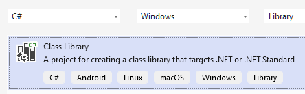

Many beginner users may be frustrated with .net and how it used in LabVIEW as well as why .NET Core and .NET Framework exists and what the differences. Since last LabVIEW 2024 supported both Core and Standard below is "demystification" with practical examples and some notes. 
<!--more-->
Assumed basic knowledge of .net is present.

In the beginning, there was the .NET Framework. Over time, the .NET Framework struggled to stay competitive, burdened by the weight of backward compatibility. Other languages and frameworks worked on any platform instead of being limited to Windows.
To start fresh, the .NET team created a new version called .NET Core that incorporated
a lot of new ideas: designing and building in the open, working on any platform, focusing on web performance, and so on.

#### .NET Framework and .NET Core

"**.NET Framework**" was the first .NET, started in February 2006 and is Windows-only. Microsoft has stopped adding new features to this. They are going to keep supporting it and will fix security issues, but they don't really want people to keep using it if they have a choice between Framework and Core, so it is more or less "legacy" stuff.

"**.NET Core**" was developed by Microsoft 10 years later, in June 2016. MS wanted a cross-platform runtime, as well as solving some architectural "issues", increase performance. It is the most modern Microsoft-developed .NET and the one they recommend for new projects going forwards. .NET Core 3.1 was the last time .NET Framework had a feature release along side Core's release. Beginning with .NET 5.0, Microsoft .NET Core has been re-branded as .NET (take a note - Microsoft decided to skip version .NET 4 to avoid confusion with .NET Framework 4), starting from this point, it is possible .NET Core may have features that .NET Framework won't.

| Implementation | Included versions                           | Last Update            |
| :------------- | :------------------------------------------ | ---------------------- |
| .NET (Core)    | .NET Core 1.0 - 3.1, .NET 5.0-8.0 and later | v.8.0 - 8th Oct 2024   |
| .NET Framework | .NET Framework 1.0 - 4.8                    | v.4.8.1 — 9th Aug 2022 |

Currently active .NET  version is 8.0 - SDK   8.0.403/RunTime 8.0.10 included in Visual Studio 2022 (17.11.5)
with Language support C# 12.0, F# 8.0, Visual Basic 16.9

There is also .NET 9.0 is available as SDK 9.0.100-rc.2 included in Visual Studio 2022 Preview (v17.12 latest preview) with support C# 13.0.

{}
{}
{}


Summary: 

|                                 | **.NET Framework**                                           | **.NET Core**                                                |
| ------------------------------- | ------------------------------------------------------------ | ------------------------------------------------------------ |
| **History**                     | the first implementation of .NET.                            | the latest implementation of .NET.                           |
| **Open Source**                 | No, the only certain components  are open source.            | Yes, .NET Core is open-source.                               |
| **Cross-Platform**              | It works only on the Windows platform.                       | It runs cross-platform like Windows, Linux, and macOS.       |
| **Performance and Scalability** | less effective in comparison to .NET Core in terms of performance and scalability | offers higher performance and scalability compared to .NET Framework. |
| **Command-line Tools**          | heavy for Command Line Interface                             | provides cross platform lightweight command-line tools       |

Let 's consider we have created an application using .NET Framework. After some time, we have decided to create a set of modular applications in .NET Core, put some code to shared libraries. and try to re-use the above same shared library back in .NET Framework. Is it compatible and can we use it? The Answer is No. We cannot use .NET Core Class Library in .NET Framework applications, because of compatibility issues. Basically, the libraries which target to .NET Core can only run in .NET Core-based applications. What is the solution?

### .NET Standard

To make existing libraries port easily between Framework and Core, Microsoft introduced .NET Standard, which defines only the APIs that a .NET implementation needs to fulfill. If you have some projects that are .NET Framework and others that are .NET Core, .NET 5, or later, those projects can use common libraries that target the .NET Standard.

If you want to develop in .NET, forget about Core 1.0-3.1, which are out of support and Framework as well; target the latest long-term support release of .NET (which is 8.0). If you need to support older versions of .NET, you can targeting .NET Standard, which will give your libraries the broadest reach.

---

Well, now from theory we can do some practical exercises.

I will use the latest available Microsoft Visual Studio 2022, then will create three .net Class Libraries, and call both from .NET and LabVIEW environment.

When I'll call ".NET Core" or "Core" I will assume latest and newest .NET. The same with LabVIEW - .NET Core means .-NET

As stated above, there are three ways to create .NET Library - Framework, Core and Standard. An easiest way to create these Libraries is using the Wizard.

I will start with classical .NET Framework:


On the next page you will configure the project and choose target framework:


The code created is simple - just one method, which adds two integers:

```c#
namespace NET_Framework_Class_Library
{
    public class NetFrameworkClass
    {
        public string Info => ".NET Framework 4.8.1 Library";
        public int Add(int x, int y) => x + y;
    }
}
```

Take a note that 

```c#
    public int Add(int x, int y) => x + y;
```

is syntax sugar for 

```c#
    public int Add(int x, int y)
    {
        return x + y;
    }
```

This will create DLL, which can be called from LabVIEW like this:


So far so good, now I will do the same with Core:



On the next screen you can select target framework, I will choose .NET 8.0:


And the code:

```C#
namespace NET_Core_Class_Library;
	public class NetCoreClass
    {
		public string Info => ".NET 8.0 Library";
		public int Add(int x, int y) => x + y;
    }
```

Take a note, that the code slightly more simply.

Now, before calling this DLL the support is necessary to be enabled in the Settings: 

This will enable .NET Core in the Constructor:

In LabVIEW will be called like this:


with obviously same result.

By the way, there is other way to create DLL and later console:

```
>mkdir "NET Core Class Library"
>cd "NET Core Class Library"
>dotnet new classlib
```

then modify your class as needed in any text editor (also Notepad is OK, the Visual Studio Code is recommended)

then build or publish:

```
>dotnet build
>dotnet publish
```

Finally I will create Standard Library. Everything the same - starting with this Wizard and the code behind:


But why do we need Standard at all? To illustrate this I can create two console applications and call these DLLs from both.

The first one is .NET Framework - based app. Again with Wizard, selecting appropriate framework:

Now I need to put my Class Library to the dependencies, and call like this:

I can reference both .NET Framework and .NET Standard, but attempt to call .NET Core Library from this applicationcaused Error:


Now do the same for .NET Core based app:

Here I can obviously call .NET DLL, but also .NET Standard. Interesting fact that I can call .NET Framework as well, but I guess, this will work not for every assebly.

Anyway, you can call .NET Standard from both and you can supply this for modern and for "legcy apps.

Unfortunately it is impossible to call .NET Standrd from LABIVEW, but hopefully this gets improved in a future.

Now, what to do if you have .NET Assembly in your hands, which can't be used in LabVIEW?

Thre are different possbilkitties.

If you have a very old DLL, then you can try to create config file, whcih will allow to load such DLL. This file should have content like this:

<...>

and saved as LabVIEW.exe.config, placed near LabVIEW App.

In case of builded application you should name it as the name of the executable, then place in the asme folder.

If this not work, then you can try to recompilke DLL. Kind of refverce engineering.  The source could be done with help of IlSpy (there are may "disassemblers available, but htis one is really good. As result you will get ViszualStudio Project, where you can change used frameworks. This will work for simple assemblies without "heavy weight" dependencies (we should keep in mind, that different versions of the frameworks could have some "breaking" differences. The project files are just text files, btu manual tqmpering sjhall be done carefully. How beginning of the file looks for all three:

And migration tool form .NET Framework to .-net core is also exists Ucheck it)

To deploy appliction whre .NET is used, the appropriate Run-Time is required, and for .NET Core can be downloaded for free from here:

Actual version as per Nov 2024 is 8.0 (Check it).

If you have "unknown" ,NET DLL in your hands, then the useful free tool is JetBrains peek, which allow to get info ybout header.

Useful tools for .NET

IlDasm

IlSpy

