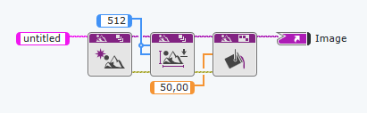
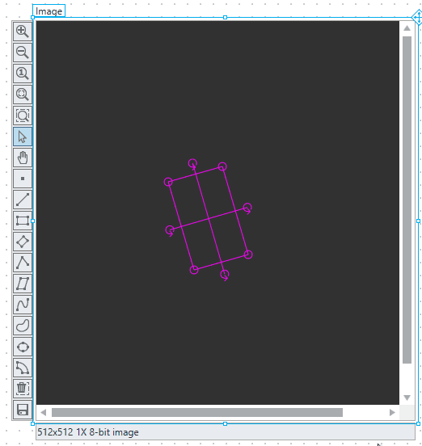
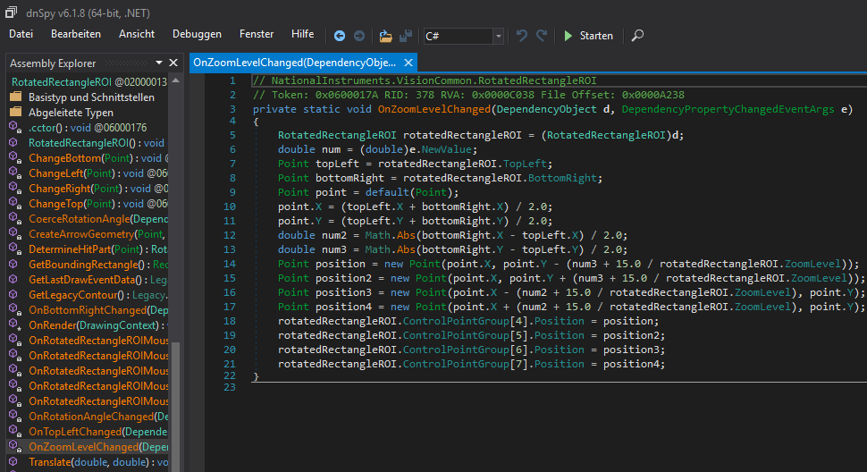
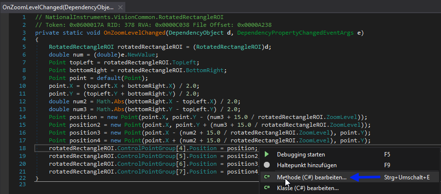
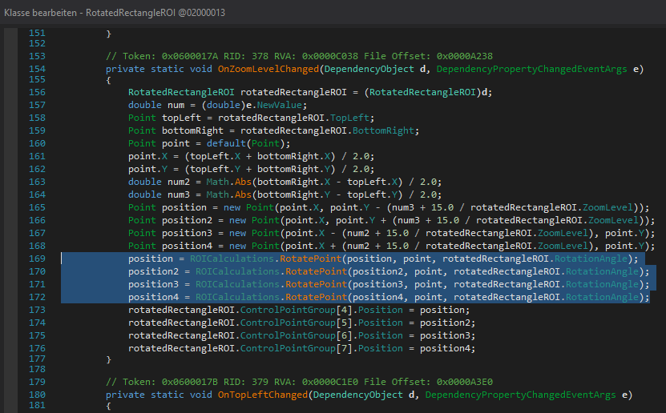
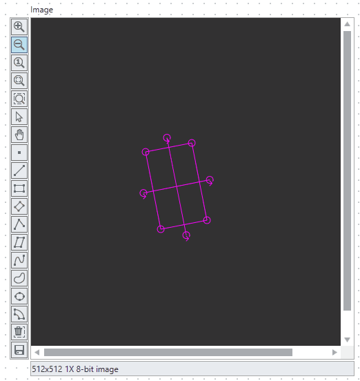

Annoying issue in LabVIEW NXG/Vision with **Rotated ROI**: When an ROI is rotated and the image is subsequently zoomed in/out by the user, the anchors remain unrotated. They only update after moving or resizing the ROI. Here’s how to fix it

<!--more-->

LabVIEW NXG 5.1.0; Build 8.4.0.49575.

Vision Development Module 2025 Q2.

Code:



And the issue:



To get this fixed you can use dnSpy software (and the fact that LabVIEW NXG including Vision based on .net, and the code was not obfuscated much).

All what you need to modify this file a little bit:

```
C:\Program Files\National Instruments

\LabVIEW NXG 5.0\Addons\NI\Vision\Core-src\20.6.0\NationalInstruments.VisionCommon.Display.Controls.dll

\Shared\LabVIEW NXG Run-Time\5.0\NationalInstruments.VisionCommon.Display.Controls.dll
```

On Zoom Level Change the following happened:



You have to change this Method:



All what you need is to add 4 lines code 

```c#
			position = ROICalculations.RotatePoint(position, point, rotatedRectangleROI.RotationAngle);
			position2 = ROICalculations.RotatePoint(position2, point, rotatedRectangleROI.RotationAngle);
			position3 = ROICalculations.RotatePoint(position3, point, rotatedRectangleROI.RotationAngle);
			position4 = ROICalculations.RotatePoint(position4, point, rotatedRectangleROI.RotationAngle);
```

right here:



After compiling and saving (ensure write permissions in the `Program Files` folder):



Used Tool - [dnSpy 6.1.8](https://github.com/dnSpy/dnSpy).

[ILSpy](https://github.com/icsharpcode/ILSpy) is also useful, but I wasn’t able to get functional assembly after rebuild.
