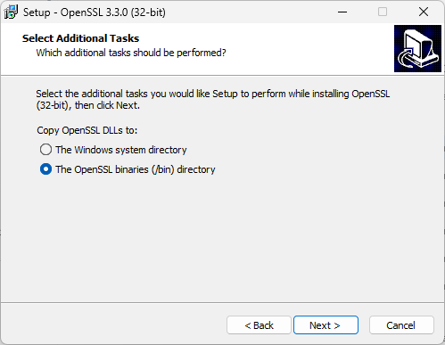

Finally wrote command line script to build open62541 library automatically (more or less).
<!--more-->
Assumed that everything is installed «by default».

### Tools needed

As compiler — the latest [Microsoft Visual Studio Professional 2022](https://visualstudio.microsoft.com/vs/professional/) [v.17.13.0](https://learn.microsoft.com/en-us/visualstudio/releases/2022/release-notes#17.13.0)

Additional tools:

[CMake](https://cmake.org/download/) [v.3.31.5](https://github.com/Kitware/CMake/releases/download/v3.31.5/cmake-3.31.5-windows-x86_64.msi).

[Python](https://www.python.org/downloads/) [v.3.13.2](https://www.python.org/ftp/python/3.13.2/python-3.13.2-amd64.exe).

[OpenSSL](https://slproweb.com/products/Win32OpenSSL.html) v3.4.1 ([Win64](https://slproweb.com/download/Win64OpenSSL-3_4_1.msi) / [Win32](https://slproweb.com/download/Win32OpenSSL-3_4_1.msi)).

OpenSSL install in dedicated folder



[Git for Windows](https://git-scm.com/download/win) must be installed as well ([v.2.48.1](https://github.com/git-for-windows/git/releases/download/v2.48.1.windows.1/Git-2.48.1-64-bit.exe))

### The command line script to build both 32- and 64- bit DLLs:

(may be will work not for everyone)

```console
python.exe -m pip install --upgrade pip
pip install six

:ask_user
echo Please enter 'M' or 'A'.
set /p "choice=Clone Master(M) or actual 1.4.10(A)? "

if /i "%choice%"=="M" git clone https://github.com/open62541/open62541
if /i "%choice%"=="A" git clone --branch v1.4.10 --depth 1 https://github.com/open62541/open62541

mkdir open62541-build32
mkdir open62541-build64
:make
set "FLAGS=-DBUILD_SHARED_LIBS=ON -DUA_BUILD_EXAMPLES=ON -DUA_ENABLE_ENCRYPTION=OPENSSL"
set "BUILD=-DCMAKE_BUILD_TYPE=Release -G "Visual Studio 17 2022""
set "CMAKE="C:\Program Files\CMake\bin\cmake.exe""
%CMAKE% %BUILD% %FLAGS% -A Win32 -S open62541 -B "open62541-build32" 
%CMAKE% %BUILD% %FLAGS% -A x64 -S open62541 -B "open62541-build64" 
:build
set "MSBUILD="C:\Program Files\Microsoft Visual Studio\2022\Professional\MSBuild\Current\Bin\MSBuild.exe""
%MSBUILD% open62541-build32\open62541.sln /t:Clean;Rebuild /property:Configuration=Release
%MSBUILD% open62541-build64\open62541.sln /t:Clean;Rebuild /property:Configuration=Release
:copy
copy open62541-build32\bin\Release\open62541.dll open62541x86.dll
copy open62541-build64\bin\Release\open62541.dll open62541x64.dll
copy "C:\Program Files\OpenSSL-Win64\bin\libcrypto-3-x64.dll" libcrypto-3-x64.dll
copy "C:\Program Files (x86)\OpenSSL-Win32\bin\libcrypto-3.dll" libcrypto-3.dll 

:end
```


