How to setup simple B&R OPC UA Server from the scratch.
<!--more-->

In this exercise I'll use latest available AS v.4.12.5.95:

 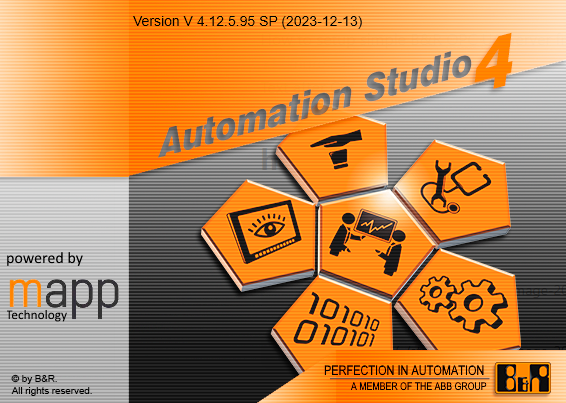


### Start with new Project

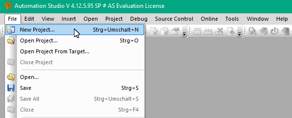


Step by step:

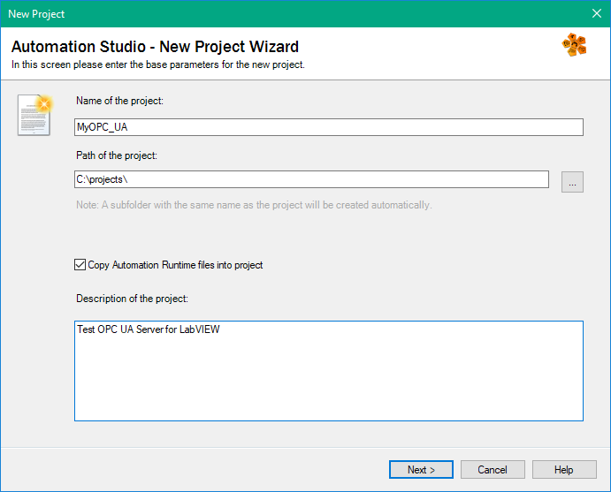


Everything by default

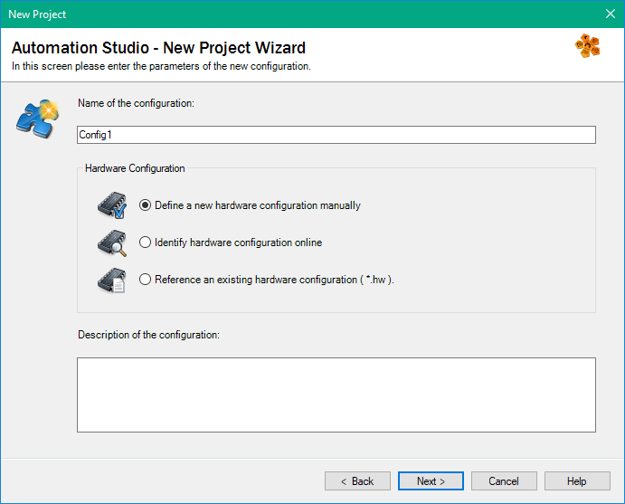

Select Standard PC here:

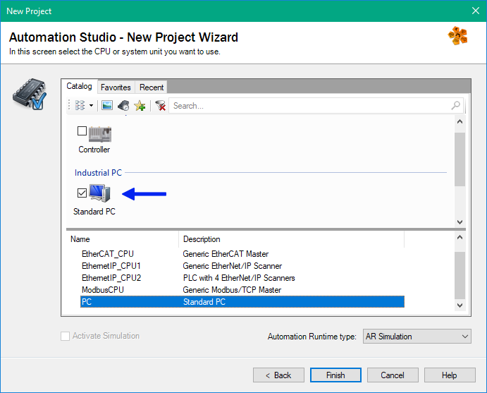

If you're lucky, then the project is created and online in Run State:

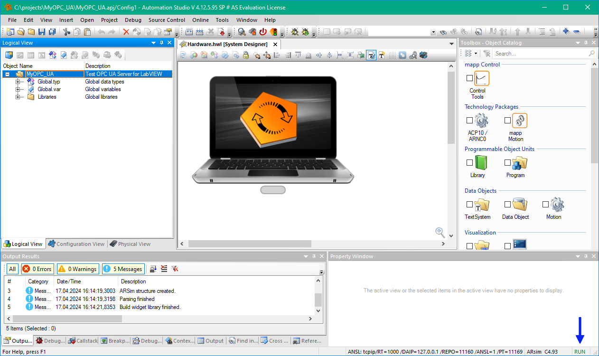

Add Global variable (later this Variable will be mapped to OPC UA Node):

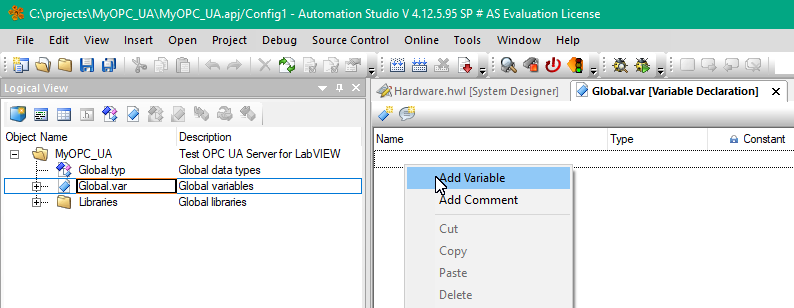

Who said that the Globals are bad?!

I'll change name to "Counter" and keep default type, which is USINT (which is uint8).


Don't confuse with BYTE Type, this is something different in B&R Interprepation!

Now I'll add C Program. Just drag and drop to MyOPC_UA:

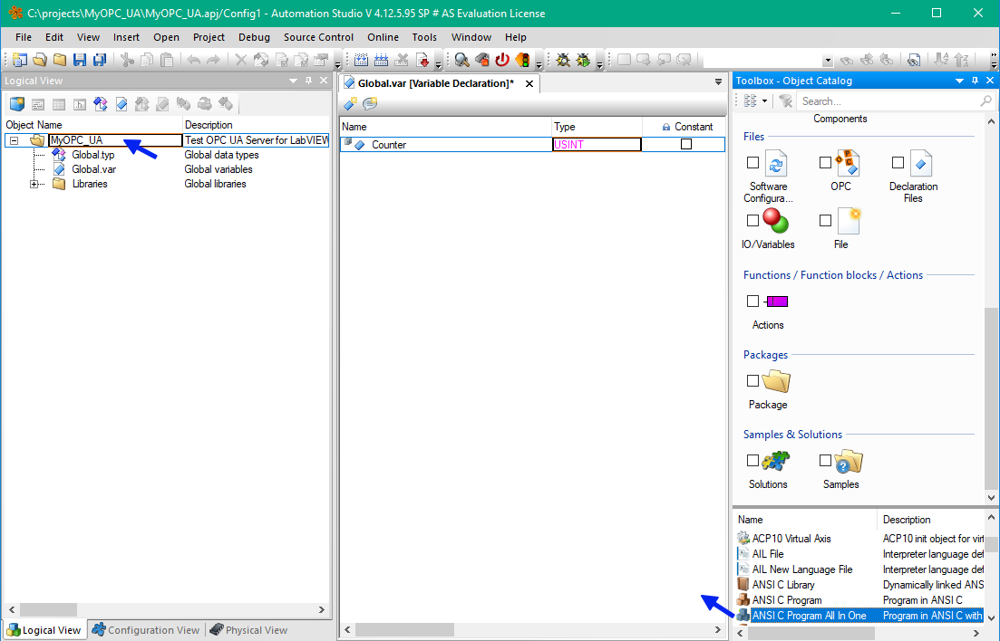

I prefer "All in One" Template. The changes I'll made very simple:

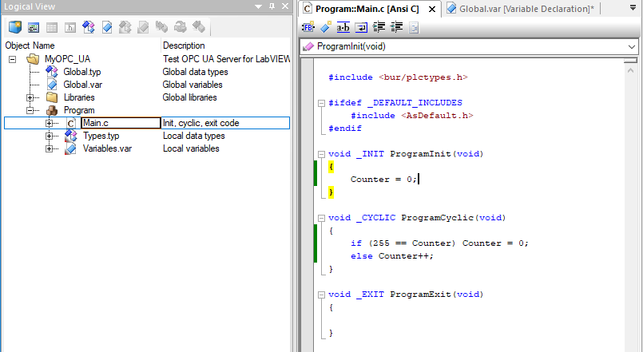

Whole program:

```c

#include <bur/plctypes.h>

#ifdef _DEFAULT_INCLUDES
	#include <AsDefault.h>
#endif

void _INIT ProgramInit(void)
{
	Counter = 0;
}

void _CYCLIC ProgramCyclic(void)
{
	if (255 == Counter) Counter = 0;
	else Counter++;
}

void _EXIT ProgramExit(void)
{

}

```

Now time for first build:

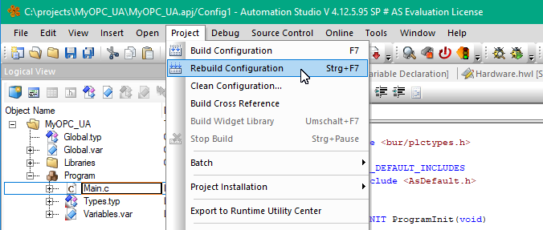

and transfer to the target:

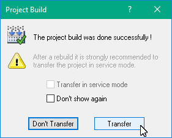

and transfer

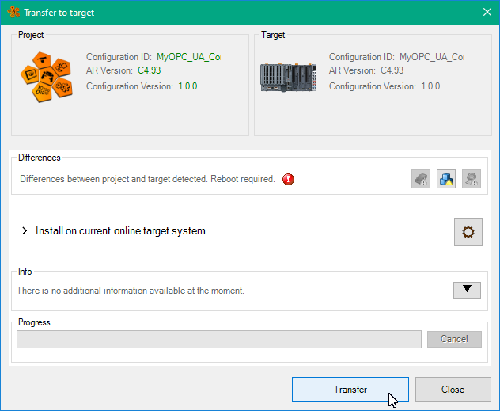

If you're still lucky, you will see running counter:

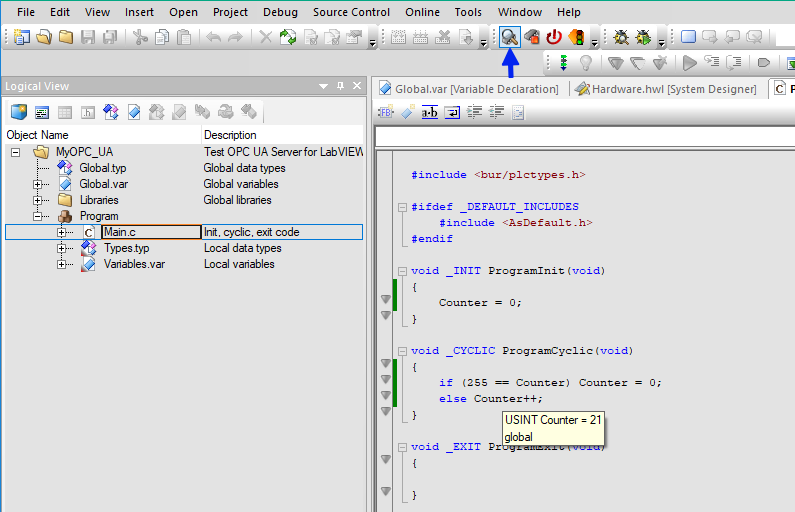

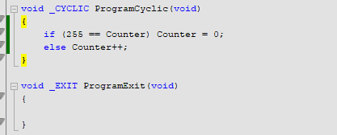

The counter incremented once per second, because by default your Program automatically inserted into 1000ms  cycle:

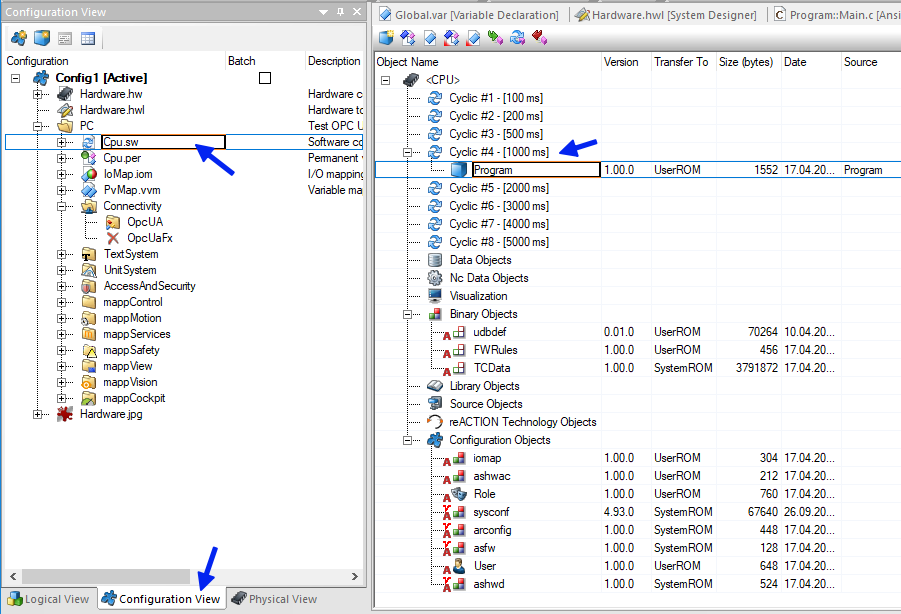

Now time to turn ON OPC Server, this can be done here:

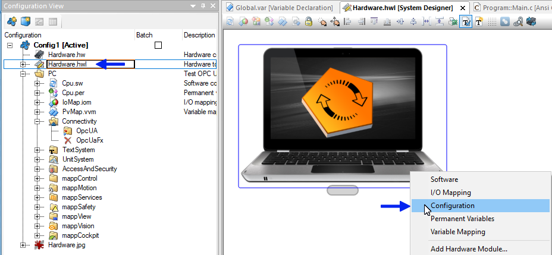

It is OFF by default, needs to be switched to ON:

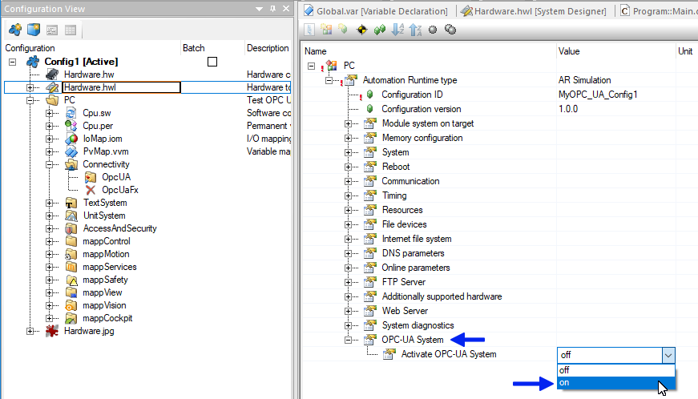

By default Security Policies will prohibit Authentication without security, I'll allow for my exercises

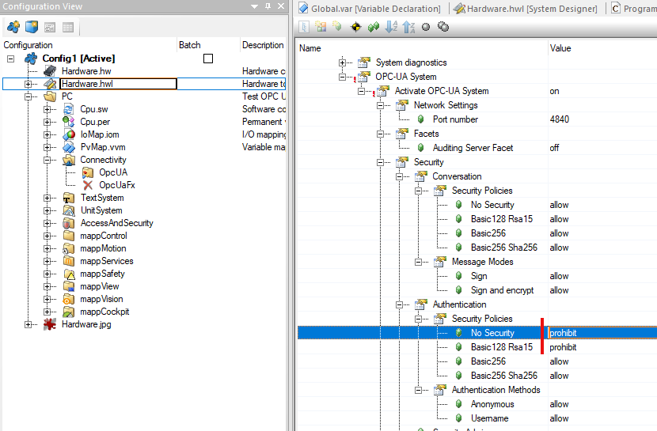

Keep rest by defaults:

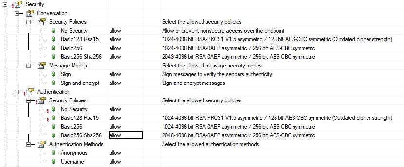

Now we must add mapping:

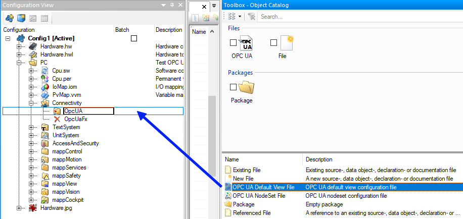

The variable is available, but disabled:

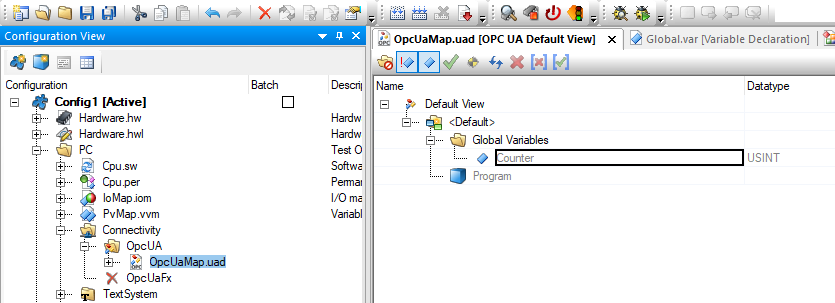

You have to enable it:

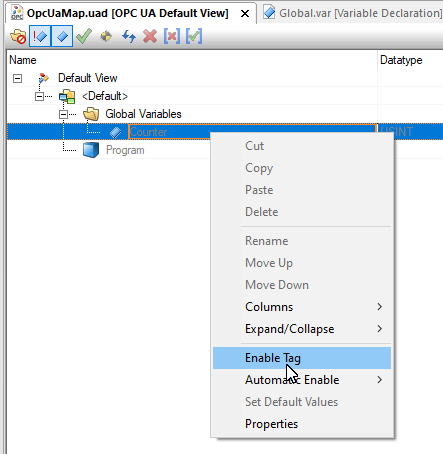

and rebuild:

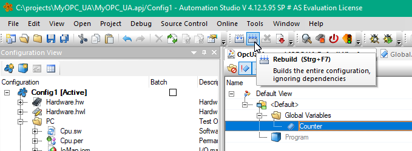

Now this Node is appeared in UA Expert:

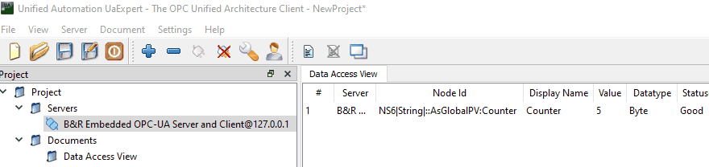

In the Tree located here:

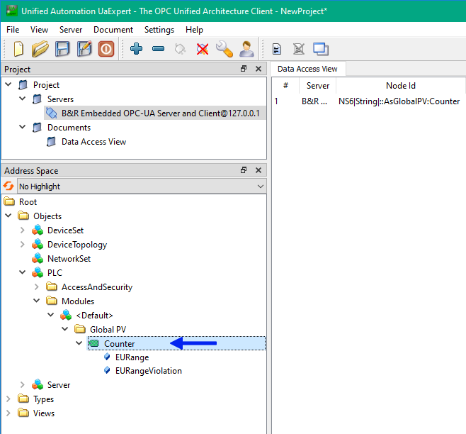

That is.
