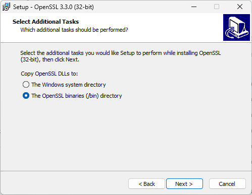
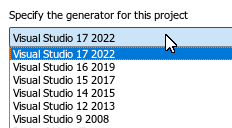
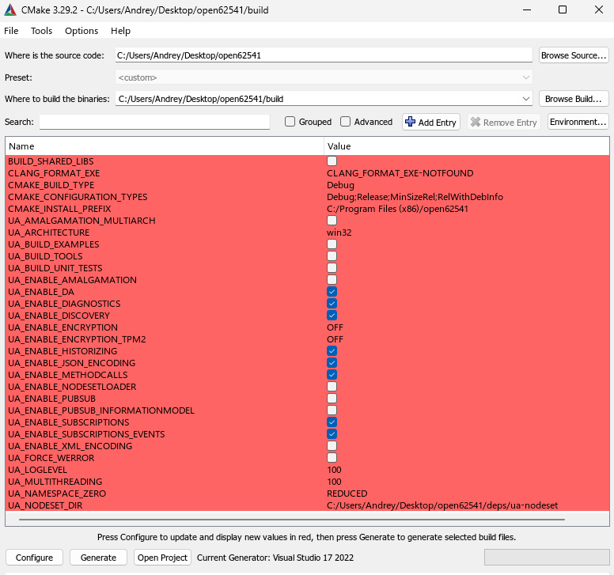
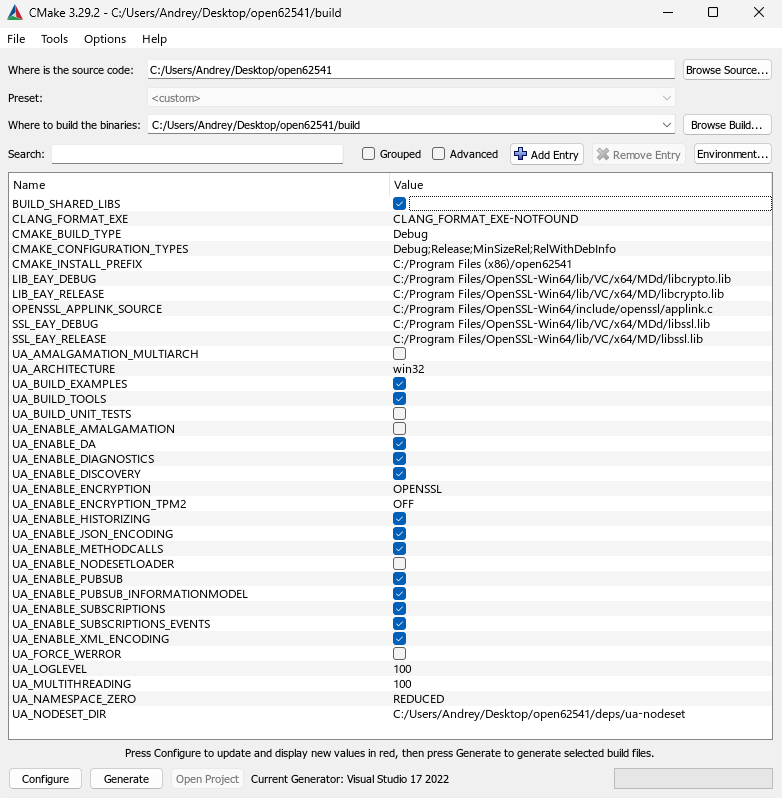
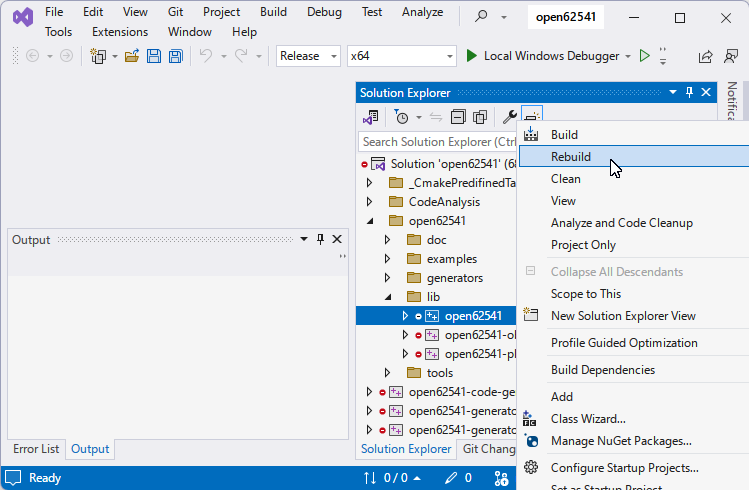
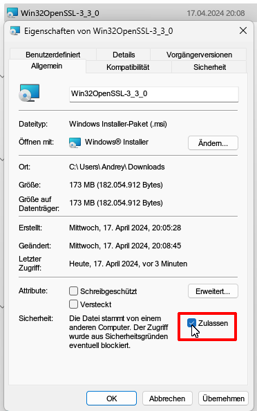

Step by step guide - how to build [open62541](https://www.open62541.org) from sources as Dynamic Link Library.
<!--more-->
This guide based on the official [Build Instructions](https://www.open62541.org/doc/master/building.html), but slightly more detailed.

### Get latest sources

```console
>git clone https://github.com/open62541/open62541
Cloning into 'open62541'...
remote: Enumerating objects: 74781, done.
remote: Counting objects: 100% (809/809), done.
remote: Compressing objects: 100% (329/329), done.
remote: Total 74781 (delta 526), reused 642 (delta 457), pack-reused 73972
Receiving objects: 100% (74781/74781), 53.19 MiB | 2.52 MiB/s, done.
Resolving deltas: 100% (56327/56327), done.
>cd open62541
```

### Tools needed

As compiler — the latest [Microsoft Visual Studio Professional 2022](https://visualstudio.microsoft.com/vs/professional/) [v.17.9.6](https://learn.microsoft.com/en-us/visualstudio/releases/2022/release-notes#1796--visual-studio-2022-version-1796) (free Visual Studio Community should be OK as well).

Additional tools:

[CMake](https://cmake.org/download/) [v.3.29.2](https://github.com/Kitware/CMake/releases/download/v3.29.2/cmake-3.29.2-windows-x86_64.msi).

[Python](https://www.python.org/downloads/) [v.3.12.3](https://www.python.org/ftp/python/3.12.3/python-3.12.3-amd64.exe).

[OpenSSL](https://slproweb.com/products/Win32OpenSSL.html) v.3.3.0 ([Win64](https://slproweb.com/download/Win64OpenSSL-3_3_0.msi) / [Win32](https://slproweb.com/download/Win32OpenSSL-3_3_0.msi)).

Everything installed "by default".

OpenSSL I prefer to install in dedicated folder



[Git for Windows](https://git-scm.com/download/win) must be installed as well ([v.2.44.0](https://github.com/git-for-windows/git/releases/download/v2.44.0.windows.1/Git-2.44.0-64-bit.exe))

### Preparation

After installation Install python-six with the pip package manager:

```console
>pip install six
```

### Build from command line

Assumed that you already in open62541 directory. If not, then

```console
>cd <path-to>\open62541
```

Then

```console
>mkdir build
>cd build
>"C:\Program Files\CMake\bin\cmake.exe" .. -G "Visual Studio 17 2022"
```

Of course, of you have different version of Visual Studio, then the last command will be different, for example, for Visual Studio 2015 "Visual Studio 14 2015", other versions:



In case of success you should see something like that:

```
-- Selecting Windows SDK version 10.0.22621.0 to target Windows 10.0.22631.
-- The C compiler identification is MSVC 19.39.33523.0
-- Detecting C compiler ABI info
-- Detecting C compiler ABI info - done
-- Check for working C compiler: C:/Program Files/Microsoft Visual Studio/2022/Professional/VC/Tools/MSVC/14.39.33519/bin/Hostx64/x64/cl.exe - skipped
-- Detecting C compile features
-- Detecting C compile features - done
-- Found Python3: C:/Program Files/Python312/python.exe (found version "3.12.3") found components:  Interpreter
-- Found Git: C:/Program Files/Git/cmd/git.exe (found version "2.44.0.windows.2")
-- open62541 Version: v1.4.0-rc2-386-gb1f5e0ea5
-- The selected architecture is: win32
-- CMAKE_BUILD_TYPE not given; setting to 'Debug'
-- Could NOT find Sphinx (missing: SPHINX_EXECUTABLE)
-- Could NOT find LATEX (missing: LATEX_COMPILER)
-- Configuring done (5.0s)
-- Generating done (0.1s)
-- Build files have been written to: C:/Users/Andrey/Desktop/open62541/build
```

Now in  \build folder you should have Solution named "open62541.sln".

### Build from GUI

Initially everything will be red:



Now I will turn ON the Option BUILD_SHARED_LIBS, as well as SSL, and some other which could be useful:



And hit Generate.

The log file

```
Selecting Windows SDK version 10.0.22621.0 to target Windows 10.0.22631.
open62541 Version: v1.4.0-rc2-386-gb1f5e0ea5
The selected architecture is: win32
Could NOT find Sphinx (missing: SPHINX_EXECUTABLE) 
Could NOT find LATEX (missing: LATEX_COMPILER) 
CMake Warning at examples/CMakeLists.txt:195 (MESSAGE):
  Can't build custom datatype examples on WIN32 when BUILD_SHARED_LIBS
  enabled.  Skipping  custom_datatype_client and custom_datatype_server!

CMake Warning at examples/CMakeLists.txt:235 (message):
  Build option BUILD_SHARED_LIBS not supported for standalone subscriber and realtime examples.  Skipping these examples.

Configuring done (1.0s)
Generating done (0.8s)
```

### Compile in Visual Studio

Open Solution, select library and rebuild:



If everything goes well, you will see at the end:

```console
9>   Creating library C:/Users/Andrey/Desktop/open62541/build/bin/Release/open62541.lib and ...
9>open62541.vcxproj -> C:\Users\Andrey\Desktop\open62541\build\bin\Release\open62541.dll
========== Rebuild All: 9 succeeded, 0 failed, 0 skipped ==========
```


### Links

# CMake projects in Visual Studio

### Troubleshooting

In latest Windows 11 attempt to install msi will cause this message:


Easiest way to fix is set "Allowed" flag in the Properties (sorry for German screenshot)



https://stackoverflow.com/questions/54985518/build-open62541-dll-with-visual-studio-2017

