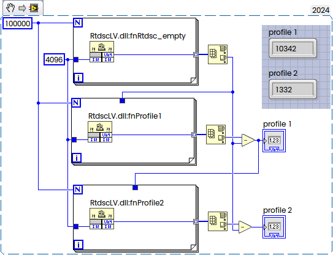

In some cases we need to measure a very short intervals (hundreds of the CPU Tacts) directly in Assembler. We can perform measurement by using cpuid/rdtsc combination.
<!--more-->
The idea behind is that the [RDTSC](https://www.felixcloutier.com/x86/rdtsc) will read Time-Stamp Counter.
Here is how to get it:
```nasm
        align 16
EXPORT fnRtdsc_get
fnRtdsc_get PROC
	push rsi
	push rdi
	push rbx
	push rcx
	push rdx

	cpuid ; force all previous instructions to complete and reset rax...rdx registerss!
	rdtsc ; read time stamp counter
	shl rax, 32
	shrd rax, rdx, 32
        
	pop rdx
	pop rcx
	pop rbx
	pop rdi
	pop rsi

	RET
ENDP fnRtdsc_get

```
Now to profile a piece of the code we need to read rdtsc twice and take difference:

```nasm
		align 16
EXPORT fnRtdsc_empty
fnRtdsc_empty PROC
	mov r10, rcx ; x64 calling convention
	push rsi
	push rdi
	push rbx
	push rcx
	push rdx

	cpuid ; force all previous instructions to complete
		  ; this will reset rax...rdx registerss!
	rdtsc ; read time stamp counter
	mov edi, eax ; save EAX for later
	mov esi, edx ; save EDX for later
L0:
	; CODE to be tested
	dec	r10
	jnz	L0

	cpuid ; wait for FDIV to complete before RDTSC
	rdtsc ; read time stamp counter
	sub eax, edi ; subtract the most recent CPU ticks from the original CPU ticks
	sbb edx, esi ; now, subtract with borrow
	shl rax, 32
	shrd rax, rdx, 32
        
	pop rdx
	pop rcx
	pop rbx
	pop rdi
	pop rsi

    RET ;returned through RAX
ENDP fnRtdsc_empty

```

The difference will be returned in RAX. Number of repetition is the parameter (passed via RCX, this is x64 calling convention).

I will put first part to the prolog.asm and second part to epilog.asm toe get everything shorter.

Now we can perform simple benchmark:

```nasm
		align 16
EXPORT fnProfile1
fnProfile1 PROC
	mov r10, rcx
INCLUDE prolog.asm 
L1:
	; CODE
	add rax, rax
	add rax, rax
	add rax, rax
	add rax, rax  ; total latency of 4 cycles for these 4 adds
	dec	r10
	jnz	L1
INCLUDE epilog.asm
    RET
ENDP fnProfile1

```

or like this:

```nasm
		align 16
EXPORT fnProfile2
fnProfile2 PROC
	mov r10, rcx
INCLUDE prolog.asm 
L2:
	; CODE
	add rax, rax
	add rbx, rbx
	add rcx, rcx
	add rdx, rdx ; these 4 instructions might all execute, 
				 ; in parallel in a single cycle
		
	dec	r10
	jnz	L2
INCLUDE epilog.asm
    RET
ENDP fnProfile2

```

The first code is much slower than second one. This is how it called from LabVIEW:



Simple but powerful technique.

{}
```nasm
	push rsi
	push rdi
	push rbx
	push rcx
	push rdx

	cpuid ; force all previous instructions to complete
		  ; this will reset rax...rdx registerss!
	rdtsc ; read time stamp counter
	mov edi, eax ; save EAX for later
	mov esi, edx ; save EDX for later

```
{}


{}
```nasm
	cpuid ; wait for FDIV to complete before RDTSC
	rdtsc ; read time stamp counter
	sub eax, edi ; subtract the most recent CPU ticks from the original CPU ticks
	sbb edx, esi ; now, subtract with borrow
	shl rax, 32
	shrd rax, rdx, 32
        
	pop rdx
	pop rcx
	pop rbx
	pop rdi
	pop rsi
```
{}


{}
```nasm
 EUROASM DEBUG=OFF,PROFILE=OFF,AUTOSEGMENT=ON,LIST=ON, DUMP=ON, DUMPWIDTH=25, DUMPALL=OFF, CPU=X64, SIMD=AVX512, MVEX=ENABLED, EVEX=ENABLED
 EUROASM NoWarn=2101, NoWarn=2461, MMX=ENABLED, AMD=ENABLED
 EUROASM ListRepeat=yes, ListMacro=yes, ListVar=yes ; Only if you want to debug the listing.
 RtdscLV PROGRAM FORMAT=DLL, Entry=DllEntryPoint, MODEL=FLAT,WIDTH=64, ICONFILE=, LISTMAP=ON, LISTGLOBALS=ON

        align 16
EXPORT fnRtdsc_get
fnRtdsc_get PROC
	push rsi
	push rdi
	push rbx
	push rcx
	push rdx

	cpuid ; force all previous instructions to complete and reset rax...rdx registerss!
	rdtsc ; read time stamp counter
	shl rax, 32
	shrd rax, rdx, 32
        
	pop rdx
	pop rcx
	pop rbx
	pop rdi
	pop rsi

	RET
ENDP fnRtdsc_get


		align 16
EXPORT fnRtdsc_empty
fnRtdsc_empty PROC
	mov r10, rcx ; x64 calling convention
INCLUDE prolog.asm 
L0:
	; CODE to be tested
	dec	r10
	jnz	L0
INCLUDE epilog.asm
    RET ;returned through RAX
ENDP fnRtdsc_empty


		align 16
EXPORT fnProfile1
fnProfile1 PROC
	mov r10, rcx
INCLUDE prolog.asm 
L1:
	; CODE
	add rax, rax
	add rax, rax
	add rax, rax
	add rax, rax  ; total latency of 4 cycles for these 4 adds
	dec	r10
	jnz	L1
INCLUDE epilog.asm
    RET
ENDP fnProfile1


		align 16
EXPORT fnProfile2
fnProfile2 PROC
	mov r10, rcx
INCLUDE prolog.asm 
L2:
	; CODE
	add rax, rax
	add rbx, rbx
	add rcx, rcx
	add rdx, rdx ; these 4 instructions might all execute, 
				 ; in parallel in a single cycle
		
	dec	r10
	jnz	L2
INCLUDE epilog.asm
    RET
ENDP fnProfile2

EXPORT Break_
Break_ PROC
        RET
ENDP Break_

;EXPORT DllEntryPoint
DllEntryPoint PROC                      
	mov rax, 1
	ret
ENDPROC DllEntryPoint

ENDPROGRAM RtdscLV

```

{}


Refer to:

[Agner Fox — Software optimization resources](https://www.agner.org/optimize/)
