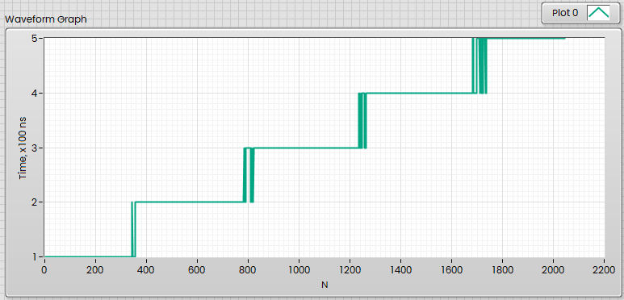

Usually to measure execution Time in LabVIEW the GetTickCount is used, and HighRedolution Counter. How to measure short intervals with high precision? 
<!--more-->
Typical code bencmarking in LabVIEW usually looks like this:


This will give mostly 50 ms, sometimes 51 ms. 

From loop to loop iteration the following pattern used:


There are two disadvantages with Tick Counts. One is the resolution of the Tick Count (ms), which is 1 ms, and another one is the fact that Tick Count (ms) return unsigned 32-bit value, which will be overflowed in 49,7103 days once reached 4294967295.

Another function in LabVIEW is 


Now we have fractional part of the milliseconds, but how high is the precision of this function?

The very first thing to understand — there are different timers on Windows. The Low-Res Timer will issue interrupt every  15 ms, more exactly, by default it is waking up every 15.625 ms, or 64 times a second. It means that if you call Sleep(1), then you will wait the next interrupt, which is issued in 15,625 ms. It is quite easy to demonstrate:

```c
#include <Windows.h>
#include <ansi_c.h>

int main (int argc, char *argv[])
{
	for (int i = 0; i < 1000; i++){
		printf ("Tick count (%d) = %d\n", i, GetTickCount());
		Sleep(1);
	}
	return 0;
}
```

Now if you will take a look into output, then you will see:

```
Tick count (0) = 82485640
Tick count (1) = 82485671
Tick count (2) = 82485687
Tick count (3) = 82485703
Tick count (4) = 82485703
Tick count (5) = 82485718
Tick count (6) = 82485734
Tick count (7) = 82485734
Tick count (8) = 82485750
Tick count (9) = 82485765
```

And the first one and last one:

```
Tick count (0) = 82485640
Tick count (999) = 82496421
```

So, it takes 10781 ms for execution and not 1000 as you might expect.

If I will remove Sleep(1) and call GetTickCount() without any delay, then you will see 15 ms gaps:

```
Tick count (26) = 82553250
Tick count (27) = 82553250
Tick count (28) = 82553250
Tick count (29) = 82553265
Tick count (30) = 82553265
Tick count (31) = 82553265
```

Why GetTickCount(ms) in LabVIEW incremented almost every millisecond? Just because LabVIEW will set Timer to 1 ms resolution.

Its can be easily checked by calling `powercfg /Energy` (from Administrator Prompt):

```
C:\>powercfg /Energy /Duration 1
Ablaufverfolgung wird für 1 Sekunden aktiviert...
Systemverhalten wird überwacht...
Ablaufverfolgungsdaten werden analysiert...
Die Analyse ist abgeschlossen.

Es wurden Energieeffizienzprobleme festgestellt.

12 Fehler
15 Warnungen
69 Informationsereignisse

Weitere Informationen finden Sie in "C:\energy-report.html".

C:\>
```

Output:

```
Plattform-Zeitgeberauflösung:Ausstehende Zeitgeberanforderung
Von einem Programm oder Dienst wurde eine Zeitgeberauflösung angefordert, die kleiner als die maximale Zeitgeberauflösung der Plattform ist.
Angeforderter Zeitraum	10000
ID des anfordernden Prozesses	18324
Pfad des anfordernden Prozesses	\Device\HarddiskVolume3\Program Files\National Instruments\LabVIEW 2024\LabVIEW.exe
```

The Low-Res Timer in Windows is programmable (in the latest version per application basis), and can have resolution between 0,5 ms ... 15,625. This resolution (between 1 ms and 15,625) can be set using [timeBeginPeriod](https://learn.microsoft.com/en-us/windows/desktop/api/timeapi/nf-timeapi-timebeginperiod)/[timeEndPeriod](https://learn.microsoft.com/en-us/windows/desktop/api/timeapi/nf-timeapi-timeendperiod) functions from timeapi.h. LabVIEW.exe will set it to 1 ms. Prior to Windows 10, version 2004, the timeBeginPeriod function affects a global Windows setting. For all processes Windows uses the lowest value (that is, highest resolution) requested by any process. Starting with Windows 10, version 2004, this function no longer affects global timer resolution. For processes which call this function, Windows uses the lowest value (that is, highest resolution) requested by any process. For processes which have not called this function, Windows does not guarantee a higher resolution than the default system resolution.

Starting with Windows 11, if a window-owning process becomes fully occluded, minimized, or otherwise invisible or inaudible to the end user, Windows does not guarantee a higher resolution than the default system resolution. See [SetProcessInformation](https://learn.microsoft.com/en-us/windows/desktop/api/processthreadsapi/nf-processthreadsapi-setprocessinformation) for more information on this behavior.

Setting a higher resolution can improve the accuracy of time-out intervals in wait functions as well as GetTickCount(). However, it can also reduce overall system performance, because the thread scheduler switches tasks more often. High resolutions can also prevent the CPU power management system from entering power-saving modes. Setting a higher resolution does not improve the accuracy of the high-resolution performance counter (see below).

If better than 1 ms resolution needed, then there is also [*NtSetTimerResolution*](http://undocumented.ntinternals.net/index.html?page=UserMode%2FUndocumented%20Functions%2FTime%2FNtSetTimerResolution.html) which allows setting the interval with sub-millisecond precision but that is rarely used and with this non-documented function you can set timer to 500 µs interval, but not better. Refer to [Windows Timer Resolution: The Great Rule Change](https://randomascii.wordpress.com/2020/10/04/windows-timer-resolution-the-great-rule-change/). Also from msdn [Implement a Continuously Updating, High-Resolution Time Provider for Windows](https://learn.microsoft.com/en-us/archive/msdn-magazine/2004/march/implementing-a-high-resolution-time-provider-for-windows) and [About Timers](https://learn.microsoft.com/en-us/windows/win32/winmsg/about-timers), of course.

## High-Resolution Performance Counters

Another way proposed by Microsoft to measure time intervals shorter than 1 ms is Windows Performance Counters described in Acquiring high-resolution time stamps Article.

The code from the link above:

```c
LARGE_INTEGER StartingTime, EndingTime, ElapsedMicroseconds;
LARGE_INTEGER Frequency;

QueryPerformanceFrequency(&Frequency); 
QueryPerformanceCounter(&StartingTime);

// ======== Activity to be timed ===============

QueryPerformanceCounter(&EndingTime);
ElapsedMicroseconds.QuadPart = EndingTime.QuadPart - StartingTime.QuadPart;
// To avoid loss-of-precision, convert to µs *before* dividing by ticks-per-second:
ElapsedMicroseconds.QuadPart *= 1000000;
ElapsedMicroseconds.QuadPart /= Frequency.QuadPart;
```

This will give time interval in µs.

The resolution of this timer is defined by Frequency and currently 100 ns. It is quite simple to check. Just wrap QueryPerformanceFrequency() and QueryPerformanceCounter() into DLL 

```
#include <Windows.h>
#include <utility.h>
#include <inttypes.h>

uint64_t GetPerfCounter ()
{
	LARGE_INTEGER CurrentTime;
	QueryPerformanceCounter(&CurrentTime);
	return (uint64_t)CurrentTime.QuadPart;
}

uint64_t GetPerfFrequency ()
{
	LARGE_INTEGER CurrentFrequency;
	QueryPerformanceFrequency(&CurrentFrequency);
	return (uint64_t)CurrentFrequency.QuadPart;
}
```

and call from LabVIEW:


(it should be possible to call these functions directly, but its much easier to deal with QuadParts in C code rather than in LabVIEW, but impossible is nothing).

Anyway, here we will see 10 MHz Frequency - means 100 ns per increment, exactly so much increments in one second and absolute value of the ticks represents UpTime of the computer in 100 ns increments (you can divide it by amount of increments in 24 Hours which is 864000000000).

This is exactly what High Resolution Relative seconds VI does, just dividing Ticks by 10000000 and subtract LabVIEW's start time, so this value is called "Relative".

In general behind this VI is just DLL call:


We can easily trace this call in the debugger (I'll use x64dbg). Start the debugger, attach to LabVIEW process (Ctrl+A), then set breakpoint to GetHiResRelativeSeconds():


Place this VI on the BD and run it:


and debugger will break execution into your hands:


Now you see three following functions called from HiResClock Class in chain - ::HiResClock (which is constructor, I guess), then ::SetToNow and ::ToSeconds.

Go step by step (hit F7) and in ::SetToNow you will see our friend QueryPerformanceCounter():


By the way, this HiResClock class located not in LabVIEW, but in dll named mgcore_sh_24_1.dll (located in resource Folder).

So, if we will multiply result of this VI by 10000000, then we will get back "RAW" ticks (except the fact that "zero" is not OS start, but LabVIEW's launch time).

But to measure such "fine" delay we need a code which will delay execution for nanoseconds. Let say, I have around 3 GHz CPU, so it means 0,3 ns per tact and we need around three CPU commands one tact each one. I will do it on Assembler, its much more simple to have such low level control. In test function we will compute sum of indexes, so we can put three simple commands one tact each into the loop.

```nasm
EXPORT fnSumAsm_
fnSumAsm_ proc
                xor     rax, rax
                test    rcx, rcx
                jle     exit
loop:                   ; if not zero
                add     rax, rcx
                dec     rcx
                jnz     loop
exit:
                retn
endp fnSumAsm_
```

This is 64-bit, of course. Input parameter n passed in rcx, if not zero then proceed to loop, where added to rax (which set to zero by xor operation - this is standard way to zero registers in assembly), then decremented, and go back to the beginning of the loop. The commands add, dec and jnz (if not misspredicted)  will take around one tact each one. Modern CPU will perform some conveyourization, cahing, etc, therefore exact time is hard to estimate, but I'll expect that one loop iteration will take around from half to one nanosecond, and N parameter will be proportional to nanoseconds (more or less, of course).

The equivalent c code

```c
uint64_t SumAsm(int n)
{
	uint64_t tmp = 0;
	for (int i = 0; i < n; i++) tmp += i;
	return tmp;
}
```

(if you will try to use such code in C, then optimizer will compute this without loop, this is major reason to take assembly language).

Well, now we can compute first 2K elements and measure the time using Performance Counter (take an ote that we haven't traditional "repetition" benckmarking loop here with dividing to amount of iterations after that - it is just single iteration measured, and to avoid "peaks" the minimum taken).


and the result:



For N=1000 we have something around 300 ns, and clearly recognized "steps", because Performance Counter have discrete values at 100 ns resolution and for example, between 800 and 1200 we have almost no intermediate values, because the only 3 ticks increment according to this interval.

Well, if our theory about High Resolution Counter is correct, then we should get the same by multiplication results to 10000000:


And it is:


Same discrete steps in same range (not exactly, because some overhead from calling VIs, plus some rounding error. But behaviour is exactly the same and that means that behind High Resolution Relative Seconds is exactly QueryPerformanceCounter and to get "RAW" increments you just need to multiply output by 10000000. 

## Rtdsc

100 ns resolution is not bad, but can we measure intervals with higher precision? Yes, because we can count CPU's tacts, and modern CPU working at GHz frequencies.

To achieve this we will read Time Stamp Counter (TSC) value with RDTSC Command. But here is small side note —  we should call CPUID  before RDTSC for serialization, which ensures that all previous instructions have completed execution before reading the Time Stamp Counter (TSC) value with RDTSC. RDTSC instruction can be executed out-of-order. This means that **CPU can execute some of instructions that are after RDTSC instruction before where it is placed in code**. So measurements can be inaccurate.

Typically CPUID/RDTSC can take 100-200 tacts, and there are techniques exists to compensate this, but this is slightly out of scope for this experiment with LabVIEW. So, calling the following code before and after benchmarked code will be sufficient for this experiment:

```
EXPORT fnGetRtdsc
fnGetRtdsc PROC
	push rbx
	push rcx
	push rdx

	cpuid 	; force all previous instructions to complete and reset rax...rdx!
	rdtsc 	; read time stamp counter

    shl rax, 32
	shrd rax, rdx, 32
        
	pop rdx
	pop rcx
	pop rbx

    RET
ENDP fnGetRtdsc
```

Because registers rbx...rdx gets damaged, they pushed into stack and popped back at the end. Rax will contain TSC result.

The first test needs to be performed - the same as before - how many increments within one second:


And now we have 2 890 014 685 increments per second.

Its because my CPU operates at 2,9 GHz:


On the other PC this will give other results:


Obviosly this counter will be not incremented if CPU on halt (PC in standby).

The resolution on the 2,9 GHz means 0,345 nanoseconds or 345 picoseconds per increment, but on the 3,9 GHz — 0,256 ns/increment.

Now we can repeat measuement of the test function, but with Rdtsc function as was done above with Performance Counter:


And the results:


Now we have no more visible discrete steps, because resolution is much higher and where we have had only one increment per 100 ns now we have around 400 increments per 100 ns, therefore graph is smooth, continuously increased, and we are able to see "fine" differences.

Usually RDTSC is rarely used because High Res Timer is sufficient for most application, and very low level RDTSC intendent for "fine" profiling, sometimes used with C code or in Assembly to check needed tacts for instructions sequences.

Bonus.

### C++

As small bonus - If you are using C++ you can use `system_clock::now()` from chrono:

```cpp
auto start = std::chrono::system_clock::now();

/* do some work */

auto end = std::chrono::system_clock::now();
auto elapsed = end - start;
std::cout << elapsed.count() << '\n';
```

You can also specify the granularity to use for representing a duration:

```cpp
// this constructs a duration object using milliseconds
auto elapsed =
    std::chrono::duration_cast<std::chrono::milliseconds>(end - start);

// this constructs a duration object using seconds
auto elapsed =
    std::chrono::duration_cast<std::chrono::seconds>(end - start);
```

https://learn.microsoft.com/en-us/cpp/standard-library/high-resolution-clock-struct?view=msvc-170

https://en.cppreference.com/w/cpp/chrono/system_clock

