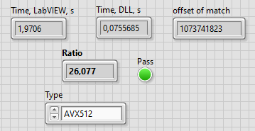

For some reason I need a fast method for String Search. Provide by LabVIEW Search/Split String is relative slow, I done this with String Zilla, and got around 20x boost with AVX2/AVX512.
<!--more-->

It is pretty simple, using DLL.

The source code:

```c
#define SZ_USE_X86_AVX2 1
#define SZ_USE_X86_AVX512 1

#include <inttypes.h>
#include "C:\Program Files\National Instruments\LabVIEW 2025\cintools\extcode.h"
#include "stringzilla.h"
#include "framework.h"
#include "SearchStr.h"

#define GUARD(s, p) if (!s || !p) return -1; \
              if (!(*s)->str || !(*p)->str || !(*s)->cnt) return -1; \
              if (!(*p)->cnt) return 0;

SEARCHSTR_API int32_t fnSearchStrAVX2(LStrHandle str, LStrHandle pattern)
{
    GUARD(str, pattern)
    // Initialize your haystack and needle
    sz_string_view_t haystack = { (sz_cptr_t)((*str)->str), (sz_size_t)(*str)->cnt };
    sz_string_view_t needle = { (sz_cptr_t)((*pattern)->str), (sz_size_t)(*pattern)->cnt };
    
    sz_cptr_t substring_position = sz_find_avx2(haystack.start, haystack.length, needle.start, needle.length);
    sz_find_t* res = (sz_find_t*)substring_position;
    int64_t offset = (substring_position - haystack.start);

    if (substring_position) return (int32_t)offset;
    else return -1;
}

SEARCHSTR_API int32_t fnSearchStrAVX512(LStrHandle str, LStrHandle pattern)
{
    GUARD(str, pattern)
    sz_string_view_t haystack = { (sz_cptr_t)((*str)->str), (sz_size_t)(*str)->cnt };
    sz_string_view_t needle = { (sz_cptr_t)((*pattern)->str), (sz_size_t)(*pattern)->cnt };

    sz_cptr_t substring_position = sz_find_avx512(haystack.start, haystack.length, needle.start, needle.length);
    sz_find_t* res = (sz_find_t*)substring_position;
    int64_t offset = (substring_position - haystack.start);

    if (substring_position) return (int32_t)offset;
    else return -1;
}
```

Important point is that the string passed "Adapt to type" and not as C String Pointer (otherwise you will get unnecessary copy of your string, with significant performance drop).

LabVIEW code:


And the result for AVX2 — 23x Boost:


AVX-512 — 26x improvement:



Source code on the GitHub — [С Source Code](https://github.com/AndrDm/LabVIEW-SlowString-Search/tree/main/SearchStringSource), [LabVIEW Source Code](https://github.com/AndrDm/LabVIEW-SlowString-Search/tree/main/SearchStringBenchmark).
