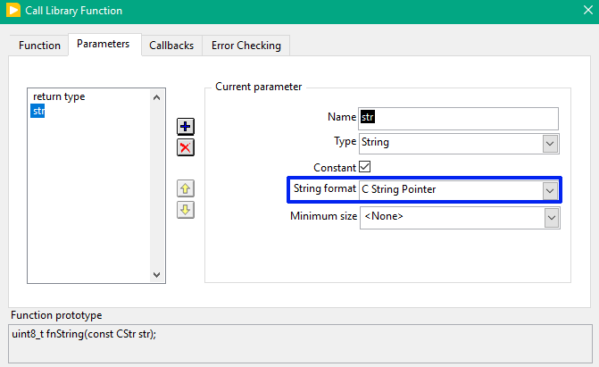
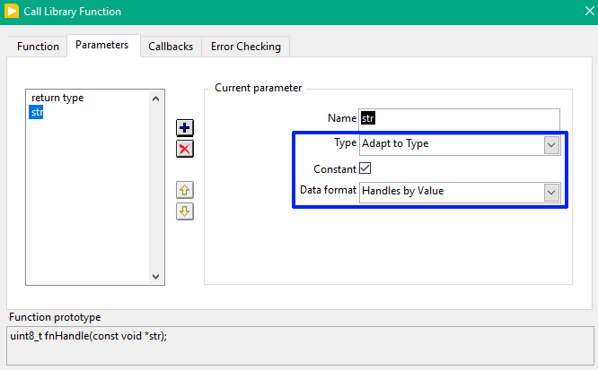
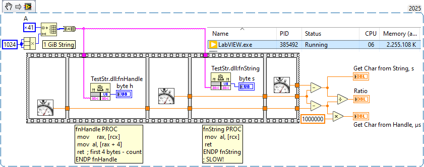
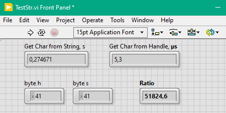
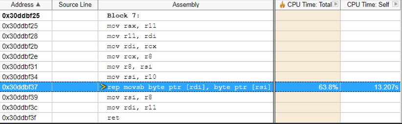
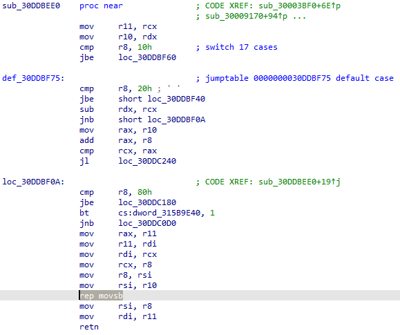

I just encountered slow string performance in LabVIEW when a large string is passed to a DLL as a C string pointer. It is always better to pass it as 'Adapt to Type' instead of a pointer.
<!--more-->

Actually I would to implement fast string search on large string based on AVX2/AVX-512, and got strange penalty.

Here is the comparison between two ways.

"Traditional" way looks like this:



"Advanced" way (and more convenient, because the length of the string will be passed as well):



Let compare wot 1GiB string:



And the results:



Its a difference by factor 50000x!

Behind the scenes of the two functions — it is just reading of the first byte:

Native String Pointer (just passed via rcx):

```nasm
fnString PROC
	mov		al, [rcx]
	ret
ENDP fnString
```

Adapt to type (in rcx we have pointer to the structure, the second member is the address of the string):

```nasm
fnHandle PROC
	mov     rax, [rcx]
	mov		al, [rax + 4] ; first 4 bytes - count
	ret
ENDP fnHandle
```

The reason is that when passed via C String Pointer, LabVIEW will create a copy of the whole string in the memory (because this string needs to be null-terminated), and in very inefficient way, bottleneck from profiler:



Whole function (from Run-Time, which is affected as well) caused this:



Refer to [Assembly: REP MOVS mechanism](https://stackoverflow.com/questions/27804852/assembly-rep-movs-mechanism#:~:text=In%20this%20case%2C%20you%20will,of%20memory%20to%20somewhere%20else.) / [Enhanced REP MOVSB for memcpy](https://stackoverflow.com/questions/43343231/enhanced-rep-movsb-for-memcpy). 

Using "Adapt to Type" (or Pascal String pointer) you will avoid unnecessary copy.

Source code on the [GitHub](https://github.com/AndrDm/LabVIEW-SlowString-Search/tree/main/SlowStringIssue).
