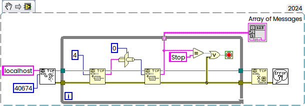

A very simple and basic TCP communication example for Python and LabVIEW
<!--more-->

Using Python 3.13.0 and LabVIEW 2024 Q3 (will work for older versions for sure).

First run Server, then Client.

Python as Server:

```Python
# first of all import the socket library
import socket

# next create a socket object
s = socket.socket()
print ("Socket successfully created")

# reserve a port on your computer in our case it is 40674 but it can be anything
port = 40674

# Next bind to the port - we have not typed any ip in the ip field
# instead we have inputted an empty string this makes the server listen to requests
# coming from other computers on the network
s.bind(('', port))
print ("socket binded to %s" %(port))

# put the socket into listening mode
s.listen(5)    
print ("socket is listening")

# a forever loop until we interrupt it or an error occurs
while True:

    # Establish connection with client.
    c, addr = s.accept()
    print ('Got connection from', addr )

    # send a thank you message to the client.
    c.send(b'Thank you for connecting')

    # Close the connection with the client
    c.close()
```

According LabVIEW's Client:


and works:

```markup
>python Server.py
Socket successfully created
socket binded to 40674
socket is listening
Got connection from ('127.0.0.1', 52430)
```

### Opposite Direction — LabVIEW as Server and Python as Client:

LabVIEW Code:


and according Python Code:

```Python
# Import socket module
import socket

# Create a socket object
s = socket.socket()

# Define the port on which you want to connect
port = 40674

# connect to the server on local computer
s.connect(('127.0.0.1', port))

# receive data from the server
print(s.recv(24))

# close the connection
s.close()
```

Works as well:

```
>python Client.py
b'Thank you for connecting'
```

In both cases 24 bytes string was transferred.

### Variable Length

To handle messages with variable length you need to transmit the length in first bytes (consider to have one, two or four depends on max possible length), something like that:

```python
import socket
import struct

def send_string(sock, message):
    # Encode the string to bytes
    message_bytes = message.encode('ascii') #utf-8
    
    # Get the length of the message
    message_length = len(message_bytes)
    
    # Pack the length into 4 bytes (big-endian unsigned integer)
    length_prefix = struct.pack('>I', message_length)
    
    # Combine the length prefix and the message
    full_message = length_prefix + message_bytes
    
    # Send the full message
    sock.sendall(full_message)

# Example usage
HOST = '127.0.0.1'  # The server's hostname or IP address
PORT = 40674        # The port used by the server

with socket.socket(socket.AF_INET, socket.SOCK_STREAM) as s:
    s.connect((HOST, PORT))
    send_string(s, "Hello, World!") # 13 bytes
    send_string(s, "Hello, LabVIEW!") # 14 bytes
    send_string(s, "Stop") # 4 bytes
```

 The LabVIEW's Snippet:



Refer to [Python Network Programming](https://www.geeksforgeeks.org/python-network-programming/) and [NI Forum](https://forums.ni.com/t5/LabVIEW/i-am-facing-error-56-issue-while-connecting-to-python-how-to/td-p/4408227).
