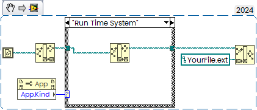

Collection of useful small Snippets
<!--more-->
These Snippets could be moved to Block Diagram by Drag & Drop

### Get Application Folder
Useful to load Files from Local Folder (same as VI or App) as well as App Settings:

### Close Application on Exit

### Float Point Compare

usage:

Refer to [Re: -0.002 and -0.002 are not equal](https://forums.ni.com/t5/LabVIEW/0-002-and-0-002-are-not-equal/m-p/4410266#M1299609).
