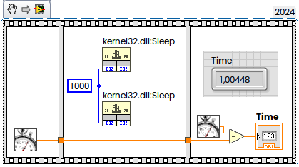
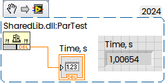
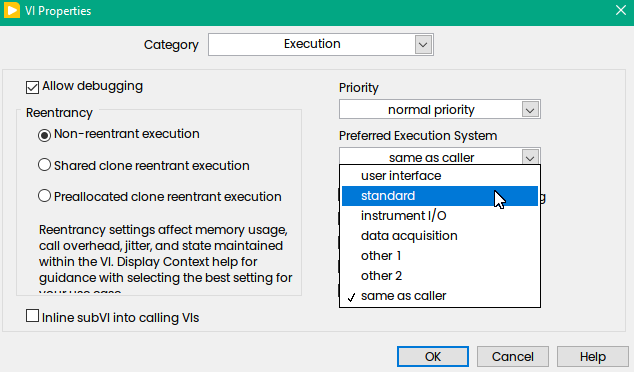
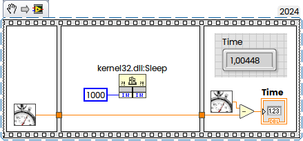

Interesting question was raised on NI Forum. "*I have created an app that works without issue... As a DLL called by Python, 1 of the functions work... the other just freezes.*". The reason is — the Execution System was set "same as caller" (which is default), but Python is not LabVIEW.
<!--more-->
Let do simple experiment. I will create simple DLL in LabVIEW with function, which requires two threads to execute:



Here just two thread-safe calls of the Sleep(1000) from kernel32.dll. If everything OK with multi-threading, then they should take 1 second time to execute.

Now, when called from Python. something like this:

```python
import ctypes
import os

script_dir = os.path.dirname(os.path.abspath(__file__))
dll_path = os.path.join(script_dir, "SharedLib.dll")
dll = ctypes.CDLL(dll_path)
par_test = dll.ParTest
par_test.restype = ctypes.c_double
result = par_test()
print(f"ParTest execution time: {result:.6f} seconds")
```

The same when called from C:

```c
int main (int argc, char *argv[])
{
	double res = ParTest();
	printf("Time is %f s\n", res);
	return 0;
}
```

In both cases takes two seconds instead of one:

```
>python Test.py
ParTest execution time: 2.011455 seconds

>DLL_Test.exe
Time is 2.011993 s
```

The reason is Execution system. When "same as caller" used, then LabVIEW will force single-thread execution (like in UI Thread).

But when called from LabVIEW it takes ons second as expected:



To get advantages of the parallelization we should switch execution to Standard in VI's Properties:



Not it works es expected:

```
>python Test.py
ParTest execution time: 1.005697 seconds

>DLL_Test.exe
Time is 1.005611 s
```

In general from that point all multi-threading rules like different execution systems, setting from INI, etc are applicable to DLL as well.

In general from architecture point of view of the "mixed" environment we have always two choices — to use multi-threading offered by LabVIEW or using "native" multi-threading offered by "third-party" environment like Python, Rust, C, etc. Both ways will work and have own "pros" and "cons" in term of penalties caused by threads start/stop/sync as well as how "convenient" this from programming point of view and how much "low level control" do we need over the threads. In this particular case we can split our LabVIEW code into two SubVIs, wrap every into own DLL func and call both in parallel.

The LabVIEW "do something" code will be as simple as following:



Then C-code (CVI was used):

{}

```c
#include <ansi_c.h>
#include <utility.h>
#include "SharedLib.h"

 int CVICALLBACK ThreadFunction1 (void *functionData);
 int CVICALLBACK ThreadFunction2 (void *functionData);
 
int main (int argc, char *argv[])
{
	int functionId1, functionId2;
	
	if (InitCVIRTE (0, argv, 0) == 0) return -1; /* out of memory */
	
	ParTest1(); ParTest2(); //"Dummy" call to get everything loaded	
	 
    clock_t start = clock();
	 
    CmtScheduleThreadPoolFunction (DEFAULT_THREAD_POOL_HANDLE, ThreadFunction1, NULL, &functionId1);	
    CmtScheduleThreadPoolFunction (DEFAULT_THREAD_POOL_HANDLE, ThreadFunction2, NULL, &functionId2);	
	
	CmtWaitForThreadPoolFunctionCompletion (DEFAULT_THREAD_POOL_HANDLE, functionId1, 0);
	CmtWaitForThreadPoolFunctionCompletion (DEFAULT_THREAD_POOL_HANDLE, functionId2, 0);
	
	clock_t end = clock();
    double cpu_time_used = ((double) (end - start)) / CLOCKS_PER_SEC;
	 
	printf("Two Threads took %f seconds to execute \n", cpu_time_used); 

	CmtReleaseThreadPoolFunctionID (DEFAULT_THREAD_POOL_HANDLE, functionId1);
	CmtReleaseThreadPoolFunctionID (DEFAULT_THREAD_POOL_HANDLE, functionId2);	
	
	return 0;
}

int CVICALLBACK ThreadFunction1 (void *functionData)
{
	printf("Thread1 execution time: %f s\n", ParTest1());
    return 0;
}


int CVICALLBACK ThreadFunction2 (void *functionData)
{
	printf("Thread2 execution time: %f s\n", ParTest2());
    return 0;
}
```

{}

Or in case of Python something like that:

{}

```python
import ctypes
import os
import threading
import time

def ThreadFunction1():
	result = par_test1()
	print(f"Thread1 execution time: {result:.6f} seconds")

def ThreadFunction2():
	result = par_test2()
	print(f"Thread2 execution time: {result:.6f} seconds")
	
script_dir = os.path.dirname(os.path.abspath(__file__))
dll_path = os.path.join(script_dir, "SharedLib.dll")
dll = ctypes.CDLL(dll_path)
par_test1 = dll.ParTest1
par_test2 = dll.ParTest2
par_test1.restype = ctypes.c_double
par_test2.restype = ctypes.c_double
par_test1()
par_test2()
   
t1 = threading.Thread(target=ThreadFunction1, args=())
t2 = threading.Thread(target=ThreadFunction2, args=())

start = time.time()

t1.start()
t2.start()

t1.join()
t2.join()

end = time.time()
result = end - start
print(f"Two threads took {result:.6f} seconds")

```

{}

Now both "single thread" LabVIEW functions called in parallel, the overall execution speed is still around 1 second in both environments:


```
>DLL_Test.exe
Thread1 execution time: 1.000765 s
Thread2 execution time: 1.000640 s
Two Threads took 1.015000 seconds to execute

>python TestMT.py
Thread1 execution time: 1.000129 seconds
Thread2 execution time: 1.000881 seconds
Two threads took 1.001891 seconds
```

Link to NI Forum thread with code samples — [Re: Special LabVIEW Considerations when creating a DLL?](https://forums.ni.com/t5/LabVIEW/Special-LabVIEW-Considerations-when-creating-a-DLL/m-p/4407166#M1298554)
