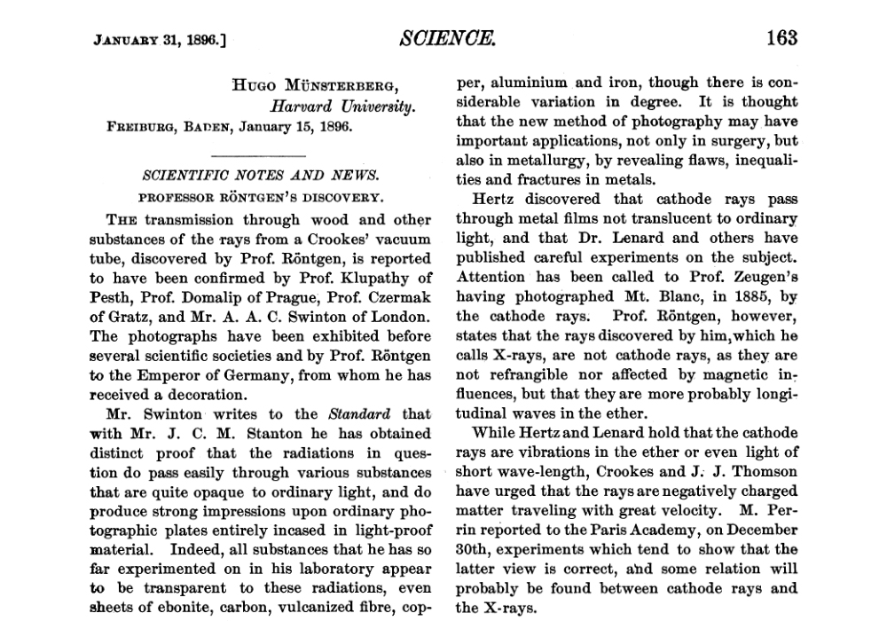

I was a very curious about the very first appearances of the X-ray discovery published in *Science Magazine*, and it seems to be found in the archives.
<!--more-->

On [8 November 1895](https://en.wikipedia.org/wiki/1895#October–December), German physics professor [Wilhelm Röntgen](https://en.wikipedia.org/wiki/Wilhelm_Röntgen) stumbled on X-rays while experimenting with Lenard tubes and [Crookes tubes](https://en.wikipedia.org/wiki/Crookes_tube) and began studying them. He wrote an initial report "On a new kind of ray: A preliminary communication" and on 28 December 1895, submitted it to [Würzburg](https://en.wikipedia.org/wiki/Würzburg)'s Physical-Medical Society journal.[[18\]](https://en.wikipedia.org/wiki/X-ray#cite_note-18) This was the first paper written on X-rays. Röntgen referred to the radiation as "X", to indicate that it was an unknown type of radiation.

It is in Science Magazine, New Series, Vol. 3, No. 57, Jan. 31, 1896:

Full article:



Electrical engineering article:



Röntgen rays: memoirs by Röntgen, Stokes, and J.J. Thomson



Selected Articles as single PDF:

