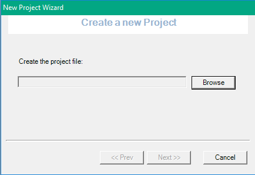
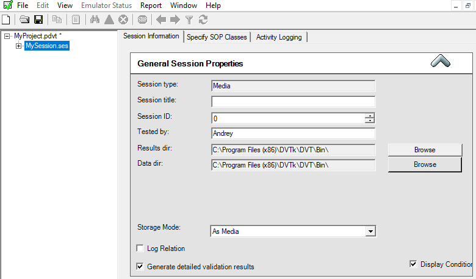

Technical validation of the DICONDE Files is important compliance step to be sure that the PACS System is compliant to DICONDE Standard. Below the instruction how to validate DICONDE Files.
<!--more-->
Technically the DICONDE Standard follow DICOM Rules. The Data Element Types are defined in [Part 5, section 7.4](https://dicom.nema.org/medical/dicom/current/output/html/part05.html#sect_7.4).

There are three important Types — 1, 2 and 3::

**Type 1** — Required mandatory Data Elements

Type 1C  — Conditional Data Elements

**Type 2**  — Required Data Elements

Type 2C  — Conditional Data Elements

**Type 3**  — Optional Data Elements

In technically valid DICONDE File all Tags with Type 1 and 2 must present (Type 1 with valid values, Type 2 may have empty). Type 3 is optional.

The validation can be done with help of DVTK Validation Tools. This tool will take "Definition" Files (where all Tags and according Types are listed), then perform simple comparison.

So, you need both parts - Definition Files and Tool, which can be downloaded from [DVTK Web page](https://www.dvtk.org/downloads/).

Current Versions (as per 2nd May 2024):


First you have to install Definition Files, then DVTK Toolkit. I also would like to recommend to install DVTK Editor, its not mandatory required for validation, but helpful for troubleshooting.

After installation your Definition Files located in "C:\Program Files (x86)\Common Files\DVTk\Definition Files\DICOM"  Folder and the software in "C:\Program Files (x86)\DVTk\DVT\Bin\DVT.exe".

You don't need all Validation Files, the only DICONDE relevant files are:


Usually I make a copy of these files in separate DICONDE Folder to avoid "mixture" of Medical and Industrial Definitions.

If you will take a look inside of these files you will see something like that:

```
#
#Generated by odd2def on: Wed Jan 11 11:42:48 2006#
#

DEFINE SYSTEM "DICOM" "3.0"
"DICOM" "3.0"
ENDDEFINE


#
# Definition of the Digital X-Ray Image Storage - For Pres. SOP
#
DEFINE C-STORE-RQ "Digital X-Ray Image - For Pres."

SOPCLASS "1.2.840.10008.5.1.4.1.1.1.1" "Digital X-Ray Image Storage - For Pres. SOP"

MODULE "Component Module" M
(0x00100010,2,PN,1)                                 "Component Name"
(0x00100020,2,LO,1)                                 "Component ID Number"
(0x00100030,2,DA,1)                                 "Component Manufacturing Date"
#(0x00100040,2,CS,1,E,"F"
#                   | "M"
#                   | "O")                           "Patient's Sex"
(0x00100040,2,CS,1,E,"")                            "Patient's Sex"
#(0x00100021,3,LO,1)                                 "Issuer of Patient ID"
#(0x00100032,3,TM,1)                                 "Patient's Birth Time"
(0x00101000,3,LO,1:n)                               "Other Component IDs"
(0x00101001,3,PN,1:n)                               "Other Component Names"
...
MODULE "Component Study Module" M
(0x0020000D,1,UI,1)                                 "Study Instance UID"
#(0x00080020,2,DA,1)                                 "Study Date"
(0x00080020,1,DA,1)                                 "Study Date"
#(0x00080030,2,TM,1)                                 "Study Time"
(0x00080030,1,TM,1)                                 "Study Time"
(0x00080050,2,SH,1)                                 "Accession Number"
(0x00080090,2,PN,1)                                 "Component Owner's Name"
(0x00200010,2,SH,1)                                 "Study ID"
#(0x00081030,3,LO,1)                                 "Study Description"
(0x00081030,2,LO,1)                                 "Study Description"
#(0x00081048,3,PN,1:n)                               "Physician(s) of Record"
(0x00081048,2,PN,1:n)                               "Inspecting Company Name"
```

Here the first item like 0x00100010 is Tag (0010:0010 or sometimes 0010,0010), then follow Type, for example, Study Instance UID is mandatory, because Type 1, then VR (Value Representation), and then Value Multiplicity (the Tag may have multiple values).

Now you need your images. In the past the test images was on ASTM Web page, but nowadays they are gone, but you still can get these [from Web Archive](https://web.archive.org/web/20211026153720/https://www.astm.org/COMMIT/DICONDE_Information.htm). Direct Link to [dicondeExampleFiles.zip](https://web.archive.org/web/20210417031142/https://www.astm.org/COMMIT/DICONDE/dicondeExampleFiles.zip).

Now you can start DVTK Tool. I would like to recommend to start it as Administrator, because some setting will be written to "%PROGRAMFILES(x86)%\DVTK\DVT\Bin" Folder, where you normally haven't access.

When started first time, you haven't project, so create new one:


Point here to directory where you want:



Initially you haven't session, so hit "Finish" here:


Now you can add New Session:


and save as well:


Switch Session type to Media (we want to check *.dcm media file):


And now you should point DVTK to Definition Files Directory:


(see default path above)


and load Definition Files:


If everything is OK, then now should looks like this:



Now with right mouse click you can validate your File:


I will select minimum DxExample Image (minimum, because contains the only minimal set of the Tags which should make DICONDE technically valid):


Now you will see result of validation, something like this:


All Errors and Warnings will be listed. Most of issues — missing Tags, some may have wrong Types or wrong data behind. These old files from Web Archive have some errors, and may be this is 6why they are removed from ASTM Web Page.

You can save this report in PDF or Export Errors to Excel.


Take a note that some missing Tags will not "damage" your DICONDE file. Such files will be successfully opened in most of DICOM Viewers without any problems, but they are not "accurate" technically. Better do not have any errors, of course. On the other hand absence of some optional Tags may raise some discussions. For example, the x-ray Current is Type 3:


but many experienced NDT Operators will not accept omitted Current, because this is a very important Property of the Inspection. This is historical reason for this, because initially DICONDE Standard based on the DICOM, which is Medical standard, and in Medicine the pure Current is not very important, but total Patient Dose is relevant, therefore the mAs (milliamper * seconds) is usually set. Common recommendation is to set as many parameters as possible.
