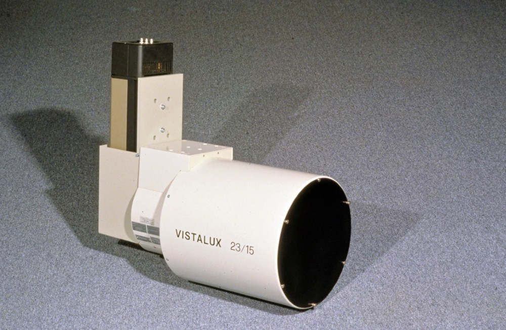
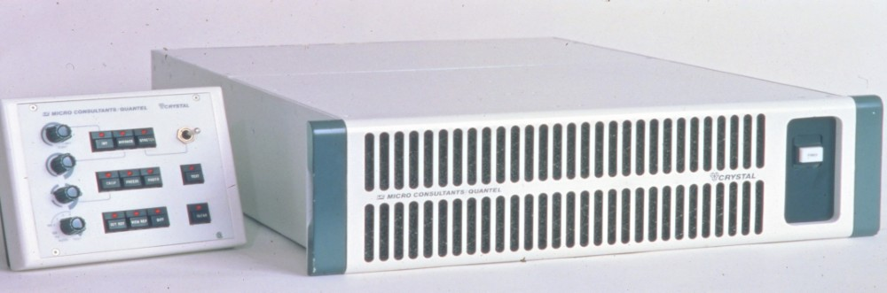
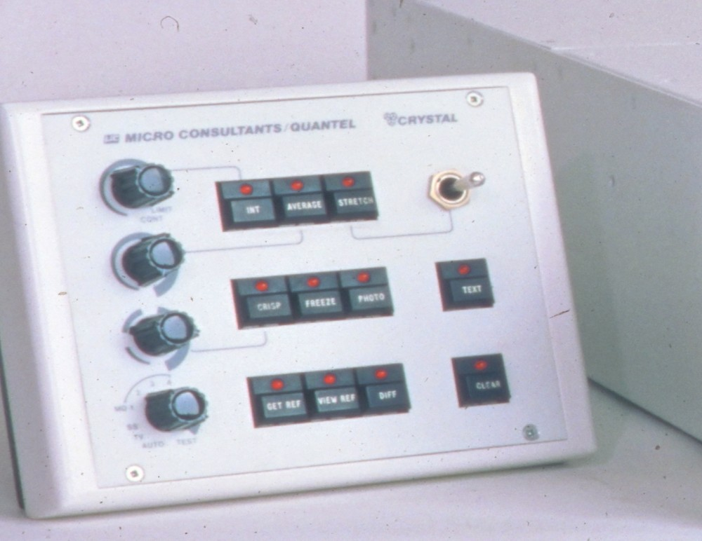

How image enhancements for x-ray inspection was done over 40 years ago.
<!--more-->
A long time ago, X-ray inspection was performed using devices called [X-ray Image Intensifiers](https://en.wikipedia.org/wiki/X-ray_image_intensifier). An example of such a device is the *Seifert VistaLux*:

An X-ray Image Intensifier converts X-rays into visible light at a much higher intensity than traditional fluorescent screens can. The device typically contains a low-absorbency and low-scatter input window (usually made of aluminum), an input fluorescent screen, a photocathode, electron optics, an output fluorescent screen, and an output window. All these components are mounted in a high-vacuum environment within a glass or later metal/ceramic housing.

The device shown in the photo above is equipped with a CCIR camera, which connects directly to a black-and-white TV via a coaxial cable with BNC connectors.

However, the image produced by this setup was often low in contrast and noisy. To improve image quality, the UK-based company [Quantel](https://en.wikipedia.org/wiki/Quantel) developed a device called *Crystal Sapphire*:

This device was inserted between the X-ray image intensifier and the TV and performed basic image enhancements — mostly through analog processing.

The major functions included frame averaging, a high-pass “Crisp” filter, the ability to “freeze” images, capture and store reference frames, and subtract reference images from live ones to display differences — all achieved through analog TV signal processing!

